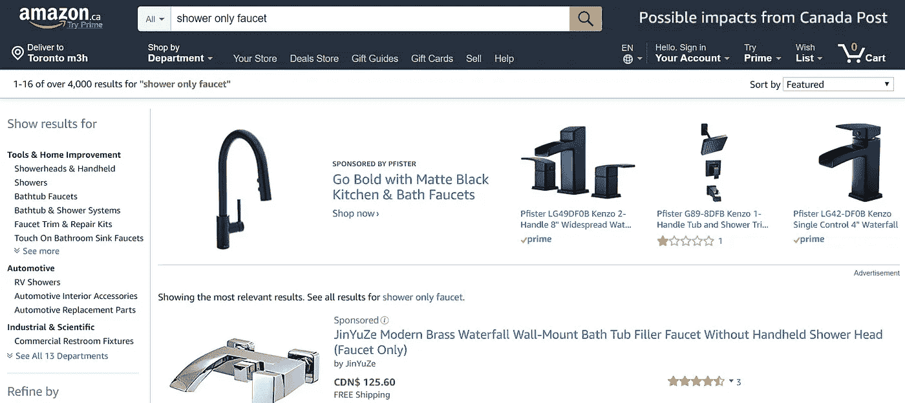
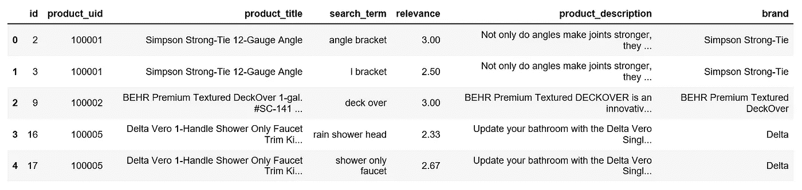
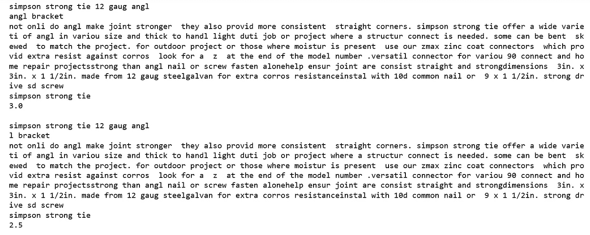
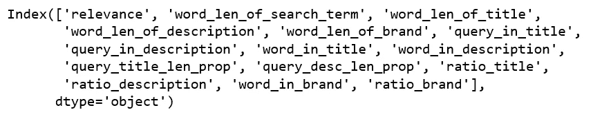
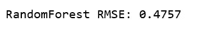
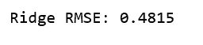
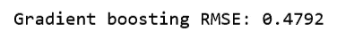
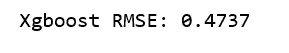
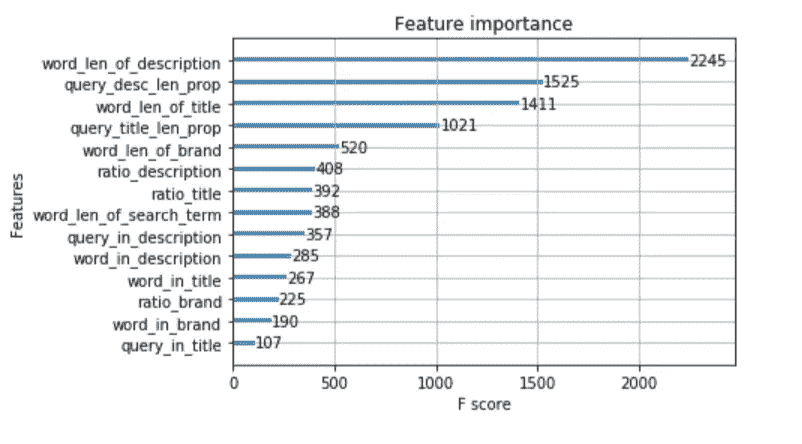

# 使用机器学习预测在线零售商的搜索相关性

> 原文：<https://towardsdatascience.com/predict-search-relevance-using-machine-learning-for-online-retailers-5d3e47acaa33?source=collection_archive---------4----------------------->


Photo credit: Unsplash

## 高质量的搜索就是返回相关的结果，即使数据在变化或结构不良，查询也不精确。

大型在线零售商通常使用基于查询的搜索来帮助消费者在其网站上找到信息/产品。他们能够利用技术为用户提供更好的体验。因为他们知道搜索相关性的重要性，而且长时间和/或不成功的搜索会让他们的用户离开，因为用户习惯于并期待即时的相关搜索结果，就像他们从谷歌和亚马逊得到的一样。

似乎产品搜索只在亚马逊有效。例如，键入搜索术语“淋浴专用水龙头”，一种水龙头，我得到我正在寻找的。



Source: Amazon.ca

尽管搜索对任何电子商务业务的成功都至关重要，但它并不总是像看起来那么容易，尤其是对中小型在线零售商而言，因为它通常需要大量人工标记的数据和机器学习技术。

高质量的搜索就是返回相关的结果，即使数据在变化或结构不良，查询也不精确。我们今天要做的是:只给定原始文本作为输入，我们的目标是预测产品与家得宝网站搜索结果的相关性，从而帮助他们改善顾客的购物体验。我们开始吧！

# 数据

该数据集包含了家得宝网站上的大量产品和真实顾客搜索词。为了创建基本事实标签，家得宝将搜索/产品配对众包给了多个人工评级机构。我们将从 [Kaggle](https://www.kaggle.com/c/home-depot-product-search-relevance/data) 下载三个表格:

*   训练集 train.csv 包含产品、搜索和相关性分数。
*   包含每个产品的文本描述。
*   attributes.csv 提供了关于产品子集的扩展信息。

这三个表包含以下数据字段:

*   id，一个唯一的 Id 字段，表示一个(搜索术语，产品 uid)对。
*   product_uid，产品的 id。
*   产品标题，产品标题。
*   product_description，产品的文本描述(可能包含 HTML 内容)。
*   search_term，搜索查询。
*   相关性，给定 id 的相关性评级的平均值(我们将为给定的搜索词预测的特征)。
*   名称，一个属性名称。
*   值，属性的值。

```
import numpy as np
import pandas as pd
from nltk.stem.porter import *
stemmer = PorterStemmer()
import re
import randomrandom.seed(2018)df_train = pd.read_csv('train_depot.csv', encoding="ISO-8859-1")
df_pro_desc = pd.read_csv('product_descriptions.csv')
df_attr = pd.read_csv('attributes.csv')
```

对于属性表，我们只对品牌名称感兴趣，因为有时查询包含品牌名称。然后我们通过“product_uid”合并这三个表。

```
df_brand = df_attr[df_attr.name == "MFG Brand Name"][["product_uid", "value"]].rename(columns={"value": "brand"})
df_all = pd.merge(df_train, df_pro_desc, how='left', on='product_uid')
df_all = pd.merge(df_all, df_brand, how='left', on='product_uid')
```



Figure 1

# 文本预处理

在应用任何机器学习 NLP 算法之前，文本处理是一个重要的阶段。虽然文本处理在技术上可以在特征生成过程中完成，但我想先进行所有处理，然后再进行特征生成。这是因为相同的处理过的文本被用作输入来生成几个不同的特征。在我们的数据集中，有几个方面的文本处理。

*   搜索词拼写纠正。我们将使用来自 Kaggle 论坛的谷歌词典

```
df_all['search_term']=df_all['search_term'].map(lambda x: google_dict[x] if x in google_dict.keys() else x)
```

*   统一单位。
*   删除特殊字符。
*   词干文本
*   标记文本

str_stem

我们将对所有文本特征应用 str_stem 函数。

```
df_all['product_title'] = df_all['product_title'].apply(str_stem)
df_all['search_term'] = df_all['search_term'].apply(str_stem)
df_all['product_description'] = df_all['product_description'].apply(str_stem)
df_all['brand'] = df_all['brand'].apply(str_stem)
```

之后，我们的文本看起来干净多了。

```
a = 0 
for i in range(a,a+2):
    print(df_all.product_title[i])
    print(df_all.search_term[i])
    print(df_all.product_description[i])
    print(df_all.brand[i])
    print(df_all.relevance[i])
    print()
```



Figure 2

# 特征生成

任何机器学习项目中最重要也是最耗时的部分是特征工程。在我们的例子中没有例外，特别是，我们的主要数据是文本。新创建的特征可以分为几类:

*   计数特征:查询长度、标题长度、描述长度、品牌长度、查询和标题之间的共克数、查询和描述之间的共克数、查询和品牌之间的共克数。

例如，查询是“仅淋浴龙头”，相关联的产品标题是“铬制 Delta Vero 1-手柄仅淋浴龙头装饰套件(不包括阀门)”，相关联的产品描述是“用铬制 Delta Vero 单手柄淋浴龙头装饰套件更新您的浴室”。它具有时尚、现代和简约的美感。多选择通用阀将水温保持在+/-3 华氏度范围内，有助于防止烫伤。加利福尼亚居民:参见 65 号提案信息仅包括阀内件套件，粗进套件(R10000-UNBX)单独出售包括手柄即使在系统其他地方打开或关闭阀门时，也能保持冷热水压力平衡。由于纽约州的水感法规，请确认您的运输邮政编码没有被限制使用不符合水感要求的物品。

在本例中，整个查询只在产品标题中出现过一次，而没有在产品说明中出现。

在同一个例子中，在查询中出现的三个单词也出现在产品标题中，因此，在查询和产品标题之间有三个共同的单词。在查询中出现的两个词也在产品描述中出现，因此，在查询和产品描述之间有两个共同的词，等等。

*   统计特征:标题长度与查询长度之比、描述长度与查询长度之比、标题与查询常用字数与查询长度之比、描述与查询常用字数与查询长度之比、查询与品牌常用字数与品牌长度之比。

为了创建新的特性，我们需要创建几个函数来计算普通克数和普通整词数。

str_common_whole_word

接下来是新功能的创建过程:

feature_generation

```
df_all.drop(['id', 'product_uid', 'product_title', 'search_term', 'product_description', 'brand', 'product_info', 'attr'], axis=1, inplace=True)
```

删除我们不再需要的列后，下面是我们将要开发的功能:

```
df_all.columns
```



Figure 3

# 模型

在文本处理和特征工程之后，训练/预测将变得快速和容易。

```
from sklearn.model_selection import train_test_splitX = df_all.loc[:, df_all.columns != 'relevance']
y = df_all.loc[:, df_all.columns == 'relevance']
X_train, X_test, y_train, y_test = train_test_split(X, y, test_size=0.3, random_state=0)
```

**随机森林回归**

random_forest_regression



Figure 4

**岭回归**

ridge_regression



Figure 5

**用于回归的梯度增强**

gradient_boosting_regressor



Figure 6

**Xgboost 用于回归**

Xgboost_regressor



Figure 7

[XGBoost 库](https://xgboost.readthedocs.io/en/latest/python/python_intro.html)提供了一个名为`plot_importance()`的内置函数，用于绘制按重要性排序的特性。

```
from xgboost import plot_importance
plot_importance(xgb);
```



Figure 8

[Jupyter 笔记本](https://github.com/susanli2016/NLP-with-Python/blob/master/Search%20relevance.ipynb)可以在 [Github](https://github.com/susanli2016/NLP-with-Python/blob/master/Search%20relevance.ipynb) 上找到。享受这周剩下的时光吧！

参考:[卡格尔](https://www.kaggle.com/c/home-depot-product-search-relevance)