# 预测波士顿(昂贵的)房地产市场

> 原文：<https://towardsdatascience.com/predicting-bostons-expensive-property-market-bdcd9db6a218?source=collection_archive---------14----------------------->

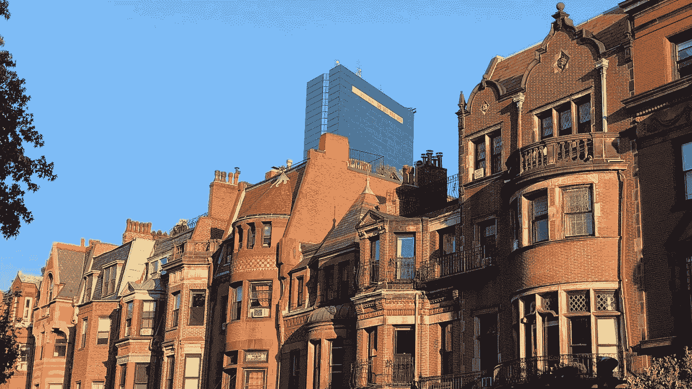

Boston’s Back Bay Neighborhood

众所周知，波士顿是一个生活成本很高的城市。

(如果你需要令人信服的话，这个 [238 平方英尺的工作室](https://www.redfin.com/MA/Boston/189-Beacon-St-02116/unit-3/home/12440283)公寓卖了 40 万美元，[这个*停车位*](https://www.redfin.com/MA/Boston/321-Commonwealth-Ave-02115/unit-10A/home/9238828) 待定 35 万美元。)

使用来自波士顿[城市](http://data.boston.gov)的公开可用的 [2018 年房地产评估](https://data.boston.gov/dataset/property-assessment/resource/fd351943-c2c6-4630-992d-3f895360febd)数据，我开始发现一些关于波士顿房地产的更有见地的发现，并使用机器学习来尝试和预测整个城市的房地产价值。

完整的 Python 项目代码和更详细的发现[可以在这里找到](https://github.com/jordanbean/Predicting_Boston_Housing/blob/master/Boston%20Property%20Data.ipynb)。

**我们正在处理哪些数据？**

与任何项目一样，第一次打开一个数据集会带来更多的问题而不是答案。有哪些最值得关注的数据点？可用的特征中，哪些与我们的发现实际相关？

幸运的是，数据附有一张[有用的表格](https://data.boston.gov/dataset/property-assessment/resource/b8e32ddf-671f-4a35-b99f-c060bae958e5)来解释每一个变量。我可以用它来删除大约 12 个我无法想象会在任何分析中使用的列。接下来，我只过滤了住宅物业代码，因为我想给项目一个更有针对性的重点。

生成的数据只有不到 140，000 行(观测值)和 60 多列(要素)。每个观察值代表一个单独的住宅物业，特征包括物业的特征，如位置(邮政编码、街道、单元号)、应纳税价值、平方英尺、建造/改造年份、状况等。

**数据有什么有趣的地方？**

波士顿是什么时候建成的？

知道了波士顿有许多历史建筑，我们可以从看看这些年来今天的城市是如何建造的开始:

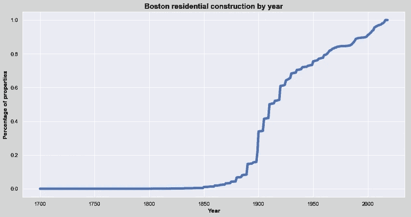

波士顿大约一半的现有住宅建于 1925 年，在 1880-1930 年间有了显著的增长。

从下图中，我们可以看到这种分布在一些更受欢迎的社区中是如何变化的。到 1900 年，比肯山已有近 80%的建筑建成，而这个海港的住宅建筑几乎有一半是在 21 世纪初建成的。

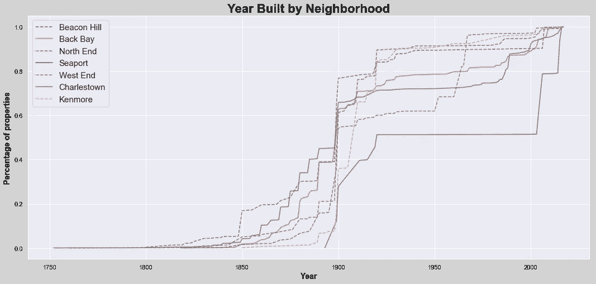

*波士顿房产价值*

转移到房地产价值，正如所料，豪华市场主导着波士顿。约 60%的城市住宅物业总价值(约 113，057，142，300 美元)来自 20%的财产。

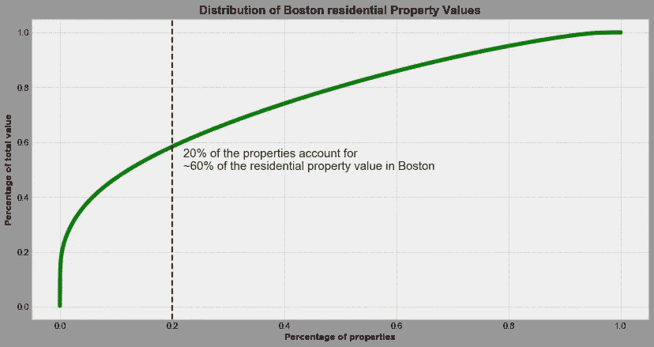

当然，在数据中还可以找到更多——在伴随代码的[中也有更多——但是为了简洁起见，本文的其余部分将集中在该项目的机器学习方面。](https://github.com/jordanbean/Predicting_Boston_Housing/blob/master/Boston%20Property%20Data.ipynb)

**预测波士顿房产价值**

该项目的目标是创建一个预测波士顿房地产价值的模型。我之前只过滤了住宅物业的数据，对于预测，我进一步过滤了数据，只包括了公寓和总价值(约 300 万美元)的 98.5%的数据。

上述原因是:( 1)我需要在我的计算机上本地处理数据，因此多次使用 4 个模型的全部 100，000+文件是不可行的，所以我必须缩减数据;( 2)有少量大的异常值可能会影响预测，我需要一个可以概括大多数属性的模型。

*型号选择*

从表面上看，这是一个经典的回归问题:获取一系列输入，计算每个输入的相对影响(斜率)，并预测一个连续变量。

事实上，在这个项目的过程中，我测试了 Python 的 sklearn 库中的 4 个回归模型——线性、随机森林、KNeighbors 和梯度推进。

*每个型号是什么？*

线性回归试图通过最小化均方误差产生一条最佳拟合的线。或者，换句话说，该线被构造成使得所有输入和预测线之间的距离最小化。

[随机森林回归](http://scikit-learn.org/stable/modules/generated/sklearn.ensemble.RandomForestRegressor.html)创建一系列单独预测属性值的决策树，然后对所有树的预测值进行平均，得到最终预测值。 [KNeighbors 回归](http://scikit-learn.org/stable/modules/generated/sklearn.neighbors.KNeighborsRegressor.html)找到最接近的(即大小、卧室数量、邻居等。)“k”个数据点指向每个输入，然后对这些“k”(用户自定义)点的总数进行平均，作为预测值。

最后，[梯度推进回归器](http://scikit-learn.org/stable/modules/generated/sklearn.ensemble.GradientBoostingRegressor.html)是我最近学到的一个新模型，概念上我理解它，但是算法背后的数学需要更多的工作。该模型通过分析误差并根据误差移动不同点的权重(误差越大=下一次迭代中的重点越多)，迭代地建立在每个连续的预测集上。

*准备数据*

机器学习和预测不仅对大量、多样和准确的数据是有效的，而且当数据在输入模型之前准备妥当时也是有效的。

我们的数据预处理将采取两个步骤。首先，我们要缩放连续变量。接下来，我们要对分类列进行编码和二进制化。

我们将使用的连续变量包括总平方英尺、卧室数量、公寓所在的楼层，以及自装修以来的年数(如果公寓从未装修，则为自建造以来的年数)。

平方英尺明显大于卧室的数量，但不一定更重要。为了抵消这种缩放偏差，我们将应用标准缩放器，使每一列的平均值为 0，标准差为 1。

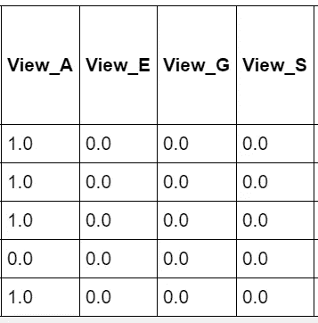

对于分类变量，我们创建二进制(值为 1 或 0)列，当列值与新的二进制列匹配时，这些列被“激活”。例如，在左边的例子中，在我们的预处理步骤之前，5 个属性中的 4 个具有值“A ”,而另一个不包含这些值。

```
view_dummies = pd.get_dummies(predict_df.U_VIEW, prefix='View')view_df = pd.concat([predict_df, view_dummies], axis=1)
```

*模型创建和测试*

准备好数据后，建模过程分为 3 个步骤:

1.  特征工程和模型测试
2.  最终特征选择
3.  模型调整

*特征工程和模型测试:*

我的模型构建过程从使用最基本的特性开始，然后测试添加附加特性的影响。我只从数据中的连续变量开始(在预处理中提到过),结果非常糟糕。均方根误差为 250，000 美元以上，而平均绝对误差为 150，000 美元以上(预测误差平均超过 150，000 美元)。

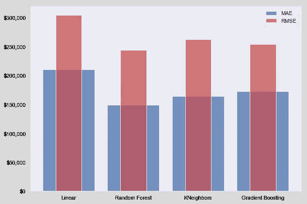

然而，有足够的机会用其他变量来改进模型。第一个增加是为房产所在的社区创建并包含虚拟变量，因为正如下面的箱线图所示，价值因位置而有显著变化。


事实上，包括邻居极大地改善了结果。例如，Random Forest 的 MAE 从大约 150，000 美元下降到大约 63，000 美元，降幅接近 60%。

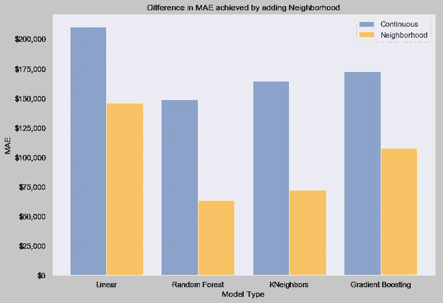

我继续添加数据特征，如视图(特殊到差)和方向(后方、前方、通过等。)和测试模型，每一个都显示出递增的改进。

然后，我希望从数据本身开发额外的功能。例如，我创建了一个“奢华”变量(其思想是，在其他条件相同的情况下，奢华的房产可以卖更高的价格)，将厨房或浴室风格的房产标记为奢华。我还创建了多项式特性来尝试捕捉连续变量和属性值之间的非线性和交互关系。

最后，我引入了邮政编码级别的外部数据。我找到了一个 Python 包，它接受邮政编码并返回平均收入、土地面积和人口密度等信息。

```
**import** **uszipcode**
**from** **uszipcode** **import** ZipcodeSearchEnginezips_list = []

**for** zipcode **in** zips:

    search = ZipcodeSearchEngine()
    zippy = search.by_zipcode(zipcode)
    zips_list.append(zippy)
```

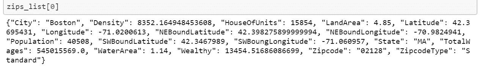

A sample result for the above code

我还搜索并最终找到了邮政编码级别的人口统计数据，并将其合并到预测数据信息中，如该社区的种族构成(白人与少数族裔)和年龄细分(千禧一代与中年人和退休者)，目的是找到其他相关变量。

虽然没有一个对添加像邻域这样的东西的大小产生影响，但我们确实看到了每种模型类型的误差度量(平均绝对误差，MAE)的总体下降趋势，没有一个较新模型的 KNeighbors 出现单个峰值。平均绝对误差从开始到结束的级数如下。

框中的值代表最终模型在每条虚线之前的 MAE，最左边的框是只有连续变量的第一个模型的 MAE:

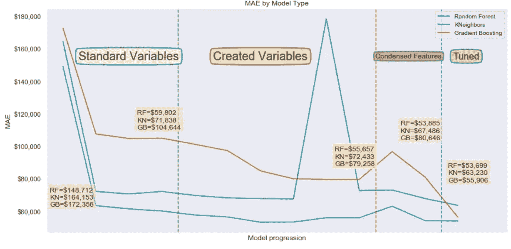

*功能选择*

虽然创建和添加要素有助于了解不同要素如何影响我们的模型，但我们的最终结果不一定是最佳输入集。我们可能有[多重共线性](https://en.wikipedia.org/wiki/Multicollinearity)需要在我们的要素中解决(要素之间的相关性),而其他可能对我们的预测没有帮助。

有几种不同的方法来处理特性选择，我尝试了两种不同的方法。首先是[主成分分析](https://jakevdp.github.io/PythonDataScienceHandbook/05.09-principal-component-analysis.html) (PCA)，它基于特征的解释方差来减少维数。这一过程分为两步:用未定义数量的成分拟合 PCA，分析解释的方差，然后用最少数量的成分重新拟合，以获得最大的方差。

```
pca = PCA()
pca.fit(poly_df_s, predict_df.AV_TOTAL)
```

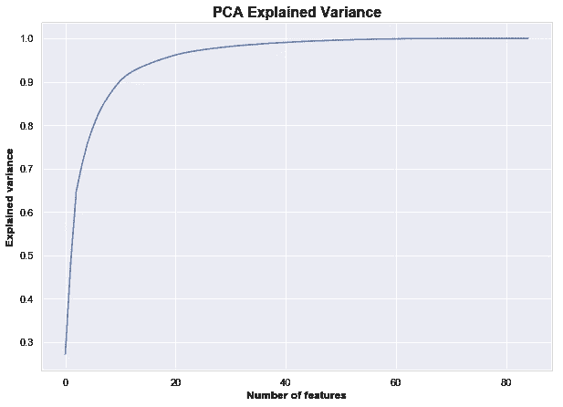

我们看到几乎 100%的差异是由大约一半的特征解释的。然后，我们可以对 PCA 和 40 个特征使用维数减少，目标是实现与所有特征相似的结果。

```
fitted_pca = pd.DataFrame(PCA(n_components=40).fit_transform(poly_df_s, predict_df.AV_TOTAL))
```

对具有 40 个分量的 PCA 转换数据运行模型，对于梯度增强算法产生了类似的结果-证明我们大约一半的特征对于该模型是无关紧要的-而 KNeighbors 和 Random Forest 的性能略有下降。

第二种方法使用 [SelectKBest](http://scikit-learn.org/stable/modules/generated/sklearn.feature_selection.SelectKBest.html#sklearn.feature_selection.SelectKBest) 函数搜索要使用的最佳特性。我针对从 20 到最大列数的 5 个 k 值测试了模型，结果是 60 产生了最好的结果。

```
# select_k_best_model_test is a function defined earlier in the code # that fits a SelectKBest model, tests the models on that data, and # returns both the results of the test (MAE, RMSE, score) plus a    # data frame of the condensed columnsk_to_test = [20, 30, 40, 60, 84]

**for** i **in** k_to_test:

    result, df = select_k_best_model_test(i)

    print('The results for the best **%i** features' %i)
    print(result)
    print('**\n**')
```

在用 60 列拟合 SelectKBest 模型之后，我试图通过删除相关列(我认为是那些相关性高于 0.8 的列)来抵消多重共线性问题。

```
corr_matrix = best_k.corr().abs()

*## Select upper triangle of correlation matrix*

upper = corr_matrix.where(np.triu(np.ones(corr_matrix.shape), k=1).astype(np.bool))

*## Find index of feature columns with correlation greater than 0.8*

to_drop = [column **for** column **in** upper.columns **if** any(upper[column] > 0.8)]*## Drop columns with a correlation about 0.8* best_k_consolidated = best_k.drop(to_drop, axis=1)
```

最终结果是一个有 37 列的模型——比我们最初的 84 列减少了很多——***的表现和其他任何模型一样好，甚至更好。*** 其余栏目包括居住面积的抽样(sq。脚)、基础楼层(即一楼、二楼等。)、看法(一般、优秀等。)、多个邻域虚拟变量等；大约三分之一的最终列是我们的特征工程和/或引入其他外部数据的结果。

*模型调整*

在经历了变量创建和从这些变量中选择特征之后，是时候看看我们是否可以通过调整超参数来改进开箱即用的模型了。

我根据模型使用了 [GridSearchCV](http://scikit-learn.org/stable/modules/generated/sklearn.model_selection.GridSearchCV.html) 和 [RandomizedSearchCV](http://scikit-learn.org/stable/modules/generated/sklearn.model_selection.RandomizedSearchCV.html) 的组合来搜索最佳结果的参数。这些函数要么搜索参数输入的每个组合(GridSearch)，要么搜索一定数量的随机选择的输入(RandomizedSearch)。

```
params_grid_gbr = {'loss':['ls','lad','huber'], 'learning_rate':np.arange(0.02, 0.4, 0.03), 
                   'n_estimators':np.arange(100, 500, 50), 'min_samples_split': np.arange(2, 50, 5), 
                   'max_depth':np.arange(3, 15, 3)}

gbr = GradientBoostingRegressor(random_state=66)

gbr_grid = RandomizedSearchCV(gbr, params_grid_gbr, n_iter=10, cv=5, scoring='neg_mean_absolute_error',)gbr_grid.fit(tr_x, tr_y)
```

运行这些算法的结果是，对于每个被调整的模型，基于被测试的输入的一组最佳参数。这里需要注意的是，最优参数是我们测试的参数的函数，因此实际上它们可以被认为是局部最优而不是全局最优(即，如果我们要测试每一个可能的参数组合)。

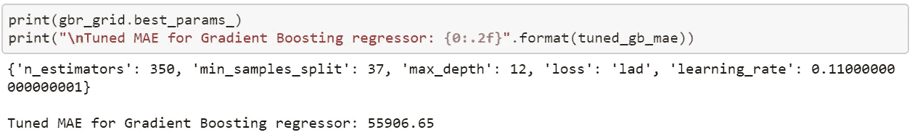

梯度推进回归器从调优中获得了最大的改善，MAE 从大约 80，000 美元下降到大约 55，900 美元，改善了大约 30%！其他的，比如 Random Forest，没有看到任何有意义的调整，而由 MAE 测量的 KNeighbors 的性能下降了 6%多一点。

*胜负*

完成以上所有工作后，是时候看看我们的工作成果了。我们将从查看一些指标开始，然后是我们的一个模型的错误的说明性可视化表示。

根据一个简单的“基线”模型，该模型预测房地产价值是所有房地产的平均值，我们的最佳预测将 MAE 从 290，000 美元减少到 53，600 美元。从第一个连续变量模型到调整后的模型，最小 MAE 从大约 150，000 美元下降到 53，600 美元，降幅为 64%，R2 从 0.5-.68 的范围提高到 0.8–0.95。

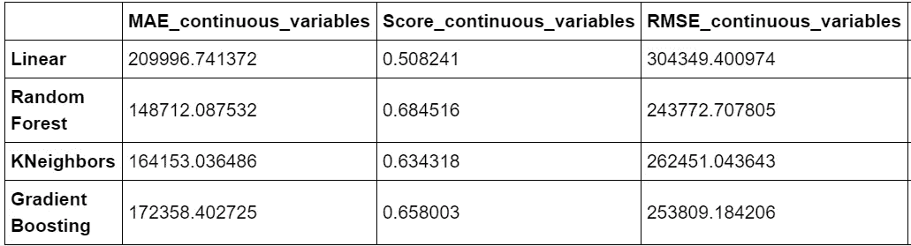

**Untuned** first model scoring

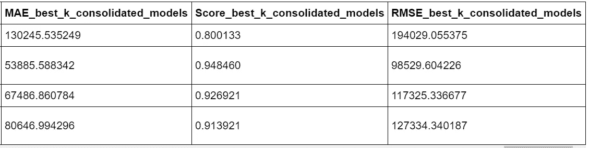

**Untuned** final model scoring

最终调整后的模型的平均绝对误差值为:

*   兰登森林:53699 美元
*   邻居:63230 美元
*   梯度推进:55906 美元

总的来说，我们的模型与实际的财产价值相差约 10%。我们的预测绝非完美，但也大致如此。我很想知道其他人可以在我进行的过程之上做出的改进，或者超出我当前技能的更复杂的模型的结果会是什么。

我将提供的最后一个视觉效果是检查我们的一个模型的错误，并寻找是否有任何模型无法捕捉的系统偏差(例如，通过属性值、邻域、一致的过/欠预测)。下图显示了随机森林模型的绝对误差，按邻域着色，气泡大小是误差的大小(因此中间 45 度线上的空白区域-小误差=小气泡)。

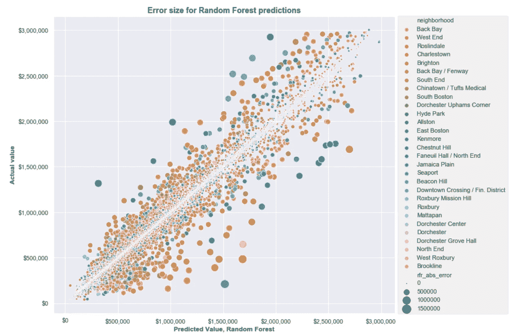

事实上，我们没有看到任何明确的数据误差模式。我们看到的最大错误分组是，模型预测的价值在大约 100 万美元到大约 100 万美元 2M 之间，而实际价值不到 100 万美元。我很想知道是什么属性“愚弄”了模型，以至于预测如此之远。

结论:我们学到了什么？

这些项目的目标不仅是能够分享有趣的结果，而且是发展更好的数据技能。考虑到这一点，我从这个项目中得到的一些最大的收获如下:

*   **预测房产难**！我确信，第一个包含平方英尺和卧室等变量的线性模型至少会产生一个令人尊敬的预测，但它还远远不够，而且随着时间的推移，增加变量的大量努力提供了递减的回报。
*   不同回归模型的性能存在显著差异，并且**测试多个模型很重要**。如果使用我们的最终特征，简单的线性模型不会比大约 130，000 美元的平均误差做得更好，但是通过其他回归模型，我们能够将平均误差降低近 60%。
*   **最大的收益来自功能工程**，这还远远不够。虽然超参数调整从选择的特征中提取了最后的预测能力(特别是对于梯度增强)，但它是在从更好的特征中显著减少的基础上增加的。
*   特征工程超越了缩放或测试样品内特征。大约 30%的最终特征是根据现有数据(即添加奢侈品标签或多项式特征)或外部数据(邮政编码级别的人口统计数据、收入)创建的。**数据集变量之外的特征工程降低了我们的误差幅度，从约 6%(近邻)到约 30%(梯度增强)**。
*   最后… **功能选择具有挑战性**！我在该项目的大部分时间都在试图了解不同的特征选择标准，以便在不过度拟合模型的情况下获得最大的预测能力。我以为会有一种简单的方法来插入特性和目标——瞧！—完美的特征依然存在。相反，我循环使用了几种不同的方法，在这个过程中加深了我的学习。

该模型并不完美，但至少它是一个案例，说明了添加额外特征(样本内外)的价值以及特征选择的重要性。 ***我们的模型对于右边的 37 列和所有的 84 个*** 一样强大。

所以，是的，波士顿的房地产很贵，预测它是一个挑战，但最终我觉得对我的城市和我的数据技能都更了解了。

我欢迎任何人对代码、功能或想法的反馈。请随时到 jordan@jordanbean.com 找我。