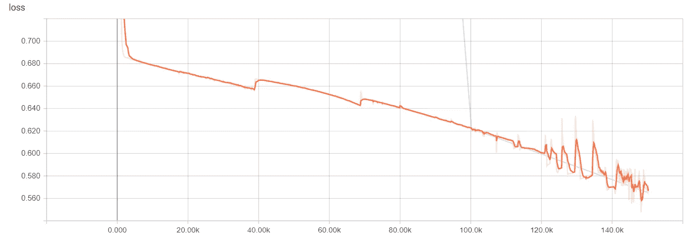
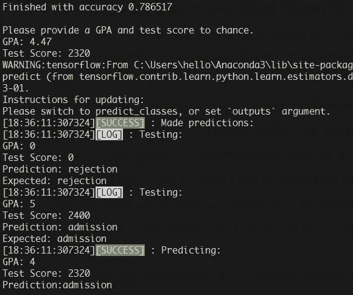
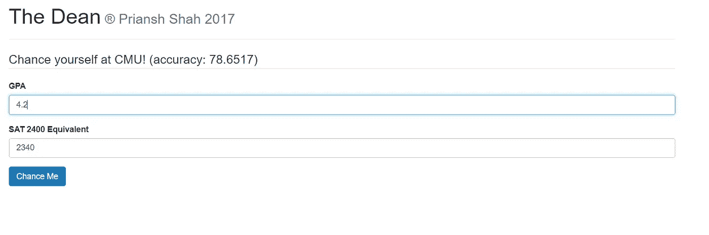

# 用人工智能预测大学录取

> 原文：<https://towardsdatascience.com/predicting-college-acceptance-with-ai-6d8abd702385?source=collection_archive---------2----------------------->

大约在去年的这个时候，我正忙着敲击键盘，向世界各地的大学申请。当我填写面前看似无穷无尽的申请表时，我突然意识到这完全是低效和冒险的。

每年有超过 200 万份大学申请被提交，每一份都带有一定的偶然性。即使是学术水平最高的学生申请也带有一定的随意性，结果往往会面临困境——大学录取中固有的精英制度让位于不确定性、怀疑和焦虑。

当然，许多因素影响录取，但众所周知，有两个因素在决定录取时举足轻重:GPA 和 SAT/ACT 分数。虽然其他因素肯定会被考虑在内，但不可否认的是，这两个指标对学生的申请有着不可思议的重要性——尽管没有人真正知道*大学是如何判断和筛选这些指标的。*

但是说到底，这两个指标是*指标*:可以使用数据科学分析趋势和关系来轻松评估的数字。因此，尽管我非常不耐烦和焦虑，我还是决定尝试预测大学录取情况，而不是等待决定出台。虽然有成千上万种统计方法来分析 GPA/考试成绩和申请结果之间的趋势，但我选择了一种最近流行的预测方法:机器学习。

机器学习是一个广泛的领域，有许多解决方案和应用，但我特别专注于人工神经网络。鉴于我的输入完全是数字，我的输出可以一次性编码成二进制值(0 表示拒绝，1 表示接受)，人工神经网络工作得相当好。

在 [Tensorflow](http://www.tensorflow.org) 中实现了一个架构之后，我在专门为卡内基梅隆大学收集的数据集上训练了我的网络(这只是一个例子，大约有 90 个数据点)。经过大约 150，000 次迭代(在 GeForce 1060 GPU 上大约 1 分钟)，我能够达到介于**75–80%**之间的精确度。虽然这可能看起来不太准确，但它足以得出一些结论，并且肯定比任意的线性模型更好。

Decreasing Loss over 150,000 steps (faded blue line is cross validation, no overfitting + room for more training)

从命令行中，我能够收集到一些相当不错的预测大学录取的结果:

Using a randomly high GPA and high SAT.

(美丽的日志由来源构建的`[console-logging](https://github.com/pshah123/console-logging)`提供)

为了便于使用，我用 Bootstrap 3 设计了一个简单的 GUI:

总而言之，它不仅在平息我的焦虑方面，而且在过滤我的申请以限制我可能进入的学校方面，证明是有点用的。具有讽刺意味的是，它甚至预言了我被卡内基梅隆大学拒绝！

该项目的完整来源可在 Github [在这个回购。](https://github.com/pshah123/ChanceyNN)

 [## pshah123/ChanceyNN

### 利用人工智能预测大学申请结果

github.com](https://github.com/pshah123/ChanceyNN) 

像这样，还有更多？在 [Aiko AI](https://helloaiko.com) ，我们热爱开源项目以及探索和可视化数据！