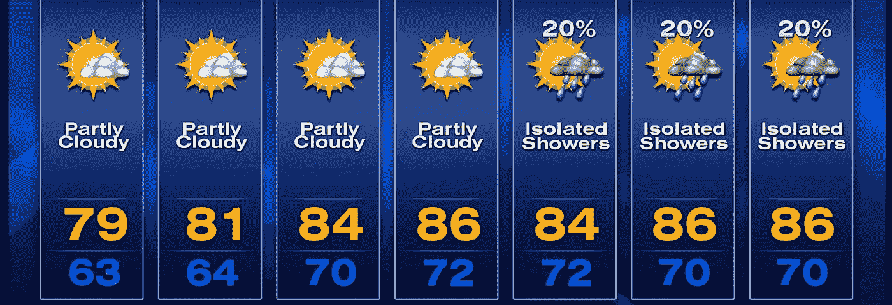
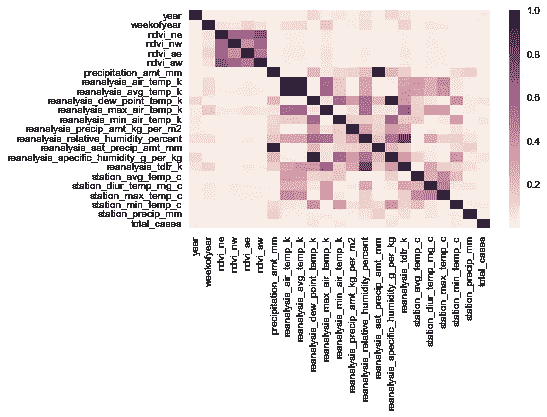
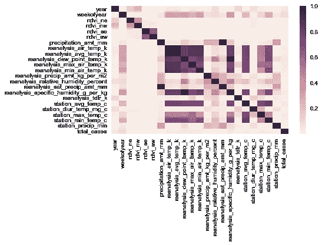
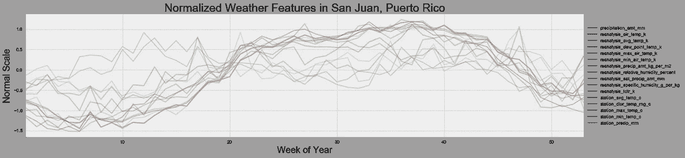
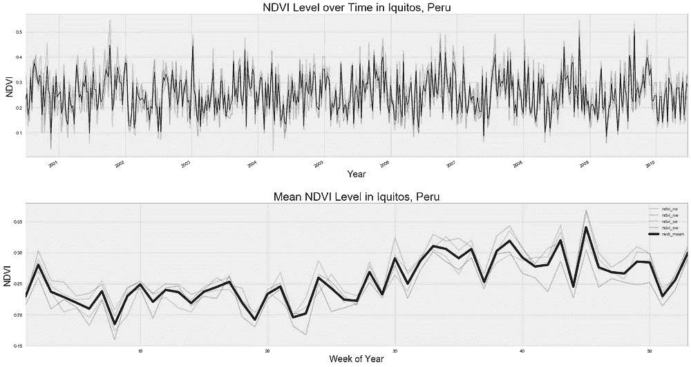
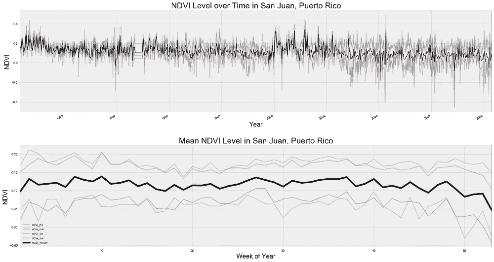

# 用 Python 预测登革热:看天气

> 原文：<https://towardsdatascience.com/predicting-dengue-fever-with-python-look-at-the-weather-8945b615301f?source=collection_archive---------6----------------------->

## 步骤 Pandas、matplotlib 和 Python 中的特性探索

驱动数据公司目前正在举办一场[竞赛](https://www.drivendata.org/competitions/44/dengai-predicting-disease-spread/page/80/)，预测秘鲁伊基托斯和波多黎各圣胡安的登革热病例。我在我之前的[职位](https://medium.com/@alexjf12/predicting-dengue-cases-in-san-juan-puerto-rico-and-iquitos-peru-6596d9f44120)中探究了每周的案件量。在这篇文章中，我将探讨竞争对手提供的特性。

# 功能

天气天气天气。所有提供的预测病例数的变量都是基于天气。这 20 项功能分为:

*   温度
*   湿度
*   降雨
*   植被水平

我的第一步，总是，是看哪些特征彼此相关，哪些特征与目标相关。Seaborn 的热图功能有助于可视化这些相关性。在这种情况下，我对所有相关值进行平方，因为我不关心正相关或负相关，只关心相关的强度。越接近 1，相关性越强。

Correlation Heatmap for Iquitos (left) and San Juan (right)

圣胡安和伊基托斯具有不同的要素关系集。NDVI 水平在伊基托斯高度相关，但在圣胡安不太相关。圣胡安的温度特征会一起移动，但伊基托斯不会。这再次表明每个城市需要不同的模式。

## 温度、降雨量和湿度

蚊子需要水和合适的温度才能茁壮成长。我的假设是:更多的雨和热=更多的蚊子。下面的图表解释了这些特征平均来说是如何随时间变化的。

我将所有的天气特征标准化，使它们保持在相同的尺度上。例如，在波多黎各的圣胡安，大多数特征都在 0 左右。这意味着它们接近整个数据集的平均温度。值为 1 或-1 表示变量高于或低于平均值 1 个标准偏差。像这样标准化可以让我们比较不同尺度上变量的变化(温度变化 1 度和降雨量增加 1 英寸具有完全不同的意义)。

绘制所有特征的目的是看它们是否一起移动。看`precipitation_amt_mm`是否每周都在变化并不重要，重要的是看它是否与其他特征同步变化。

圣胡安的天气变化比秘鲁的伊基托斯更为紧密。特征之间的变化，尤其是在基于时间的分析中，对于具有更大的预测能力是重要的。但这也可能导致更多的噪音。

## 归一化差异植被指数

美国国家海洋和大气管理局(NOAA)拍摄各个城市的卫星图像，并确定该地区的有机增长数量。该级别被归一化为归一化差异植被(NDVI)，并提供给每个城市的四个象限。关于 NDVI 是如何计算的更多信息，请点击这里。

Normalized Difference Vegetation Index for Iquitos, Peru (left) and San Juan, Puerto Rico (right)

第一，这个数据是有噪音的。每张图片的上半部分显示了每周的观察结果。取一年中每周的平均值，我们可以得出圣胡安和伊基托斯植被水平的年度趋势。随着时间的推移，伊基托斯的趋势比圣胡安强得多。此外，所有四个象限在伊基托斯总是几乎相同。圣胡安南部象限的 NDVI 分数几乎总是低于北部象限。

## 结论

建模将向我们展示哪些特征以及特征的哪些组合将是病例数量的良好预测器。然而，重要的是要记住，并不是当前的天气决定了蚊子的数量，从而决定了登革热病例的数量。之前的几周和几个月为蚊子的繁殖提供了潜伏期。

下一篇文章将探讨如何确定月趋势(不考虑天气特征)。之后，我将描述使用历史天气预测当前登革热病例数量的方法。

## 密码

我的 [GitHub repo here](https://github.com/AlexJF12/predicting-dengue/blob/master/3%20-%20Dengue%20cases%20EDA.ipynb) 上有 Jupyter 笔记本，上面有我的可视化 python 代码。请随意阅读我未来的帖子。