# 利用季节性 ARIMAX 模型和气象数据预测登革热传播

> 原文：<https://towardsdatascience.com/predicting-dengue-spread-using-seasonal-arimax-model-on-meteorology-data-3f35979ec5d?source=collection_archive---------6----------------------->

在过去的几十年中，登革热病毒已经在世界的亚热带地区传播，严重形式的登革热的数量增加，例如严重出血、低血压，甚至死亡。由于疾病由蚊子传播，登革热的传播与温度和降水等气象变量有关。在这篇博文中，我将回顾一下我是如何应对[邓艾竞赛](https://www.drivendata.org/competitions/44/dengai-predicting-disease-spread/)的论文和代码可以在[我的 github](https://github.com/bostonchopsticks/Predicting-Disease-Spread) 上找到！

这是游戏计划:

1.  数据分割
2.  描述性分析和数据可视化
3.  处理缺失值
4.  模型诊断
5.  模型形成
6.  预测

# 数据分割

邓艾竞赛数据集本质上是一个杂乱的数据集，包含两个不同的城市和两个不同的时间框架。我根据两个城市将数据集分成两个小数据集:圣胡安和伊基托斯。从两个数据集中，我将每个数据集分为训练集和验证集，以便在选择最佳模型在最终测试集上执行之前测试不同的模型。

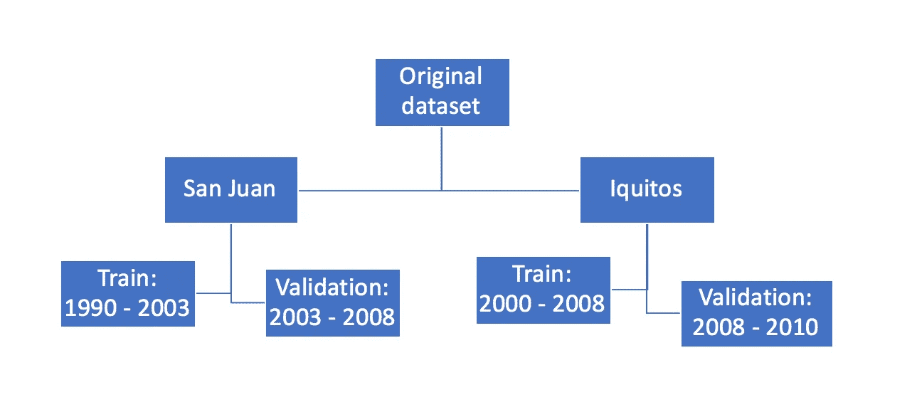

**Figure 1:** Data Split

# 描述性分析和数据可视化

圣胡安和伊基托斯的数据处理非常相似，所以我在这一节只展示圣胡安的图表。伊基托斯的图表将在[我的论文](https://github.com/bostonchopsticks/Predicting-Disease-Spread)中提供。

每个数据集包含 25 个变量，包括气象和地理变量。在此查看每个变量[的详细信息。](https://www.drivendata.org/competitions/44/dengai-predicting-disease-spread/page/82/)

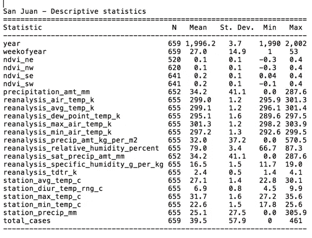

**Figure 2:** Descriptive Analysis of San Juan

相关图将有助于诊断两个变量之间是否存在任何线性关系。我们可以看到，这些变量中没有一个与总病例数**(图 3)** 高度相关。然而，如果我们包括 2 个以上的变量并运行多元线性回归，每个预测因子的大小可能会改变。

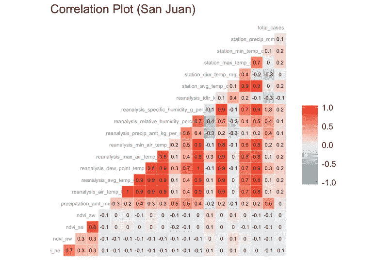

**Figure 3:** Correlation Plot of San Juan

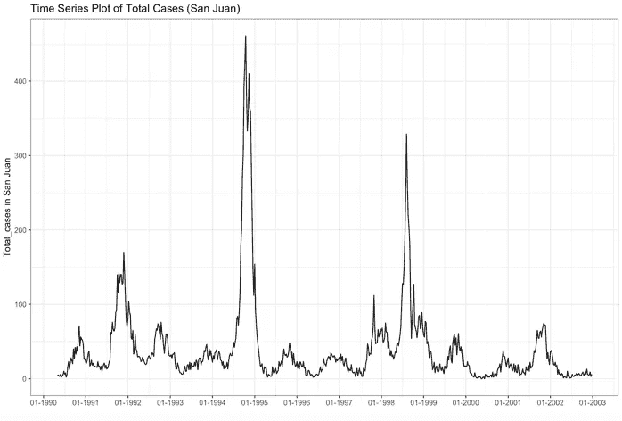

**Figure 4:** Time Series Plot of Total Cases of San Juan

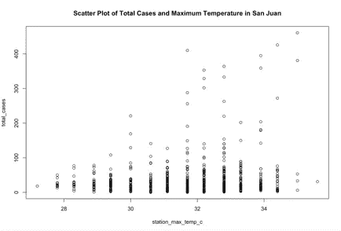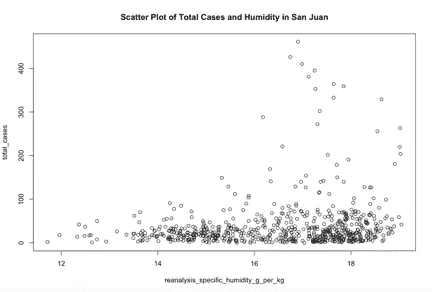

**Figure 5:** Scatter Plots of Total Cases and Climate Variables of San Juan

时间序列图表明数据中可能存在季节性，因为每年夏季前后总病例数达到高峰。两个散点图也表明了总病例数和两个气候变量之间可能的线性关系。(温度和湿度)

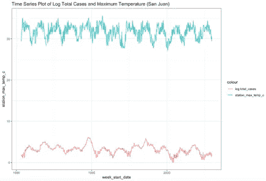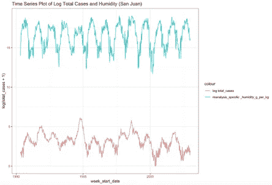

**Figure 6:** Time Series Plot of Total Cases and Climate Variables of San Juan

查看总例数和温度以及总例数和湿度的双时间序列图，我们可以看到有时例数和气候值一起上下移动；有时天气变量首先达到峰值或直线下降，然后总病例数在 3 -4 周后上下波动。更有趣的是，登革热症状通常在被受感染的蚊子叮咬后 4 至 7 天开始出现。蚊子在 70 华氏度时可能需要 14 天完成其生命周期，而在 80 华氏度时只需要 10 天。因此，在温度、降雨量或湿度上下波动后，平均需要 3-4 周才能报告病例。

描述性分析和数据可视化提出了一个具有额外预测变量的时间序列模型，并且可能有一些预测变量的先前滞后。

# 处理缺失值

我通过使用 R 中的**最后一次观察结转**方法来处理缺失数据，这基本上是用之前最近的非 NA 替换每个 NA。这里我假设本周的天气与上周的天气不会有太大的不同。

```
*# build a function to impute data with the most recent that is non missing*
  na.locf.data.frame <- 
    **function**(object, **...**) replace(object, TRUE, lapply(object, na.locf, **...**))

  *#fill in NAs - SJ*
  sjdata.train.imputed <- na.locf.data.frame(sjdata.train)

  *#fill in NAs - IQ*
  iqdata.train.imputed <- na.locf.data.frame(iqdata.train)
```

# 模型诊断

一个增强的 Dickey-Fuller 检验表明时间序列数据集是平稳的。该数据集具有复杂的季节性，每周数据点(频率= 52.18)。ETS、分解等方法大多要求季节周期为整数。即使我们把它四舍五入到 52，大多数方法也不会有效地处理这么大的季节周期。一种可能的方法是通过在 ARIMA 模型中包括傅立叶项来使用动态谐波回归模型。

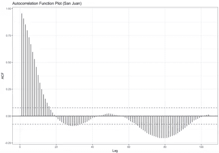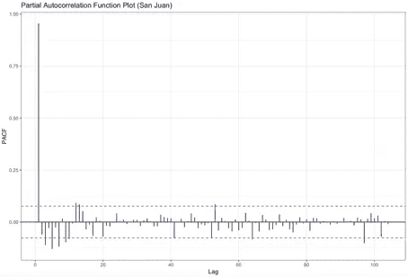

**Figure 7:** ACF and PACF Plots of Total Cases of San Juan Time Series

接下来，为了挑选 MA 和 AR 术语，我首先检查了早期滞后(1，2，3，…)来判断非季节性术语。在低滞后时，ACF 中的这些峰值表示非季节性 MA 术语。此外，PACF 在低滞后时的峰值表明可能存在非季节性 AR 项。

# 模型形成

通过经验审查和数据诊断，我决定尝试 3 种模型:SARIMA、SARIMAX 和神经网络。我从一个只有全部病例的基本而简单的季节性 ARIMA 开始，然后我在模型中添加了更多的预测因子，如温度、湿度、降雨量。最后，我用 r 中的 NNETAR 包建立了神经网络模型(多层前馈网络)。这里我将只报告建立最佳模型的过程，即季节性 ARIMAX。

**季节性 ARIMAX**

在研究了影响蚊子繁殖的因素后，我使用 xreg 参数将这些变量添加到季节性 ARIMA 中:

*   降水量 _ 金额 _ 毫米
*   再分析露点温度 k
*   再分析 _ 相对湿度 _ 百分比
*   车站平均温度 c
*   车站 _ 昼夜 _ 温度 _rng_c
*   车站最高温度 c
*   车站最低温度 c

基本上，如果你在一个热带国家长大，你可能知道蚊子的生命周期包括在水中和空气中的四个不同的阶段。因此，降水、温度和湿度在加速蚊子数量方面起着重要作用。请参考此链接了解更多信息。

有时，包含在回归模型中的预测因子的影响不是简单而直接的。例如，高温和高降雨量可能在几周之后的一段时间内影响所有病例。我运行了 CCF(交叉相关函数),以查看预测因子的任何先前滞后是否与总病例的当前滞后高度相关。似乎前 4 周的露水温度可能与当前的病例数正相关。

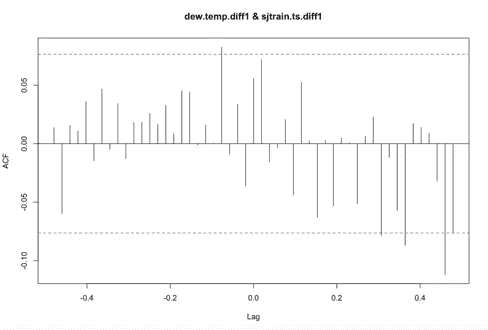

**Figure 8:** CCF Plots of Total Cases and Dew Temperature of San Juan Time Series

ARIMA 模型的选择是使用赤池的信息标准(AIC)进行的。在所有测试的模型中，a SARIMAX (3，0，2)(0，0，1)[52]是最适合圣胡安市的模型，而 ARIMAX (0，1，2)的季节傅立叶项 K = 1 是伊基托斯市的最佳模型。

在 ARIMA 和 NNET 之间的最终选择基于使用 MAE 作为主要参数的样本内交叉验证。

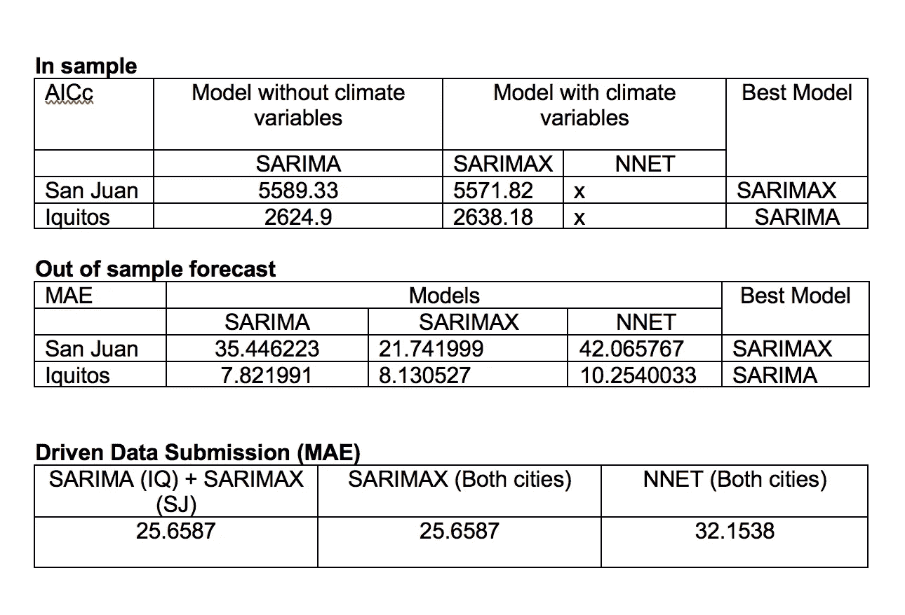

# 预测

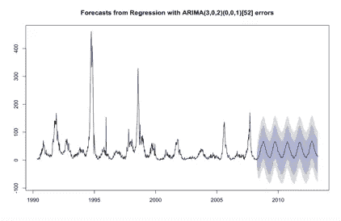

这是两个城市的预测图。我综合了圣胡安和伊基托斯总病例的预测，并将结果提交给数据驱动网站。我 MAE 得了 25.6587，排名 674/4392。

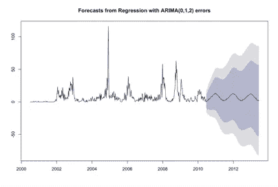

**Figure 9:** Forecasted Values of Total Cases of San Juan and Iquitos

最终的模型有一些缺点，可以在将来解决。首先，我完全忽略了“ndvi”(地理变量和卫星植被指数)，而这些变量可能对疾病的爆发很重要。然而，为了包括这些变量，我需要做更多的研究，以更好地理解它们是什么、为什么以及如何重要。其次，该模型没有完全捕捉到导致登革热传播的所有因素。更多与这两个城市的基础设施和医疗保健系统相关的变量应该包括在模型中。最后，可以使用多季节周期模型来显示周、月和年的不同季节模式，因为当前模型仅捕获每周的季节性。