# 预测 Airbnb 新用户的目的地国家

> 原文：<https://towardsdatascience.com/predicting-destination-countries-for-new-users-of-airbnb-eb0d7db7579f?source=collection_archive---------7----------------------->


我在 3 年前发现了 Airbnb 在 Kaggle 上发布的这个有趣的挑战。但是，让您参与刺激的数据挑战永远不会太晚！:)

这个 Kaggle 挑战提出了一个预测哪个国家将成为新用户预订目的地的问题。为了这个挑战，我们将使用 Airbnb 提供的三个数据集。

1.  训练集
2.  测试设备
3.  会话数据

让我们了解一下用户资料在训练和测试数据集中的样子。

描述每个用户的 16 个特征如下

1.  id:用户 id
2.  date_account_created:帐户创建日期
3.  timestamp_first_active:第一个活动的时间戳，注意它可以早于 date_account_created 或 date_first_booking，因为用户可以在注册之前进行搜索
4.  date_first_booking:首次预订的日期
5.  性别
6.  年龄
7.  注册方法
8.  注册流:用户注册的页面
9.  语言:国际语言偏好
10.  affiliate_channel:什么样的付费营销
11.  affiliate_provider:营销的地方，如谷歌，craigslist，其他
12.  first_affiliate_tracked:用户在注册之前互动的第一个营销是什么
13.  注册应用程序
14.  第一设备类型
15.  第一个浏览器
16.  country_destination:这是我们要预测的目标变量

类似地，有 6 个特征来描述用户的每个 web 会话，如下所示:

1.  user_id:与 users 表中的列' id '连接
2.  行为
3.  动作类型
4.  行动 _ 详细信息
5.  设备类型
6.  secs _ elapsed

我把对这个挑战的分析分成了两部分—

一.探索性分析

二。预测建模

让我们首先开始探索数据集。

# 一.探索性分析

```
# Importing the necessary libraries
import pandas as pd
import numpy as np
import seaborn as sns
import matplotlib.pyplot as plt
%matplotlib inline
import warnings
warnings.filterwarnings("ignore")
```

让我们现在加载数据。

```
train_users = pd.read_csv("train_users_2.csv")
test_users = pd.read_csv("test_users.csv")print("There were", train_users.shape[0], "users in the training set and", test_users.shape[0], "users in the test set.") print("In total there were",train_users.shape[0] + test_users.shape[0], "users in total." )
```

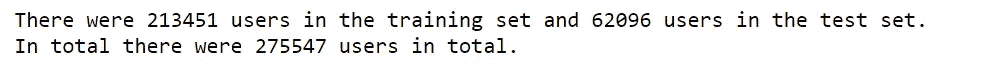

现在，我们将探索训练集和测试集中的所有用户。

```
df = pd.concat((train_users, test_users), axis = 0, ignore_index = True, sort = True)
```

检查空值。

```
display(df.isnull().sum())
```

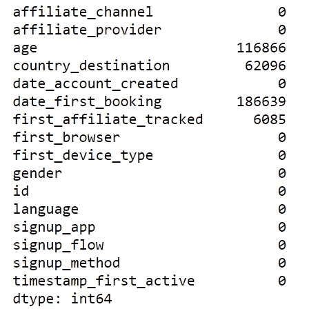

我们看到“年龄”、“国家/地区 _ 目的地”、“日期 _ 首次预订”、“首次会员 _ 追踪”列中有空值。

我们尝试检查每一列中的唯一值，以确定是否有任何丢失的数据。我们发现“性别”和“第一浏览器”列中有未知数。

```
df.gender.unique()
```

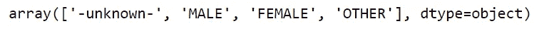

```
df.first_browser.unique()
```


我们用 NaNs 替换 unknowns，并删除列“date_first_booking ”,因为它在我们的测试集中没有任何值。

```
df.gender.replace("-unknown-", np.nan, inplace=True)
df.first_browser.replace("-unknown-", np.nan, inplace=True)
df.drop("date_first_booking", axis = 1, inplace=True)
```

# 用户年龄

现在让我们检查年龄的统计摘要，看看是否有任何明显的异常。

```
df.age.describe()
```

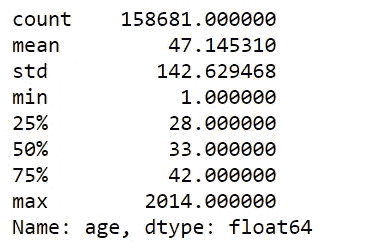

最大年龄是 2014，这是不可能的。看起来用户无意中填写了年份而不是年龄。还有，最小年龄 1 看起来很荒谬。

```
df.loc[df['age']>1000]['age'].describe()
```

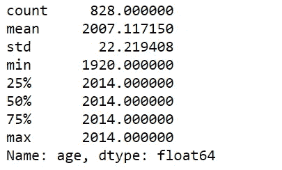

```
df.loc[df['age']<18]['age'].describe()
```


我们纠正错误填写的年龄，然后设置年龄限制(18-下限和 95-上限)。

```
df_with_year = df['age'] > 1000
df.loc[df_with_year, 'age'] = 2015 - df.loc[df_with_year, 'age']
df.loc[df_with_year, 'age'].describe()
```

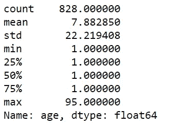

```
df.loc[df.age > 95, 'age'] = np.nan
df.loc[df.age < 18, 'age'] = np.nan
```

可视化用户的年龄。

```
plt.figure(figsize=(12,6))
sns.distplot(df.age.dropna(), rug=True)
plt.show()
```

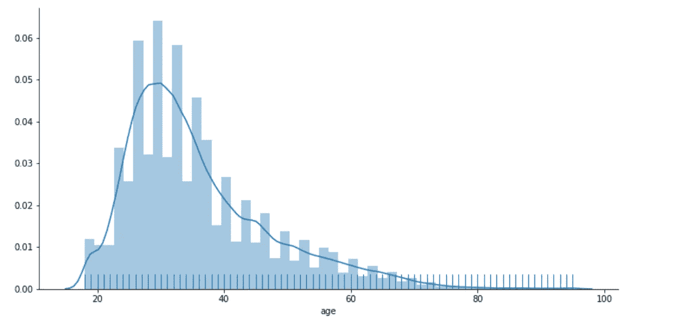

Fig.1: Plot visualizing the age bracket of the users

正如我们在图 1 中看到的，大多数用户群都在 20 到 40 岁之间。

# **用户性别**

```
plt.figure(figsize=(12,6))
sns.countplot(x='gender', data=df)
plt.ylabel('Number of users')
plt.title('Users gender distribution')
plt.show()
```

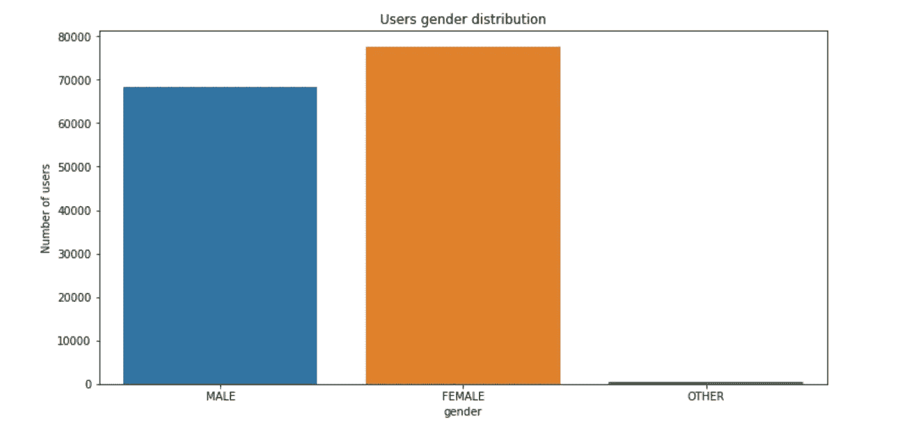

Fig.2: Plot visualizing gender distribution of the users

正如我们在图 2 中看到的，男性和女性用户之间没有显著差异。

# 旅游目的地

这是我们预测问题的目标变量。

```
plt.figure(figsize=(12,6))
sns.countplot(x='country_destination', data=df)
plt.xlabel('Destination Country')
plt.ylabel('Number of users')
plt.show()
```

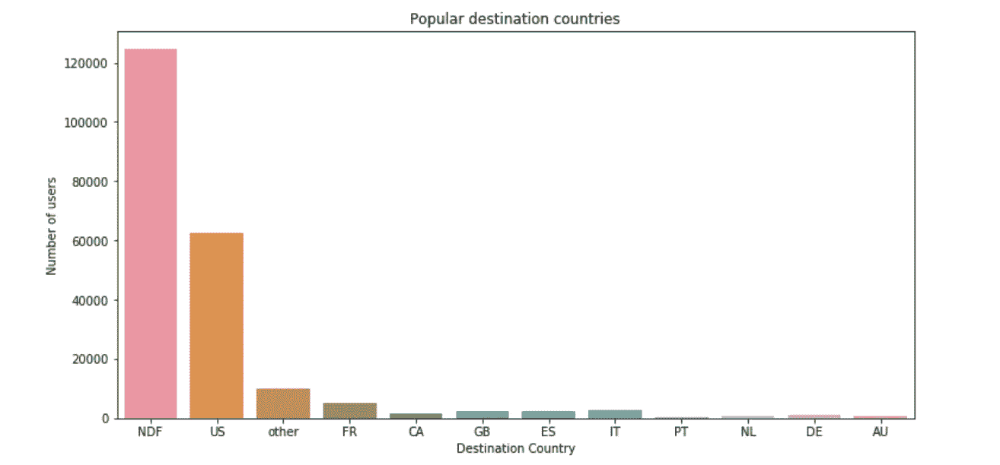

Fig.3: Plot showing popular destinations among users

我们在图 3 中看到，近 60%的用户最终没有预订 NDF 代表的任何旅行。考虑到这个问题中的用户群来自美国，大多数用户预订了美国的目的地(约 30%)。因此，我的推断是，美国旅行者倾向于在我们自己内部旅行。

我们现在将只分析那些至少进行了一次预订的用户。

```
plt.figure(figsize=(12,6))
df_without_NDF = df[df['country_destination']!='NDF']
sns.boxplot(y='age' , x='country_destination',data=df_without_NDF)
plt.xlabel('Destination Country')
plt.ylabel('Age of users')
plt.title('Country destination vs. age')
plt.show()
```

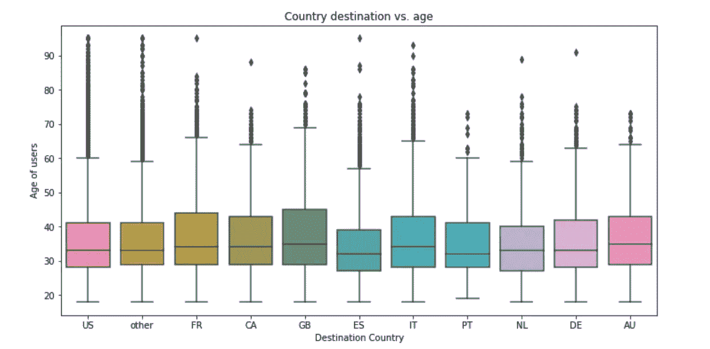

Fig.4: Plot showing choice of destination countries varies across ages

图 4 示出了在预订到图表中显示的目的地的旅行的用户中没有显著的年龄差异。然而，预订去英国旅行的用户似乎比预订去西班牙和荷兰旅行的用户年龄更大。

```
plt.figure(figsize=(12,6))
sns.countplot(x='signup_method', data = df_without_NDF)
plt.xlabel('Signup Method')
plt.ylabel('Number of users')
plt.title('Users sign up method distribution')
plt.show()
```

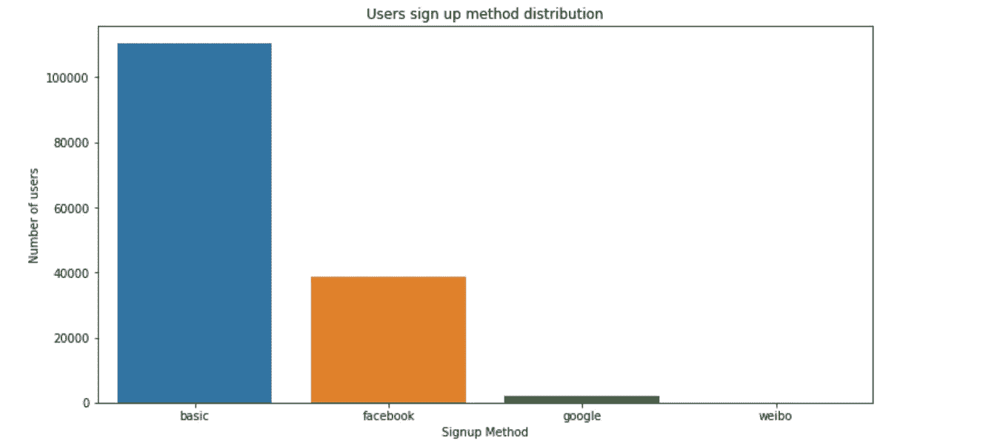

Fig.5: Plot showing sign up method distribution

图 5 显示，在至少预订过一次的所有用户中，近 70%的人使用基本方法(电子邮件)在 Airbnb 注册。

```
plt.figure(figsize=(12,6))
sns.countplot(x='country_destination', data = df_without_NDF, hue = 'signup_method')
plt.xlabel('Destination Country')
plt.ylabel('Number of users')
plt.title('Users sign up method vs. destinations')
plt.legend(loc='upper right')
plt.show()
```

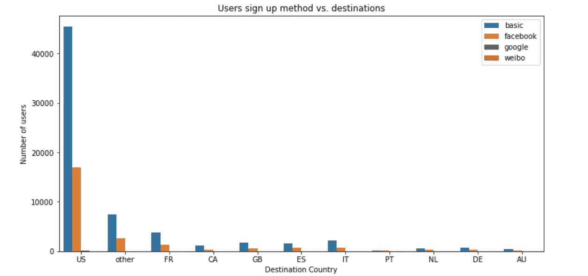

Fig.6: Plot showing distribution of sign-up methods vs. destinations

图 6 告诉我们，在至少预订过一次的用户中，无论预订的目的地是哪个国家，大多数人都使用电子邮件的方式注册 Airbnb。

```
plt.figure(figsize=(12,6))
sns.countplot(x='signup_app', data=df_without_NDF)
plt.xlabel('Signup app')
plt.ylabel('Number of users')
plt.title('Signup app distribution')
plt.show()
```

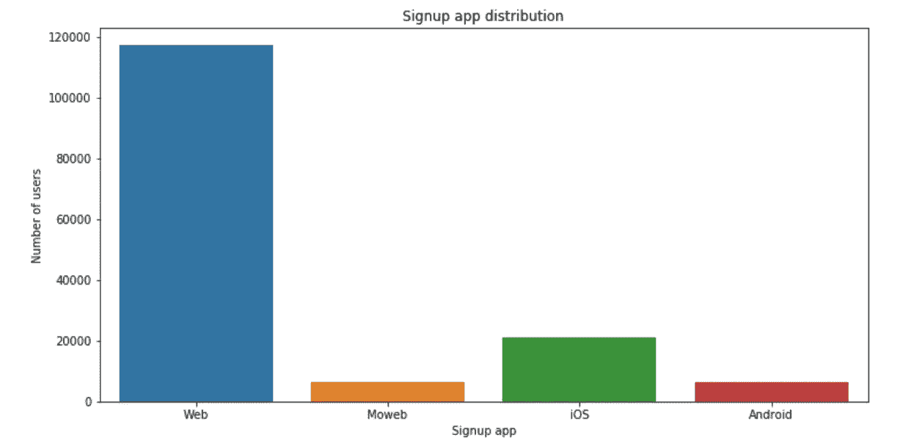

Fig.7: Plt showing signup app distribution

在所有预订者中，大多数人都是使用 Airbnb 的网站注册的。接下来，大多数用户使用 iOS 注册(图 7)。

```
plt.figure(figsize=(12,6))
sns.countplot(x='country_destination', data=df_without_NDF, hue='signup_app')
plt.xlabel('Destination Country')
plt.ylabel('Number of users')
plt.title('Destination country based on signup app')
plt.legend(loc = 'upper right')
plt.show()
```

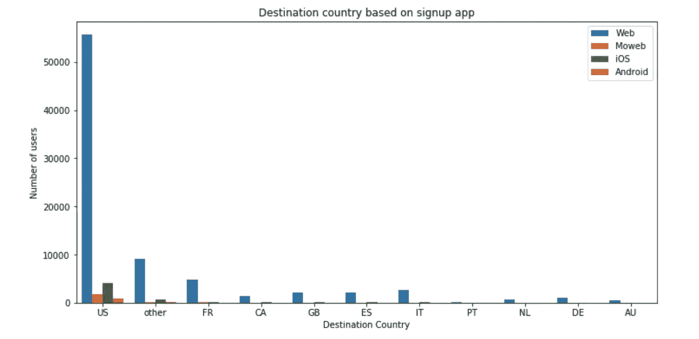

Fig.8: Plot showing distribution of destination countries based on signup app

我们看到，美国用户在 Airbnb 上注册时使用了各种各样的应用程序。在其他国家，用户似乎更喜欢只在 Airbnb 的网站上注册(图 8)。

# 接纳

```
plt.figure(figsize=(12,6))
sns.countplot(x='affiliate_channel', data=df_without_NDF)
plt.xlabel('Affiliate channel')
plt.ylabel('Number of users')
plt.title('Affiliate channel distribution')
plt.show()
```

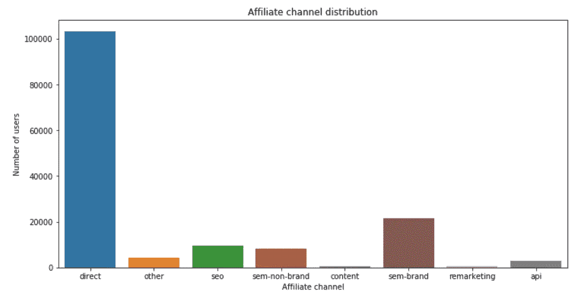

Fig.9: Plot showing distribtution of affiliate channels

我们看到，近 70%的用户直接来到 Airbnb 的网站，没有任何附属机构的参与(图 9)。

```
plt.figure(figsize=(18,6))
sns.countplot(x='first_device_type', data=df_without_NDF)
plt.xlabel('First device type')
plt.ylabel('Number of users')
plt.title('First device type distribution')
plt.show()
```

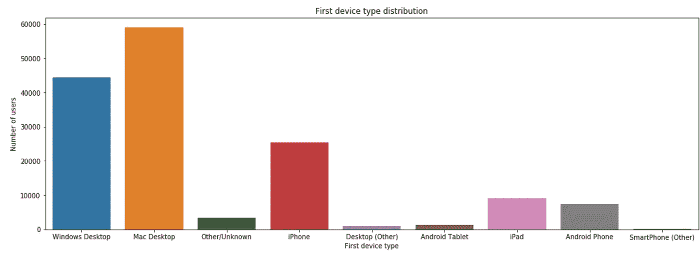

Fig.10: Plot showing distribution of first device type used by users

从图 10 来看，用户首次访问 Airbnb 网站时最常用的设备似乎是 Mac 桌面(40%)，其次是 Windows 桌面(30%)。

```
plt.figure(figsize=(18,6))
sns.countplot(x='country_destination', data=df_without_NDF, hue='first_device_type')
plt.ylabel('Number of users')
plt.title('First device type vs. country destination')
plt.legend(loc = 'upper right')
plt.show()
```

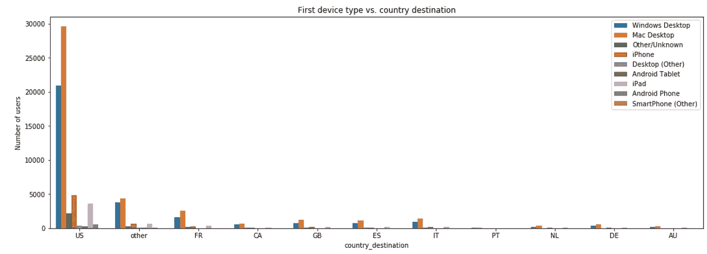

Fig.11: Plot showing distribution of first device type vs. country destination

从图 11 中可以看出，无论预订的目的地是哪个国家，Mac Desktop 都是用户访问 Airbnb 网站的首选设备。这似乎是美国最高的。紧随其后的是 Windows 桌面。

```
df_without_NDF_US = df_without_NDF[df_without_NDF['country_destination']!='US']
plt.figure(figsize=(18,6))
sns.countplot(x='country_destination', data=df_without_NDF_US, hue='first_device_type')
plt.ylabel('Number of users')
plt.title('First device type vs. country destination without the US')
plt.legend(loc = 'upper right')
plt.show()
```

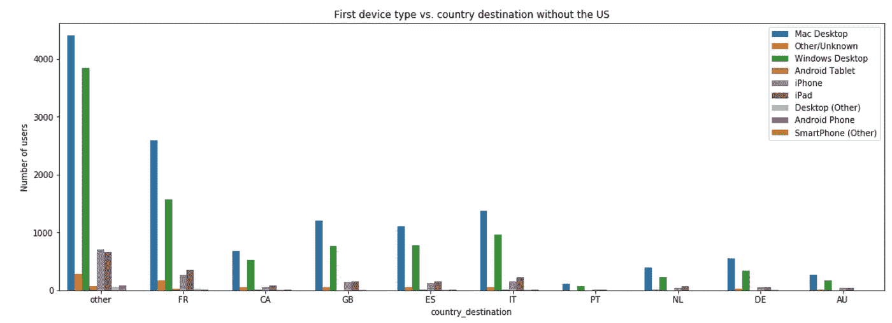

Fig.12: Plot showing distribution of first device type vs. destinations (excluding US)

在美国以外，苹果设备似乎比 Windows 设备更受欢迎(图 12)。

```
plt.figure(figsize=(20,6))
sns.countplot(x='first_browser', data=df_without_NDF)
plt.xlabel('First browser')
plt.ylabel('Number of users')
plt.title('First browser distribution')
plt.xticks(rotation=90)
plt.show()
```

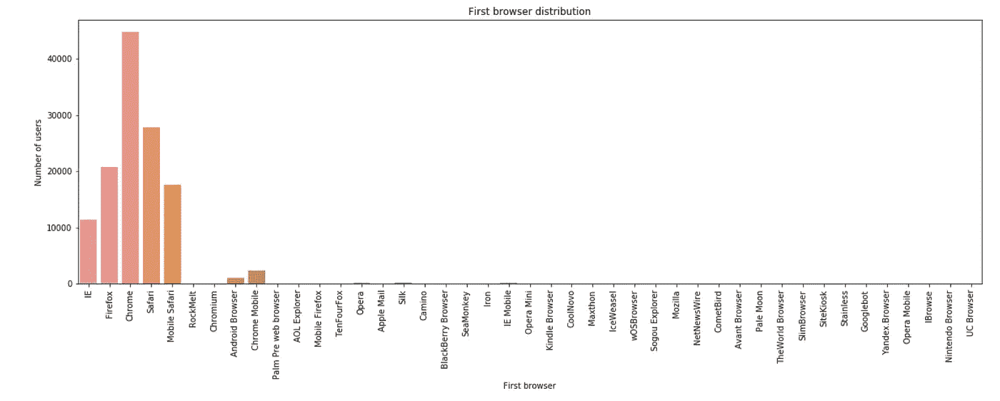

Fig.13: Plot showing distribution of first browsers used by users

正如预期的那样，30%的预订者使用 Chrome 浏览器访问 Airbnb 网站。接下来最受欢迎的似乎是 Safari 浏览器(图 13)。

# 用户的首选语言

```
plt.figure(figsize=(12,6))
sns.countplot(x='language', data=df_without_NDF)
plt.xlabel('language')
plt.ylabel('Number of users')
plt.title('Users language distribution')
plt.show()
```

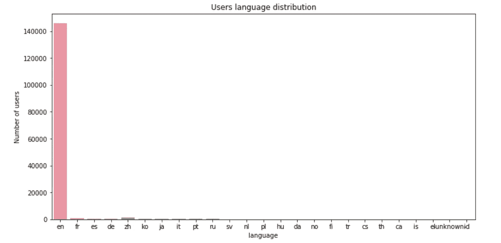

Fig.14: Plot showing user language distribution

几乎所有用户的语言偏好都是英语。这是合理的，因为我们的人口问题来自我们。

# 日期

为了直观地显示预订如何随月份和年份而变化，让我们首先将日期列转换为 datetime 类型。

```
df_without_NDF['date_account_created'] = pd.to_datetime(df_without_NDF['date_account_created'])
df_without_NDF['timestamp_first_active'] = pd.to_datetime((df_without_NDF.timestamp_first_active)//1000000, format='%Y%m%d')
plt.figure(figsize=(12,6))
df_without_NDF.date_account_created.value_counts().plot(kind='line', linewidth=1.2)
plt.xlabel('Date')
plt.title('New account created over time')
plt.show()
```

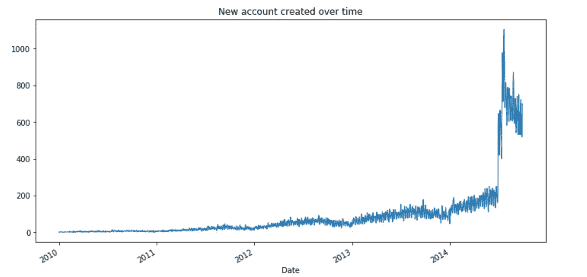

Fig.15: Plot showing trend of user account creation

2014 年后，账户创建量将大幅增加。Airbnb 在 2014 年后突飞猛进(图 15)。

```
#Creating a separate dataframe for the year 2013 to analyse it further.
df_2013 = df_without_NDF[df_without_NDF['timestamp_first_active'] > pd.to_datetime(20130101, format='%Y%m%d')]
df_2013 = df_2013[df_2013['timestamp_first_active'] < pd.to_datetime(20140101, format='%Y%m%d')]plt.figure(figsize=(12,6))
df_2013.timestamp_first_active.value_counts().plot(kind='line', linewidth=2)
plt.xlabel('Date')
plt.title('First active date 2013')
plt.show()
```

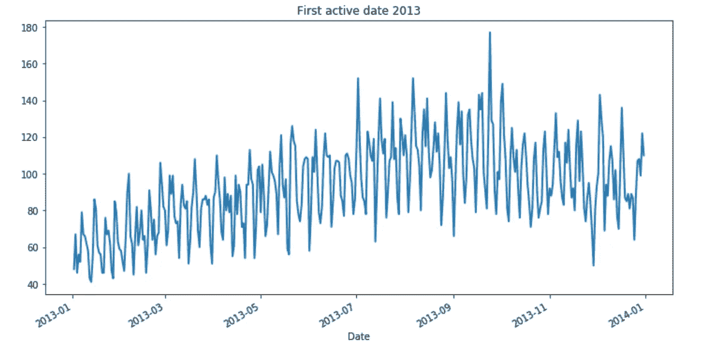

Fig.16: Plot showing trend of first activity of users in 2013

如果我们看到用户每月的活跃程度，那么高峰月份是 7 月、8 月和 10 月。另一方面，最不活跃的月份是 12 月(图 16)。

# 用户会话数据探索性分析

正在加载会话数据。

```
sessions = pd.read_csv("sessions.csv")print("There were", len(sessions.user_id.unique()),"unique user ids in the sessions data.")
```


检查空值。

```
display(sessions.isnull().sum())
```

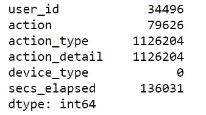

检查未知数。

```
sessions.action_type.unique()
```

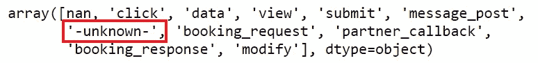

我们看到“action_type”列中有 nan 和 unknown，因此我们将所有 unknown 转换为 nan。

```
sessions.action_type.replace('-unknown-', np.nan, inplace=True)sessions.action.value_counts().head(10)
```

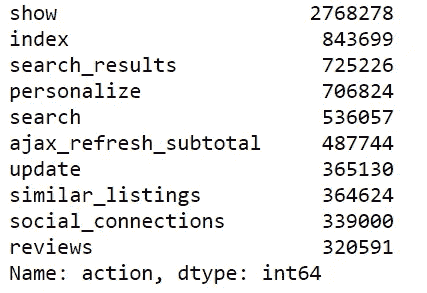

```
sessions.action_type.value_counts().head(10)
```

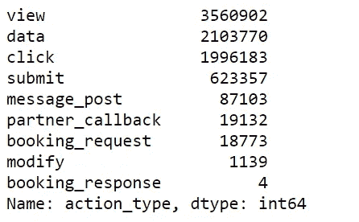

```
sessions.action_detail.value_counts().head(10)
```


```
plt.figure(figsize=(18,6))
sns.countplot(x='device_type', data=sessions)
plt.xlabel('Device type')
plt.ylabel('Number of sessions')
plt.title('Device type distribution')
plt.xticks(rotation=90)
plt.show()
```

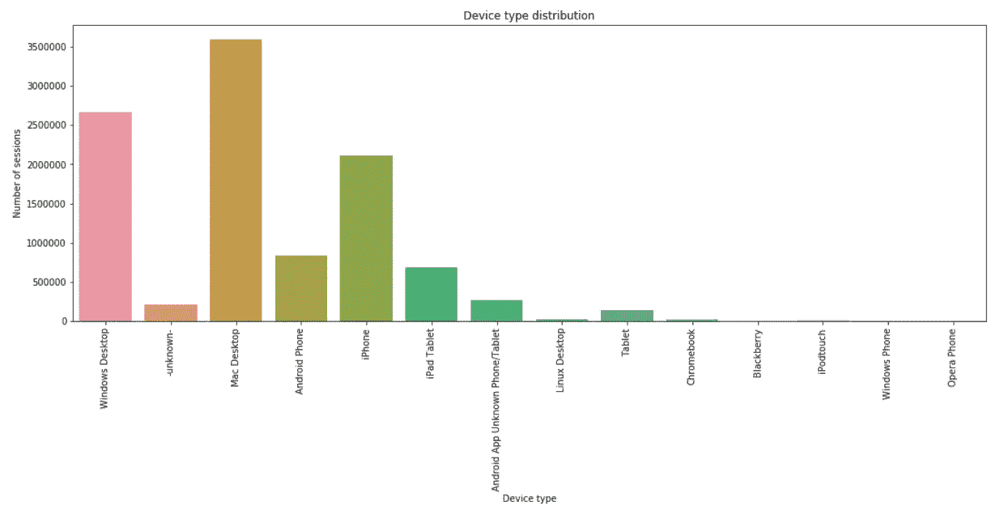

Fig.17: Plot showing device type distribution

正如我们在更早的时候研究用户数据时发现的那样，访问 Airbnb 最流行的设备似乎是 Mac Desktop。现在让我们来看看至少预订了一次的用户的会话行为(图 17)。

```
session_booked = pd.merge(df_without_NDF, sessions, how = 'left', left_on = 'id', right_on = 'user_id')#Let us see what all columns we have for session_booked
session_booked.columns
```

让我们来看看预订者通常会做的 5 大行为。

```
session_booked.action.value_counts().head(5)
```

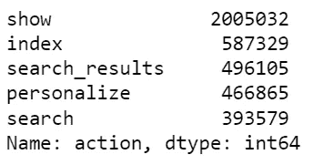

# 二。预测建模

```
#Importing necessary libraries
import pandas as pd
import numpy as np
import seaborn as sns
import matplotlib.pyplot as plt
```

加载数据集并在此过程中进行一些数据预处理。

```
train_users = pd.read_csv('train_users_2.csv')
test_users = pd.read_csv('test_users.csv')
df = pd.concat((train_users, test_users), axis=0, ignore_index=True)
df.drop('date_first_booking', axis=1, inplace=True)
```

**特色工程**

```
df['date_account_created'] = pd.to_datetime(df['date_account_created'])df['timestamp_first_active'] = pd.to_datetime((df.timestamp_first_active // 1000000), format='%Y%m%d')df['weekday_account_created'] = df.date_account_created.dt.weekday_name
df['day_account_created'] = df.date_account_created.dt.day
df['month_account_created'] = df.date_account_created.dt.month
df['year_account_created'] = df.date_account_created.dt.yeardf['weekday_first_active'] = df.timestamp_first_active.dt.weekday_name
df['day_first_active'] = df.timestamp_first_active.dt.day
df['month_first_active'] = df.timestamp_first_active.dt.month
df['year_first_active'] = df.timestamp_first_active.dt.year
```

计算时间滞后变量。

```
df['time_lag'] = (df['date_account_created'] - df['timestamp_first_active'])
df['time_lag'] = df['time_lag'].astype(pd.Timedelta).apply(lambda l: l.days)df.drop( ['date_account_created', 'timestamp_first_active'], axis=1, inplace=True)
```

让我们用-1 来代替年龄一栏中的 NaNs。

```
df['age'].fillna(-1, inplace=True)
```

让我们按 user_id 分组，并计算每个用户的动作数量、动作类型和动作细节。

```
#First we rename the column user_id as just id to match the train and test columnssessions.rename(columns = {'user_id': 'id'}, inplace=True)action_count = sessions.groupby(['id', 'action'])['secs_elapsed'].agg(len).unstack()
action_type_count = sessions.groupby(['id', 'action_type'])['secs_elapsed'].agg(len).unstack()
action_detail_count = sessions.groupby(['id', 'action_detail'])['secs_elapsed'].agg(len).unstack()
device_type_sum = sessions.groupby(['id', 'device_type'])['secs_elapsed'].agg(sum).unstack()sessions_data = pd.concat([action_count, action_type_count, action_detail_count, device_type_sum],axis=1)
sessions_data.columns = sessions_data.columns.map(lambda x: str(x) + '_count')# Most used device
sessions_data['most_used_device'] = sessions.groupby('id')['device_type'].max()print('There were', sessions.shape[0], 'recorded sessions in which there were', sessions.id.nunique(), 'unique users.')
```


```
secs_elapsed = sessions.groupby('id')['secs_elapsed']secs_elapsed = secs_elapsed.agg(
    {
        'secs_elapsed_sum': np.sum,
        'secs_elapsed_mean': np.mean,
        'secs_elapsed_min': np.min,
        'secs_elapsed_max': np.max,
        'secs_elapsed_median': np.median,
        'secs_elapsed_std': np.std,
        'secs_elapsed_var': np.var,
        'day_pauses': lambda x: (x > 86400).sum(),
        'long_pauses': lambda x: (x > 300000).sum(),
        'short_pauses': lambda x: (x < 3600).sum(),
        'session_length' : np.count_nonzero
    }
)
secs_elapsed.reset_index(inplace=True)
sessions_secs_elapsed = pd.merge(sessions_data, secs_elapsed, on='id', how='left')
df = pd.merge(df, sessions_secs_elapsed, on='id', how = 'left')print('There are', df.id.nunique(), 'users from the entire user data set that have session information.')
```

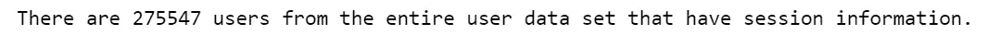

```
#Encoding the categorical features
categorical_features = ['gender', 'signup_method', 'signup_flow', 'language','affiliate_channel', 'affiliate_provider', 'first_affiliate_tracked', 'signup_app', 'first_device_type', 'first_browser', 'most_used_device', 'weekday_account_created', 'weekday_first_active']df = pd.get_dummies(df, columns=categorical_features)df.set_index('id', inplace=True)
```

# 分裂训练和测试

```
#Creating train dataset
train_df = df.loc[train_users['id']]train_df.reset_index(inplace=True)
train_df.fillna(-1, inplace=True)#Creating target variable for the train dataset
y_train = train_df['country_destination']train_df.drop(['country_destination', 'id'], axis=1, inplace=True)from sklearn.preprocessing import LabelEncoder
label_encoder = LabelEncoder()
encoded_y_train = label_encoder.fit_transform(y_train) #Transforming the target variable using labels#We see that the destination countries have been successfully encoded now
encoded_y_train
```


```
#Creating test set
test_df = df.loc[test_users['id']].drop('country_destination', axis=1)
test_df.reset_index(inplace=True)id_test = test_df['id']
test_df.drop('id', axis=1, inplace=True)
```

从训练和测试中移除副本(如果有)。

```
duplicate_columns = train_df.columns[train_df.columns.duplicated()]duplicate_columns
```

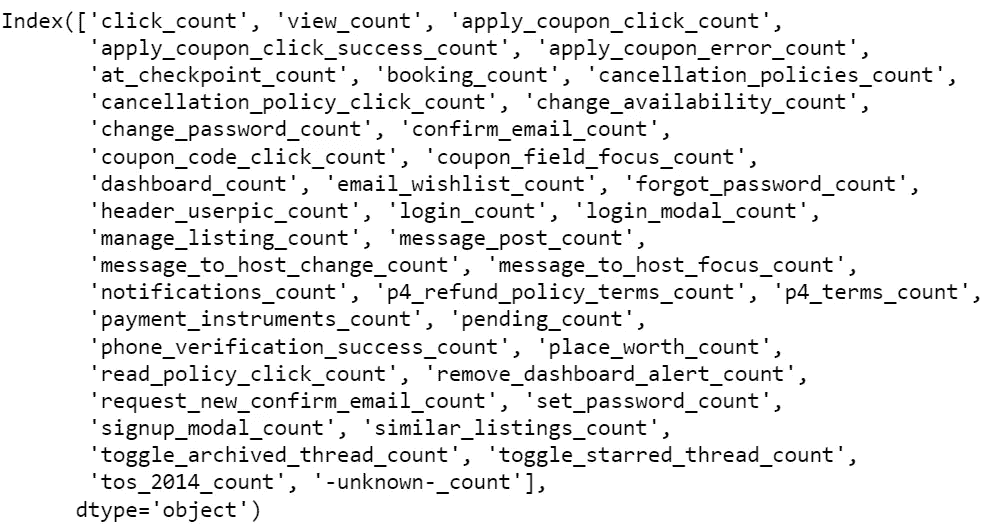

我们发现有重复的，因此我们删除它们。

```
#Removing the duplicates 
train_df = train_df.loc[:,~train_df.columns.duplicated()]
```

类似地，处理测试集中的重复项。

```
test_df.columns[test_df.columns.duplicated()]
```

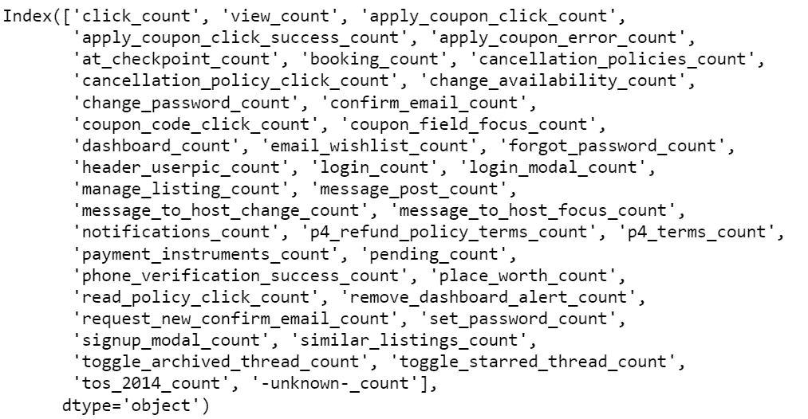

```
test_df = test_df.loc[:,~test_df.columns.duplicated()]
```

# 训练模型并进行预测

对于给定的预测问题，我们使用 XGBoost 模型。

```
import xgboost as xgb
xg_train = xgb.DMatrix(train_df, label=encoded_y_train)#Specifying the hyperparameters
params = {'max_depth': 10,
    'learning_rate': 1,
    'n_estimators': 5,
    'objective': 'multi:softprob',
    'num_class': 12,
    'gamma': 0,
    'min_child_weight': 1,
    'max_delta_step': 0,
    'subsample': 1,
    'colsample_bytree': 1,
    'colsample_bylevel': 1,
    'reg_alpha': 0,
    'reg_lambda': 1,
    'scale_pos_weight': 1,
    'base_score': 0.5,
    'missing': None,
    'nthread': 4,
    'seed': 42
          }num_boost_round = 5print("Train a XGBoost model")
gbm = xgb.train(params, xg_train, num_boost_round)
```

# 对测试集进行预测

```
y_pred = gbm.predict(xgb.DMatrix(test_df))
```

为每个用户 id 选择前 5 个目的地。

```
ids = []  #list of ids
cts = []  #list of countries
for i in range(len(id_test)):
    idx = id_test[i]
    ids += [idx] * 5
    cts += label_encoder.inverse_transform(np.argsort(y_pred[i])[::-1])[:5].tolist()
```

创建一个包含用户及其五大目的地国家的数据框架。

```
predict = pd.DataFrame(np.column_stack((ids, cts)), columns=['id', 'country'])
```

创建最终预测 csv。

```
predict.to_csv('prediction.csv',index=False)
```

我们已经成功预测了 Airbnb 新用户的目的地国家！

**下一步:**

1.  由于我们知道哪些目的地国家更受用户欢迎，Airbnb 可以实施有针对性的营销。这意味着，将这些特定国家的营销策略集中于上述练习中确定的用户。
2.  Airbnb 可以提前计划他们应该更多地搜寻哪些国家，以获得住宿提供商的支持，因为他们可以清楚地看到用户访问这些国家的倾向。
3.  根据特定用户对目的地国家的选择，Airbnb 可能会想到类似的目的地国家(在气候、地形、娱乐选择等方面)。)作为其他可行的旅行选项提供给用户。
4.  该分析提供了关于用户简档看起来如何的广泛想法。Airbnb 利用这一优势来试验新的营销策略，或者头脑风暴未来几年的需求变化。

如果你喜欢看我的分析，一定要给我掌声！:)

*源代码托管在* [*GitHub*](https://github.com/tanmayeewaghmare/Airbnb-Kaggle-Challenge/blob/master/Airbnb%20Kaggle%20prediction%20.ipynb) *上。*