# 预测员工流动率

> 原文：<https://towardsdatascience.com/predicting-employee-turnover-7ab2b9ecf47e?source=collection_archive---------1----------------------->

# 介绍

**员工流动率**是指离开一个组织并被新员工取代的员工的百分比。对组织来说，这是非常昂贵的，费用包括但不限于:离职、空缺、招聘、培训和替换。平均来说，组织投资四周到三个月来培训新员工。如果新员工在第一年就决定离开，这项投资对公司来说将是一项损失。此外，由于定期更换*的客户代表*和/或*的顾问*，咨询公司等组织的客户满意度会下降，这将导致失去客户。

在本帖中，我们将研究来自 [kaggle](https://www.kaggle.com/ludobenistant/hr-analytics) 的模拟人力资源数据，以构建一个分类器，帮助我们预测在给定某些属性的情况下，哪种员工更有可能离职。这种分类器将有助于组织预测雇员流动，并积极主动地帮助解决这种代价高昂的问题。我们将限制自己使用最常见的分类器:随机森林，梯度推进树，K-最近邻，逻辑回归和支持向量机。

数据有 14999 个例子(样本)。下面是每一种的功能和定义:

*   satisfaction_level:满意度{ 0–1 }。
*   last_evaluationTime:自上次绩效评估以来的时间(以年为单位)。
*   number_project:工作时完成的项目数。
*   average_montly_hours:工作场所每月平均工作时间。
*   time_spend_company:在公司工作的年数。
*   Work_accident:员工是否发生了工作场所事故。
*   left:员工是否离开了工作场所{0，1}。
*   promotion_last_5years:员工在过去五年中是否获得晋升。
*   销售:员工工作的部门。
*   工资:工资的相对水平{低、中、高}。

创建这篇文章的源代码可以在[这里](https://nbviewer.jupyter.org/github/ImadDabbura/blog-posts/blob/master/notebooks/Employee-Turnover.ipynb)找到。

# 数据预处理

让我们看一下数据(检查是否有缺失值以及每个要素的数据类型):

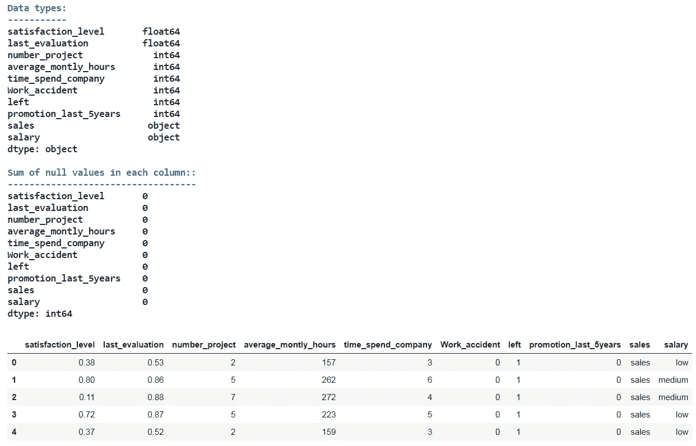

Data oveview

因为没有缺失值，所以我们不必做任何插补。但是，需要一些数据预处理:

1.  将**销售**功能名称改为**部门**。
2.  将**薪金**转换为*有序分类*特征，因为在低、中、高之间有内在的顺序。
3.  从**部门**特征创建虚拟特征，并删除第一个特征，以避免某些学习算法可能遇到的线性依赖性。

数据现在可以用于建模了。最终的特征数量现在是 17 个。

# 建模

让我们先来看看每一类的比例，看看我们处理的是平衡的还是不平衡的数据，因为每一类都有自己的一套工具在拟合分类器时使用。

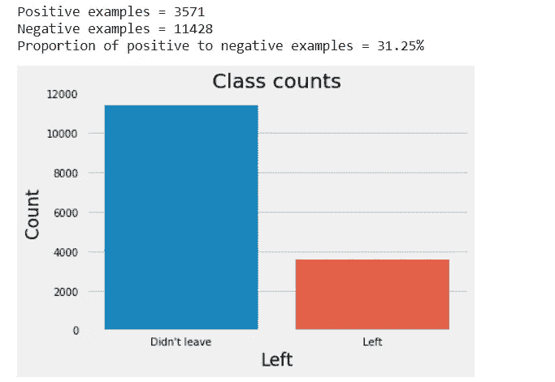

Class counts

如图所示，我们有一个不平衡的数据集。因此，当我们在这样的数据集上拟合分类器时，在比较诸如 *f1-score* 或*AUC*(ROC 曲线下面积)等模型时，我们应该使用准确性以外的度量。此外，类不平衡通过隐式学习基于数据集中的多数类优化预测的模型，使决策规则偏向多数类，从而影响训练期间的学习算法。有三种方法可以处理这个问题:

1.  对少数群体的错误预测给予更大的惩罚。
2.  对少数类进行上采样或对多数类进行下采样。
3.  生成合成训练示例。

尽管如此，没有明确的指南或最佳实践来处理这种情况。因此，我们必须尝试所有这些方法，看看哪种方法最适合手头的问题。我们将限制自己使用前两个，即，在分类器中使用`class_weight`为来自少数类的错误预测分配更大的惩罚，这允许我们这样做，并评估对训练数据的上采样/下采样，以查看哪一个给出更高的性能。

首先，使用 80/20 拆分将数据拆分为训练集和测试集；80%的数据将用于训练模型，20%用于测试模型的性能。第二，对少数类进行上采样，对多数类进行下采样。对于这个数据集，正类是少数类，负类是多数类。

原始形状:(11999，17) (11999，)
上采样形状:(18284，17) (18284，)
下采样形状:(5714，17) (5714，)

我认为我们不需要应用 PCA 之类的降维方法，因为:1)我们想知道每个特征在决定谁会离开与谁不会离开(推断)中的重要性。2)数据集的维数适当(17 个特征)。然而，很高兴看到需要多少主成分来解释数据中 90%、95%和 99%的变化。

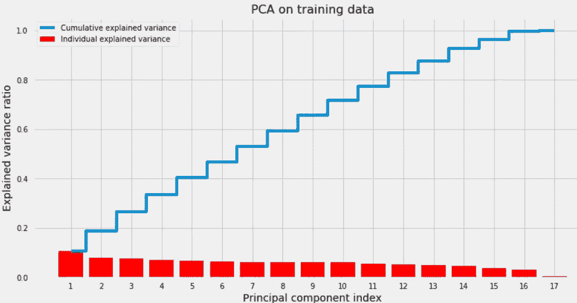

PCA

看起来它需要 14、15 和 16 个主成分来分别捕捉数据中 90%、95%和 99%的变化。换句话说，这意味着数据已经在一个良好的空间中，因为特征值彼此非常接近，并进一步证明我们不需要压缩数据。

我们在构建分类器时将遵循的方法如下:

1.  使用 scikit-learn 的`make_pipeline`构建一个处理所有步骤的管道，该管道有两个步骤:

I .将数据标准化，以加快收敛速度，并使所有特征具有相同的比例。

二。我们想要用来拟合模型的分类器(`estimator`)。

2.使用`GridSearchCV`通过 10 重交叉验证调整超参数。我们可以使用更快的`RandomizedSearchCV`，尤其是如果我们有两个以上的超参数，并且每个超参数的范围都很大时，它可能会优于`GridSearchCV`；然而，`GridSearchCV`将工作得很好，因为我们只有两个超参数和下降范围。

3.使用训练数据拟合模型。

4.使用测试数据为最佳估计量绘制混淆矩阵和 ROC 曲线。

对*随机森林、梯度推进树、K 近邻、逻辑回归和支持向量机*重复上述步骤。接下来，选择交叉验证 f1 值最高的分类器。注意:一些超参数范围将由论文[将机器学习应用于生物信息学问题的数据驱动建议](https://arxiv.org/pdf/1708.05070.pdf)指导。

# 随机森林

首先，我们将从使用*未采样、上采样和下采样*数据拟合随机森林分类器开始。其次，我们将使用交叉验证(CV) f1 得分评估每种方法，并选择 CV f1 得分最高的方法。最后，我们将使用该方法来拟合其余的分类器。

我们将调整的唯一超参数是:

*   `max_feature`:每次分割随机考虑多少个特征。这将有助于避免在每次分割时挑选很少的强特征，并让其他特征有机会做出贡献。因此，预测的相关性将会降低，每棵树的方差将会减少。
*   `min_samples_leaf`:每次拆分要有多少个实例才能成为最终叶节点。

随机森林是一个集合模型，有多棵树(`n_estimators`)。最终预测将是所有估计者预测的加权平均值(回归)或模式(分类)。注意:大量的树不会导致过度拟合。

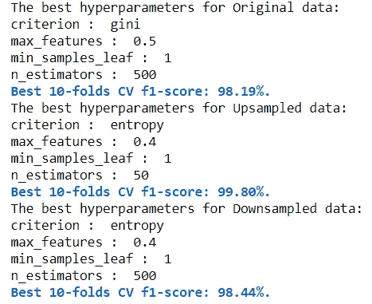

Random Forest hyperparameter tuning results

上采样产生了最高的 CV f1 值，为 99.8%。因此，我们将使用上采样数据来拟合其余的分类器。新数据现在有 18，284 个例子:50%属于积极类，50%属于消极类。

让我们使用上面调整的最佳超参数，用向上采样的数据重新调整随机森林，并使用测试数据绘制混淆矩阵和 ROC 曲线。

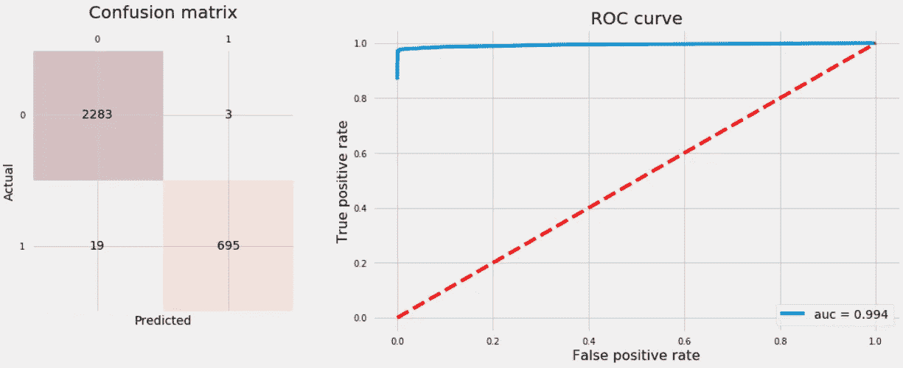

Random Forest

# 梯度推进树

梯度增强树与随机森林相同，除了:

*   它从小树开始，并通过考虑成年树的残差从成年树开始学习。
*   更多的树会导致过度拟合；与随机森林相对。

因此，我们可以把每一棵树都看作一个弱学习者。除了`max_features`和`n_estimators`之外，我们要调整的另外两个超参数是:

*   `learning_rate`:速率树学习，越慢越好。
*   `max_depth`:每次树生长时的分裂次数，限制了每棵树的节点数。

让我们使用测试数据拟合 GB 分类器并绘制混淆矩阵和 ROC 曲线。

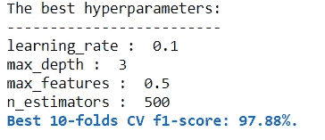

Gradient Boosting Trees hyperparameter tuning results

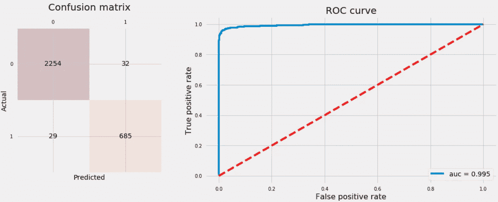

Gradient Boosting Trees

# k-最近邻

KNN 被称为懒惰学习算法，因为它不学习也不适合任何参数。它从训练数据中提取最接近我们感兴趣的点的`n_neighbors`点来预测它的类别，并将邻近点的类别的模式(多数投票)作为它的类别。我们要调整的两个超参数是:

*   `n_neighbors`:用于预测的邻居数量。
*   `weights`:根据以下条件为邻居分配多少权重:
*   “均匀”:所有相邻点的权重相同。
*   “距离”:使用预测中使用的每个相邻点的欧几里德距离的倒数。

让我们拟合 KNN 分类器，并绘制混淆矩阵和 ROC 曲线。

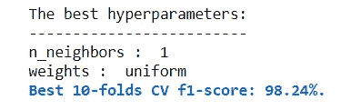

K-Nearest Neighbors hyperparameter tuning results

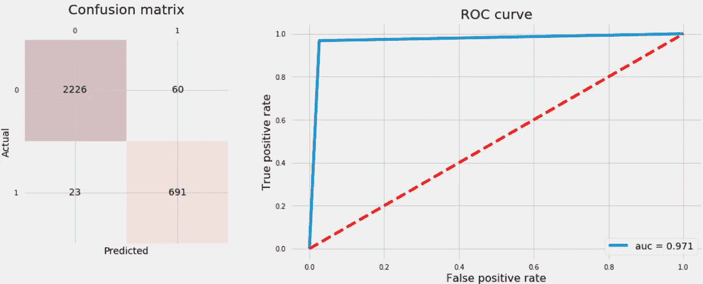

K-Nearest Neighbors

# 逻辑回归

对于逻辑回归，我们将调整三个超参数:

*   `penalty`:正则化类型，L2 或 L1 正则化。
*   `C`:参数λ正则化的反面。C 越高，正则化程度越低。我们将使用覆盖非正则化到完全正则化之间的整个范围的值，其中模型是示例标签的模式。
*   `fit_intercept`:是否包含拦截。

我们不会使用任何非线性，如多项式特征。

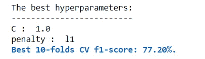

Logistic Regression hyperparameter tuning results

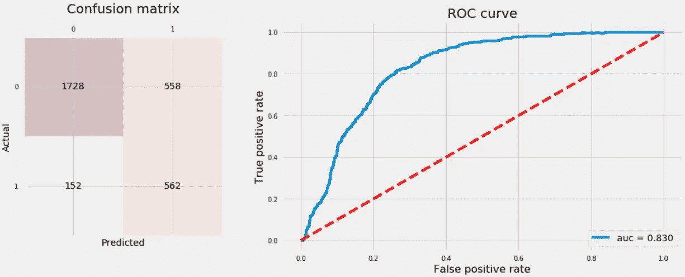

Logistic Regression

# 支持向量机(SVM)

SVM 调整其超参数的计算成本非常高，原因有二:

1.  对于大数据集，它变得非常慢。
2.  它有大量的超参数需要优化，这需要在 CPU 上花费很长时间来优化。

因此，我们将使用我们之前提到的论文中推荐的超参数值，该论文显示在 Penn Machine Learning Benchmark 165 数据集上产生最佳性能。我们通常希望调整的超参数有:

*   `C`、`gamma`、`kernel`、`degree`和`coef0`

**10 倍 CV f1 分为:96.38%**

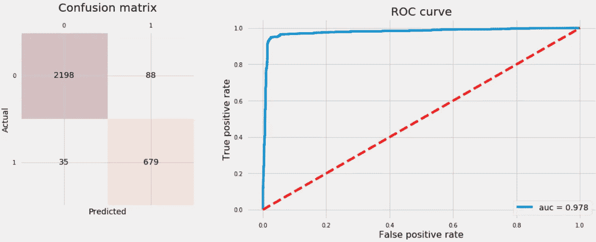

Support Vector Machine

# **结论**

最后，让我们打印出到目前为止我们训练的所有分类器的测试准确率，并绘制 ROC 曲线。然后我们将挑选 ROC 曲线下面积最大的分类器。

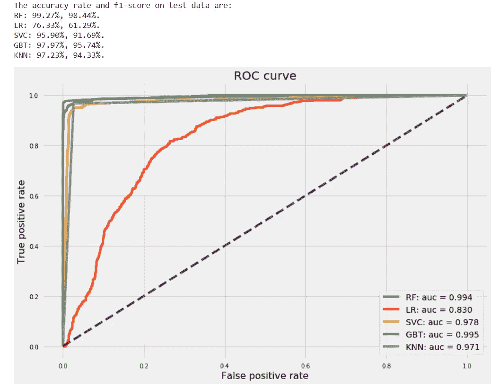

Comparing ROC curves for all classifiers

尽管随机森林和梯度增强树具有几乎相等的 AUC，但随机森林具有更高的准确率和 f1 值，分别为 99.27%和 99.44%。因此，我们有把握地说，随机森林优于其余的分类器。让我们看看随机森林分类器的特征重要性。

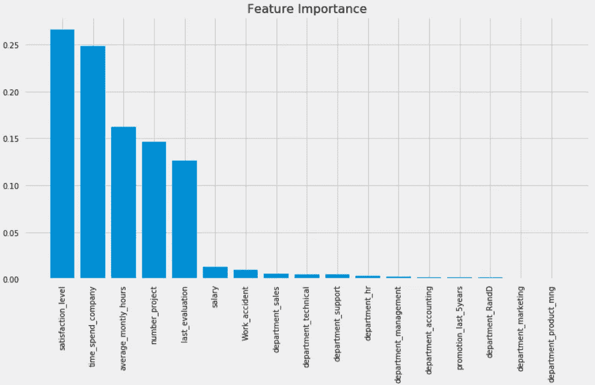

Random Forest feature importance

看起来最重要的五个特征是:

*   满意度 _ 级别
*   时间 _ 花费 _ 公司
*   平均每月小时数
*   数字 _ 项目
*   lats _ 评估

带回家的信息如下:

*   在处理不平衡类时，精度不是模型评估的好方法。AUC 和 f1 分数是我们可以使用的指标示例。
*   上采样/下采样、数据合成和使用平衡的类权重是尝试提高不平衡类数据集的分类器精度的好策略。
*   `GridSearchCV`帮助调整每个学习算法的超参数。`RandomizedSearchCV`更快，可能会超过`GridSearchCV`，尤其是当我们有两个以上的超参数需要优化时。
*   主成分分析(PCA)并不总是被推荐，特别是如果数据在一个好的特征空间中，并且它们的特征值彼此非常接近。
*   正如所料，在大多数情况下，集成模型优于其他学习算法。

*原载于 2017 年 12 月 11 日*[*imaddabbura . github . io*](https://imaddabbura.github.io/posts/employee-turnover/Employee-Turnover.html)*。*