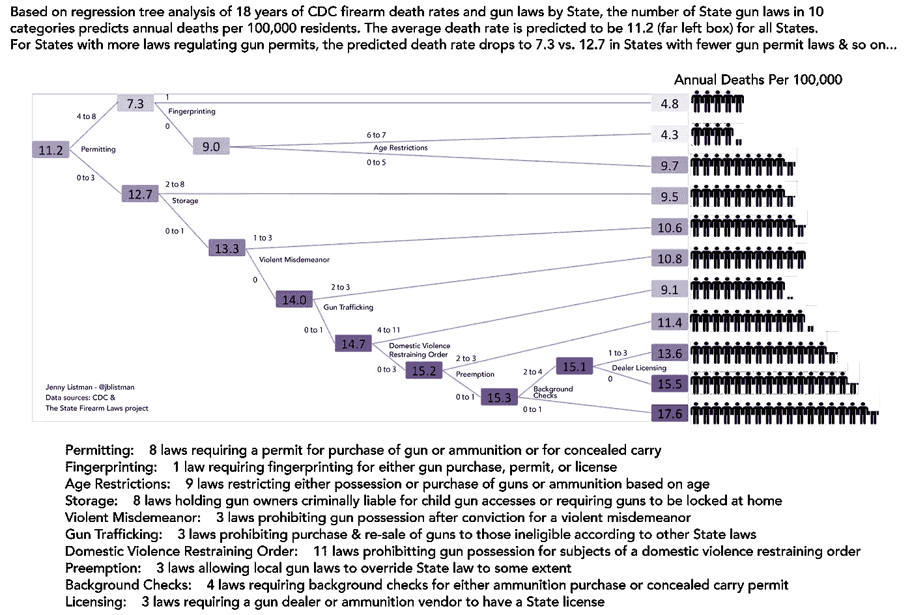

# 从枪支法预测枪支死亡率:生命与自由之间的平衡是可以衡量的

> 原文：<https://towardsdatascience.com/predicting-gun-death-rate-from-gun-laws-d96041c14198?source=collection_archive---------6----------------------->

当美国政府成立时，生命、自由和追求幸福被视为天赋人权。美国枪支法平衡了限制个人自由和保护个人生命。

以下是无可争议的:1。枪支法限制个人自由。枪支法拯救生命。没有理由浪费精力争论这些事实。相反，问题是，美国人将选择在哪里找到生命和自由之间的平衡，因为这是一个选择。

All data, code, and notes to replicate this analysis can be found on my [GitHub repo](https://github.com/JListman/FirearmDeathRate)

撇开游说者对枪支政策或枪支政策对犯罪的影响不谈，各州已经选择通过枪支法，这些法律代表了生命与自由连续统一体中的一系列观点。这里总结的分析不是一种观点，而是对一组复杂的相互作用的、可测量的因素和结果的描述，使用数学算法进行梳理。(按州和年份分类的枪支死亡率和枪支法计数)……中的数字..数字(增加或减少预测死亡率的枪支法律类别以及增加或减少多少)。

结果是一个横向树，描绘了预测的平均年枪支死亡率，这取决于它们在一个类别中拥有的法律数量。树中的每一个分割线都显示了一些法律子类如何增加或减少与枪支相关的死亡人数。从树的左侧开始，每 100，000 名州居民的平均枪支死亡率预测为 11.2，但对于在允许类别内有 4-8 项法律的州，它下降到 7.3。对于有 0-3 个许可法的州，比率增加到 12.7…等等。

特别及时的是年龄限制是否重要的问题。在某些情况下，有更多年龄限制的州(如州枪支法律项目[码本](https://www.statefirearmlaws.org/download-codebook.html)所定义的)预计死亡率会低得多。具体来说，在有更多许可法但没有指纹法的州，通过实施更多年龄限制，死亡率预计将减半(4.3 比 9.7，最右边从上往下数第二和第三个框)。

> 数据:

[波斯顿大学](http://www.bu.edu)的[州枪支法律项目](https://www.statefirearmlaws.org/about.html)维护着一个[数据库](https://www.statefirearmlaws.org/table.html)，其中记录了 1991 年至 2017 年间 133 个州枪支法律条款的状况，根据对枪支暴力的预期影响，由他们的法律研究团队分为 14 个类别和 49 个子类别。这是一个公开可用的资源，你也可以通过他们的[交互式地图](https://www.statefirearmlaws.org/law-data.html)和[图表](https://www.statefirearmlaws.org/state-by-state.html)进行探索。我下载了他们按州和年份划分的有无枪支法律条款的数据集。

疾控中心的基本死因数据库按地区和年份对死亡证明死因进行了细分。我下载了每个州/年每 100，000 居民的原始死亡率，火器是死亡原因。这包括**任何因枪支**造成的死亡，无论是否意外，是否自残，是否与犯罪有关，但没有关于枪支类型、性别、年龄或情况的数据。

正如州枪支法项目警告的那样，由于枪支法本身不太可能是枪支死亡率的唯一决定因素，我进行了同样的分析，包括每个州/年的失业率，然后是每个州/年的加权人口密度，这两者都没有显著改变结果。在重复分析中，可能有其他因素(按州/年)可以提供信息，例如与枪支法更多或更少的州的接近程度。

> 总结平衡自由与生活的量化效果:

基于递归分割和回归树(RPART)分析，发现 49 个枪支法子类中的 10 个显著预测了州枪支死亡率的下降与上升，平均误差率为每 100，000 人 1.76 例死亡。预测的年平均死亡率是 11.2。从那里树分成两部分:上部和下部。

上半部分显示，在拥有 4-8 项许可法律(由州枪支法律项目[码本](https://www.statefirearmlaws.org/download-codebook.html)定义)的州，该比率从 11.2 降至 7.3。其中，也有指纹法的州的比率预计会下降到 4.8；否则就涨到 9.0 了。如果没有指纹法，在 6-7 个年龄限制法的情况下，预测的比率从 9.0 下降到 4.3，但在 0-5 个年龄限制法的情况下，预测的比率增加到 9.7。

该树的下半部分从拥有 0-3 项许可法律的州开始，平均每年预计枪支死亡率为 12.7。对于有 2-8 个存储法则的州，这个比率可以降低到 9.5，否则，这个比率会增加到 13.3。预计在暴力轻罪子类别中有 1-3 项(任何)法律的州，这一数字将从 13.3 降至 10.6；如果没有，预测的比率将增加到 14.0。

再向右下方移动，在 2-3 个枪支贩运法律之间，这些州的预测比率从 14.0 下降到 10.8，但是对于 0-1 个枪支贩运法律的州，预测比率增加到 14.7。在家庭暴力限制令子类别中保留 4-11 项法律会将预测比率从 14.7 一直降低到 9.1，但如果这些州有 0-3 项这样的法律，比率会增加到 15.2。如果先占权子类别中有 2-3 项法律，这些州的预测比率将从 15.2 下降到 11.4，但如果有 0-1 项法律，预测比率将上升到 15.3。如果这些州在背景调查子类别中有 2-4 项法律，这一比率预计会稍微降低到 15.1，但如果有 0-1 项这样的法律，这一比率会上升到 17.6。对于那些有大量背景调查法律的州，预测的枪支死亡率在有 1-3 个(任何)经销商许可子类别法律的情况下从 15.1 下降到 13.6，在没有法律的情况下上升到 15.5。

以上三段是信息图存在的理由。向上滚动并查看树可能会更好。或者可以这样压缩:1 .枪支法限制个人自由。枪支法拯救生命。

## 感谢您的阅读。

我欢迎建设性的反馈。“鼓掌”表示赞同，在 FB、Twitter、Linkedin、Reddit 或任何地方分享，或者如果你有具体的回应或问题，请在这里给我发消息。我也有兴趣听听你想在未来的帖子中涉及哪些主题。如果您想要用于数据争论、特性工程和分析的数据和 [R](https://www.r-project.org) 代码，请派生或下载我的关联 [GitHub](https://github.com/JListman/FirearmDeathRate) 资源库。如果有人在添加可能影响结果的额外州/年变量后重复分析，那就太好了。如果有，请告诉我。

**阅读更多关于我的作品**[**【jenny-listman.netlify.com】**](https://jenny-listman.netlify.com)**。欢迎随时通过 Twitter**[**@ jblistman**](https://twitter.com/jblistman)**或**[**LinkedIn**](https://www.linkedin.com/in/jenniferlistman/)**联系我。**

> 数据和分析说明:

1.  复制这一分析的所有数据、代码和注释都可以在我的 [GitHub repo](https://github.com/JListman/FirearmDeathRate) 上找到。去吧！
2.  从州枪支项目下载了 1991 年至 2017 年美国各州 133 项枪支法律的存在或不存在:[https://www.statefirearmlaws.org/table.html](https://www.statefirearmlaws.org/table.html)
3.  法律的[代码本](https://www.statefirearmlaws.org/download-codebook.html)及其类别、子类和解释可从国家火器法律项目的网站上下载:[https://www.statefirearmlaws.org/download-codebook.html](https://www.statefirearmlaws.org/download-codebook.html)。
4.  美国疾病预防控制中心按州/年分列的死因火器数据下载自:[https://wonder.cdc.gov/ucd-icd10.html](https://wonder.cdc.gov/ucd-icd10.html)使用过滤标准:州、年、受伤原因=火器。或者[从我的 GitHub repo 下载](https://github.com/JListman/FirearmDeathRate/blob/master/StateGunDeathRate.csv)吧。
5.  使用 [R](https://www.r-project.org) 统计计算语言中的 [rpart](https://www.rdocumentation.org/packages/rpart/versions/4.1-12) 包，输入变量包括由[州枪支法项目](https://www.statefirearmlaws.org/about.html)编码的 49 个子类别中每一个子类别每年的法律总数，输出变量是每年每个州的年度原始枪支死亡率。输入变量被缩放，因为法律类别的大小变化很大。数据被分成训练集和测试集。通常，这是通过随机选择 20%的数据作为测试集，80%的数据作为训练集来完成的。然而，对于这个数据集，很可能存在给定年份的跨州相关性和给定年份的跨年相关性，或者每个小范围年份内的年间相关性。因此，数据集按奇数年或偶数年分成两组，每一组都按州进行了平衡，并消除了年初/近年的偏差。用典型的 20/80 随机分割完成的重复分析给出了令人难以置信的相似结果。
6.  虽然我最终没有使用每年每个州的失业率或加权人口密度，但在我的 GitHub repo 中有[数据集。我花时间获取它们，并把它们整理成整齐的格式，其他人可能会想要使用它们。2016 年各州失业数据来自](https://github.com/JListman/FirearmDeathRate/tree/master/data)[美国劳工部，劳工统计局](https://www.bls.gov/lau/lastrk16.htm)。截至 2015 年的失业率数据来自爱荷华州立大学，[爱荷华社区指标计划](https://www.icip.iastate.edu/tables/employment/unemployment-states)下的“附加数据:下载 Excel 中的历史年度系列(1980-当前)”。他们已经汇编了美国劳工部那几年的数据，所以我不必这么做。加权人口密度数据是利用丹·戈尔茨坦在《决策科学新闻》的这篇文章中的代码获得的。