# 用机器学习预测视频游戏点击率

> 原文：<https://towardsdatascience.com/predicting-hit-video-games-with-ml-1341bd9b86b0?source=collection_archive---------1----------------------->

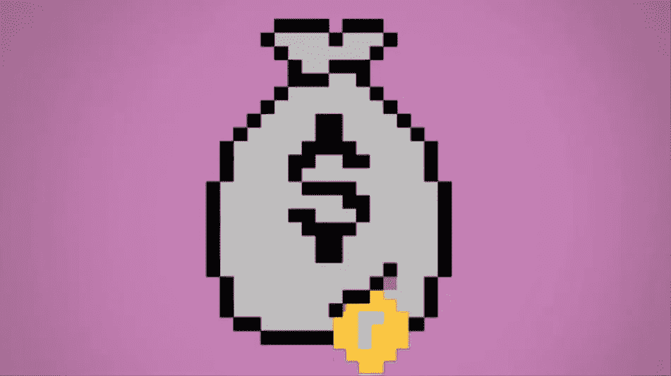

Original image: [http://kotaku.com](https://i.kinja-img.com/gawker-media/image/upload/s--P5u-7P6M--/c_scale,f_auto,fl_progressive,q_80,w_800/781029484320871752.gif)

## 在这个项目中，我分析了 8K 视频游戏的销售数据，确定了与点击率(销量超过 100 万台的游戏)最相关的变量，并实现了一个预测模型来区分赢家和输家。奖金:2016 年有哪些游戏还能成为热门？

# 1.数据探索和分析

## 中值销售额(百万单位)与评论家得分

以下四幅热图显示了游戏销售如何根据评论家的评分而变化，这些评分分为六个评分组。此外，每个热图还根据以下特征之一进一步细分数据:流派、开发者、发行商和平台(按外观顺序)。

在每个热图下，我们确定了游戏销售最好的类别。这是为*好的*、*好的、*和*好的*游戏而做的，这些游戏分别由得分在 70、80 和 90 分的游戏定义。

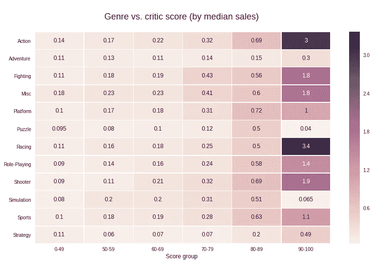

*   最畅销的游戏类型:赛车、动作
*   **好的*游戏卖得最好的流派:***平台、动作/射击
*   **流派哪里*好的*游戏卖得最好:**格斗，杂项

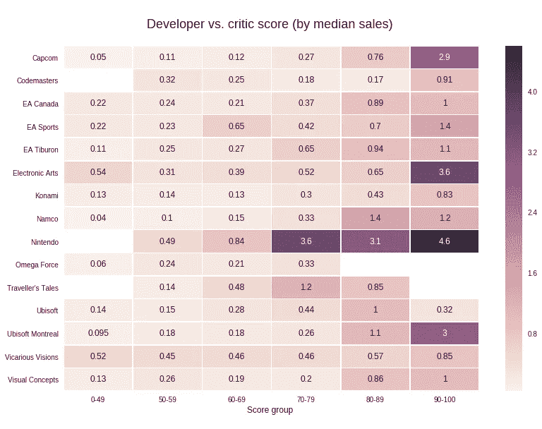

*   谁的游戏卖得最好:任天堂，艺电
*   **开发商谁的*好*游戏卖得最好:**任天堂，Namco
*   谁的游戏卖得最好？

*解读:在* ***伟大的*** *得分栏(最后)，任天堂每场游戏的中值销售额(以百万台计)最高，为 460 万台。有趣的是，任天堂在* ***好的*** *和* ***好的*** *得分栏中也拥有最高的每场游戏中值销售额。*

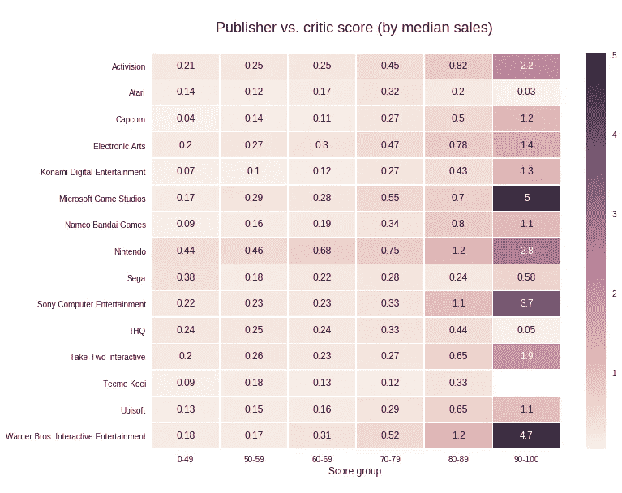

*   **销售*优秀*游戏最好的发行商:**微软游戏工作室，华纳兄弟互动娱乐公司
*   **卖*好*游戏最好的发行商:**任天堂/华纳兄弟互动娱乐
*   **卖 *okay* 游戏最好的发行商:**任天堂，微软游戏工作室

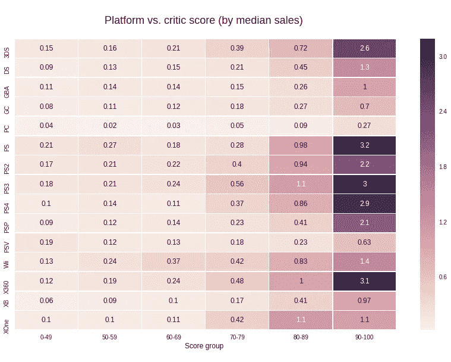

*   **伟大的*游戏卖得最好的平台:*** PS，X360
*   好游戏卖得最好的平台: PS3，XOne
*   游戏卖得最好的平台: PS3，X360

有趣的是，整个 PlayStation 产品线中的游戏销售似乎对高评论家分数非常敏感，特别是当中等分数范围的销售看起来与其他主机相当时(或至少表现出较窄的差距)。

## **数据集中的最高值**

*(按平台、开发商、发行商和流派)*

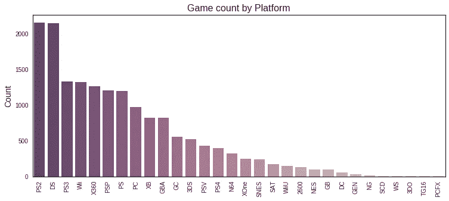

***数据集中游戏最多的平台***

1.  PS2
2.  鐽
3.  PS3

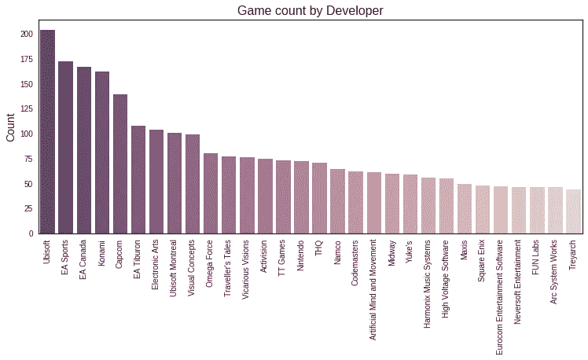

***数据集中游戏最多的开发商*:**

1.  育碧
2.  艺电体育
3.  EA 加拿大

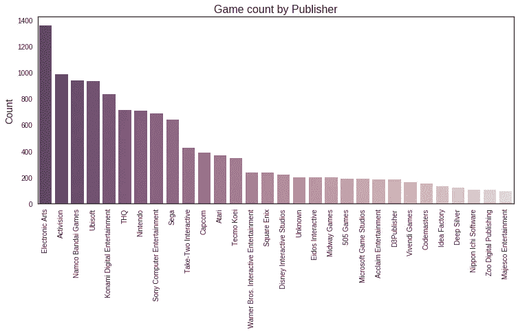

***数据集中游戏最多的发行商*:**

1.  电子艺术
2.  动视
3.  纳木错万代运动会

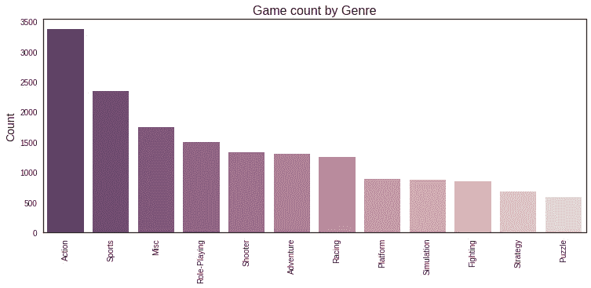

***数据集中游戏最多的流派*:**

1.  行动
2.  运动
3.  混杂的

## 数据集相关性

*(用于数值和分类变量)*

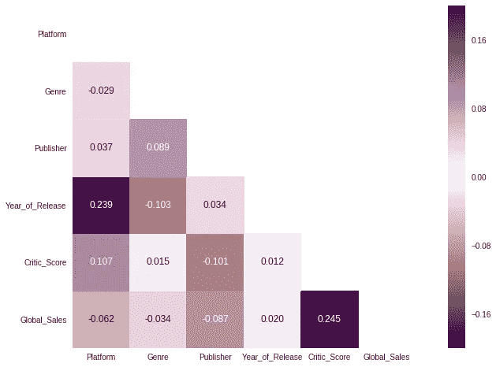

**最强相关性:**

*   ***评论家评分与全球销售额之比* :** 我们将在接下来的两个部分中进一步探讨这一点。
*   ***发布到平台的年份* :** 这很有意义，因为新平台会定期发布。

*注意:分类栏(平台、流派、发行商)按照游戏数量的顺序转换为数字，如前一节所示。他们与全球销售的轻微负相关可以解释为“ID 号越高，则[平台、流派、发行商]越小，因此销售数字也就略低”。*

## 评论家得分与全球销售额

*(针对数据集中的所有年份)*

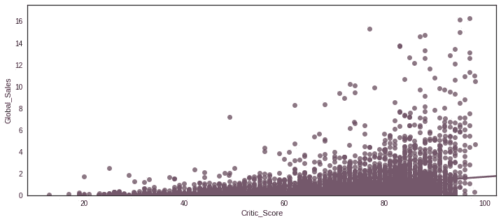

有点乱，对吧？

我们将继续使用垃圾箱来更好地感受这种关系…

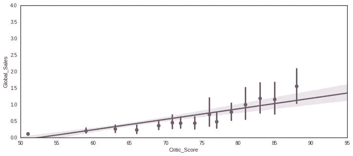

For years ≥ 2014

这种关系现在看起来清晰多了。有趣的是，斜率在 80 年代变得更陡。似乎一旦一个视频游戏获得了很高的批评分数，每增加一分都会产生更大的影响。例如，在 2014 年至 2016 年的子集里，****评论家分数增加 8 分，似乎对 65 分起的销售额有大约 25 万英镑的积极影响，但对 77 分起的销售额有大约 100 万英镑的积极影响。** *去大了还是回家吧？***

## **将销量超过 100 万台的产品定义为热门产品**

**这将是我们预测模型中的目标，在这里我们将预测一个游戏是否会成功。目标是二进制的:如果命中则为 1，否则为 0。**

****以下是使用 5%样本的评论家分数和 VG 点击率之间的关系:****

**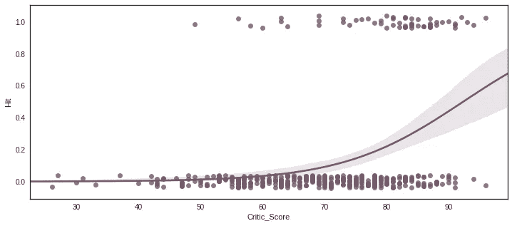**

**正如所料，**点击率似乎大多出现在高评论分数附近**，而非点击率在分数上可能有所不同，但在高分范围内开始失去存在(正如 70 年代附近的变陡回归曲线所解释的)。**

# **2.预测模型**

***(用于预测给定游戏达到 100 万台或更高销量的可能性，称为“热门”游戏。分类方法被应用于从非命中中分离命中。)***

## **生成特征和训练/测试分割**

**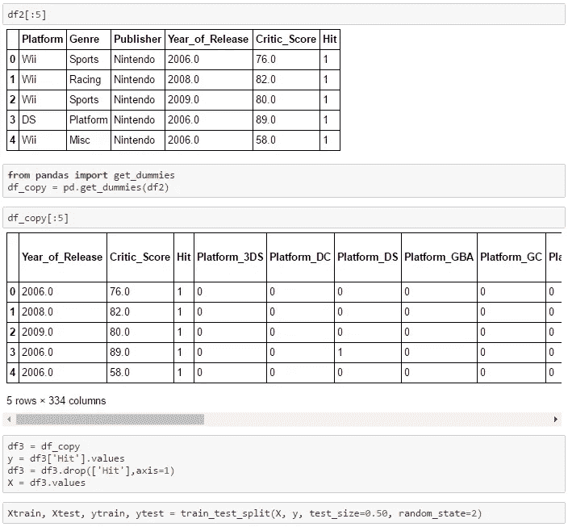**

## **用 RFC 和 LR 测试预测精度**

**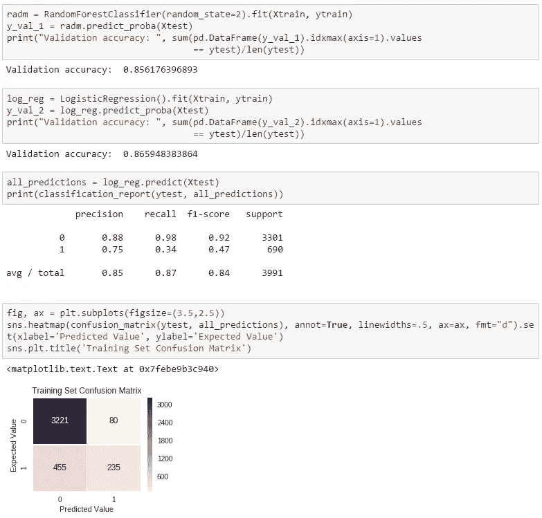**

## **分级功能性能**

```
**Feature ranking (top 10):**1\.  **Critic_Score** (0.323090)
2\.  **Year_of_Release** (0.158740)
3\.  **Publisher_Nintendo** (0.030405)
4\.  **Genre_Action** (0.024856)
5\.  **Publisher_Activision** (0.018035)
6\.  **Genre_Sports** (0.016918)
7\.  **Publisher_Electronic** Arts (0.016917)
8\.  **Genre_Shooter** (0.015722)
9\.  **Platform_PS3** (0.015634)
10\. **Publisher_Ubisoft** (0.014164)
```

# **3.2016 年哪些电子游戏还能成为热门？**

## **最有可能成为热门的视频游戏:**

**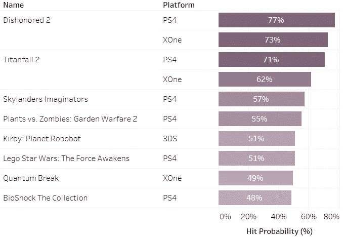**

## **最不可能成为热门的视频游戏:**

**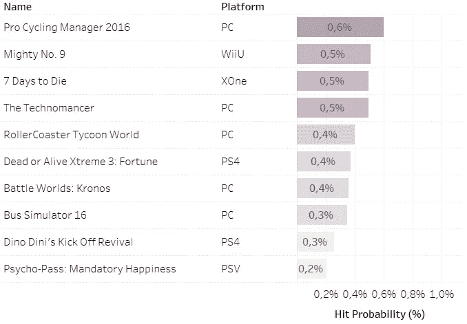**

****Kaggle 笔记本(Python)可以在这里找到**[](https://goo.gl/S6vGkf)****并随时在**[**Twitter**](https://twitter.com/ignacio_chr)**或**[**LinkedIn**](https://www.linkedin.com/in/ignacio-chavarria-19a3a420/)**上找我。******

****如果你喜欢读这篇文章，如果你点击“推荐”按钮和/或分享它，我会很感激。****