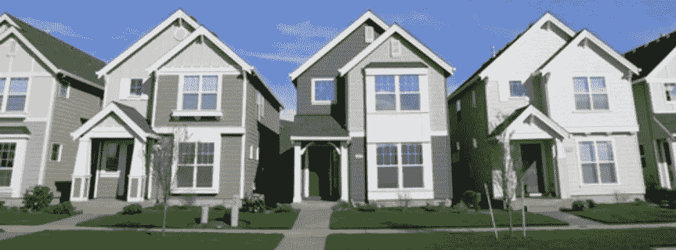
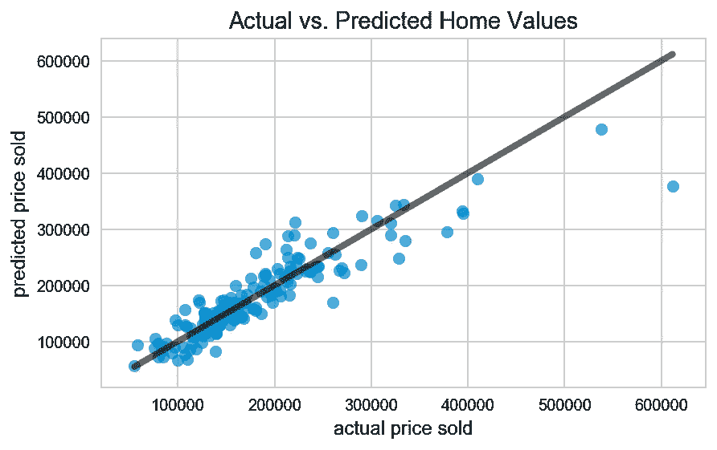

# 预测爱荷华州埃姆斯的房价

> 原文：<https://towardsdatascience.com/predicting-home-prices-in-ames-iowa-3a247e6c9639?source=collection_archive---------5----------------------->

## 回归、正则化、残差和特征选择

Kaggle 最近在爱荷华州的 Ames 举办了一场旨在预测房价的比赛。你可以[在这里](https://www.kaggle.com/c/house-prices-advanced-regression-techniques)了解更多信息。

在我的分析中，我避开了卡格尔关于预测销售价格的问题。相反，我想确定哪些功能最能增加房屋价值。这些数据包括地块大小、地块形状、邻居和其他你无法改变的房子特征。后半部分是关于某些方面的质量和状况。这些质量变量反映了房子中你可以在出售前翻新的部分(车库、厨房、整体)。

我问自己:房子的哪一部分可以改进，从而最大程度地提高价格？

我把这个问题分成三个部分:

1.  固定的特征，如地段大小、房子的平方英尺和邻居，能在多大程度上解释销售价格。
2.  在剩下的误差中，包含测量翻新的特征能解释多少呢？
3.  在这些质量特征中，哪一个最能解释错误，哪一个最能提高销售价格？

这个分析的所有代码都可以在[我的 GitHub repo 中找到](https://github.com/AlexJF12/ames_housing)。

## 探索性数据分析

和所有好的项目一样，我探索了数据的特性。首先，销售价格。

该分布不完全是正态分布，但对于我们的模型来说，它足够接近了。与左侧相比，尾部继续向右侧延伸(显然不会有售价低于 0 美元的房屋)。这些高销售价格异常值将会在以后的分析中引起问题。

街区的平均价格显示了从上到下的明显差异。作为一个固定的模型，这是第一个模型中最重要的特征之一。

## 固定特征模型

使用线性回归，我发现固定特征解释了销售价格变化的 82%。不算太坏。然而，绘制实际销售价格与预测销售价格的对比图显示，非常昂贵的房屋的销售价格一贯高估。

这里的残差是实际价格和预测价格之间的差额。残差越大，模型就离正确预测越远。这里使用的线性模型试图减少所有数据点的残差。

再往深里看，也许我们并不需要所有这些功能。有可能其中一些只是噪音。

正则化是一种减少或消除不重要特征的影响并向模型中添加小误差项的方法。我执行了一个套索正则化方法，发现 10 个最有影响力的特征中有 7 个是邻域变量(每个邻域都有一个虚拟变量)。

在所有特征中，“邻居”是不可能改变的。对于我的第二个模型，我研究了翻新如何进一步解释销售价格

## 翻新模型

对于第二个模型，我包含了所有可以通过家庭装修来修复的特性。仅用这些模型，我发现它们解释了 74%的销售价格。同样，规则化表明虚拟变量“屋顶材料”和“厨房质量”变量解释了最大的差异。

然而，仔细观察“屋顶材料”的价值计数显示，只有 6 个家庭有木瓦，使得这个变量在最终分析中没有用，因为很少有家庭有木瓦。“厨房质量”值更多地分布在一般、典型/一般、良好和优秀之间。

## 组合模型

要了解“厨房质量”如何解释固定特征模型的误差，只需将该变量代入即可。模型的 R 平方从 0.82 增加到 0.85。换句话说，“厨房质量”解释了基于固定特征的模型中 19%的误差。

## 结论

“厨房质量”变量的贝塔系数(又名系数)显示了翻新会增加多少销售价格。与普通厨房相比，提升一个质量等级将会提高售价:

*   优秀:65，884.53 美元
*   好:17898.30 美元
*   典型/平均 1，878.90 美元

当然，这个项目没有考虑装修的成本。如果你能以低于上面列出的价格升级一个不错的厨房，你会在销售谈判中得到更多。

欢迎评论和提问。所有代码和一些 powerpoint 幻灯片都可以在我的 [GutHub repo 这里](https://github.com/AlexJF12/ames_housing)获得。