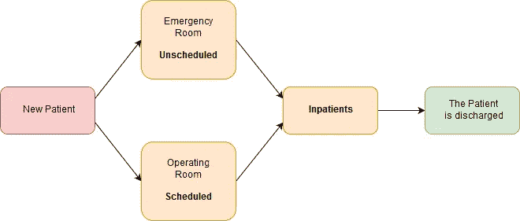
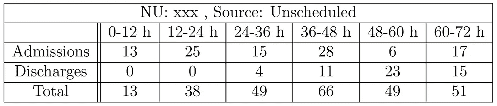

# 预测医院病床的可用性(部分。1)

> 原文：<https://towardsdatascience.com/predicting-hospital-bed-availability-part-1-81d75649a18c?source=collection_archive---------5----------------------->

“MacBook Pro near black stethoscope and brown clipboard” by [rawpixel](https://unsplash.com/@rawpixel?utm_source=medium&utm_medium=referral) on [Unsplash](https://unsplash.com?utm_source=medium&utm_medium=referral)

我们是塞利姆·阿姆鲁尼和 T2，目前是哥伦比亚大学运筹学的学生。如果您有任何问题，请随时通过电子邮件([塞利姆](mailto:selim.amrouni@columbia.edu) / [蒂博](mailto:thibault.duplay@columbia.edu))或我们的 LinkedIn ( [塞利姆·阿姆鲁尼](https://www.linkedin.com/in/selimamrouni/) / [蒂博·杜普雷](https://www.linkedin.com/in/thibaultduplay/))账户与我们联系。

在这个 Medium 系列中，我们将于 2018 年夏天在 [NYU 朗格健康](https://nyulangone.org/)展示我们作为研究实习生的工作。

本文(部分。1)将着重于问题的一般陈述和医院流程的描述。

[部分。2](https://medium.com/@thibault.duplay/predicting-hospital-bed-availability-part-2-4ebf1c037df1) 将关注用于预测医院入住率的模型。所以，这里我们进入项目的核心！

# 实习概述

> “预测未来 72 小时内医院床位的可用性…”

医院病床占用率的容量规划、预测和优化是一个热门领域。**目标**是**提升**操作流程**和**提高**效率****保健行业**。一些医院，如辛辛那提儿童医院和耶鲁纽黑文医院，由于容量规划已经改善了他们的运营系统。****

**作为世界大城市纽约的一家医院，纽约医疗中心经历了几次床位短缺。这些**情况**非常**烦人**这就是为什么**提前预测**床位占用**然后使用这些预测**优化患者安置**是一个有趣且有用的问题。****

**我们的目标是**预测**未来 72 小时(每天)的床位**可用性。
随着数据的到来，模型必须**重新校准**:我们不知道今天会发生什么，但明天我们就会知道发生了什么，所以模型必须不断地用更新的数据重新拟合它的预测。****

# **综合换乘中心**

****

**“white airplane in sky above body of water” by [kazuend](https://unsplash.com/@kazuend?utm_source=medium&utm_medium=referral) on [Unsplash](https://unsplash.com?utm_source=medium&utm_medium=referral)**

> **“医院控制塔”**

****综合转运中心** (CTC)是一个由十几个成员组成的团队，**管理** **整个 NYU 朗格健康的所有患者流动活动**。它与领导和员工以及跨学科团队合作，管理 NYU 朗格健康中心内部和内部的转移。
CTC 比作医院的**【控制塔】**。这个团队每天都在做着一项惊人的工作，以确保 NYU 所有**床位设施的**完善** **管理**。****

# **医院组织**

****

**[Tisch Hospital](https://med.nyu.edu/research/office-science-research/)**

**NYU 兰贡拥有 200 个地点，其中 6 个护理住院病人。本项目的**范围**仅限于的 **3 个住院单位: **Tisch** 医院、 **Kimmel** 馆&hassen feld**儿童医院。
在进一步深入之前，我们首先需要定义一个**护理单元(NU)** 。阿奴是医院的一个**物理细分。每个 NU 对应一个护士台。****

**我们的**项目粒度**处于 **NU 级别**:我们需要预测每个 NU 内的可用性。**

**项目范围统计在 **562** **床位**左右，分布在 **21 个 NU** 中，每个 NU 又根据护理级别的不同细分为 3 级:(从最低到最高)急性，阶梯式&重症监护。因此，**患者**可以根据他们的服务**和他们需要的护理**级别进行分配。通常，有三至四个 NUs 可用，安置旨在提高医院的运作效率。**

# **医院病人流量**

**为了预测床位需求，重要的是了解医院**的患者流量**。首先我们需要创建一个简单的方案来了解某个**患者**可以处于哪种**状态**。这个方案可以很容易地用数学建模，并用历史数据进行调整。**

**下图说明了我们为研究选择的医院的简化机制。真实的图表更复杂，但在我们的项目范围内，所引起的变化可以忽略不计。**

****

**Diagram of the patients flow**

****入口**有**两种** **种****患者**:预约**(在医院预约的，主要是手术)和非预约**(主要是急诊)。这些病人**在医院员工看过之后，可以占用**一张病床，也可以不占用一张病床，成为**住院病人**，直到出院。由于该项目的目标是预测床位的可用性，没有占用床位的患者不在考虑范围内。******

****为了估计未来床位的可用性，我们需要区分以下情况:****

*   ******当前住院患者**:我们可以访问住院患者的当前快照，基于此数据，我们希望为每位住院患者分配特定的住院时间(LoS)。****
*   ******即将安排的**:我们可以查看下一次手术的时间表。我们有一些关于这些“预定”病人的信息。根据该时间表，我们将尝试调整预定住院病人的数量，并为他们分配一个服务点。****
*   ****即将到来的计划外的:这些病人天生就是随机的。根据历史数据，我们将尝试对急诊室即将到来的患者进行抽样调查。通过这些模拟，我们希望调整非预定住院病人的数量，并为他们分配一个服务点。****

# ******模型框架******

## ****投入****

****使用了四个数据集来源:****

*   ******当前普查**:是拉出来的那一刻医院所有住院病人的快照。****
*   ******流量**:这是最近两个月流量的数据集，对历史数据进行统计很有用。****
*   ******或时间表**:这是一个时间表，我们可以访问 15 天内即将到来的手术，我们可以访问护理强度、药物类型和手术时间。NU 尚未分配。****
*   ******安置矩阵**:这是一个由 CTC 团队经常更新的矩阵，将特定类型的药物和护理级别与 NU 相关联。****

## ****输出****

****输出是小的**表格**用于**每个护理单元**分成**三个** **不同的** **来源**:“预定的”、“非预定的”和“当前住院病人”，可以很容易地汇总。表格的列分隔六个时隙。每个时间段代表 12 个小时(主要是上午和下午)。时间线从今天凌晨 0:00 开始，到明天中午 12:00 结束。表格中的行分隔了每个时间段 NU 中的入院、出院和患者总数(来自所考虑的来源)。****

********

****Example of an output for the unit xxx, sourced with the unscheduled patients (the name of the unit is masked for non-disclosure agreement)****

## ******汇总三个来源******

****为了有一个特定 NU 的接下来 72 小时的**预测，忽略来源，我们只需对来自三个来源的**表**求和**。如果我们想要完整位置(Tisch 医院、Kimmel Pavillon 或 Hassenfeld 儿童医院)的预测，我们只需对相应 NU 的表求和。********

# 结论

瞧啊。在第一部分中，您有机会了解了医院、CTC 组织和管理以及对我们模型的介绍。在接下来的文章中，我们将更深入地研究模型的每个部分，使用单词距离使程序对人类输入具有鲁棒性，模拟未安排的患者，构建图形用户界面以及我们改进工具的思考。

> 请跟随我们并保持关注…