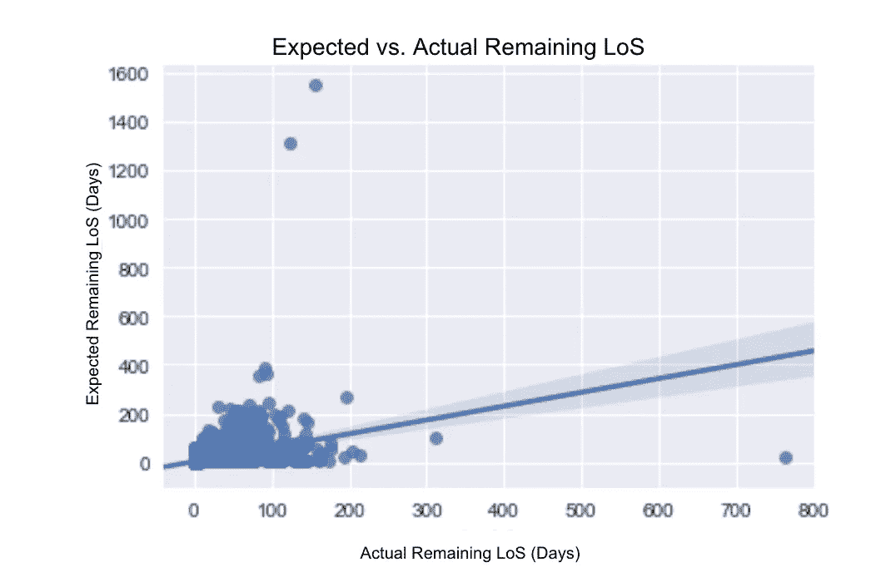
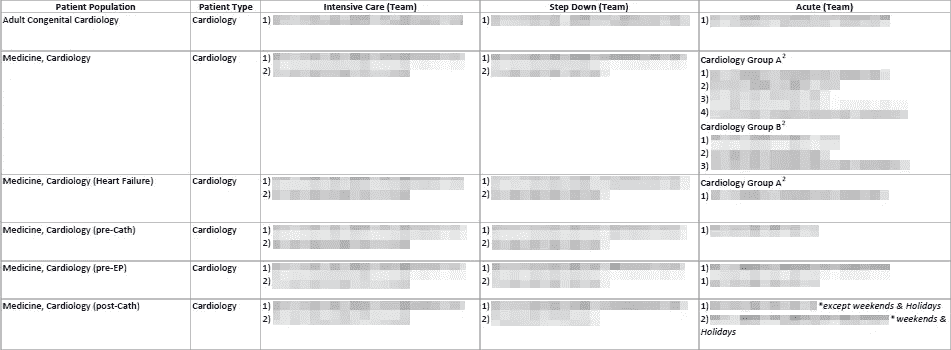
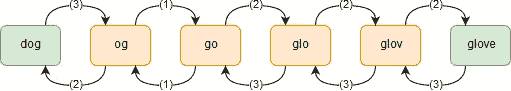
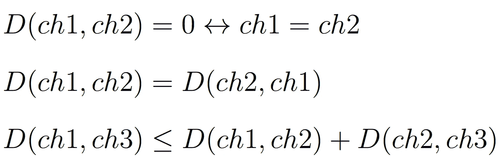
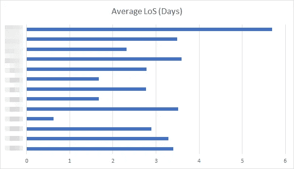
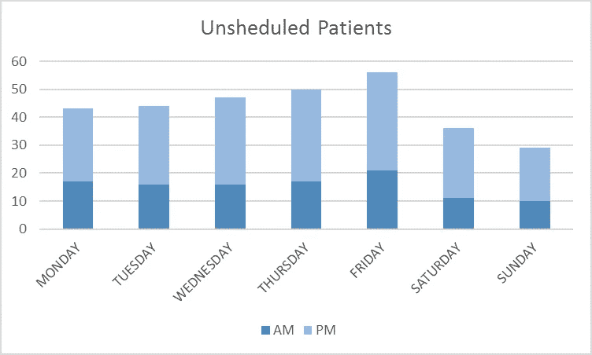
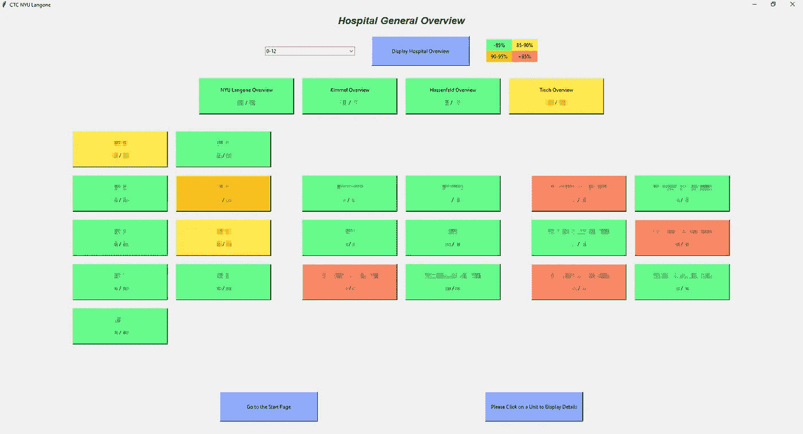

# 预测医院病床的可用性(部分。2)

> 原文：<https://towardsdatascience.com/predicting-hospital-bed-availability-part-2-4ebf1c037df1?source=collection_archive---------5----------------------->

“woman showing man laptop” by [rawpixel](https://unsplash.com/@rawpixel?utm_source=medium&utm_medium=referral) on [Unsplash](https://unsplash.com?utm_source=medium&utm_medium=referral)

我们是塞利姆·阿姆鲁尼和 T2，目前是哥伦比亚大学运筹学的学生。如果您有任何问题，请随时通过电子邮件([塞利姆](mailto:selim.amrouni@columbia.edu) / [蒂博](mailto:thibault.duplay@columbia.edu))或我们的 LinkedIn ( [塞利姆·阿姆鲁尼](https://www.linkedin.com/in/selimamrouni/) / [蒂博·杜普雷](https://www.linkedin.com/in/thibaultduplay/))账户与我们联系。

在这个 Medium 系列中，我们将于 2018 年夏天在 [NYU 朗格健康](https://nyulangone.org/)展示我们作为研究实习生的工作。

[部分。1](/predicting-hospital-bed-availability-part-1-81d75649a18c) 是关于问题的一般陈述和医院流程的描述。

本文(部分。2)将集中于用于预测医院占用率的模型。所以，这里我们进入项目的核心！

# 住院病人模型

## 初步的

**住院病人**已经进入 NYU 朗格医疗机构。正如他们已经承认的那样，**唯一的目标**是**预测**他们的**出院**日期。然后，通过合计每个 NU 内的出院人数，我们可以检索 NU 内的患者人数。

> 每天预测患者的剩余 LoS 是多少

**可以实施两种方法**来预测患者的出院情况。**首先**，我们可以尝试**直接预测患者入院时的损失**(例如:3 天、4 天……)。然而，患者的出院是非常不可预测的，并且估计的出院日期在患者护理过程中会改变几次。事实上，患者的身体反应是不确定的，没有人确切知道患者将停留多久，未来的治疗将是什么，等等。因此，**第二种方法**是每天**预测患者的**剩余 LoS** 是什么。这是我们采取的方法。**

同样，**预测****排放**日期既可以看作是**回归**也可以看作是**分类**问题。

> 由于 CTC 团队要求的粒度，我们选择了分类方法。

在**回归问题**中，目标是预测**在医院的正确剩余时间量**。然而，由于 CTC 团队要求的粒度，**我们选择了分类方法**。事实上，从运营的角度来看，重要的是了解医院每天的入住情况，但他们并不关心出院的确切时间。在与团队进行了几次审查后，除了当天，我们意识到他们需要知道的一个**重要信息**是**放电**是否会在中午(下午 12:00)之前**发生。事实上，在中午之前知道一张床是否是**排放物** (DBN)使得团队能够在下午直接重新确定这张床的属性。这样，就不会出现病人在夜间入住的床位不足的情况。这就是为什么我们把回归问题变成了分类问题。我们**将时间分成 7 个 12 小时的时间段**，从**“0–12 小时”**到**“+72 小时”**。例如，如果患者属于“24–36h”类别，这意味着他的剩余 LoS 在 24 到 36 小时之间。这样，预测医院住院人数的问题就变成了一个**监督七类分类问题**。**

## 使用的功能

用于这项任务的数据集是当前的人口普查。这是医院的快照，有大约 200 个特征。但是，由于过去数据中未来数据的数据泄漏(患者的过去数据被最后的条目覆盖)，我们无法使用这些功能。有希望的是，在与 it 团队的几次会议后，由于他们惊人的工作，我们开始每天四次捕获和存储当前的人口普查数据集。因此，我们希望能够在今后的工作中尝试和检验我们的方法。

乍一看，因为我们无法访问历史数据，所以我们只能为我们的住院病人模型使用一个特性:**医生给出的估计出院数据**。事实上，医生在其每日患者巡视期间更新患者的估计出院日期。

## 数据的处理

给定医生估计的出院日期和当前时间，我们可以计算患者的剩余住院时间。然后，知道了病人将停留的剩余时间，我们可以将每个病人归属于它所属的类别。最后一步是在每个 NU 内计算属于每个类别的患者数量，以便了解出院人数。

**结果**

Scatter Plot of the Actual vs. Expected Remaining LoS

实际剩余 LoS 与预期剩余 LoS 的散点图显示了医生预测的**低效率。**基于这种观察，我们试图开发一种监督学习分类算法。

# 预定模型

## 放置矩阵

安置矩阵为 NU 指定一种医疗类型和一个护理级别。

First rows of the Placement Matrix (details have been blurred for non-disclosure agreement)

我们可以看到在某些情况下有 NU ( 1)，2) …)的列表。这描述了 NU 填充的顺序，如果“1”已满，则将患者放在“2”中，以此类推。我们还可以观察到，有时根据外科医生的团队或一天的类型(工作日、周末或假日)，位置会发生变化。

> 我们必须解读原始文本…

**格式**是**不是**以为是**被**机器**使用**而是被人类雇员使用。我们不得不**解读**原始文本。有时，同一 NU 的名称会有些不同。我们需要找到一种方法来解决这些困难，我们不能为特定的布局矩阵编码一个简单的映射。事实上，布局矩阵经常变化，我们需要**执行**一个**算法** **对这些变化**具有鲁棒性。

> …使用单词距离…将 ch1 转换为 ch2 所需的最少数量的基本运算

我们决定列出 NU 的未更改名称，然后使用**单词距离**将放置矩阵建议的 NU 与列表中距离**最小的 NU 相关联。为此，我们使用了以下距离:设 *ch1* 和 *ch2* 为两个字符链。 *ch1* 和 *ch2* 标注为 *D(ch1，ch2)* 的距离是**将**ch1 转换为 *ch2* 所需的**对 *ch1* 的最小基本运算次数。有三种基本操作:****

*   互换两个角色(1)(例如:狗→上帝)
*   插入一个字符(2)(例如:上帝→黄金)
*   删除一个字符(3)(例如:黄金→旧)

例如*D(“*狗*”、“*手套*”)*= 5:

How to calculate the distance between ”dog” and “glove”

这个距离的灵感来自于著名的**莱文斯坦距离**。我们**增加了**操作**互换**。在我们的例子中，字符链实际上是句子。如果两个句子中的单词相似但顺序不同，则互换具有灵活性。我们可以注意到距离**验证了**距离的**最广泛的数学定义:**

Definition of a distance

结果非常令人满意，没有一个 NU 的名字被错误地映射。

## 承认

一旦我们能够正确处理位置矩阵，承认是简单的。我们选择了这样的假设，即**患者** **在其手术**之后的时间段进入 **他的 NU。我们做这个选择是为了考虑手术的长度和在 PACU 的时间。例如，如果患者被安排在明天下午，因此在时间段“36-48 小时”，我们将假设他将在时间段“48-60 小时”到达他的 NU。**

## 排放

由于我们还没有关于该患者的任何其他信息(他还没有住院)，我们不能以令人满意的准确性影响他。根据他的《怒》，我们可以根据**史料**对**样**其**洛**。
下图给出了每个单位患者的平均损失:

The average LoS for each unit (details have been blurred for non-disclosure agreement)

## 非计划模型

对于计划外的患者，我们需要使用历史数据对**急诊室**中的**到达者**进行**采样。**

## 承认

原理很简单，在关于病人出院的数据中，我们可以推导出每天的平均到达人数，考虑到一周中的某一天- **季节性**。下图给出了这种特殊季节性的精确值。由于一年中的一段时间(有一些高峰，尤其是在夏季或冬季)造成的季节性应该被直接考虑在内。事实上，我们只考虑了过去两个月的出院数据。因此**统计**使得**只考虑**当年的**当前** **期间**。

Day-of-the-week-seasonality for the unscheduled arrivals

> 我们需要模拟今天、明天和后天

一旦我们对这些天进行了统计，我们就知道**今天、明天和后天**我们需要模拟多少计划外的患者。我们甚至更精确:我们考虑是上午还是下午来正确地填充我们的时间段。
然后，如果我们知道我们必须对特定时间段内的" *n* "非预定到达进行采样，我们也可以**将**分配给这个" *n* "不同的患者和 NU。我们利用历史数据完成了这项任务，下图说明了非计划到达的 NU 份额。基于这种分布，我们可以很容易地对计划外患者进行抽样(这只是一种多项分布)。我们使用这个模型来填充急诊室到达的输入。

The distribution of the NU concerning the unscheduled arrivals (details have been blurred for non-disclosure agreement)

## 排放

正如我们对预约患者所做的那样，我们对非预约患者的 LoS 进行了抽样。然后我们可以推导出不定期到达的出院日期。

> 现在，CTC 团队已经将软件全部设置好了…

Graphic interface we made in order to facilitate the use for non-technical people

# 结论

瞧啊。在第二部分中，您有机会深入了解我们为项目构建的模型。在接下来的文章中，我们将进入更奇妙、更吸引人的数学领域来改进这个模型。

> 请跟随我们并保持关注…