# 入院时预测住院时间

> 原文：<https://towardsdatascience.com/predicting-hospital-length-of-stay-at-time-of-admission-55dfdfe69598?source=collection_archive---------4----------------------->

## 探索一个重要的医疗保健绩效指标

Photo by [Hush Naidoo](https://unsplash.com/photos/ZCO_5Y29s8k?utm_source=unsplash&utm_medium=referral&utm_content=creditCopyText) on [Unsplash](https://unsplash.com/search/photos/hospital-room?utm_source=unsplash&utm_medium=referral&utm_content=creditCopyText)

## 项目概述

预测分析是医疗保健领域日益重要的工具，因为现代机器学习(ML)方法可以使用大量可用数据来预测患者的个体结果。例如，ML 预测可以帮助医疗保健提供者确定疾病的可能性，帮助诊断，推荐治疗方法，以及[预测未来健康](https://www.elsevier.com/connect/seven-ways-predictive-analytics-can-improve-healthcare)。在这个项目中，我选择关注医疗保健的物流指标，医院**住院时间** (LOS)。LOS 定义为入院到出院之间的时间，以天为单位。

美国医疗系统每年至少花费[3775 亿美元](https://www.healthcatalyst.com/success_stories/reducing-length-of-stay-in-hospital)，最近的[医疗保险立法](https://go.beckershospitalreview.com/how-predicting-patient-length-of-stay-enables-hospitals-to-save-millions)规范了手术费用的支付，不管病人在医院呆了多少天。这激励医院在入院时识别具有高 LOS 风险的患者。一旦确定，具有高 LOS 风险的患者可以优化他们的治疗计划，以最小化 LOS 并降低获得医院获得性疾病(如葡萄球菌感染)的机会。另一个好处是事先了解 LOS 可以帮助后勤工作，如房间和床位分配计划。

## 问题陈述

> 这个项目的目标是建立一个模型，预测每个病人入院时的住院时间。

我最初的想法是，使用随机森林或梯度树增强集成方法会产生最好的结果。其原因是集成方法结合了多种学习算法，以获得比单一算法更好的预测性能，并经常用于 Kaggle [竞赛](https://www.datasciencecentral.com/profiles/blogs/want-to-win-at-kaggle-pay-attention-to-your-ensembles)。然而，第一步是找到合适的数据集。

作为寻找数据的起点，我的直觉是，数据集应该理想地包括诸如患者的诊断类别(例如，心脏病、分娩、受伤/中毒等)的特征。)、年龄、性别、婚姻状况和种族。在搜索了一个有用的医疗数据库后，我最终选择了 MIT [MIMIC-III](https://mimic.physionet.org/) 数据库，因为它拥有大量的信息。模拟描述如下:

> MIMIC 是由麻省理工学院计算生理学实验室开发的一个公开可用的数据集，包含与大约 40，000 名重症监护患者相关的去身份健康数据。它包括人口统计，生命体征，实验室检查，药物治疗，等等。

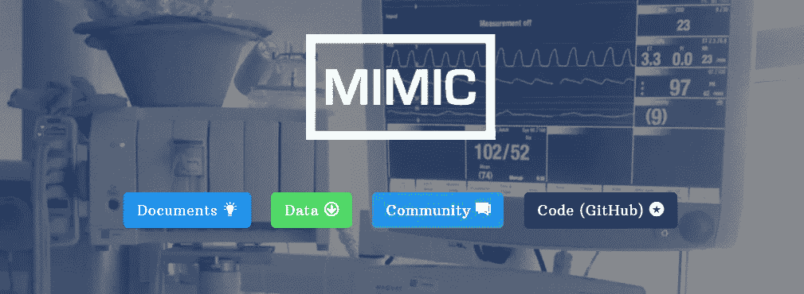

顺便提一下，进入 MIMIC 需要参加[的研究道德与合规培训课程](https://about.citiprogram.org/en/homepage/)，并填写[的研究申请表](https://physionet.org)。我发现的唯一明显的缺点是数据库不包括儿科信息(2-13 岁)。

为了预测医院服务水平，需要将模拟数据分为因变量(在本例中为住院时间)和自变量(特征),作为模型的输入。由于 LOS 不是一个分类变量，而是一个连续变量(以天为单位)，因此将使用回归模型进行预测。很可能(事实证明是这样的)数据需要大量的清理和特征工程，才能与学习模型兼容。对于这个项目，我使用了 Python 的 [Pandas](https://pandas.pydata.org/) 和 [scikit-learn](https://scikit-learn.org) 库。

## 韵律学

该项目的预期结果是开发一个模型，该模型在预测医院损失方面优于中位数和平均损失的行业标准。中值损失简单来说就是过去入院的中值损失。类似地，医疗保健中第二个常用的指标是[平均值](https://www.intel.com/content/dam/www/public/us/en/documents/case-studies/predictive-analytics-help-a-hospital-group-reduce-patient-length-of-stay-study.pdf)，或平均 LOS。为了衡量性能，我将使用均方根误差(RMSE)将预测模型与中值和平均 LOS 进行比较。RMSE 是一种常用的度量模型预测值和观测值之间差异的方法，分数越低表示精确度越高。例如，一个完美的预测模型的 RMSE 应该为 0。这项工作的 RMSE 方程如下所示，其中(n)是住院记录的数量，(y-hat)是预测的服务水平，(y)是实际的服务水平。

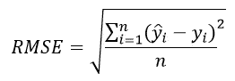

最终目标是开发一种预测模型，该模型的 RMSE 低于平均模型或中值模型。

有许多回归模型可用于预测 LOS。为了确定这项工作的最佳回归模型(将被评估的模型子集)，将使用 R2 (R 平方)评分。R2 是对模型拟合度的度量。换句话说，它是因变量中方差的比例，可以从自变量中预测出来。R2 定义为以下等式，其中( *y_i* )是观察数据点，( *ŷ* )是观察数据的平均值，( *f_i* )是预测模型值。

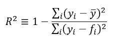

最佳可能的 R2 分数是 1.0，负值意味着它比常数模型差，在这种情况下是平均值或中值。

## 数据探索和特征工程

在多次重复查看 MIMIC 数据库中各种表格的内容后，我最终选择了以下表格，并使用 Pandas 将它们加载到 DataFrames 中: *ADMISSIONS.csv、PATIENTS.csv、DIAGNOSES _ ICD.csv、*和 *ICUSTAYS.csv.*

*入院*表给出了 SUBJECT_ID(唯一的患者标识符)、HADM_ID(住院 ID)、ADMITTIME(入院日期/时间)、DISCHTIME(出院时间)、DEATHTIME 等信息。该表有 58，976 个入院事件和 46，520 个不同的患者，这似乎是进行预测模型研究的合理数据量。首先，我通过获取每一行的入院和出院时间之间的差异创建了一个住院时间列。我选择删除有负损失的行，因为这些是患者在入院前死亡的情况。此外，我发现 9.8%的入院事件导致了死亡，因此我删除了这些事件，因为它们不包含在典型的 LOS 指标中。就天数而言，服务水平的分布是右偏的，中位数为 10.13 天，中位数为 6.56 天，最大值为 295 天。

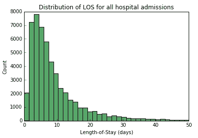

对于录取*种族*栏，有 30 多个类别可以很容易地减少到下面显示的五个。有趣的是，*亚洲*类别具有最低的数据集中位数 LOS。

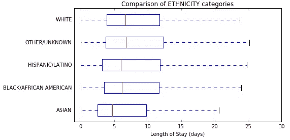

对于*宗教*，我把名单缩减为三类*得不到*(录取 13%】*宗教*(录取 66%)，或者不指定(录取 20%)。*无法获得的*组具有最低的中值 LOS。

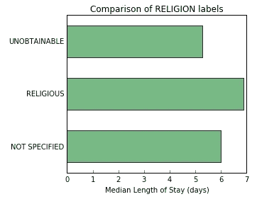

入院人数减少到四类:*急症、新生儿、急诊、择期*。*新生儿*的平均 LOS 最低，而*紧急*护理类别的平均 LOS 最高。选择性招生有一个更紧密的分布，有利于较低的损失，这是有道理的，因为这种情况的严重性通常是时间不太关键。

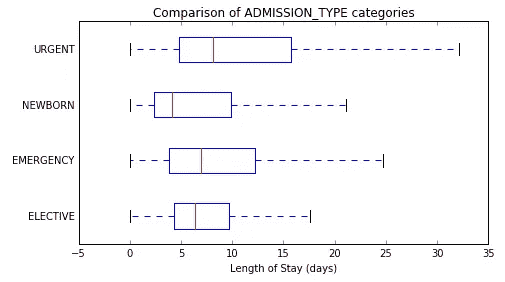

这个数据集有一个有趣的见解，表明自费(通常意味着免费)入院比其他保险类别的 LOS 短得多。医疗保险和医疗补助占据最高的中位 LOS 位置，这可能与这些系统中患者的年龄有关。

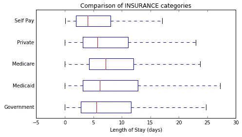

*患者*表提供了不确定的出生日期和性别信息。因为模拟数据集不提供真实的出生日期来保护患者的身份，所以我需要使用以下解码器来设计年龄特征:患者的年龄由他们出生的“出生日期”和他们第一次入院的日期之间的差异给出。考虑到这一点，我合并了*患者*和*入院*数据帧，并使用 pandas‘group by’来提取每个患者的首次入院时间。

> df[['SUBJECT_ID '，' ADMITTIME']]。groupby('SUBJECT_ID ')。最小()。重置索引()

在计算了出院时间和第一次入院时间之间的差异后，我可以看看患者的年龄分布。需要注意的是，89 岁以上的患者在 MIMIC 中被归入同一年龄组。

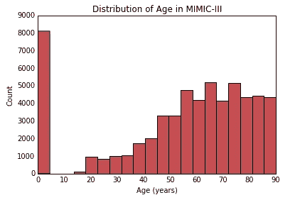

尽管新生儿患者数据包含在模拟数据集中，但儿科年龄不包含在内。为了给年龄分布图增加一个维度，我观察了 LOS 与年龄的关系。该图突出了新生儿和> 89 岁老人的模拟组，其中从 20 岁到 80 岁的住院人数不断增加。由于年龄极值的数据分布类似离散，我决定将所有年龄转换成类别*新生儿、年轻成人、中年、*和*老年人*，以便在预测模型中使用。

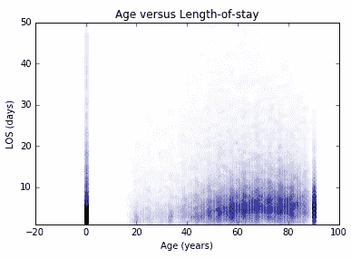

*诊断 _ICD* 表在特征工程方面提供了最大的挑战。该表由患者和入院 id 以及 ICD9 代码组成，描述如下(来源):

> 国际疾病分类，临床修改(ICD-9-CM)是由美国国家卫生统计中心(NCHS)创建的改编，用于分配与美国住院病人、门诊病人和医生办公室使用相关的诊断和程序代码。

我本可以为每个代码创建[虚拟变量](https://pandas.pydata.org/pandas-docs/stable/generated/pandas.get_dummies.html)，但是在这种情况下没有意义。在模拟数据集中使用了 6，984 个独特的代码，对患者进行了 651，047 次 ICD-9 诊断，因为大多数患者被诊断患有不止一种疾病。查看表格，您可以看到 *ICD9_CODE* 列代码采用了可变字符长度的方法。

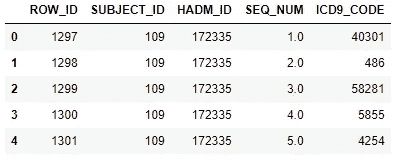

经过一番调查，我发现真正的代码语法是三位数字后跟一组子类别的小数。例如，第一行的代码是 403.01，属于循环系统的*疾病范围，而. 01 值进一步指定了*高血压慢性肾脏及相关疾病*。此外，我注意到 ICD-9 有 [17 个主要类别](https://en.wikipedia.org/wiki/List_of_ICD-9_codes)，所以我决定将每个入场的唯一代码分类到这些类别中。我的推理是，将 ICD-9 代码从 6984 个减少到 17 个会使 ML 模型更容易理解。此外，我不希望任何 ICD-9 代码只有一个单一的损失目标行，因为这将使培训/测试复杂化。最后，我将排序 ICD-9 代码转换为入院-ICD9 矩阵，对每个入院的诊断进行分组，并将新列与 HADM_ID(入院 ID)上的主*入院*数据帧合并。您可以看到每一行(入院)都包含多个诊断，这是应该的。*

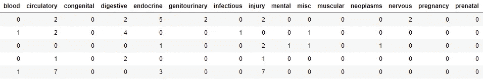

Part of the admission-ICD9 category matrix

查看每个 ICD-9 超级类别的中值 LOS，可以看到*妊娠*和*皮肤*诊断代码组之间令人印象深刻的差异。正如后面将要显示的，诊断类别是预测 LOS 的最重要的特征。

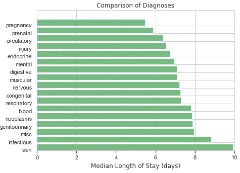

## 数据预处理

即使在完成了 age 和 ICD-9 的特征工程之后，在将数据用于预测模型之前，仍有一些遗留问题需要整理。首先，我确保没有导致死亡的入院是被清理数据集的一部分。我删除了所有未使用的列，并验证了数据中不存在 nan。对于*入院类型*、*保险类型、宗教、种族、年龄、*和*婚姻状况*列，我执行了 Pandas *get_dummies* 命令，将这些分类变量转换成虚拟变量/指示变量。最终的数据帧大小产生 48 个特征列和 1 个目标列，条目计数为 53，104。

## 预测模型

为了实现预测模型，我使用 sci kit-learn*train _ test _ split*函数将 LOS 目标变量和特征以 80:20 的比例分成训练集和测试集。

> X_train，X_test，y_train，y _ test = train _ test _ split(features，
> LOS，test_size = .20)

使用训练集，我使用默认设置拟合了五个不同的回归模型(来自 scikit-learn 库),然后比较了测试集上的 R2 分数。GradientBoostingRegressor 以大约 37%的 R2 分数赢得了测试集，所以我决定专注于改进这个特定的模型。由于 RandomForestRegressor 过去的成功，我尝试了该模型的参数，但从未超过 GradientBoostingRegressor 的分数。

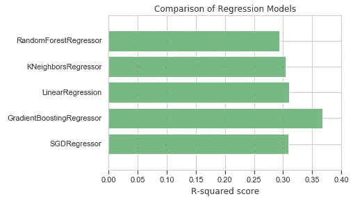

为了改进 GradientBoostingRegressor 模型，我使用了 scikit-learn 的 GridSearchCV 函数来测试各种参数排列，如 *n_estimators* 、 *max_depth* 和 *loss* 。GridSearchCV 的最佳估计结果是 *n_estimators* =200， *max_depth* =4，以及 *loss* =ls。这导致了一个小的改进，测试集的 R2 分数大约为 39%。

## 结果

在查看 RMSE 基准之前，我想调查在使用梯度推进回归模型预测住院时间时，什么特征是最重要的。与*产前*问题相关的诊断具有最高的特征重要性系数，其次是*呼吸*和*伤害*。正如我前面提到的，ICD-9 诊断类别是迄今为止最重要的特征。事实上，在前 20 大特色中，只有*急诊*入院类型、*性别*和*医疗补助*保险显示出诊断组之外的重要性。

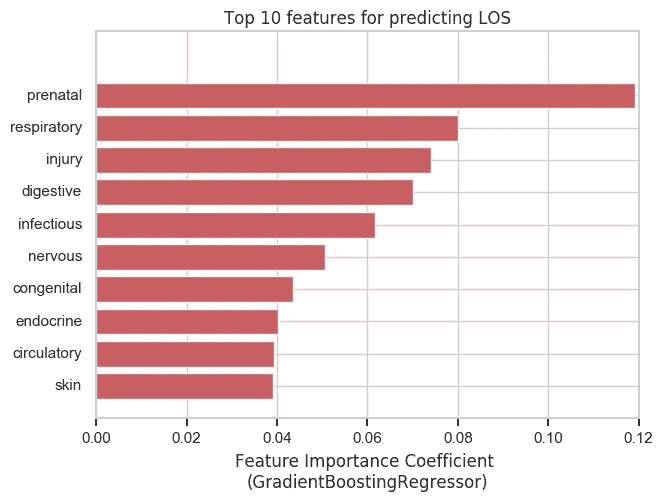

在指标部分，我说明了 RMSE 将用于比较预测模型与行业标准的平均和中值 LOS 指标。与常数平均值或中值模型相比，梯度推进模型 RMSE 要好 24%以上(百分比差异)。

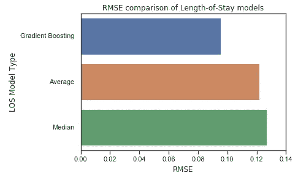

虽然 RMSE 的趋势很有希望，但我也想从其他一些角度来评估这个模型。下图取自测试集中的前 20 个录取，并直接比较实际、预测(梯度推进模型)、平均值和中值 LOS 值。这给出了预测模型的更复杂的情况；在某些情况下，它预测得很好，但在其他情况下就不那么好了。然而，基于 RMSE 评分，预测模型通常仍将比使用中值或平均 LOS 更准确。

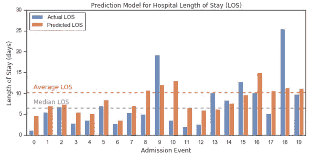

我想看这个模型的最后一种方式是，绘制测试集中准确预测的比例与允许误差的比例。其他[研究](https://www.intel.com/content/dam/www/public/us/en/documents/case-studies/predictive-analytics-help-a-hospital-group-reduce-patient-length-of-stay-study.pdf)将一个 LOS 预测视为*正确*如果它落在一定的误差范围内。因此，随着误差容限的增加，所有模型的准确预测的比例也应该增加。梯度推进预测模型在高达 50%的误差范围内比其他常数模型表现得更好。

## 结论

MIMIC 数据库提供了与医疗入院相关的惊人的深度和细节，这使我能够创建一个医院住院时间预测模型，该模型考虑了许多有趣的输入特征。这项工作最令人惊讶的方面是，在预测住院时间时，患者的 ICD-9 诊断如何发挥比年龄更重要的作用。到目前为止，这个项目最具挑战性的方面是将 ICD-9 诊断转化为更实用和更易解释的超级范畴的特征工程。然而，这也是未来改进的最明显的领域。鉴于诊断具有如此强的特征重要性，对主要的 ICD-9 分类进行额外的细分是否会产生更好的预测模型是值得评估的。我的理论是，只要数据集中有足够的入院记录来支持合理的诊断模型训练，通过这种优化，预测模型将变得更准确(更低的 RMSE)。

这个项目的 GitHub 库可以从这里[获得](https://github.com/daniel-codes/hospital-los-predictor)一个 Jupyter 笔记本，它详细描述了这篇文章中探索的所有部分。

*MIMIC-III，一个免费的重症监护数据库。Johnson AEW，Pollard TJ，Shen L，Lehman L，Feng M，Ghassemi M，Moody B，Szolovits P，LA 和 Mark RG。科学数据(2016)。DOI:*[10.1038/sdata . 2016.35](http://dx.doi.org/10.1038/sdata.2016.35)。来自:[http://www.nature.com/articles/sdata201635](http://www.nature.com/articles/sdata201635)