# 使用 Scikit-Learn 使用机器学习预测糖尿病患者的再入院

> 原文：<https://towardsdatascience.com/predicting-hospital-readmission-for-patients-with-diabetes-using-scikit-learn-a2e359b15f0?source=collection_archive---------4----------------------->

让我们使用机器学习来识别有再次入院风险的患者！

# 介绍

随着医疗保健系统转向基于价值的护理，CMS 创建了许多项目来提高患者的护理质量。其中一个项目叫做“减少医院再入院项目”( [HRRP](https://www.cms.gov/Medicare/Quality-Initiatives-Patient-Assessment-Instruments/Value-Based-Programs/HRRP/Hospital-Readmission-Reduction-Program.html) )，该项目减少对再入院率高于平均水平的医院的报销。对于那些目前在该计划下受到处罚的医院，一个解决方案是制定干预措施，为再入院风险增加的患者提供额外的帮助。但是我们如何识别这些病人呢？我们可以使用数据科学中的预测模型来帮助确定患者的优先顺序。

一个住院和再住院风险增加的患者群体是糖尿病患者。在美国，糖尿病是一种影响大约十分之一患者的医学疾病。根据奥斯特林等人的研究，糖尿病患者住院的几率几乎是普通人群的两倍([奥斯特林等人 2017](https://clindiabetesendo.biomedcentral.com/articles/10.1186/s40842-016-0040-x) )。因此，在本文中，我将重点预测糖尿病患者的再入院。

在这个项目中，我将演示如何使用以下步骤在 Python 中建立一个预测再入院的模型

*   数据探索
*   特征工程
*   构建培训/验证/测试样本
*   型号选择
*   模型评估

你可以跟随我的 github(【https://github.com/andrewwlong/diabetes_readmission】)上提供的 Jupyter 笔记本。

# 项目定义

预测糖尿病患者是否会在 30 天内再次入院。

# 数据探索

这个项目中使用的数据最初来自 UCI 机器学习知识库([链接](https://archive.ics.uci.edu/ml/datasets/diabetes+130-us+hospitals+for+years+1999-2008))。该数据包括 1999 年至 2008 年间美国 130 家医院超过 100000 例住院的糖尿病患者。

在这个项目中，我们将利用 Python 来构建预测模型。让我们从加载数据和研究一些列开始。

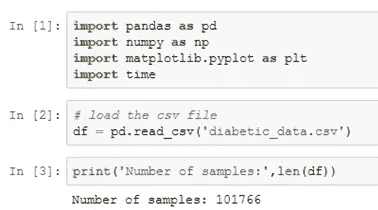

简而言之，浏览数据列，我们可以看到有一些标识列、一些数字列和一些分类(自由文本)列。下面将更详细地描述这些列。

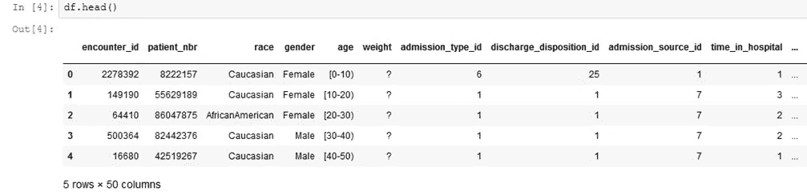

有些缺失的数据用问号(？).我们将在特性工程部分处理这个问题。

这里最重要的一栏是`readmitted`，它告诉我们患者是在 30 天内住院、超过 30 天还是没有再次入院。

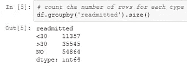

另一个重要的列是`discharge_disposition_id`，它告诉我们病人住院后去了哪里。如果我们查看 UCI 提供的 IDs_mapping.csv，我们可以看到 11，13，14，19，20，21 与死亡或临终关怀有关。我们应该从预测模型中移除这些样本，因为它们不能被重新接纳。

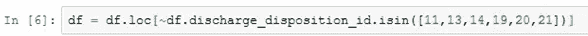

现在让我们为二元分类定义一个输出变量。在这里，我们将尝试预测患者是否有可能在出院后 30 天内再次入院。

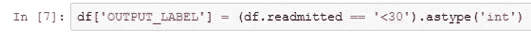

让我们定义一个函数来计算 30 天内再次入院人口的患病率。

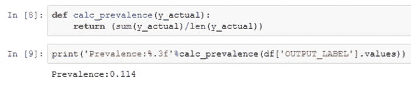

大约 11%的人口再次住院。这代表了一个不平衡的分类问题，所以我们将在下面解决这个问题。

从对列的进一步分析中，我们可以看到分类(非数字)和数字数据的混合。有几件事需要指出，

*   encounter_id 和 patient_nbr:这些只是标识符，不是有用的变量
*   年龄和体重:在这个数据集中是分类的
*   入院 _ 类型 _id，出院 _ 处置 _id，入院 _ 来源 _id:在这里是数字，但都是 id(见 IDs_mapping)。它们应该被认为是绝对的。
*   examide 和 citoglipton 只有 1 个值，所以我们不会使用这些变量
*   diag1、diag2、diag3 是分类的，有很多值。我们将不会使用这些作为这个项目的一部分，但你可以分组这些 ICD 代码，以减少维度。我们将使用 number _ diagnoses 来获取一些信息。
*   medical _ speciality 有许多分类变量，因此我们在制作特征时应该考虑这一点。

# 特征工程

在本节中，我们将为预测模型创建特征。对于每个部分，我们将向数据帧添加新的变量，然后跟踪我们希望使用数据帧的哪些列作为预测模型特征的一部分。我们将把这一部分分解成数字特征、分类特征和额外特征。

在这个数据集中，缺失的数字被打上了问号。让我们用一个 nan 表示来代替它。

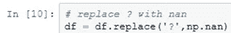

## 数字特征

最容易使用的特征类型是数字特征。这些特征不需要任何修改。我们将使用的数字列如下所示

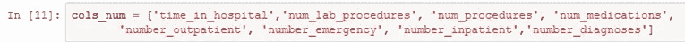

让我们检查一下数字数据中是否有缺失值。

## 分类特征

我们要创建的下一类特征是分类变量。分类变量是非数字数据，如种族和性别。要将这些非数字数据转换为变量，最简单的方法是使用一种称为 one-hot encoding 的技术，下面将对此进行解释。

我们将处理的第一组分类数据是这些列:

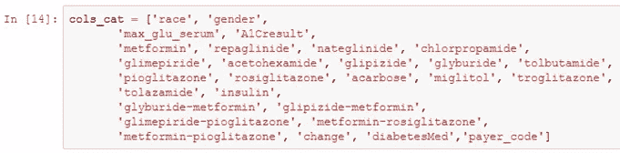

在我们的分类特征中，`race`、`payer_code`和`medical_specialty`有缺失数据。由于这些是分类数据，最好的办法是使用“fillna”函数为 unknown 添加另一个分类类型。。

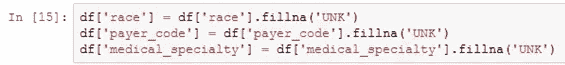

注意`medical_specialty` 没有包含在上面的列表中，因为我们需要多做一个处理步骤。在我们开始一键编码之前，让我们先研究一下医学专业。

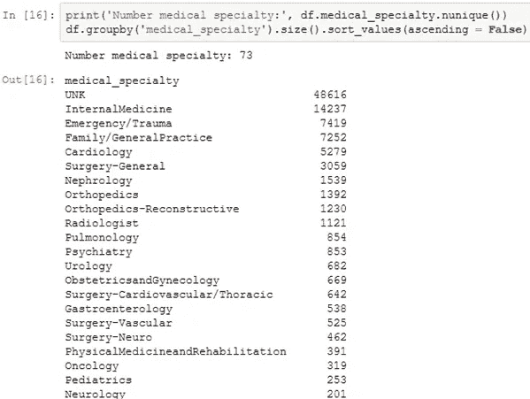

我们可以看到，其中大多数是未知的，而且数量下降得相当快。我们不想增加 73 个新变量，因为其中一些只有很少的样本。作为替代，我们可以创建一个只有 11 个选项的新变量(前 10 个专业，然后是另一个类别)。显然，还有其他的分桶选项，但这是减少可能类别数量的最简单的方法之一。

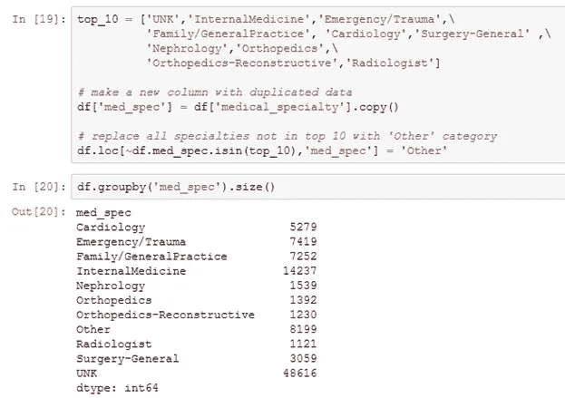

为了将我们的分类特征转换成数字，我们将使用一种称为一次性编码的技术。在一次性编码中，您为该列中的每个唯一值创建一个新列。如果样本具有唯一值，则该列的值为 1，否则为 0。例如，对于列 race，我们将创建新列(“race_Caucasian”、“race_AfricanAmerican”等)。如果患者的种族是高加索人，则患者在“种族 _ 高加索人”栏下得到 1，在其余种族栏下得到 0。要创建这些一次性编码列，我们可以使用 pandas 提供的`get_dummies`功能。

现在的问题是，如果我们为每个唯一值创建一列，我们就有了相关的列。换句话说，一列中的值可以通过查看其余列计算出来。例如，如果样本不是非洲裔美国人、亚洲人、加拿大人、西班牙人或其他人，那么它必须是 UNK 人。为了处理这个问题，我们可以使用`drop_first`选项，它将删除每一列的第一个分类值。

`get_dummies` 功能不适用于数字数据。为了欺骗`get_dummies`，我们可以将 3 个 ID 类型的数字数据转换成字符串，然后它将正常工作。

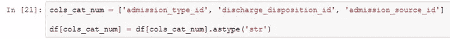

现在我们准备好制作我们所有的分类特征

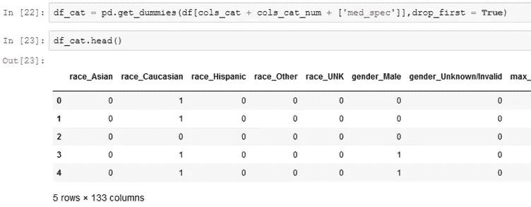

要将独热编码列添加到数据帧中，我们可以使用`concat` 函数。确保使用 axis = 1 来表示添加列。

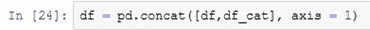

让我们保存分类数据的列名来跟踪它们。

## 额外功能

我们想要制作的最后两个专栏是`age`和`weight`。通常，您会认为这些是数字数据，但它们在该数据集中是分类的，如下所示。

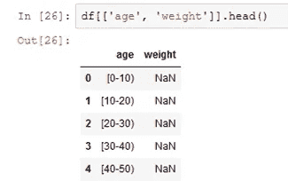

一种选择是创建如上所示的分类数据。由于这些值有一个自然的顺序，将它们转换成有序的数字数据可能更有意义。另一个例子，当你想这样做的时候，可能是 t 恤的尺寸(小号，中号，大号)。先说年龄。

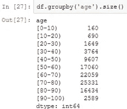

让我们将这些映射到 0 到 90 乘 10s 的数值数据。

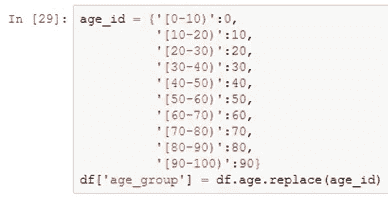

现在我们来看看重量。请注意，此功能不经常填写。

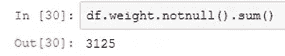

让我们创建一个变量来表示是否填写了权重，而不是像上面那样创建一个序数特征。不管值是多少，变量的存在都可能是预测性的。

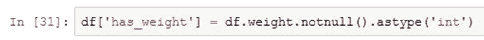

让我们也跟踪这些额外的列。

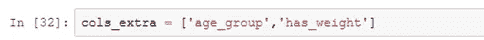

## 特征工程:概述

通过这个过程，我们为机器学习模型创建了 143 个特征。这些功能的细分如下

*   8 个数字特征
*   133 个分类特征
*   2 个额外功能

让我们创建一个只有特性和`OUTPUT_LABEL`的新数据帧。

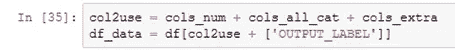

# 构建培训/验证/测试样本

到目前为止，我们已经研究了我们的数据，并根据分类数据创建了特征。现在是我们拆分数据的时候了。分割数据背后的想法是，这样你就可以衡量你的模型在看不见的数据上做得有多好。我们分成三个部分:
—训练样本:这些样本用于训练模型
—验证样本:这些样本来自训练数据，用于决定如何改进模型
—测试样本:这些样本来自所有决策，用于衡量模型

的综合性能。在这个项目中，我们将分成 70%的训练、15%的验证和 15%的测试。

我喜欢做的第一件事是使用`sample`打乱样本，以防出现某种顺序(例如，所有阳性样本都在顶部)。这里的`n`是样品的数量。`random_state`只是被指定，所以该项目是可复制的。在你自己的项目中，你不一定需要`random_state`。

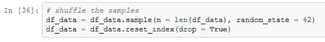

我们可以再次使用`sample`提取 30%的数据(使用`frac`)用于验证/测试分割。重要的是，验证和测试来自相似的发行版，这种技术是实现这一点的一种方式。

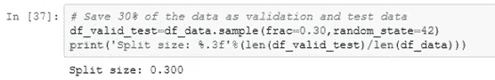

现在使用 50%的分数分为测试和验证。

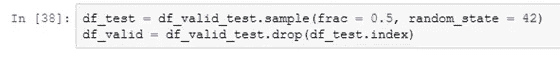

注意`.drop`只是删除了`df_test`中的行，以获取不属于样本的行。我们可以用同样的方法获得训练数据。

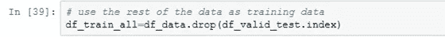

在这一点上，让我们检查一下 30 天内住院的组的百分比。这就是所谓的流行。理想情况下，这三组人群的患病率相似。

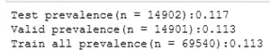

每个群体的患病率大致相同。

此时，您可能会说，将训练数据放入预测模型中，然后查看结果。然而，如果我们这样做，我们可能会得到一个 89%准确的模型。太好了！干得好！但是，等等，我们从来没有捕捉到任何重新接纳(回忆= 0%)。怎么会这样？

现在的情况是，我们有一个不平衡的数据集，其中负样本比正样本多得多，因此模型可能会将所有样本都指定为负样本。

通常情况下，最好以某种方式平衡数据，给积极的一面更多的权重。通常使用 3 种策略

*   对更占优势的类别进行二次抽样:使用底片的随机子集
*   对不平衡类进行过采样:多次使用相同的正样本
*   创建合成阳性数据

通常，如果只有少数几个阳性病例，您会希望使用后两种方法。因为我们有几千个阳性病例，所以让我们使用子样本方法。这里，我们将创建一个 50%正面和 50%负面的平衡训练数据集。也可以玩玩这个比例，看能不能得到一个提升。

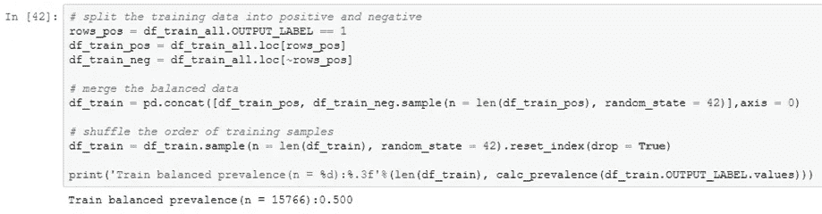

大多数机器学习包喜欢使用输入矩阵 X 和输出向量 y，所以让我们创建它们:

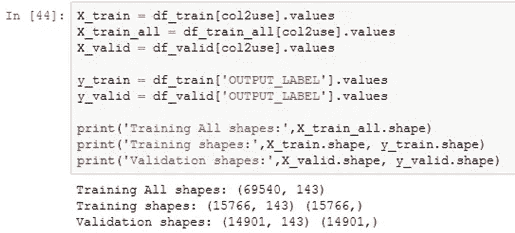

当变量大小不同时(0–100，vs 0–1000000)，一些机器学习模型会有问题。为了解决这个问题，我们可以扩展数据。在这里，我们将使用 scikit-learn 的标准定标器，该定标器去除了平均值并按单位方差进行定标。在这里，我将使用所有的训练数据创建一个缩放器，但如果你愿意，你也可以使用平衡的。

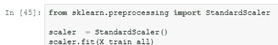

我们将需要这个 scaler 来处理测试数据，所以让我们使用一个名为`pickle`的包来保存它。

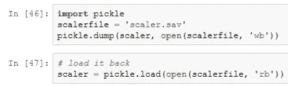

现在我们可以转换我们的数据矩阵

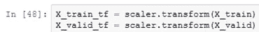

我们还不会转换测试矩阵，所以在完成模型选择之前，我们不会考虑性能。

# 型号选择

哇！为模特做准备有这么多工作。在数据科学中，这总是正确的。您花费 80–90%的时间清理和准备数据。

在本节中，我们将训练一些机器学习模型，并使用一些技术来优化它们。然后，我们将根据验证集的性能选择最佳模型。

我们将利用以下函数来评估模型的性能。关于这些性能指标的讨论，请参阅我以前的文章

*   [每个人的绩效指标](/data-science-performance-metrics-for-everyone-4d68f4859eef)
*   [了解 scikit 中的数据科学分类指标——学习 Python](/understanding-data-science-classification-metrics-in-scikit-learn-in-python-3bc336865019)

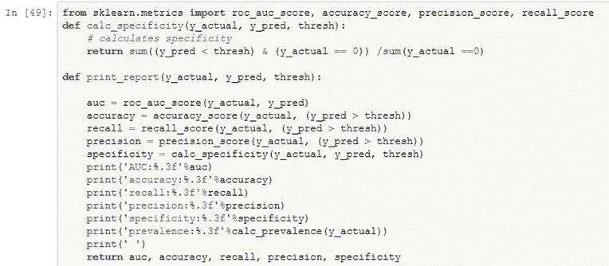

因为我们平衡了训练数据，所以让我们将阈值设置为 0.5，以将预测样本标记为阳性。

# 模型选择:基线模型

在本节中，我们将首先使用默认超参数比较以下 7 个机器学习模型的性能:

*   k-最近邻
*   逻辑回归
*   随机梯度下降
*   朴素贝叶斯
*   决策图表
*   随机森林
*   梯度推进分类器

## k 最近邻(KNN)

KNN 是最简单的机器学习模型之一。对于给定的样本点，该模型查看 K 个最接近的数据点，并通过计算阳性标签的数量除以 K 来确定概率。该模型易于实施和理解，但缺点是对 K 敏感，如果训练样本的数量很大，则需要很长时间来评估。我们可以使用 scikit-learn 中的以下代码来拟合 KNN。

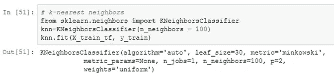

我们可以用下面的代码来评估性能

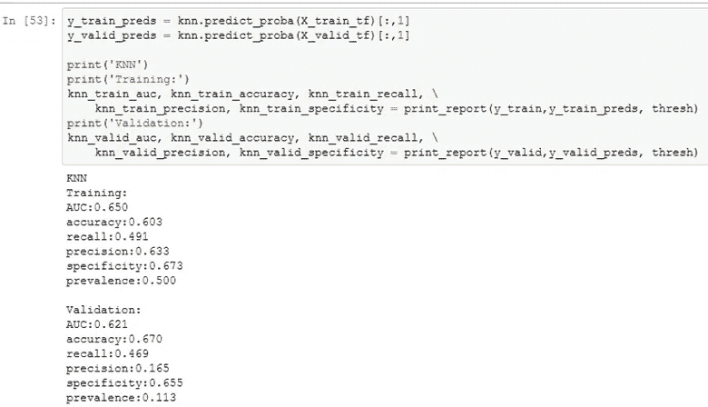

为简洁起见，我们将从剩余模型中排除评估，仅显示以下汇总结果。

## 逻辑回归

逻辑回归是一种传统的机器学习模型，适合正负样本之间的线性决策边界。这个线性函数然后通过一个 sigmoid 函数来计算正类的概率。当要素可以线性分离时，逻辑回归是一个很好的模型。逻辑回归的一个优势是模型是可解释的，即我们知道哪些特征对于预测积极或消极是重要的。需要考虑的一点是，建模对特征的缩放很敏感，所以这就是我们缩放上述特征的原因。我们可以使用 scikit-learn 中的以下代码来拟合逻辑回归。

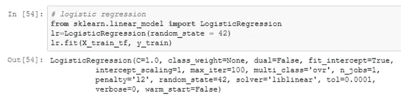

## 随机梯度下降

随机梯度下降类似于逻辑回归。这两种方法都使用梯度下降来优化线性函数的系数。在逻辑回归中，每次迭代都使用所有数据样本，而在随机梯度下降中，只使用一小批样本。这允许随机梯度下降来加速训练。我们可以使用 scikit-learn 中的以下代码来拟合随机梯度下降。

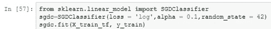

## 朴素贝叶斯

朴素贝叶斯是机器学习中偶尔使用的另一种模型。在朴素贝叶斯中，我们利用[贝叶斯规则](https://en.wikipedia.org/wiki/Bayes%27_theorem)来计算概率。这个模型的“幼稚”之处在于它假设所有的特性都是独立的(事实通常不是这样)。这对于自然语言处理模型来说效果很好，但是不管怎样，让我们在这里尝试一下。我们可以用下面的代码来拟合朴素贝叶斯。

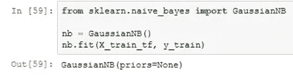

## 决策图表

另一类流行的机器学习模型是基于树的方法。最简单的基于树的方法被称为决策树。本质上，在树形方法中，你利用游戏 20 问题背后的方法论来继续划分你的样本。在每个问题中，您询问样本是否有大于某个阈值的特定变量，然后分割样本。最终预测则是树的最后一片叶子(最终分裂)中阳性样本的分数。这种方法背后的机器学习是要找出在每次分裂时使用哪个变量和哪个阈值。基于树的方法的一个优点是，它们没有关于数据结构的假设，并且如果给定足够的树深度，能够拾取非线性效应。我们可以使用下面的代码来拟合决策树。

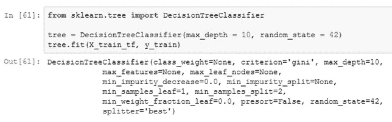

## 随机森林

决策树的一个缺点是，通过记忆训练数据，它们很容易过度拟合。因此，随机森林被创建来减少过度适应。在随机森林模型中，会创建多棵树，并对结果进行汇总。通过使用一组随机样本和每棵树中随机数量的特征，对森林中的树进行去相关。在大多数情况下，随机森林比决策树工作得更好，因为它们更容易归纳。为了适应随机森林，我们可以使用下面的代码。

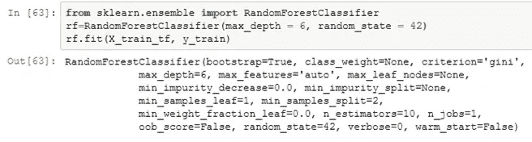

## 梯度推进分类器

另一种改进决策树的方法是使用一种叫做 boosting 的技术。在这种方法中，您创建了一组浅树，试图改善先前训练的树的错误。一种使用这种技术与梯度下降算法(以控制学习速率)相结合的模型被称为梯度提升分类器。为了拟合梯度提升分类器，我们可以使用下面的代码。

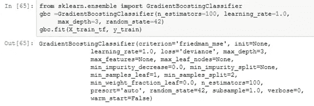

## 基线模型分析

让我们用所有基线模型的结果制作一个数据框架，并用一个名为`seaborn`的包来绘制结果。在这个项目中，我们将利用 ROC 曲线下面积(AUC)来评估最佳模型。对于挑选最佳模型来说，这是一个很好的数据科学性能指标，因为它捕捉了真阳性和假阳性之间的权衡，并且不需要选择阈值。

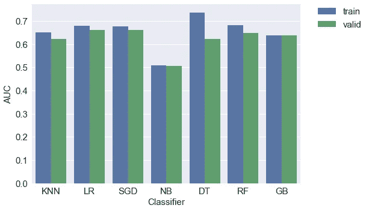

正如我们所看到的，大多数模型(除了朴素贝叶斯)在验证集上具有相似的性能。正如训练和验证之间的落差所指出的，存在一些过度拟合。让我们看看是否可以使用更多的技术来提高这种性能。

## 模型选择:学习曲线

我们可以通过绘制学习曲线来诊断模型的表现。在本节中，我们将利用来自 scikit-learn 的[网站](http://scikit-learn.org/stable/auto_examples/model_selection/plot_learning_curve.html)的学习曲线代码，对绘制 AUC 而不是精确度做了一点小小的改变。

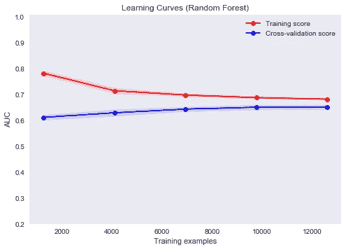

在随机森林的情况下，我们可以看到训练和验证分数相似，但它们的 AUC 分数都很低。这被称为高偏差，是不适应的标志。

根据学习曲线，我们可以采用一些策略来改进模型

高偏差:
-增加新特性
-增加模型复杂度
-减少正则化
-改变模型架构

高方差:
-添加更多样本
-添加正则化
-减少特征数量
-降低模型复杂度
-添加更好的特征
-改变模型架构

这些策略的灵感来自吴恩达的 [Coursera class](https://www.coursera.org/specializations/deep-learning?utm_source=gg&utm_medium=sem&campaignid=904733485&adgroupid=54215108588&device=c&keyword=andrew%20ng&matchtype=p&network=g&devicemodel=&adpostion=1t1&creativeid=231631799402&hide_mobile_promo&gclid=Cj0KCQjwk_TbBRDsARIsAALJSOZlkCoqhf68wjopusy6Kzw1qewNAEC-9H0K1LhwOwRZ2llTZtVINicaAiG-EALw_wcB) 转述[这里的](http://<https://www.learnopencv.com/bias-variance-tradeoff-in-machine-learning/>)和吴恩达的机器学习向往[教材](http://www.mlyearning.org/)。

## 模型选择:特征重要性

改进模型的一个途径是了解哪些特性对模型是重要的。这通常只能在更简单的模型中进行研究，如逻辑回归或随机森林。这种分析可以在几个方面有所帮助:

—激发新的特性想法→有助于高偏差和高方差
—获得用于减少特性的顶级特性列表→有助于高方差
—指出管道中的错误→有助于模型的健壮性

我们可以使用下面的逻辑回归来获得特征重要性

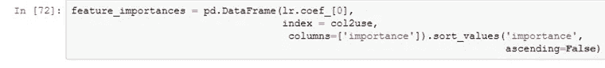

我们可以查看前 50 个正系数和前 50 个负系数来获得一些见解。

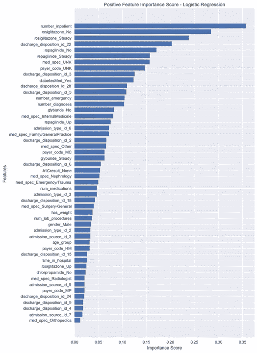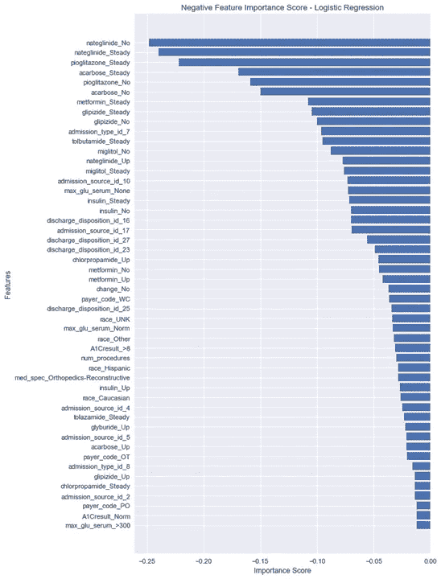

查看这些图后，您可能会受到启发，获得一些与最重要的功能相关的新数据。例如，在这两个模型中，最重要的特征是`number_inpatient`，它是去年住院病人的就诊次数。这意味着，如果患者在去年去过医院，他们更有可能再次住院。这可能会激发你获得(如果你有的话)更多关于他们之前录取的数据。另一个例子是`discharge_disposition_id_22`,用于患者出院到康复机构的情况。对你的公司来说，你可以研究出院到康复机构的规则，并添加与这些规则相关的功能。因为大多数数据分析师/数据科学家不具备深厚的领域知识。我可能会把其中的一些特征带给其他专家(如医生)，并询问他们关于药物的问题。

在高方差的情况下，一种策略是减少变量的数量以最小化过度拟合。在此分析之后，您可以使用前 N 个积极和消极特征或前 N 个重要的随机森林特征。您可能需要调整 N，以便您的性能不会急剧下降。例如，只使用顶级特性可能会大大降低性能。另一种可以用来减少变量数量的策略叫做 PCA(主成分分析)。scikit 中也实现了这一点——感兴趣的话可以学习一下。

我想提到的最后一点是，特性重要性图也可能指出您的预测模型中的错误。也许，你在清理过程中有一些数据泄露。数据泄露可以被认为是在训练中偶然包含了某种东西，从而允许机器学习算法进行人工作弊的过程。例如，我根据医生的出院记录建立了一个模型(见 TDS 文章[此处](/introduction-to-clinical-natural-language-processing-predicting-hospital-readmission-with-1736d52bc709))。当我对最重要的词进行同样的分析时，我发现预测某人不会被重新录取的第一个词是“过期”。这让我意识到自己犯了一个错误，忘记排除当前医院就诊中死亡的患者。从我的错误中吸取教训，我排除了与死亡/临终关怀相关的出院代码。合并数据集时也会发生类似的情况。也许当您合并数据集时，其中一个类的某些变量以 nan 结束。上面的分析将帮助你抓住其中的一些情况。

## 模型选择:超参数调整

我们应该研究的下一件事是超参数调整。超参数调整本质上是您在建立机器学习模型时做出的设计决策。例如，你的随机森林的最大深度是多少？这些超参数中的每一个都可以被优化以改进模型。

在本节中，我们将只优化随机梯度下降、随机森林和梯度增强分类器的超参数。我们不会优化 KNN，因为它需要一段时间来训练。我们不会优化逻辑回归，因为它的表现类似于随机梯度下降。我们不会优化决策树，因为它们往往会过度拟合，性能不如随机森林和梯度推进分类器。

超参数调整的一种技术称为网格搜索，在网格搜索中，您可以在一个值网格上测试所有可能的组合。这是非常计算密集型的。另一种选择是随机测试它们的排列。scikit-learn 中也实现了这种称为随机搜索的技术。这一部分的大部分内容是基于威廉·科尔森的博客文章。我强烈建议跟随他走向数据科学。他写高质量的文章。

让我们在一些随机森林超参数上创建一个网格。

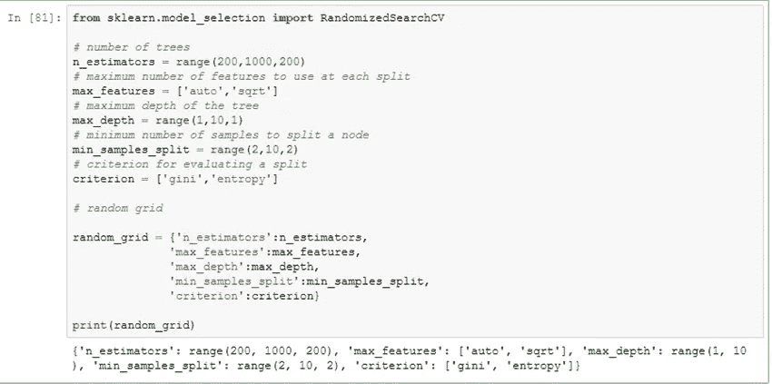

要使用 RandomizedSearchCV 函数，我们需要对一组超参数进行评分或评估。这里我们将使用 AUC。

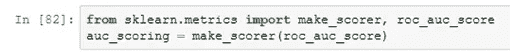

`RandomizedSearchCV`的三个重要参数是

*   得分=用于挑选最佳模型的评估指标
*   n_iter =不同组合的数量
*   cv =交叉验证分裂的数量

增加最后两项会增加运行时间，但会减少过度拟合的机会。请注意，变量的数量和网格大小也会影响运行时间。交叉验证是一种多次拆分数据以获得更好的性能指标评估的技术。为了这个项目的目的，我们将限制到 2 CV，以减少时间。

我们可以用下面的代码来适应我们的随机搜索随机森林。

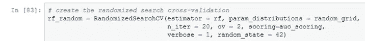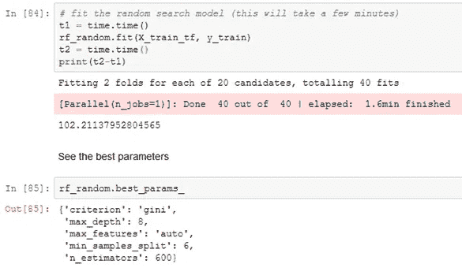

让我们分析一下最佳模型相对于基线模型的性能。

类似地，我们可以优化随机梯度下降和梯度提升分类器的性能。

我们可以汇总结果，并与验证集上的基线模型进行比较。

我们可以看到，超参数调整改进了模型，但不是很多。这很可能是因为我们有一个高偏差的情况。如果我们有高的方差，更多的改进将被期待。

## 模型选择:最佳分类器

这里，我们将选择梯度推进分类器，因为它在验证集上具有最佳 AUC。您不会希望每次运行新的预测时都训练您的最佳分类器。因此，我们需要保存分类器。我们将使用包`pickle`。

# 模型评估

现在我们已经选择了我们的最佳模型(优化的梯度推进分类器)。让我们评估一下测试集的性能。

最终评价如表所示

我们还可以为 3 个数据集创建 ROC 曲线，如下所示

# 结论

通过这个项目，我们创建了一个机器学习模型，能够预测 30 天内再次入院风险最高的糖尿病患者。最佳模型是具有优化超参数的梯度推进分类器。该模型能够捕捉到 58%的再入院率，比随机选择患者要好 1.5 倍。总的来说，我相信许多医疗保健数据科学家正在研究医院再入院的预测模型。如果你是这种情况，我很乐意与你联系(在 [Linkedin](https://www.linkedin.com/in/awlong/) )并分享经验。欢迎在下面的评论中留下任何反馈或问题。

# 参考

奥斯特林、威科夫、恰尔科夫斯基、派、崔、巴尔、吉安昌达尼(2017)。*临床糖尿病和内分泌学*中的“糖尿病和 30 天再入院率之间的关系”。3:1