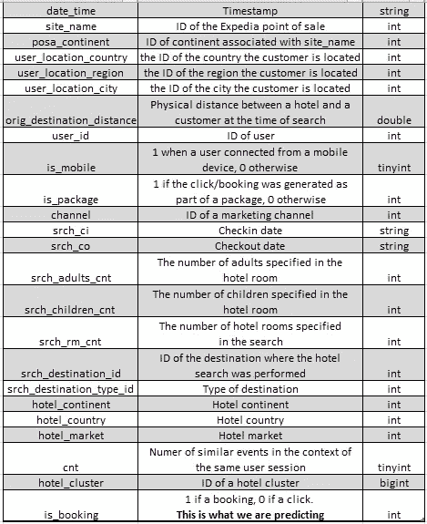
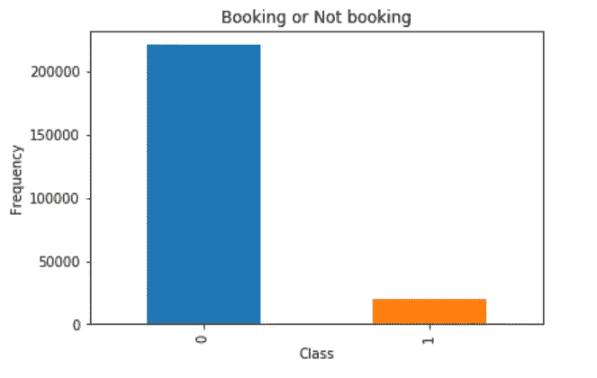
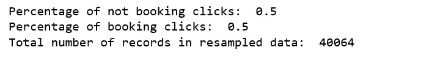
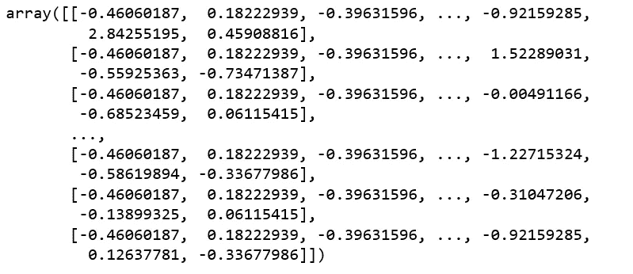
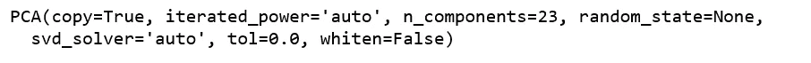
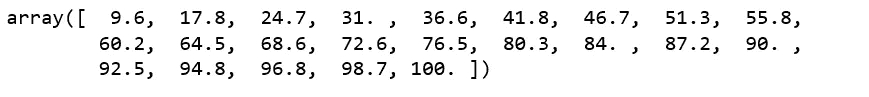
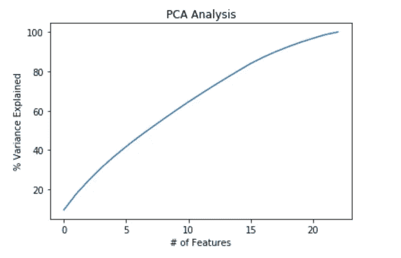
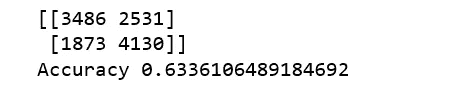
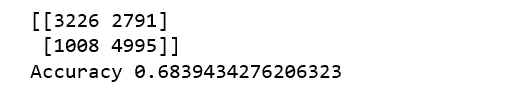

# 使用用户搜索参数预测酒店预订

> 原文：<https://towardsdatascience.com/predicting-hotel-bookings-with-user-search-parameters-8c570ab24805?source=collection_archive---------7----------------------->


Photo credit: Pixabay

一家酒店市场数据和基准公司 [STR](https://www.strglobal.com/) 和谷歌发布了一份[报告](https://str.com/str-google-research1)显示，跟踪酒店搜索结果可以对酒店预订量进行可靠的估计。因此，我们今天的目标是尝试建立一个机器学习模型，根据用户的搜索和与该用户事件相关的其他属性来预测用户事件的结果(预订或只是点击)。

# 数据

数据是公开的，可以从 [Kaggle](https://www.kaggle.com/c/expedia-hotel-recommendations/data) 下载。我们只使用训练集。下表提供了数据集的模式。



Figure 1

```
import datetime
import pandas as pd
import numpy as np
import matplotlib.pyplot as plt
import seaborn as sns
%matplotlib inlinefrom sklearn.ensemble import RandomForestClassifier
from sklearn.model_selection import train_test_split
from sklearn.preprocessing import StandardScaler
from sklearn.decomposition import PCA
from sklearn.metrics import classification_report
from sklearn.metrics import confusion_matrix  
from sklearn.metrics import accuracy_scoredf = pd.read_csv('train.csv.gz', sep=',').dropna()
df = df.sample(frac=0.01, random_state=99)
```

为了能够在本地处理，我们将使用 1%的数据。之后我们还有大量的 241179 条记录。

```
df.shape
```

***(241179，24)***

```
count_classes = pd.value_counts(df['is_booking'], sort = True).sort_index()
count_classes.plot(kind = 'bar')
plt.title("Booking or Not booking")
plt.xlabel("Class")
plt.ylabel("Frequency")
```



Figure 2

很明显我们的数据很不平衡。我们将不得不处理它。

# **特征工程**

该过程包括创建新列，如年、月、计划时间和酒店住宿。然后移除我们不再需要的柱子。

```
df["date_time"] = pd.to_datetime(df["date_time"]) 
df["year"] = df["date_time"].dt.year  
df["month"] = df["date_time"].dt.monthdf['srch_ci']=pd.to_datetime(df['srch_ci'],infer_datetime_format = True,errors='coerce')
df['srch_co']=pd.to_datetime(df['srch_co'],infer_datetime_format = True,errors='coerce')df['plan_time'] = ((df['srch_ci']-df['date_time'])/np.timedelta64(1,'D')).astype(float)
df['hotel_nights']=((df['srch_co']-df['srch_ci'])/np.timedelta64(1,'D')).astype(float)cols_to_drop = ['date_time', 'srch_ci', 'srch_co', 'user_id']
df.drop(cols_to_drop, axis=1, inplace=True)
```

使用热图绘制关联矩阵，以探索特征之间的关联。

```
correlation = df.corr()
plt.figure(figsize=(18, 18))
sns.heatmap(correlation, vmax=1, square=True,annot=True,cmap='viridis')plt.title('Correlation between different fearures')
```


Figure 3

我们看不到任何两个变量有非常密切的关联。

# **不平衡数据的处理**

我将使用欠采样方法来创建重采样数据帧。

```
booking_indices = df[df.is_booking == 1].index
random_indices = np.random.choice(booking_indices, len(df.loc[df.is_booking == 1]), replace=False)
booking_sample = df.loc[random_indices]not_booking = df[df.is_booking == 0].index
random_indices = np.random.choice(not_booking, sum(df['is_booking']), replace=False)
not_booking_sample = df.loc[random_indices]df_new = pd.concat([not_booking_sample, booking_sample], axis=0)print("Percentage of not booking clicks: ", len(df_new[df_new.is_booking == 0])/len(df_new))
print("Percentage of booking clicks: ", len(df_new[df_new.is_booking == 1])/len(df_new))
print("Total number of records in resampled data: ", len(df_new))
```



Figure 4

**混洗重新采样的数据帧**。

```
df_new = df_new.sample(frac=1).reset_index(drop=True)
```

**为新数据帧分配特征和标签**。

```
X = df_new.loc[:, df_new.columns != 'is_booking']
y = df_new.loc[:, df_new.columns == 'is_booking']
```

# **PCA**

主成分分析(PCA)是一种统计技术，通过选择捕捉关于数据集的最大信息的最重要特征，将高维数据转换为低维数据。我们希望主成分分析能帮助我们找出方差最大的成分。

**标准化数据集**。

```
scaler = StandardScaler()
X=scaler.fit_transform(X)
X
```



Figure 5

**应用五氯苯甲醚。我们的数据中有 23 个特征**。

```
pca = PCA(n_components=23)
pca.fit(X)
```



Figure 6

**计算特征值**。

```
var=np.cumsum(np.round(pca.explained_variance_ratio_, decimals=3)*100)
var
```



Figure 7

在上面的数组中，我们看到第一个特征解释了数据集内 9.6%的方差，而前两个特征解释了 17.8%，依此类推。如果我们使用所有的特征，我们就可以获得数据集中 100%的方差，因此我们可以通过实现一个额外的特征来获得一些方差。没有任何突出的特征。

**分类选择**。

```
plt.ylabel('% Variance Explained')
plt.xlabel('# of Features')
plt.title('PCA Analysis')
plt.style.context('seaborn-whitegrid')plt.plot(var)
```



Figure 8

根据上面的图，很明显我们应该保留所有的 23 个特征。

# **训练、预测和绩效评估**

**随机森林分类器**

```
X_train, X_test, y_train, y_test = train_test_split(X, y, test_size=0.3, random_state=1)pca = PCA()  
X_train = pca.fit_transform(X_train)  
X_test = pca.transform(X_test)classifier = RandomForestClassifier(max_depth=2, random_state=0)  
classifier.fit(X_train, y_train)y_pred = classifier.predict(X_test)cm = confusion_matrix(y_test, y_pred)  
print(cm)  
print('Accuracy', accuracy_score(y_test, y_pred))
```



Figure 9

**逻辑回归**

```
from sklearn.linear_model import LogisticRegression
from sklearn.pipeline import PipelineX_train, X_test, y_train, y_test = train_test_split(X, y, test_size=0.3, random_state=1)
pca = PCA(n_components=23)
logReg = LogisticRegression()pipe = Pipeline([('pca', pca), ('logistic', logReg)])
pipe.fit(X_train, y_train)
y_pred = pipe.predict(X_test)cm = confusion_matrix(y_test, y_pred)  
print(cm)  
print('Accuracy', accuracy_score(y_test, y_pred))
```



Figure 10

我们可以通过[彻底的网格搜索](http://scikit-learn.org/stable/modules/grid_search.html)将结果提高到 70%。但是在本地运行需要很长时间。我不会在这里尝试。

正如你所看到的，从我们现有的数据来预测酒店预订并不是一件容易的事情。我们需要更多的功能，如平均每日房价，用户以前的预订历史，是否有特别促销，酒店在线评论等等。

机器学习前的数据收集入门！

源代码可以在 [Github](https://github.com/susanli2016/Machine-Learning-with-Python/blob/master/Predict%20hotel%20booking.ipynb) 上找到。享受这周剩下的时光吧！