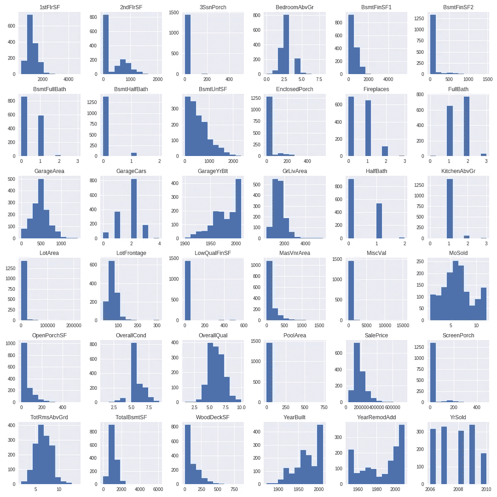
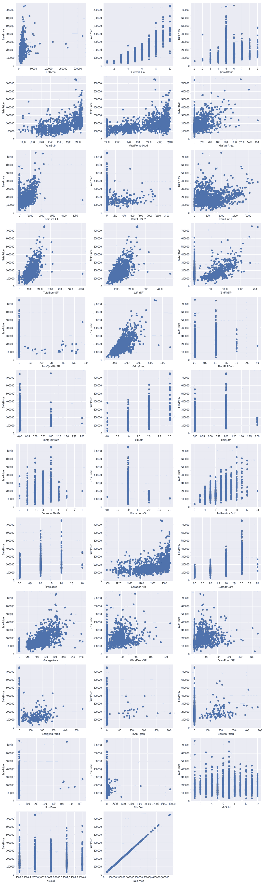
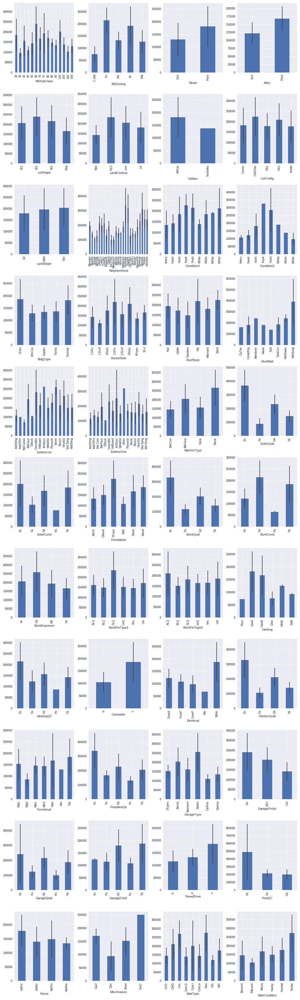
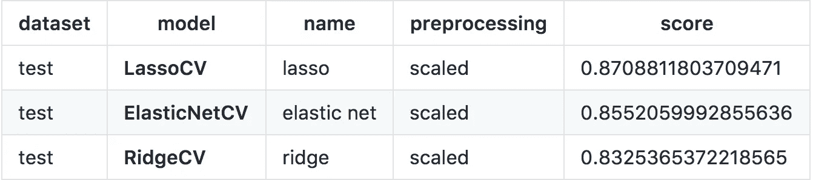

# 使用高级回归技术预测房价

> 原文：<https://towardsdatascience.com/predicting-housing-prices-using-advanced-regression-techniques-8dba539f9abe?source=collection_archive---------1----------------------->

*我最近在 General Assembly 完成了数据科学沉浸式计划，这是一个为期 12 周的培训计划，旨在深入了解数据科学世界，重点提高从大型数据集分析、预测和传达数据驱动的事实的技能。在接下来的几周里，我将分享我在课程中参与的项目，借此机会回顾我的工作，并与那些希望进入该领域的人分享我的经验。*

# 任务

这个项目的目标是使用 EDA、可视化、数据清理、预处理和线性模型来预测给定房屋特征的房屋价格，并解释您的线性模型以找出哪些特征为房屋增值。[数据](https://www.kaggle.com/c/house-prices-advanced-regression-techniques)最初取自 Kaggle。

来自 Kaggle:

> 让购房者描述他们梦想中的房子，他们可能不会从地下室天花板的高度或靠近东西向铁路开始。但是这个游乐场竞赛的数据集证明，影响价格谈判的远不止卧室的数量或白色尖桩栅栏。
> 
> 有 79 个解释变量描述了(几乎)爱荷华州埃姆斯住宅的各个方面，这场比赛要求你预测每栋房屋的最终价格。

# 背景

[Ames Housing 数据集](https://ww2.amstat.org/publications/jse/v19n3/decock.pdf)由 Dean De Cock 编制，用于数据科学教育。对于寻找经常被引用的波士顿住房数据集的现代化和扩展版本的数据科学家来说，这是一个令人难以置信的替代方案。

# 探索性数据分析

与任何数据练习一样，我们从一些探索性的数据分析开始。

**数字变量**

有 36 个相关的数字特征。`MSSubClass`“确定销售中涉及的住宅类型”，编码为数字，但实际上是一个分类变量。

共有 36 个数字特征，属于以下类型:

*   平方英尺:表示某些特征的平方英尺，即`1stFlrSF`(首层平方英尺)和`GarageArea`(以平方英尺为单位的车库大小)。
*   时间:与时间相关的变量，如房屋何时建造或出售。
*   房间和元素:表示元素的数据，如“有多少个浴室？”
*   条件和质量:主观变量从 1 到 10。

大多数与公寓实际物理空间相关的变量都是正偏的——这是有道理的，因为除了非常富有的人，人们往往住在更小的房子/公寓里。

销售价格也有类似的正偏态分布——我假设与公寓实际尺寸相关的变量对销售价格有很大的影响。

Histograms of all relevant numeric variables.

许多功能与销售价格没有很大关系，例如“销售年份”。然而，一些变量，如整体质量和地段面积与销售价格高度相关。

Scatter plots of numerical variables vs. sale price

**分类变量**

与数字特征类似，还有一系列分类特征。虽然许多看起来销售价格随类别而变化，但也有许多并非如此。让我们确定几个影响价值的特征。一些因素包括是否有中央空调、邻居、外部质量和分区。

在不同的类别中，也有价格相差不大的特点，包括屋顶风格和土地坡度。

Bar charts of all categorical variables vs. sale price

# 过程

对数据有了更好的理解后，我们现在能够浏览并对数据进行一些分析。

# 预处理

为了在数据上运行我们的模型，我必须转换许多变量。采取了以下预处理步骤:

*   去除异常值:采用 1.5 * IQR 去除异常值的经典 Tukey 方法去除了太多的数据。因此，我删除了 3 * IQR 之外的值。
*   填充 NaN 值:许多变量都有需要处理的 NaN 值。这些值是根据最有意义的内容填充的。例如，`Alley`的 NaN 值用一个字符串填充(“No Alley”)，而`GarageYrBuilt`的 NaN 值用中间值填充，以防止数据失真。
*   为分类变量创建虚拟变量。
*   将数据分为训练集和测试集
*   缩放数据

# 模型

是时候建立一些模型了！我们首先使用线性回归模型对缩放数据和非缩放数据创建了一些基准。然后，我们使用三个正则化线性回归模型准备了一系列拟合。我们适合的模型有:

*   原始数据的简单岭回归
*   针对原始数据的简单套索回归
*   原始数据的简单弹性网络回归
*   针对定标数据的简单岭回归
*   针对缩放数据的简单套索回归
*   针对缩放数据的简单弹性网络回归

然后，我们为每个正则化的线性模型导入交叉验证模型。

# 结果和结论

我们表现最佳的车型是:

Top performing models. Score is the R2 score of each test.

# 结论

用粘土瓦给房子盖屋顶去除了大部分价值。有趣的是，靠近公园或其他户外设施也会降低房子的价值。另一方面，也有一些社区增加了价值。这种情况下最有价值的特征是`GrLivArea`。

正则化模型在该数据集上表现良好。关于偏差/方差权衡的说明:根据高斯-马尔可夫定理，普通最小二乘法(OLS)拟合的模型是所有可能估计量中偏差最小的估计量。换句话说，它比所有可能的模型都更符合它所看到的数据。

然而，对于它没有见过的数据，它不一定表现得很好。正则化模型通过限制贝塔的大小来惩罚模型的复杂性。其结果是，该模型比 OLS 模型引入了更多的偏差，但在统计上变得更加稳定和不变。换句话说，它防止我们过度拟合，并且能够更好地推广到新数据。