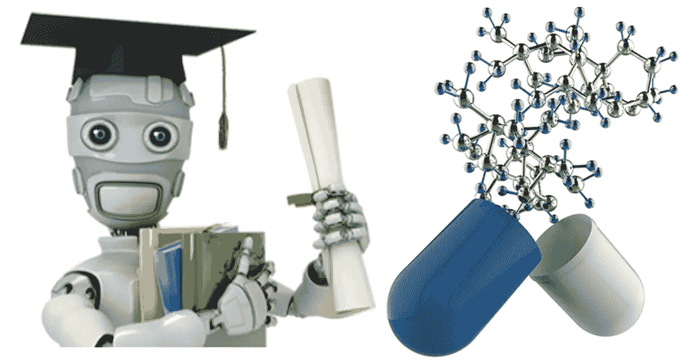
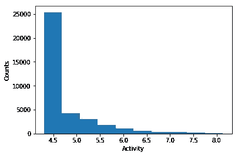
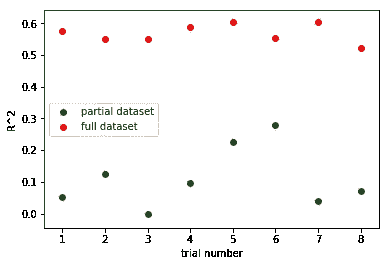
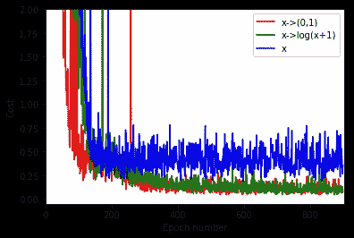
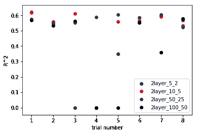
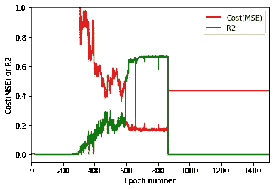

# 在 TensorFlow 中使用深度学习预测分子活性

> 原文：<https://towardsdatascience.com/predicting-molecular-activity-using-deep-learning-in-tensorflow-f55b6f8457f9?source=collection_archive---------1----------------------->

我在 STEM 领域有丰富的背景，在过去几年里，我看到了使用机器学习来解决具有挑战性的科学问题的热潮。但是，无论是 STEM 领域还是机器学习领域，都比较难有精深的知识。例如，如果你是一名材料科学家或生物化学家，你可能会花大部分时间思考如何设计实验和如何收集数据。你听到现在每个人都在谈论机器学习，觉得它真的很酷。但是，你并不知道以你的理科背景，如何潜入这个新兴的领域。这篇文章来了。它将提供一个全面的演示，通过 TensorFlow 库使用深度学习来解决[默克分子活性 Kaggle 挑战](https://www.kaggle.com/c/MerckActivity)。

**1。** **问题描述**

预测新化合物的活性是制药公司在开发新药时遇到的真正挑战。在药物发现过程中，标准的做法是扫描一个大的化合物库，以测试它们对预期靶分子和外周非靶分子的生物活性。希望化合物具有高度特异性，以便具有高效能并使副作用最小化，也就是说，它应该对靶分子具有高活性，而对非靶分子表现出低活性或无活性。这个过程可能非常耗时且昂贵。因此，希望定量预测化合物与靶分子和非靶分子之间的这种生物活性。这种预测可以帮助确定实验的优先次序，减少需要进行的实验工作。事实上，这种预测被称为定量结构-活性关系(QSAR) ，在制药行业中非常常用。

QSAR 方法具有以下特点:

1)制药环境中的数据集通常包含大量化合物。例如，在这次默克数据挑战中，每个目标都针对 20，000 多种化合物进行了测试。

2)每种化合物通常由一系列特征或指纹描述符来表示。这些指纹通常描述分子的内容、化学和分子拓扑，并由特征向量编码。例如，内容和化学可以包括碳和氮原子的数量、氢键供体和受体、电荷、极性和非极性原子以及官能团(酮、羧酸等)的描述符。拓扑包括特定半径内哪些原子与哪些其他原子键合(即分子图的子图)。Kaggle 上描述的 Merck challenge 没有给出所使用的特定指纹，只有作为原始数据的特征向量。

3)每组化合物可能涉及总数数千个指纹描述符。因此，描述每个化合物的向量是稀疏的，只有一小部分是非零的。

4)这些描述符并不都是独立的。根据化合物的结构，不同的描述符之间可能存在很强的相关性。

**2。** **客观&数据**

本次默克数据挑战的目标是，根据化合物化学结构产生的数字描述符，确定预测化合物针对特定分子的生物活性的最佳统计技术。

默克公司提供的数据基于 15 种目标分子和每个目标的 10，000 多种化合物。对于每个目标分子，每一行数据对应于一种化合物，并包含从该化合物的化学结构衍生的描述符。目标分子和每种化合物之间的活性在训练数据中提供，并且是测试数据中预测的目标。

**3。** **评估指标**

将使用 15 个数据集的平均相关系数 R^2 来评估活动预测。对于每个数据集，

其中 *x* 为已知活性， *x* 为已知活性的平均值， *y* 为预测活性， *y* 为预测活性的平均值， *Ns* 为数据集 s 中的分子数。

**4。** **方法和解决方案**

鉴于目标变量 activity 是连续的，每个数据集包含数万个条目，这是一个回归问题，我将使用 Python 中的 TensorFlow 库构建一个神经网络(NN)来进行预测。在这项工作中，成本函数被定义为均方误差或 MSE。

以下是本工作中所考虑因素的总结:

**4.1 每个目标分子或所有目标分子的一个模型**

理论上，合并所有 15 个分子的数据并训练通用模型将是理想的，因为将使用大得多的训练数据，并且模型可能表现得更好。然而，在这个特殊的问题中，这 15 个目标分子在结构和活性上可能彼此非常不同。因此，一个靶分子的数据如何对另一个分子的训练模型有用，这不是直接直观的。考虑到计算能力的限制，每个目标分子的一个模型可能是优选的。或者，我们可以训练一个好的模型，并将其应用于所有 15 个数据集。 ***作为展示，在这项工作中，只训练和优化第一个目标分子的模型。***

**4.2 数据预处理**

**4.2.1 目标**

训练数据具有 37k 个条目，其中超过 20k 个具有相同的活动值 4.30，其余的在 4.30 和 8.5 之间(图 1)。

**Figure 1\. Histogram of activity values in the training data for molecule 1.**

这是因为在数据收集过程中设置了一个阈值。例如，由于实验限制，任何低于 4.30 的数据都不会被收集或映射到 4.30。因此，大部分目标数据被截断，并且 NN 可能存在预测输出为单个值的问题。尝试以下预处理步骤:

1)没有预处理

2)删除目标值为 4.30 的所有条目

3)随机移除所有条目的 90%，目标值为 4.30

其中，1)似乎给出了最高和最一致的 R^2 值，可能与将最大量的输入数据输入到神经网络有关(图 2)。因此，不对目标 y 进行预处理。然而，优化器显然在数据集上遇到了困难，我将在 4.3.5 节中谈到这一点。

**Figure 2\. R^2 value for 8 runs of the same neural network with the full training dataset or partial dataset with all entries with a target value of 4.30 removed.**

**4.2.2 特征数量**

每个条目有 9491 个特征，并且大多数特征向量有大量的零。尝试以下预处理步骤，以便移除琐碎信息并加速模型的训练过程:

1)没有预处理

2)过滤掉方差低于阈值的特征。例如，5e-4 的阈值将移除 3.31%的特征。

3)使用主维度减少(PCA)来减少维度(例如，减少到 6000 而不是 9491 个特征)

结果是 1)和 2)给出了可比较的 R^2，而 3)给出了较低的 R^2 值。因此，在以下结果中，不会对特征进行预处理。

**4.2.3 描述符**

所有描述符都是非负整数。描述符转换的选项有:

1)无转换

2)对数变换，即 y = log(x + 1)

3)二元变换，即如果 x > 0，y = 1，否则 y = 0。

图 3 示出了对于上述三个不同的处理步骤，成本函数如何随着时期数而变化。很明显，描述符 x 的二进制或对数变换将把成本函数降低到 0.2 以下，并且随着历元数的增加振荡更少。值得一提的是，高于 0.2 的成本函数通常意味着 R^2 接近于 0。

**Figure 3\. Change of cost function with increasing epoch number for three different x preprocessing.**

使用描述符 x 的对数和二进制变换来获得可比较的 R^2 值(大约 0.6)。因此，描述符 x 的对数变换用于训练过程的剩余部分。

**4.3** **神经网络的参数**

**4.3.1** **神经网络的架构**

每个神经网络至少有三层:输入、隐藏和输出。对于输入，只有一个输入层，其神经元数量由训练集的形状唯一确定。对于这个问题中的回归，神经网络只有一个输出层，并且只有一个节点和一次函数作为它的激活函数。

确定隐藏层的数量至关重要。虽然一个隐藏层对于大多数问题是好的，但是具有一个隐藏层的 NN 给出大约为 0 的 R^2 值或无意义的值 NAN，因为所有预测的目标值完全相同。在不优化超参数的情况下，将隐藏层的数量增加到两个可以得到大约 0.56 的 R^2。因此，优选具有两个隐藏层的 NN。

至于每个隐藏层中神经元的数量，最常见的经验法则是“隐藏层的最佳大小通常介于输入层的大小和输出层的大小之间”。图 4 在多次训练试验中比较了在隐藏层中具有不同节点数的 4 个不同 NN 的 R^2 值。在第一和第二隐层中分别具有 5 和 2 个节点的神经网络与其他三个具有更多节点的神经网络具有相似的最大 R^2 值(~ 0.6)，但是它有三次试验具有低得多的 R^2，这表明具有少量节点的神经网络的不稳定性。在第一和第二隐藏层中具有 50 和 25 个节点的 NN 在 8 次试验中显示出最一致的结果，平均 R^2 为 0.568，标准偏差为 0.027。第一和第二隐层节点数分别为 100 和 50 的最大 NN 在 8 次试验中也表现出不一致性，1 次无意义 R^2 和 1 次 R^2 接近 0。这可能是因为 300 个历元不足以让较大的 NN 持续达到其全局最小值。事实上，神经网络越大，它需要运行的时期就越多，以获得持续的像样的 R^2.理想情况下，我们希望在计算能力允许的情况下运行一个神经网络，直到我们看到优化器收敛到一个解。

**Figure 4\. R^2 value in different trials for NN with 2 hidden layers and different node numbers ((5, 2), (10, 5), (50, 25), (100, 50) for the first and second hidden layer respectively.) 300 epochs are run for each NN.**

**4.3.2** **激活功能**

激活函数的实际作用是使神经网络能够模拟复杂的非线性函数。如果没有非线性激活函数，神经网络将等同于线性函数。在这个特殊的问题中，ReLu 和 Sigmoid 被尝试作为激活函数。ReLu 比 Sigmoid 性能更好，用于所有隐藏层。当使用 Sigmoid 激活函数时，成本函数确实不收敛。这可能是因为 Sigmoid 激活函数将所有输出限制在 0 和 1 之间，从而抑制了 NN 对该特定问题的训练能力。

线性激活用于输出层，这是为回归问题训练 NN 的常见做法。

4.3.3 学习率

神经网络的输出对梯度下降的初始学习速率非常敏感。我以 0.05 的学习率开始，并注意到成本函数要么发散，要么迅速超过最大浮点数，给出 NaN。降低学习率会降低成本函数，然而，成本函数容易陷入局部最小值(例如，24.085、22.220、14.683)。只有当学习率下降到 0.001 时，我才开始看到超过 0.1 的成本和 R^2 值的一致输出。因此，学习率保持在 0.001。

**4.3.4 权重和偏差**

考虑到成本函数很容易陷入局部最小值，从优化的权重和偏差开始也很重要。我们优化的权重和偏差是来自截断正态分布的随机值，平均值为 0，标准差为 1。[-2，2]之外的值将被删除并重新选取—这一步对于获得一致的结果非常重要。

**4.3.5 优化器**

Adam 优化器被证明是最好的优化器。最初使用的是随机梯度下降，但是大多数时候成本函数会陷入局部最小值(例如 0.45)。降低学习率和增加动力并没有多大帮助。在将优化器切换到 Adam(自适应矩估计)优化器之后，成本函数开始下降到小于 1，并且收敛。Adam optimizer 为每个参数计算自适应学习率，并保持过去梯度的指数衰减平均值。它通常是输入数据为稀疏矩阵的神经网络的首选优化器。

然而，代价函数(MSE)仍然会陷入局部最小值。例如，图 5 示出了成本函数和 R^2 值随着具有两个隐藏层(分别具有 1000 和 500 个节点)的神经网络的时期数的增加而变化。在时期 865，成本从低于 0.2 到高于 0.4 进行了一个小跳跃，进入一个尖锐的局部极小值，并且再也没有恢复。R^2 后来真的很糟糕，而在公元 865 年之前它要好得多。成本函数前景可能包含许多非常尖锐的局部最小值，因为我们经常看到训练试验在 R^2 差的情况下被困在 0.4-0.5 MSE 左右(参见图 4 中的一些示例)。这种跳跃现象在所有模拟中都是随机发生的，很难控制。因此，对于每个优化的模型，我通常会运行多次，以获得一致的结果。

**Figure 5\. Change of cost function and R^2 value with epoch number. The NN has 2 hidden layers with 1000 and 500 nodes respectively. All other parameters of the NN is optimized as shown in this report.**

**4.3.6 辍学**

在神经网络中，放弃是防止过度拟合的常用策略。优化结果是在隐藏层中随机丢弃 25%的神经节点而在输出层中没有丢弃的情况下实现的。

## **5。** **总结**

总之，给出最高 R^2 值的优化神经网络具有以下特征:

*   所有训练数据和所有描述符都是在没有任何过滤过程的情况下使用的。
*   描述符 x 的对数变换和目标 y 的无预处理。
*   神经网络有两个隐藏层。第一和第二隐藏层分别具有 50 和 25 个神经元。
*   ReLu 用作所有隐藏层的激活功能。线性激活函数用于输出层。
*   学习率保持在 0.001。
*   权重和偏差是截断正态分布的随机值，平均值为 0，标准差为 1。[-2，2]之外的值将被删除并重新选取。
*   使用了 Adam 优化器。
*   所有隐藏层使用 25%的丢失率，输出层不使用丢失率。
*   批量大小为 300，纪元编号为 900。

测试数据(从训练数据中分离出 20%)的最高 R^2 值是 0.568 +/- 0.027。Kaggle 领导委员会显示，所有 15 个分子的最高平均 R^2 分数为 0.494。与那个结果相比，从神经网络得到的 R^2 值是适当的和令人满意的。

请查看这个 [GitHub](https://github.com/CathyQian/Predicting-Merck-Molecular-Activity) 库，获取所有代码和补充信息。如果您有任何问题，请随时留言或联系我。