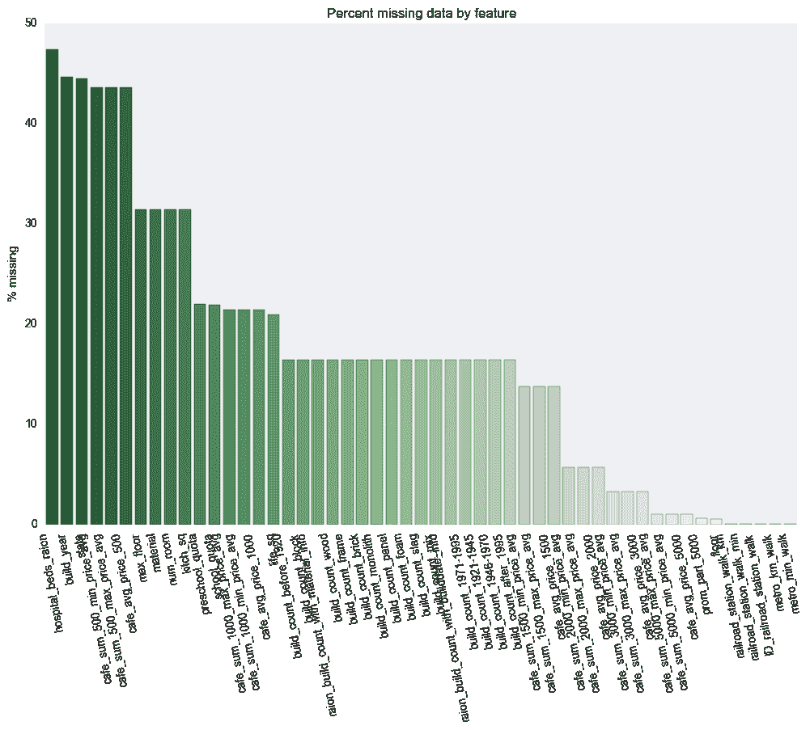
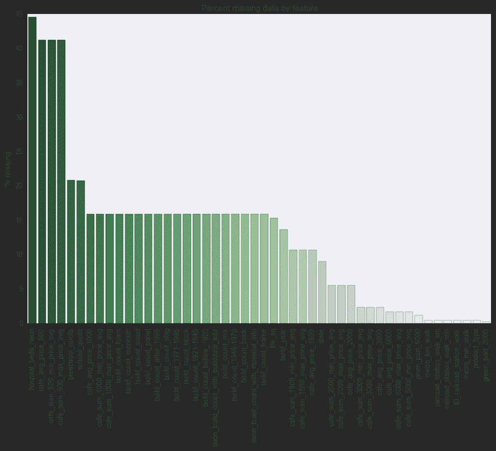
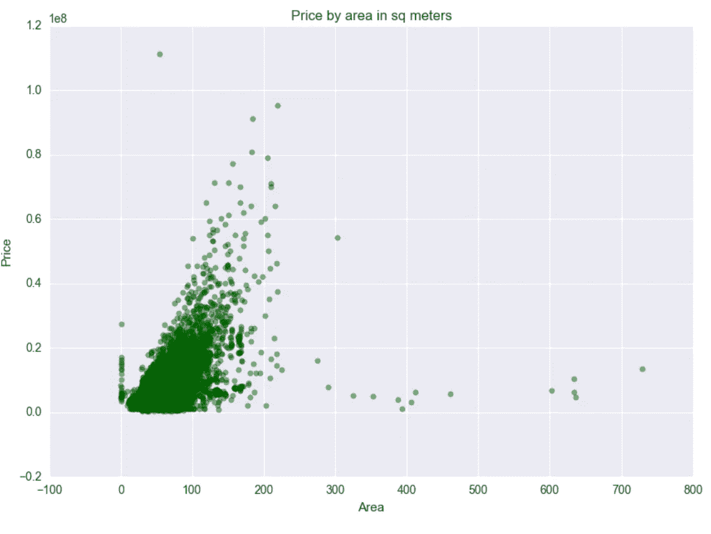
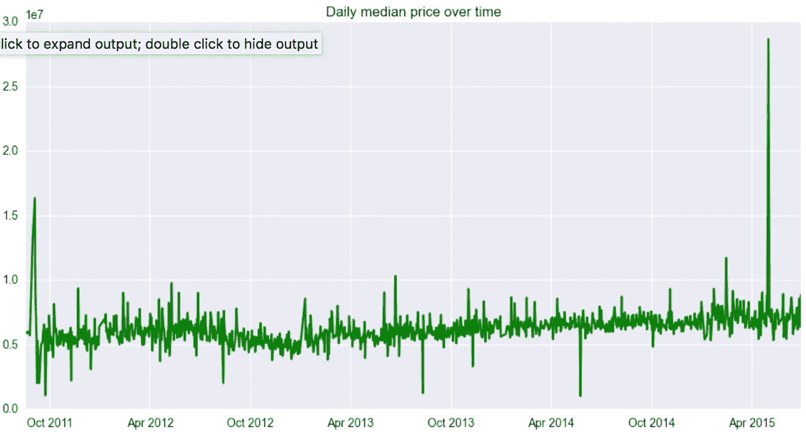
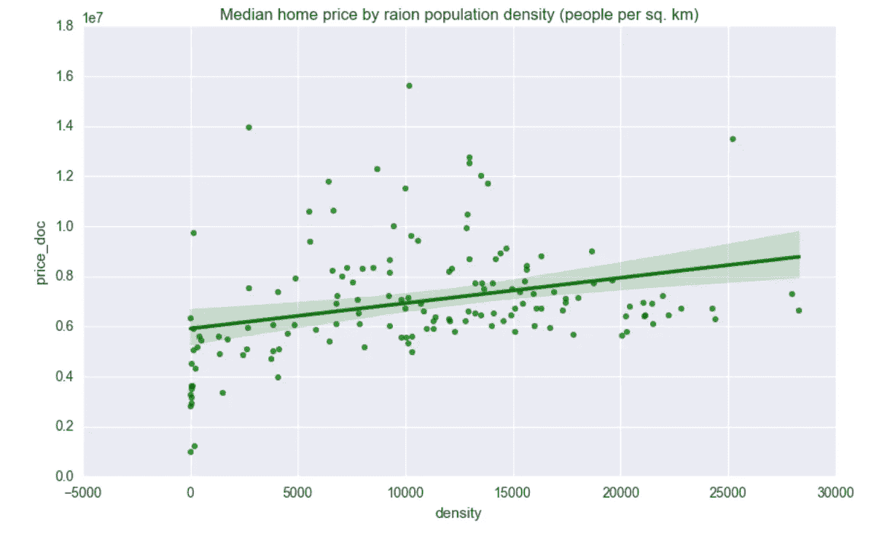
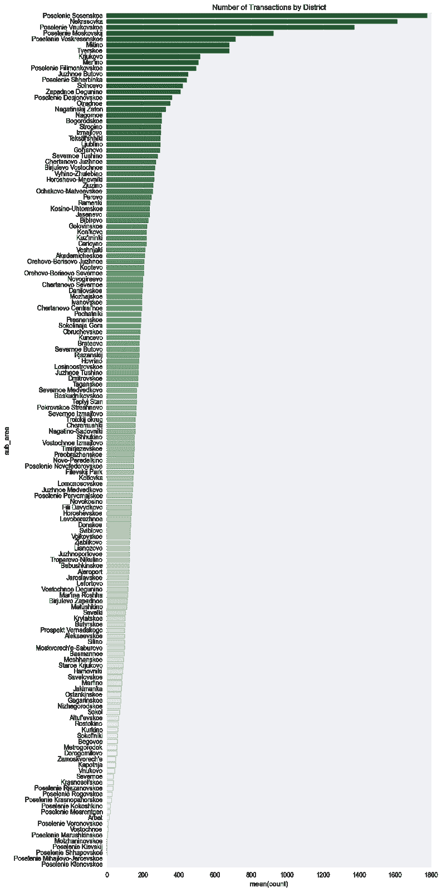
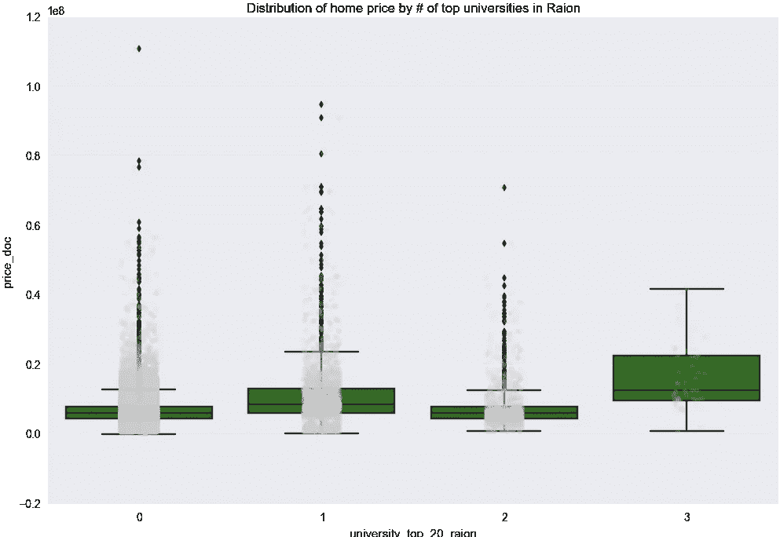
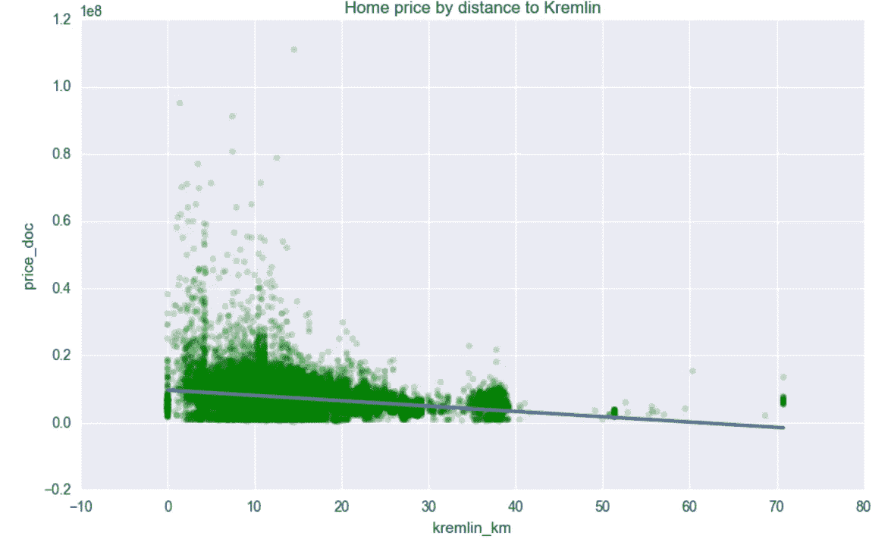
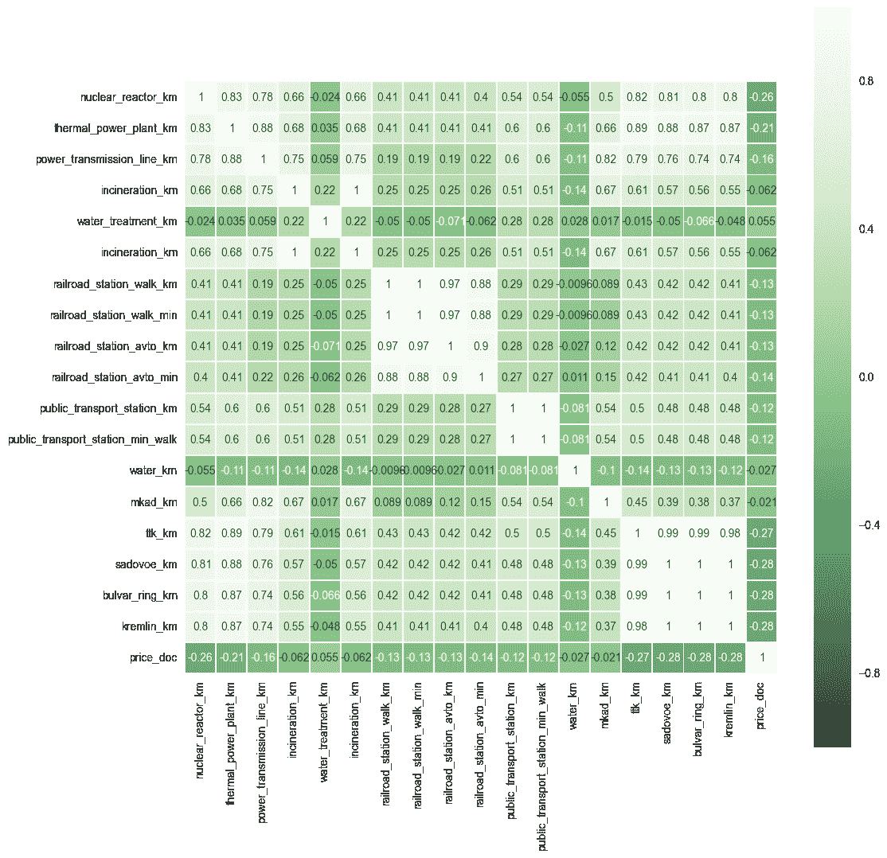
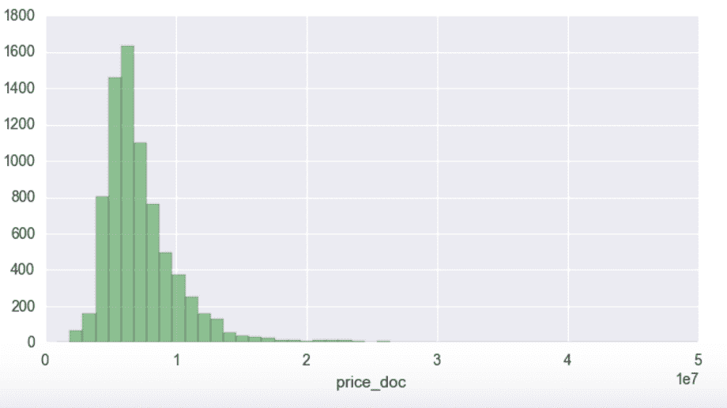

# 预测莫斯科房价

> 原文：<https://towardsdatascience.com/predicting-moscow-home-prices-5b1e82438214?source=collection_archive---------2----------------------->

俄罗斯最大的银行俄罗斯储蓄银行(Sberbank)强调，需要准确预测房价，以便投资者、购房者和开发商在签署租约或进行投资时能够更加放心。在 2014 年欧盟、美国、加拿大和澳大利亚实施制裁后，他们对预测分析的呼吁尤其合理。此后，俄罗斯卢布大幅下跌，金融危机仍在持续。这给严格根据家庭特征进行预测带来了挑战，因此 Sberbank 纳入了大量宏观经济数据。现在，让我们深入研究数据。

作为我的 EDA 的一部分，在每个都有 293 个变量的训练和测试数据集中，几个问题立即变得明显。就缺失数据而言，我可以生成一个条形图，其中包括每个特性缺失数据的百分比。51 个要素缺少值。百分比最高的是每区医院床位、建造年份、最大楼层和材料。

在深入了解 EDA 之前，我还应该注意，训练数据得出的平均房价是₽ 7，123，035.00，标准差是₽ 4，708，111。

我确实遇到了一些数据质量问题。有一年被列为 2005 年至 2009 年，所以我把它改为 2007 年的中间值。我以为 4965 年应该是 1965 年。有一个称为 condition 的分类值，它是不言自明的，从 1 到 4 对属性进行评级(1 是最差的，4 是最好的)。有一个值是 33，所以我把它改成了 3。

在生成室内功能热图后，全平方米、生活平方米和地板对价格的影响最大，其中每个都以平方米为单位，而生活平方米是不包括阳台、门廊等的总平方米。在 37 例中，生活平方英尺大于全平方英尺。面积和价格之间的相关性如下所示(离群值省略)。

当我查看房价中值时，发现 2015 年早期出现了显著的繁荣。对我来说，这似乎没有意义，需要一些背景研究。显然，莫斯科的房地产价格与世界商品市场上的石油直接相关。因此，销售增长在 2015 年停止，市场走向破产。见下文。

就何时购买而言，房价往往在 3 月和 5 月最高，11 月最低。

很明显，条件等级为 4 的房子卖得最多。

现在让我们按楼层来看房价。

存在适度的正相关。

还有一个功能叫做 max floor。我观察了一下，看看建筑的高度是否会影响价格，但影响并不明显。我注意到的是有超过 1000 个错误，其中单元的楼层大于最大楼层。奇怪！

接下来是一些人口统计数据——我查看了人口密度，看看房价是否随着人口密度的增加而上涨(确实如此),以及哪些地区的交易最频繁

现在让我们来看看是否靠近一所大学、一个体育目标(从体育场到篮球场等不同的事物)或克里姆林宫很重要。

作为我的 EDA 的最后一个组成部分，我想看看基础设施的特性。水处理的邻近性是唯一一个对价格有轻微积极影响的特征，这意味着你离得越远，你的房屋价值就越高。这是一张热图。

在看了所有的数据后，我决定进行一些特征工程。我通过从建造日期中减去年份创造了“建造年代”。我想看看一些定量指标，比如居住面积与总面积的比率，以及厨房面积与总面积的比率。接下来，我想看看大楼的楼层数与大楼的楼层数之比。最后我想看看这个单元离顶楼有几层。

我使用 RSME 作为评估指标运行 XG Boost。这给了我每一个属性的预测。下面你可以看到原分布两套并列。(请记住，科学符号使测试价格分布看起来比实际小得多)

测试价格分布

预测分布

