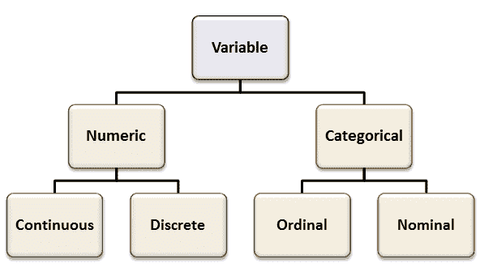
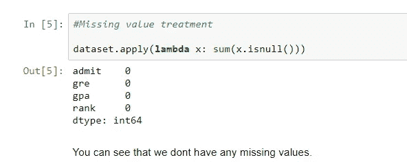
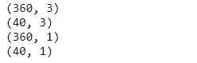
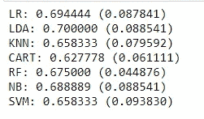
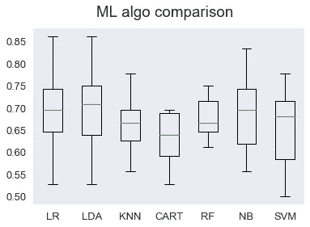
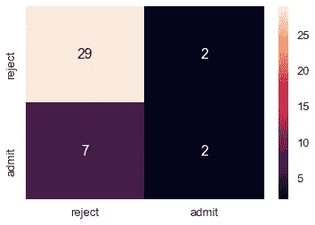
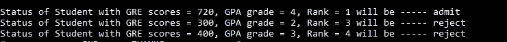

# 预测 MS 入院

> 原文：<https://towardsdatascience.com/predicting-ms-admission-afbad9c5c599?source=collection_archive---------3----------------------->


Credits: Pexels

快到录取季节了，我有几个朋友正处于恐慌状态，等待他们申请的大学的电话。这让我想到——我们如何预测一个学生是否会被录取？选择的参数是什么？可以用数学表达吗？所有这些问题开始出现，所以我决定解决这个问题，并帮助我的朋友平静他的神经。
(这是我写的第一个技术教程，所以请对我宽容些)。

为了解决这个问题，我将带你通过我称之为
***“数据科学管道”。给定任何问题陈述，遵循这条管道，这样你的方法就结构化了。***

1.  **定义问题-**

写下问题陈述，理解你试图解决的问题。在这种情况下，我们的目标是预测学生是否会被录取。这意味着，这是一个二元分类问题。

**2。生成您自己的假设-**

接下来，列出你认为会影响我们目标的所有事情，即。列出与我们的目标特性相关的所有可能的特性。
在我们的案例中，我们被问到这个问题— *影响学生录取的因素有哪些？* 拿一张纸，写下自己的假设。我花了一些时间，想出了以下特点
- GRE 成绩
-托福成绩
-目的陈述(SOP)
-推荐信(LOR)
-学习成绩(GPA)
-课外活动(体育、奥数等..)
-杰出成就
-项目和研究
确保你写下至少 10-20 个问题陈述。这有助于我们更深入地理解我们试图解决的问题，并促使我们超越现有的数据集进行思考。

**3。获取数据集-**

下一步是获取数据。我们使用加州大学洛杉矶分校的假设数据进行研究生招生。你可以点击下载[数据集。现在你可以用给定的数据集来映射你的假设。查看可以添加或修改多少要素来提高数据集的质量。将每个特征识别为
(a)连续变量或(b)分类变量](https://stats.idre.ucla.edu/stat/data/binary.csv)



(Source: Stack Exchange)

**4。数据清理-**

大多数时候，数据集会有很多异常，比如缺失值、异常值等等。在进入下一步之前，一定要对数据进行预处理。
-**-*缺失值处理:*** 您可以使用均值插补(对于连续变量)或模式插补(对于分类变量)



- ***异常值处理:*** 异常值*异常值*是随机样本中与其他值存在异常距离的观察值。


有四种方法来处理它——删除观察值、估算、创建箱和分别处理。
-**-*特征工程:*-**组合、添加、删除、分割、缩放特征以增加模型的精度

**5。探索性数据分析(EDA) -**

现在是我们动手的时候了。让我们探索数据并理解给定的特征。
该数据集有一个名为`admit`的二元响应(结果，相关)变量。有三个预测变量:`gre`、`gpa`和`rank`。我们将变量`gre`和`gpa`视为连续变量。变量`rank`取值 1 到 4。排名 1 的机构声望最高，排名 4 的机构声望最低。

EDA 帮助我们清楚地了解我们的功能。它还帮助我们捕捉数据点的任何趋势或季节性。
在我们的案例中，我们可以看到 GRE 分数和 GPA 越高，被录取的机会就越大。

6。
预测建模-这是一个二元分类问题。输出只有两种可能，要么*是(1)* 要么*否(0)。有很多分类算法，那么我们如何知道哪一个是最好的呢？我们没有。这是需要经验和专业知识的。不过，别担心，我们还有工作要做。我们可以将多种算法应用到我们的数据点上，然后评估模型。这样我们可以选择误差最小的最佳模型。首先，让我们导入所有必要的库*

```
from matplotlib import pyplot
from sklearn.model_selection import train_test_split
from sklearn.metrics import classification_report
from sklearn.metrics import confusion_matrix
from sklearn.metrics import accuracy_score
from sklearn.model_selection import KFold
from sklearn.model_selection import cross_val_score
from sklearn.linear_model import LogisticRegression
from sklearn.tree import DecisionTreeClassifier
from sklearn.neighbors import KNeighborsClassifier
from sklearn.ensemble import RandomForestClassifier
from sklearn.discriminant_analysis import LinearDiscriminantAnalysis
from sklearn.naive_bayes import GaussianNB
from sklearn.svm import SVC
```

我们将使用交叉验证作为评估指标，我们将把数据集分为训练和测试两部分。

```
**#Step 1: Convert Dataframe into matrix**
dataArray = dataset.values**#Step 2: Splitting Input features & Output Variabl**es
X = dataArray[:,1:4]
y = dataArray[:,0:1]**#Step 3: Splitting training & testing**
validation_size = 0.10
seed = 9
X_train, X_test, Y_train, Y_test = train_test_split(X,y,test_size=validation_size, random_state = seed)print(X_train.shape)
print(X_test.shape)
print(Y_train.shape)
print(Y_test.shape)
```



接下来，我们将对我们的训练数据应用以下机器学习算法
-逻辑回归(LR)
-线性判别分析(LDA)
- K 最近邻(KNN)
-决策树(CART)
-随机森林(RF)
-高斯朴素贝叶斯(NB)
-支持向量机(SVM)
初始化最大数量的特征和数量的树。

```
num_trees = 200
max_features = 3
models = []
models.append(('LR', LogisticRegression()))
models.append(('LDA', LinearDiscriminantAnalysis()))
models.append(('KNN', KNeighborsClassifier()))
models.append(('CART', DecisionTreeClassifier()))
models.append(('RF', RandomForestClassifier(n_estimators=num_trees, max_features=max_features)))
models.append(('NB', GaussianNB()))
models.append(('SVM', SVC()))**#Fit Models and Evaulate**results = []
names = []
scoring = 'accuracy'**#Cross Validation**
for name, model in models:
 kfold = KFold(n_splits = 10, random_state=7)
 cv_results = cross_val_score(model, X_train, Y_train, cv=kfold, scoring = scoring)
 results.append(cv_results)
 names.append(name)
 msg = "%s: %f (%f)" % (name,cv_results.mean(), cv_results.std())
 print(msg)
```



我们在这里所做的是在我们的数据点上运行所有 7 种算法，并尝试对其进行评估。如你所见，LR 和 LDA 表现最好。我们也可以实现一个比较图



现在，我们已经将 ML 算法应用到我们的数据集上。接下来，我们必须使用最佳算法创建一个预测模型。
为了简单起见，我打算选 LR。

```
**#Step 1 - Create prediction model**
model = LogisticRegression()**#Step 2 - Fit model**
model.fit(X_train, Y_train)**#Step 3 - Predictions** 
predictions = model.predict(X_test)**#Step 4 - Check Accuracy**
print("Model --- LogisticRegression")
print("Accuracy: {} ".format(accuracy_score(Y_test,predictions) * 100))
print(classification_report(Y_test, predictions))
```


我喜欢制造情节。所以让我们再做一个；)

```
**#plotting confusion matrix on heatmap**
cm = confusion_matrix(Y_test, predictions)
sns.heatmap(cm, annot=True, xticklabels=['reject','admit'], yticklabels=['reject','admit'])
plt.figure(figsize=(3,3))
plt.show()
```



恭喜你！您制作了我们自己的预测模型，准确率为 77.5
(对初学者来说一点也不差)
您可以尝试通过安装不同的分类算法或进行一点点特征工程来提高这个分数。
最好的方法是使用集成方法，但那是其他教程的内容。

但是等等…
我们怎么知道这行得通呢？
是的，完全正确吗？我们已经走了这么远，怎么能不让我们的模型做出一些预测呢！

```
**#Making predictions on some new data
#Like a boss**
new_data = [(720,4,1), (300,2,3) , (400,3,4) ]**#Convert to numpy array**
new_array = np.asarray(new_data)**#Output Labels**
labels=["reject","admit"]**#Let's make some kickass predictions**
prediction=model.predict(new_array)#G**et number of test cases used**
no_of_test_cases, cols = new_array.shapefor i in range(no_of_test_cases):
 print("Status of Student with GRE scores = {}, GPA grade = {}, Rank = {} will be ----- {}".format(new_data[i][0],new_data[i][1],new_data[i][2], labels[int(prediction[i])]))
```



仅此而已。我们自己的预测模型可以决定你朋友的未来(事实上不可以)
但是我们的模型绝对可以预测他/她是否会被录取！

DSW 背后的动机

我从一年前开始学习和研究数据科学。在此期间，我做了大量的问题陈述。但问题是，有时数据集非常有趣，但有时却不是。你必须关心你试图解决的问题，只有这样你才能做好工作。

所以找一个你想解决的问题，用数据来解决它。

你可以在 Github 上找到本教程的代码[](https://github.com/warmachine0609/Predicting_MS_admission)

**我将每周写下一些很棒的教程，所以如果你是那种只能通过做来学习的人，请在这里关注我的 [**出版物。**](https://medium.com/data-science-weekly-dsw/)**

**也可以在 [**LinkedIn**](https://www.linkedin.com/in/naman-doshi/) 上联系。**

**我希望你有一个富有成效的一周。**

*****在那之前，继续 hustling！*****