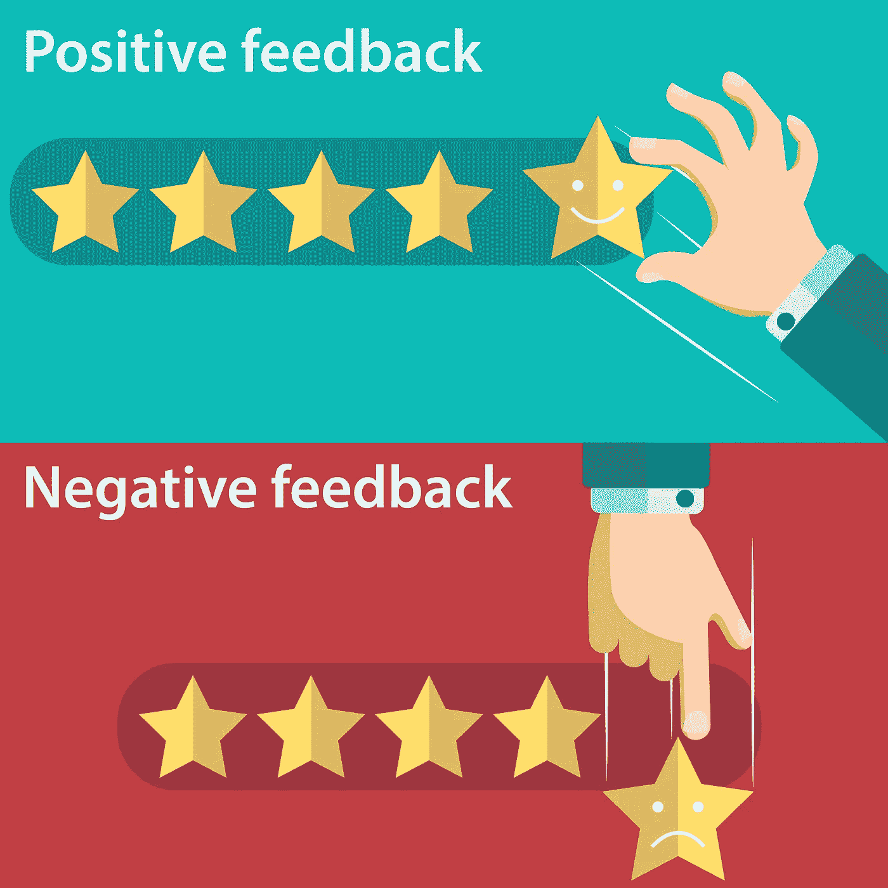
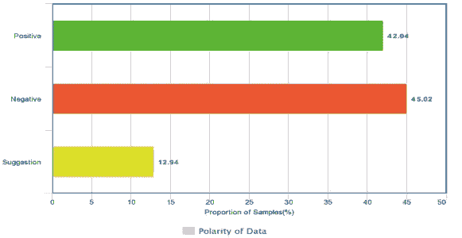
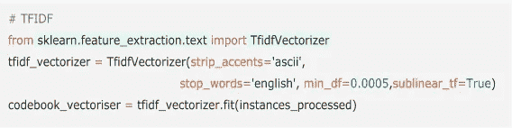
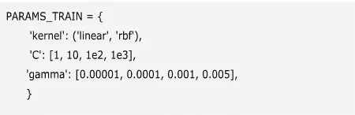
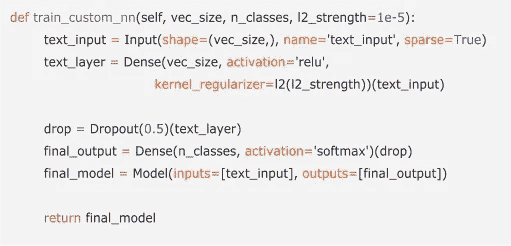
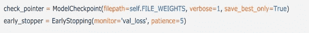
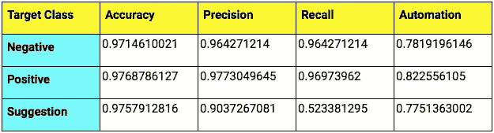
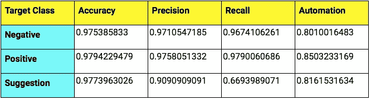

# 预测用户评论的极性

> 原文：<https://towardsdatascience.com/predicting-polarity-of-user-reviews-8774c2a83dd3?source=collection_archive---------8----------------------->

credits - [freepick](https://www.freepik.com/free-vector/positive-and-negative-rating-design_1064362.htm)

*“自动化应用于高效的运作将会放大效率”——*比尔·盖茨

根据客户互动和在线评论管理软件 Podium 对 2005 名美国消费者的调查， [93%的消费者表示在线评论对他们的购买决定有影响](http://learn.podium.com/rs/841-BRM-380/images/Podium-2017-State-of-Online-Reviews.pdf?mkt_tok=eyJpIjoiTUdRM04ySTBOR1ZqTURNNSIsInQiOiJVTktEOXNtTXlpZGFhM29YQUFyNXJZWXpNRGhLTUpYVk5nSWdcL0RPMmcwcWdjaFRlazRiMlU5ZDlcL01DMVJBNVdLVHNLYUs0eEM5Uko1dkRCdVZoRHFVbzNDMjNUdTlBT1pCT2t6cHpma3ZTUWNNSnlab3RNblhUTW5Uem5PdWk0In0%3D)。

这意味着，对于任何大批量的买卖业务来说，拥有一个强大的系统来对用户评论进行分类是至关重要的，因为评论是一种形式的[社会证明](https://en.wikipedia.org/wiki/Social_proof)。为了在规模上准确地实现这一点(同时考虑时间和成本节约)，添加自动化是有意义的。

在这篇博客文章中，我已经写了我们如何在内部使用哪些机器学习技术来创建这样一个自动化层的第一个版本。

# **问题**

每天，电子商务网站都有数百万的产品列表上传到他们的平台上。这一数据变得更加复杂，因为成百上千的消费者最终会为几乎所有的商品写评论。

但是这个数据是有用的，因为评论被用来创建平均分数来评价产品。
现在，手动对用户评论进行分类既费钱又耗时。这也是为什么在[小队](https://www.squadplatform.com)，我们正在努力使给用户评论分配极性的过程自动化。目标是预测任何评论的极性，如正面、负面或中性/建议。

# **自动化情感分析的业务影响**

通过包含一个简单的模型，该模型可以根据与评论相关的用户情绪自动对评论进行分类，它可以极大地帮助企业节省通常用于处理内部人工评论团队或外部 BPO 高管团队的成本。事实上，这样的模型实际上帮助团队变得更有生产力，因为现在他们只处理异常，而不是做端到端的猴子工作。

此外，评论的极性可以帮助准确地对产品评级，从而帮助新的在线消费者基于其他用户的喜欢/不喜欢推荐来过滤产品。

# **从数据集统计开始**

我们通过收集各种产品的评论准备了一个用户评论数据集，并使用 [Squad 的人在回路中的工作流](https://www.squadplatform.com/)来标记它们。我们在图 1 中可以看到，正面评价 42.04%，负面评价 45.02%，建议评价 12.94%。数据非常不准确，我们能提供建议的样本非常少。

Figure 1: The distribution of Positive, Negative and Suggestion reviews.

# **我们实验的不同机器学习管道**

这就是机器学习的有趣之处。

通过删除所有重复条目和空白回答对数据进行预处理。然后，对于每个评论，计算 Tf-Idf(术语频率-逆文档频率)特征:

*   *sublinear_df* 设置为 *True* 以使用对数形式的频率
*   min_df 是一个单词必须出现在文档中才能保留的最小比例
*   *stop_words* 设置为*【英语】*删除所有常用代词(*【a】*、*【the】*、…)以减少噪声特征的数量

Figure 2: Code snippet to build a Tf-Idf model.

然后，这些数据被分成 70-30 的比例，70%的数据用于训练，30%的数据用于测试我们的模型。有三种目标类别:积极、消极和建议。

我们尝试了两条管道:

***一、*管道 1 — Tf-Idf + SVM(支持向量机)**

*答:*使用 GridSearchCV 和各种参数进行了交叉验证，如图 3 所示。

*B.* 在 1.8Ghz 英特尔酷睿 I5 处理器(MacBook Air)和 8GB RAM 上训练这个模型大约需要一个小时。

Figure 3: Hyperparameters to select the best model.

***二世。*管道 2 — Tf-Idf + NN(神经网络)**

*A.* 我们做了一个定制的单层神经网络。其架构如下所述。

Figure 4: Code snippet to build a neural network.

*B.* 模型检查指针用于在每个历元之后保存最佳模型，早期停止用于在验证损失停止改善时停止训练模型。

Figure 5: Callbacks used while training.

*C.* 在我在 Pipeline 1 中使用的同一台 MacBook Air 机器上训练这个模型花了大约 20 分钟。

# **比较和结果**

使用神经网络的第二种技术给出了相对更好的结果。我们评估了模型在某个置信阈值上的性能，即所有三个类别(负面、正面和建议)中发生的最大概率应该高于该值。置信度小于该阈值的样本被认为是不明确的，然后由 HIL 小队(回路中的人)系统验证。因此，自动化表示不需要人工验证的样本比例。

管道 1 (Tf-Idf + SVM)在 0.9 置信阈值下的结果:

管道 2 (Tf-Idf + NN)在置信度阈值为 0.9 时的结果:

# **结论**

我们开发了一个用户评论分类模型。积极班和消极班的成绩略好于暗示班。从一般的观察中，可以得出这样的结论:暗示样本有时与阳性混淆，有时与阴性混淆。

建议类的性能可以通过进一步增加 Tf-Idf 特征向量的大小来提高；为每个类别制作 Tf-Idf 矢量器，并通过来自每个矢量器的每次检查，连接特征，然后训练分类器。

# 下一步是什么？

我们目前正在研究短文本增强技术，以增加用户评论数据集中倾斜类的比例，从而提高我们模型的准确性。此外，我们还在进行研究，通过使用基于方面的情感分析等技术来发现用户对产品特定功能的情感。

*在我的下一篇文章中，我将写另一个用例，我们目前正在为我们的一个企业客户工作。在此之前，请查看—*[*班参加乔尔考试*](https://medium.com/squad-engineering/squad-takes-the-joel-test-9189709a6235) *。*