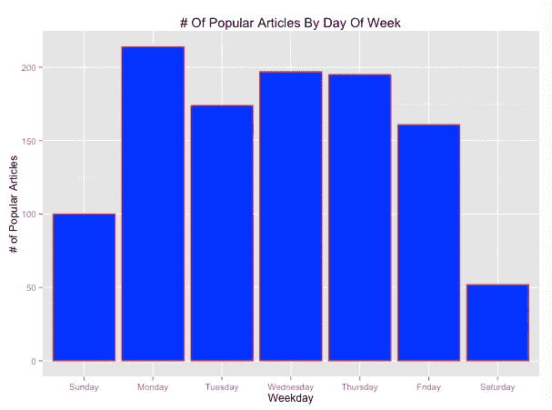
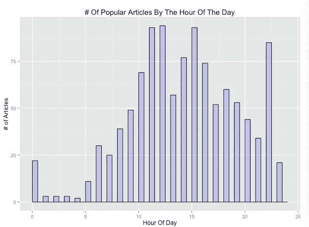
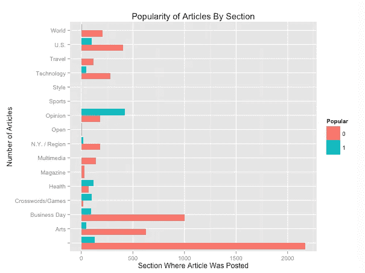
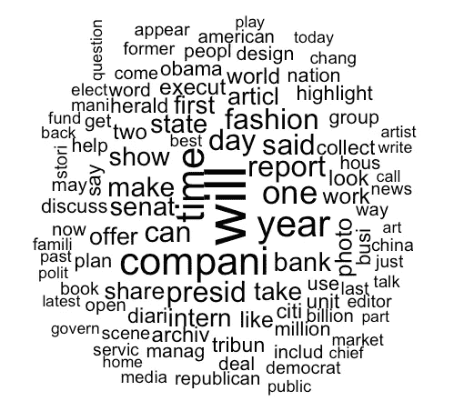

# 预测流行的纽约时报文章—质量评分算法

> 原文：<https://towardsdatascience.com/predicting-popular-ny-times-articles-quality-score-algorithms-8ab4af6a830b?source=collection_archive---------5----------------------->

为什么有人会关心《纽约时报》的博客文章有多受欢迎？我认为你应该关心，因为你的领域有可转移的知识——如何监控你的库存质量。例如，我认为脸书的“库存”就是用户的帖子。你可能会喜欢看你最好的朋友的蜜月照片；你的前搭档就没这么多了。向用户提供低质量的库存会让脸书付出与实体店同样高昂的代价。

**背景**:我参加了在 [edX](https://www.edx.org/) 上举办的一个优秀的 MITx 课程 Analytics Edge，当时我正在研究这个数据集。我是 MOOCs(大规模开放在线课程)的超级粉丝，自 2014 年夏天以来，我一直在 edX 和 [Coursera](https://www.coursera.org/) 上注册一门或多门课程。我非常尊重学习过程，并且**不会发布代码和数据**。

重建这个数据集是非常可能的，只需订阅纽约时报的费用。原始数据包括 2014 年初发表的 6500 篇文章，如果每篇文章收到 25 条以上的评论，这些文章就会被标记为受欢迎。这项任务是预测 2014 年秋季会流行的文章。提供了文章的发表日期、章节、标题和摘要。让我们从一些可视化的描述性分析开始，看看我们是否能做出任何推论。

首先，分离出受欢迎的文章并检查出版时间。

Popular NY Times Blog Articles by The Day of Week

一周内发表的文章似乎比周末发表的文章更受欢迎。这是术语影响的一个很好的例子。“受欢迎”是通过用户评论的数量来衡量的；这并不一定意味着纽约时报在周末的收视率会下降。

让我们更进一步，检查文章发布的时间。

Number of Popular Articles by the Hour of the Day of Posting

中午前后是热门文章发表的高峰，3 小时后的下午 3 点是另一个高峰。这可能是因为西海岸的作者发表文章的时间周期与他们东海岸的同事相似。或许这些文章的发表是为了配合各海岸工人的午休时间？

好的，那么文章发表的部分呢？

Popularity of Articles by Posted Section

一般来说，文章受欢迎的可能性是不受欢迎的 5 倍。然而，我们看到两个突出类别的文章更有可能受欢迎(即。其中绿色条比红色条长)。观点、健康和纵横字谜/游戏部分在用户中的受欢迎程度超出预期。

最后，我们来看一下文章内容。我生成了 6500 篇文章中使用最多的 100 个单词的单词云。

100 Most Popular Words in NY Times Blog Articles

你会注意到一些有政治倾向的词，比如奥巴马，共和党，民主党。直觉上，这是有道理的，因为 2014 年是美国中期选举年

从这四张图表中我们可以推断出什么？如果你写了一篇关于奥巴马医疗保健法的博客，并在美国东部时间周一中午 12 点发表，你的评论区会火起来。

> 这些都是描述性的，而不是预测性的分析。预测未来几个月哪些文章会流行呢？

好问题。我将在本周晚些时候的后续文章中讨论这个问题。