# 预测《纽约时报》评论的受欢迎程度(上)

> 原文：<https://towardsdatascience.com/predicting-popularity-of-the-new-york-times-comments-part-1-d32f26261f6f?source=collection_archive---------7----------------------->

*大家好！我刚刚完成了多伦多瑞尔森大学* *大数据认证的顶点项目* [*。这个项目很有挑战性，但是需要大量的学习。我花了近一个月的时间，从头到尾完成了它，并准备了报告。请按照我的*](https://ce-online.ryerson.ca/ce/calendar/default.aspx?section=program&sub=cert&cert=DATANA00&mode=program) [*GitHub 上详细的分步 R 码。*](https://github.com/sakshi716/nyt-nlp-capstone)

*第 1 部分将讨论问题陈述，并向您介绍数据集和不同的可视化方法，以便更好地理解数据。第 2 部分将更多地讨论预测建模，使用自然语言处理的文本到向量框架。*

# 介绍

《纽约时报》*(NYT)拥有庞大的读者群，在塑造公众舆论和对时事的看法以及设定公共话语基调方面发挥着重要作用，尤其是在美国。NYT 的文章评论区非常活跃，能够洞察读者对文章主题的看法。每条评论都可以收到其他读者的推荐。*

# *NYT 版主面临的挑战*

*   *高达***每篇文章 700 条评论***NYT 版主一天内人工审核~ 12000 条评论。*
*   *版主需要根据预测的相关性和受欢迎程度，更快地做出筛选和分类评论的决定。*
*   *找到一种更简单的方法来分组相似的评论，并在读者中保持有用的对话。*

**

****Number of popular comments per article by News Desk****

# *关键研究课题*

*   *广泛分析 NYT 的文章和评论*
*   *读者评论的流行度预测*

# *方法*

*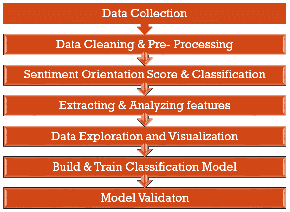*

***** *这个项目的分步代码可以在我的*** [***NYT NLP 顶点 GitHub 资源库中找到。***](https://github.com/sakshi716/nyt-nlp-capstone)*

# *步骤 1:数据收集*

## *NYT 文章数据集:*

*   *数据集由九个部分组成。2017 年 1 月至 5 月和 2018 年 1 月至 4 月发表的文章的 csv 文件(可在网上获得，也可以使用 NYT API 抓取)。*
*   *共有 9335 篇不同的文章，包含 15 个变量。*

*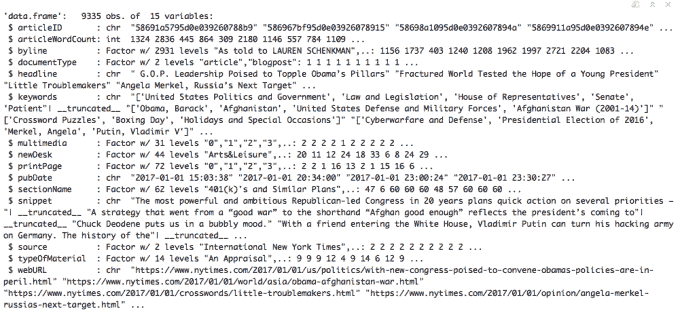*

## *NYT 评论数据集:*

*   *还有另外一组九个。包含对这些文章的评论集合的 csv 文件(可以在网上找到，也可以使用 NYT API 抓取)。*
*   *总计 2，176，364 条评论，包含 34 个变量。*

**

** *项目中使用的所有数据文件都可以在这里找到[。](https://www.kaggle.com/aashita/nyt-comments)*

# *步骤 2:数据清理和预处理*

## *限制和减少*

*   *由于庞大的数据量和有限的计算资源，我决定将数据集限制在 14 个可用新闻服务台中的**前 6 名。***
*   *我将某些“角色”特征转换为“因素”*
*   *我更改了一些特性的数据类型，尤其是将 UNIX 时间戳格式更改为 POSIXct。*
*   *我删除了分析不需要的特征。*

*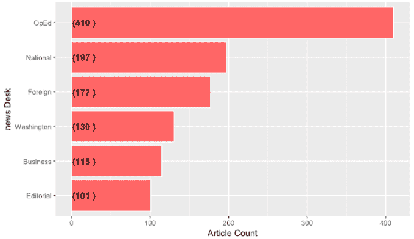*

****Number of articles published per News Desk****

*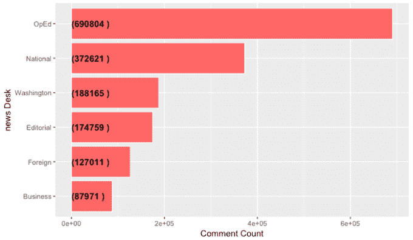*

****Volume of comments per News Desk****

# *步骤 3:情感倾向得分和计算*

## *组织和清理文本:*

*   *使用 [unnest_tokens](https://www.rdocumentation.org/packages/tidytext/versions/0.1.9/topics/unnest_tokens) 函数处理评论、摘录和文章标题中的文本。*
*   *在新数据帧的每一行中，文本主体被分割成记号(单个单词)。*
*   *我去掉了标点符号，把记号转换成小写。*

## *语义取向分数确定:*

*   *使用基于词典的方法来区分文本取向和单词的语义取向。*
*   *适当的词典( [**BING**](https://www.tidytextmining.com/sentiment.html) )是从 r。*
*   *我用 BING 给每个标题、文章片段和文章评论分配了一个情感分数。*
*   *基于情感得分，每个标题、片段和评论被分为三个情感类别:负面、正面或中性。*

# *步骤 4:提取和分析特征*

*除了数据中已经存在的变量之外，还衍生了一些其他特征:*

*   ****针对每篇文章标题、摘录和评论正文的合计情感得分*** (负面、正面、中性)*
*   ****每条评论的总字数****
*   **每条评论的总字数**
*   *****平均每句话字数*** 每个评论**
*   *****时间特征:*** 添加评论的时间与文章发表日期/时间的时间差**
*   *****星期几*** 添加注释时**
*   *****添加注释的时间*****

## **将建议转换为二进制变量:**

**此外，为了使用分类方法构建预测模型(如我的下一篇文章中所讨论的)，目标变量“建议”(数字)被转换为可能值为 0 或 1 的二进制变量。**

**流行与非流行变量是从转换前的推荐变量的五个数字的汇总统计中得出的。其总体中值为 4；因此**任何有< =3 张赞成票的评论都被标记为非热门**。**

**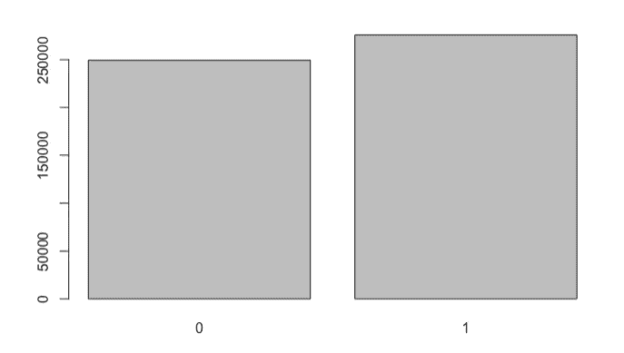**

*****0 = Non-Popular, 1 = Popular*****

**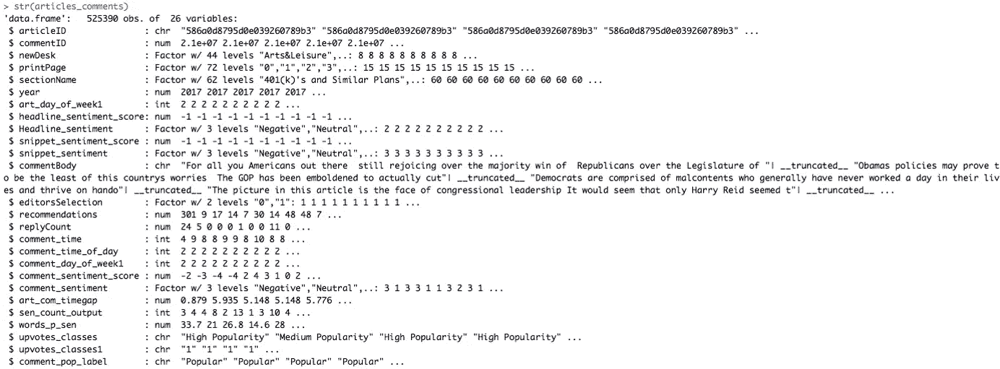**

*****The final data frame with 26 selected features*****

# **步骤 5:数据探索和可视化**

**在建立任何模型时，我们需要了解预测因素和响应变量之间的相关性。下面的可视化提供了对我的数据更好的理解，也研究了不同变量之间的关系。**

**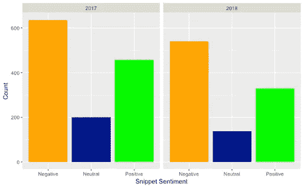**

*****Frequency of articles based on sentiment: positive, neutral or negative*****

**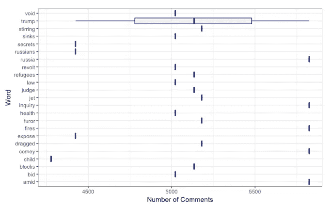**

*****Do certain words in article headlines elicit more comments?*****

**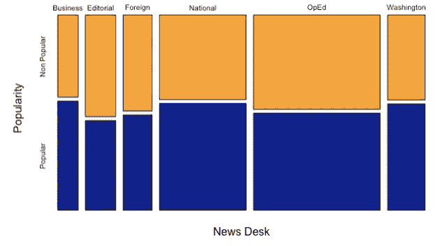**

*****Comment popularity across the top six News Desks*****

**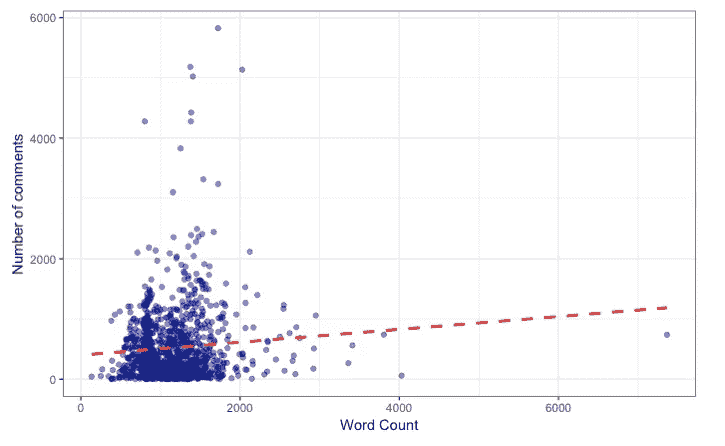**

*****Correlation between number of comments and article word counts*****

**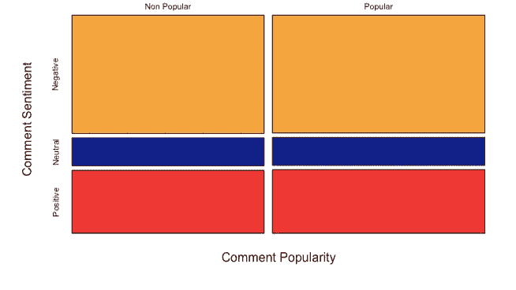**

*****Correlation between comment popularity and article sentiments*****

**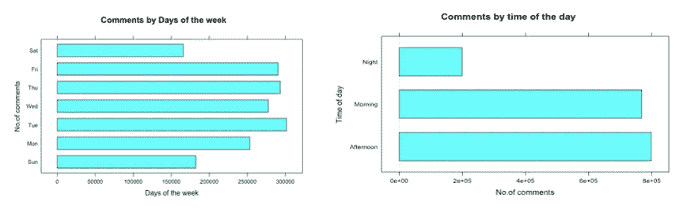**

*****Correlation between comments and temporal features*****

**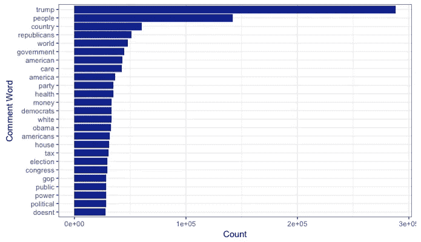**

*****Most commonly used words in comments*****

## **文本特征与评论流行度的相关性探究**

****进行 Anova 测试**以确定响应变量和数值预测值之间相关性的统计显著性。对于所有三个预测因子，相关性在统计上是**T5t，如下所示。****

**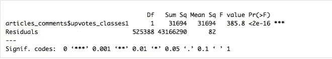**

*****Number of words per sentence in comments vs. comment popularity*****

**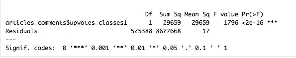**

*****Number of sentences in comments vs. comment popularity*****

**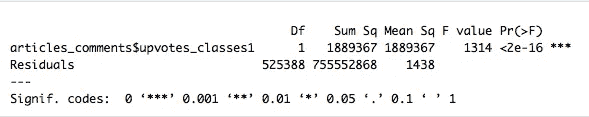**

*****Article-comment time gap vs. comment popularity*****

# **数据探索摘要**

*   **NYT 最受欢迎的新闻台是**专栏**、**国内**、**国外**、**华盛顿**、**商业**和**社论**。版主在审核读者添加的评论时，可以专注于这些类别。**
*   **在 2017 年和 2018 年，文章倾向于负面情绪多于正面情绪。这可以与美国和世界普遍的政治局势联系起来。**
*   **对于评论最多的文章以及这些评论中最常用的词，前 25 个术语相似，包括**特朗普**、**俄罗斯**、**难民**、**健康**和**秘密**。**
*   **根据评论热度分布，**全国性**文章是读者阅读和喜欢最多的**文章**。这可以归因于美国在 2017-2018 年期间发生的政治变化。**
*   **大多数评论是在上午**和下午**发表的。**
*   ****周二**、**周四**和**周五**是评论最活跃的日子，而最不活跃的日子是周末。**
*   **评论的受欢迎程度和一些衍生特征之间有很强的相关性:评论中每句话的平均字数，评论中的平均句子数，以及文章和评论发表之间的平均时间间隔。这意味着这些特征可以用来预测评论流行度。**

# **结论**

**由于许多预测因素和反应变量之间没有很强的相关性，我选择了一种不同的方法来处理这个问题，我将在下一篇博客中讨论这个问题。**

**你对四张赞成票成为受欢迎程度的分界点有何看法？你认为提高或降低阈值会如何影响结果？请在评论区告诉我你的想法，并继续关注第 2 部分:-)**

***(首发@www.datacritics.com)***