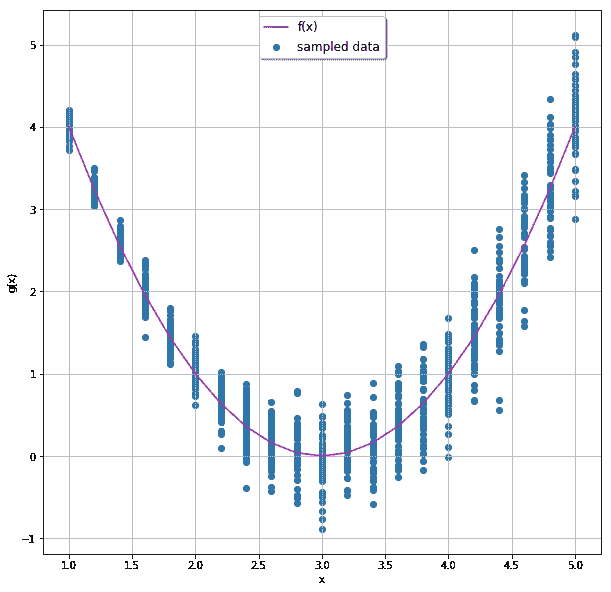
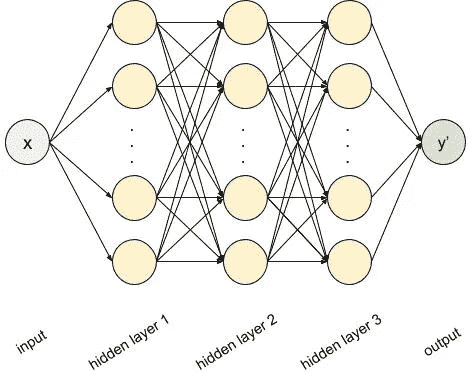
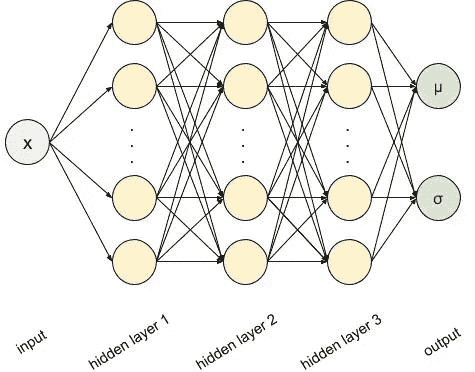
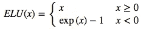
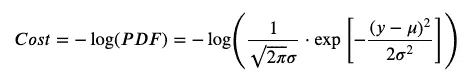
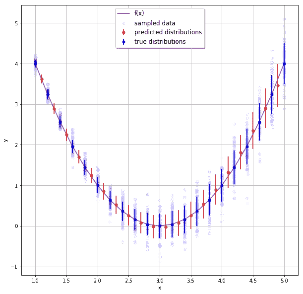

# 使用神经网络预测概率分布

> 原文：<https://towardsdatascience.com/predicting-probability-distributions-using-neural-networks-abef7db10eac?source=collection_archive---------10----------------------->

***本帖原载于*** [***Taboola 的工程博客***](https://engineering.taboola.com)


如果你最近一直在关注我们的[科技博客](https://engineering.taboola.com/)，你可能已经注意到[我们正在使用](https://engineering.taboola.com/uncertainty-ctr-prediction-one-model-clarify)一种特殊类型的神经网络，称为混合密度网络(MDN)。MDN 不仅预测目标的期望值，还预测潜在的概率分布。

这篇博文将关注如何使用 Tensorflow 从头开始实现这样一个模型，包括解释、图表和一个包含全部源代码的 [Jupyter 笔记本](https://github.com/taboola/mdn-tensorflow-notebook-example)。

## 什么是 MDN，为什么它们有用？

现实生活中的数据是嘈杂的。虽然相当恼人，但这种噪音是有意义的，因为它提供了数据来源的更广泛的视角。根据输入的不同，目标值可能有不同程度的噪声，这可能会对我们对数据的理解产生重大影响。

这个用一个例子更好解释。假设以下二次函数:


给定 x 作为输入，我们有一个确定的输出 *f(x)* 。现在，让我们把这个函数变成一个更有趣(也更真实)的函数:我们将在 *f(x)* 中加入一些正态分布的噪声。这种噪音会随着 *x* 的增加而增加。我们将称新函数为 *g(x)* ，形式上等于*g(x)= f(x)+*𝜺*(x)*，其中𝜺 *(x)* 为正态随机变量。

让我们针对不同的 *x* 值对 *g(x)* 进行采样:



紫色线代表无噪声函数 *f(x)* ，我们可以很容易地看到添加噪声的增加。让我们检查一下 *x = 1* 和 *x = 5* 的情况。对于这两个值， *f(x) = 4，*so 4 是 *g(x)* 可以取的合理值。4.5 对于 *g(x)* 也是一个合理的预测吗？答案显然是否定的。虽然 4.5 似乎是 *x = 5* 的合理值，但当 *x = 1* 时，我们不能接受它作为 g(x)的有效值。如果我们的模型只是简单地学习预测*y’(x)= f(x)*，这些有价值的信息就会丢失。这里我们真正需要的是一个能够预测*y’(x)= g(x)*的模型。这正是 MDN 所做的。

MDN 的概念是由 Christopher Bishop 在 1994 年发明的。他的[原始论文](https://publications.aston.ac.uk/373/1/NCRG_94_004.pdf)很好地解释了这个概念，但它可以追溯到史前时代，当时神经网络不像今天这样普遍。因此，它缺少实际实现的部分。这正是我们现在要做的。

## 我们开始吧

让我们从一个简单的神经网络开始，它只从有噪声的数据集中学习 *f(x)* 。我们将使用 3 个隐藏的密集层，每个层有 12 个节点，如下所示:



我们将使用均方差作为损失函数。让我们在 Tensorflow 中对此进行编码:

```
x = tf.placeholder(name='x',shape=(None,1),dtype=tf.float32)
layer = x
for _ in range(3):
   layer = tf.layers.dense(inputs=layer, units=12, activation=tf.nn.tanh)
output = tf.layers.dense(inputs=layer, units=1)
```

训练后，输出如下所示:


我们看到网络成功地学习了 *f(x)* 。现在缺少的只是对噪声的估计。让我们修改网络来获得这条额外的信息。

## 走向 MDN

我们将继续使用我们刚刚设计的相同网络，但我们将改变两件事:

1.  输出层将有两个节点，而不是一个，我们将这些节点命名为 *mu* 和 *sigma*
2.  我们将使用不同的损失函数

现在我们的网络看起来像这样:



我们来编码一下:

```
x = tf.placeholder(name='x',shape=(None,1),dtype=tf.float32)
layer = x
for _ in range(3):
   layer = tf.layers.dense(inputs=layer, units=12, activation=tf.nn.tanh)
mu = tf.layers.dense(inputs=layer, units=1)
sigma = tf.layers.dense(inputs=layer, units=1,activation=lambda x: tf.nn.elu(x) + 1)
```

让我们花一点时间来理解 sigma 的激活函数——记住，根据定义，任何分布的标准差都是非负数。[指数线性单位](http://image-net.org/challenges/posters/JKU_EN_RGB_Schwarz_poster.pdf) (ELU)，定义为:



产出 *-1* 作为其最低值，因此 *ELU+1* 将总是非负的。一定要去 ELU 吗？不，任何总是产生非负输出的函数都可以，例如 sigma 的绝对值。ELU 似乎做得更好。

接下来，我们需要调整我们的损失函数。让我们试着去理解我们现在到底在寻找什么。我们的新输出层为我们提供了正态分布的参数。这种分布应该能够描述采样产生的数据 *g(x)* 。我们如何衡量它？例如，我们可以从输出中创建一个正态分布，并最大化从中抽取目标值的概率。从数学上来说，我们希望最大化整个数据集的正态分布的概率密度函数(PDF)的值。同样，我们可以最小化 PDF 的负对数:



我们可以看到损失函数对于𝜇和𝝈.都是可微的您会惊讶于编码是多么容易:

```
dist = tf.distributions.Normal(loc=mu, scale=sigma)
loss = tf.reduce_mean(-dist.log_prob(y))
```

仅此而已。在训练模型之后，我们可以看到它确实在 *g(x)* 上拾取:



在上面的图中，蓝色的线和点代表用于生成数据的实际标准偏差和平均值，而红色的线和点代表由网络预测的不可见的 *x* 值的相同值。大获成功！


## 后续步骤

我们已经了解了如何预测简单的正态分布——但不用说，MDN 可以更通用——我们可以预测完全不同的分布，甚至几种不同分布的组合。您需要做的就是确保分布变量的每个参数都有一个输出节点，并验证分布的 PDF 是可微分的。

我只能鼓励你尝试和预测更复杂的分布——使用本文附带的笔记本，修改代码，或者在现实生活数据中尝试你的新技能！愿机会永远对你有利。