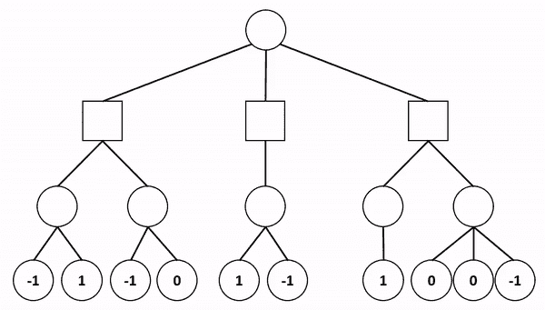
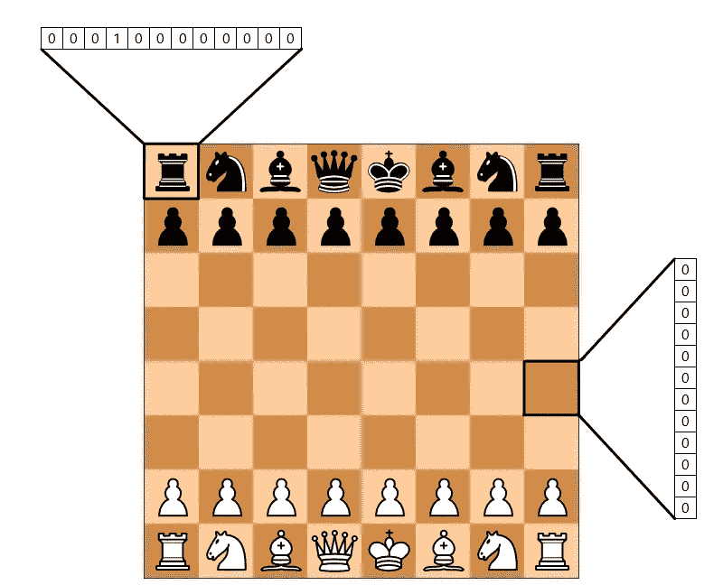
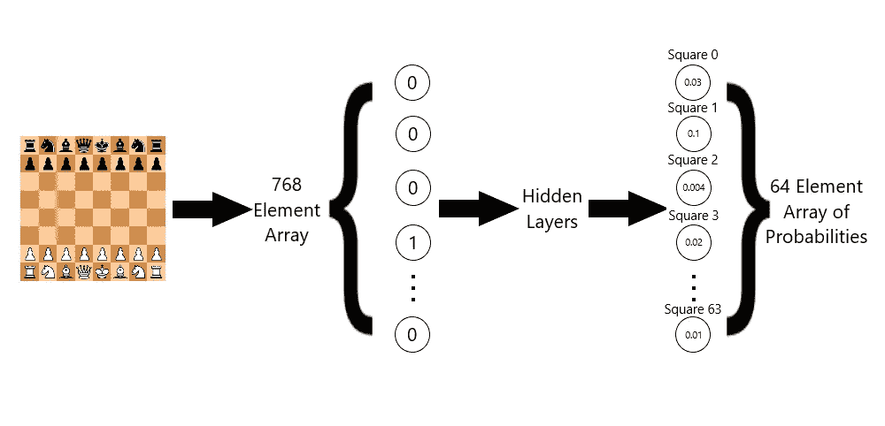
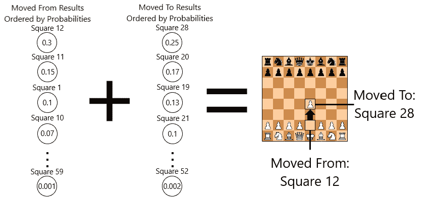

# 用深度学习预测职业棋手的棋步

> 原文：<https://towardsdatascience.com/predicting-professional-players-chess-moves-with-deep-learning-9de6e305109e?source=collection_archive---------9----------------------->

Source: [Pexels](https://www.pexels.com/photo/kick-chess-piece-standing-131616/)

所以我不擅长下棋。

我爸爸在我小的时候教我，但我想他是那种总是让孩子赢的爸爸。为了弥补这个世界上最受欢迎的游戏之一的技能缺乏，我做了任何数据科学爱好者都会做的事情:建立一个人工智能来击败我无法击败的人。不幸的是，它远不如 AlphaZero(甚至不如普通玩家)。但我想看看象棋引擎在没有强化学习的情况下如何运行，以及如何在网络上部署深度学习模型。

## [在这里对战吧！](https://sayonb.com/demos/chess-ai)

# 获取数据

[FICS](https://www.ficsgames.org/) 有一个数据库，里面有 3 亿个游戏，每个人下的棋，结果，以及参与者的评分。我下载了 2012 年所有至少有一个玩家 2000 ELO 以上的游戏。总共进行了大约 97000 场游戏，移动了 730 万次。获胜分布是:43000 个白色获胜，40000 个黑色获胜，14000 个平局。

# 极大极小

为了理解如何制作深度学习象棋人工智能，我必须首先理解传统象棋人工智能是如何编程的。进来的是极小极大。Minimax 是“最小化最大损失”的缩写，是博弈论中决定零和博弈应该如何进行的概念。

Minimax 通常与两个玩家一起使用，其中一个玩家是**最大化者**，另一个玩家是**最小化者**。代理人，或者任何使用这种算法获胜的人都认为他们是最大化者，而对手是最小化者。该算法还要求有一个董事会评估功能，这是一个谁是赢家的数字措施。这个数字介于-∞和∞之间。最大化者希望最大化这个值，而最小化者希望最小化这个值。这意味着当你，最大化者，面临两个移动之间的十字路口时，你会选择给你更高评价的那个，而最小化者会做相反的事情。这个游戏是在假设两个玩家都处于最佳状态并且没有人犯错的情况下进行的。

Source: [GlobalSoftwareSupport](https://www.globalsoftwaresupport.com/minimax-algorithm-explained/)

以上面的 GIF 为例。你，最大化者(圆圈)，有三个动作可以选择(从顶部开始)。你应该选择的移动直接取决于你的对手(方块)在移动后选择*的移动。但是你的对手选择的移动直接取决于你在*移动到*移动后选择的移动，以此类推直到游戏结束。一直玩到游戏结束会消耗大量的计算资源和时间，所以你选择一个深度，在上面的例子中，是 2。如果最小化点(最左边的方块)选择向左移动，你有-1 和 1 可以选择。你选择 1 是因为它会给你最高分。如果极小值选择正确的移动，你选择 0，因为那更高。现在轮到最小化者了，他们选择 0，因为那更低。这出戏会一直演下去，直到所有的棋都走完了，或者你没有思考的时间了。对于我的象棋引擎，引擎假设白色是最大值，而黑色是最小值。如果引擎是白色的，算法决定哪个分支将给出最高的最低分，假设人类每次都选择最低分，反之亦然。为了获得更好的性能，该算法还可以与另一种算法结合使用: [alpha-beta 剪枝](https://en.wikipedia.org/wiki/Alpha%E2%80%93beta_pruning)。Alpha-beta 剪枝应用一个截断系统来决定是否应该向下搜索一个分支。*

# 深度学习架构

我的研究始于 Erik Bernhardsson 关于象棋深度学习的伟大文章。他讲述了他如何采用传统方法让人工智能下棋，并将其转化为使用神经网络作为引擎。

第一步是将棋盘转换成输入层的数字形式。我借用了 Erik Bernhardsson 的编码策略，将棋盘与每个方格中的棋子进行热编码。这总共是一个 768 元素的数组(8 x 8 x 12，因为有 12 个元素)。

Bernhardsson 选择将输出层设为 1 表示白棋胜，设为-1 表示黑棋胜，设为 0 表示和棋胜。他认为游戏中的每个棋盘位置都与结果有关。每一个单独的位置都被训练成如果黑棋赢了就“偏向黑棋”，如果白棋赢了就“偏向白棋”。这允许网络返回一个介于-1 和 1 之间的值，这将告诉你该位置更有可能导致白棋获胜，还是黑棋获胜。

我想用一个稍微不同的评估函数来处理这个问题。网络能不能看不出是白棋还是黑棋赢了，但能看到哪一步棋会赢？首先，我尝试将 768 元件电路板表示成输出，其中一个位置是输入，下一个位置是输出。当然，这没有成功，因为这将它变成了一个多分类问题。这为引擎正确选择合法移动提供了太多的错误，因为输出层中的所有 768 个元素都可能是 1 或 0。所以我查阅了 Barak Oshri 和 Nishith Khandwala 的斯坦福论文[使用卷积神经网络](https://pdfs.semanticscholar.org/28a9/fff7208256de548c273e96487d750137c31d.pdf)预测国际象棋中的棋步，看看他们是如何解决这个问题的。他们训练了 7 个神经网络，其中一个网络是棋子选择网络。这个网络决定了哪个方块最有可能被移走。其他六个网络是专门为每一件作品类型，并会决定一个特定的作品应该移动到哪里。如果棋子选择器选择了一个有棋子的方格，只有棋子神经网络会用最有可能移动到的方格作出响应。

我借鉴了他们两人的想法，做了两个卷积神经网络。第一个是从网络移动的*，它将接受 768 元素数组表示，并输出 pro 从哪个方块(在方块 0 和方块 63 之间)移动。第二个网络:*移动到*网络，将做同样的事情，除了输出层将是 pro 移动到的地方。我没有考虑谁赢了，因为我假设不管最终结果如何，训练数据中的所有移动都是相对最优的。*

我选择的架构是两个 128 卷积层和 2x2 滤波器，后面是两个 1024 神经元全连接层。我没有应用任何池，因为池提供了位置不变性。图片左上角的猫就像图片右下角的猫一样。然而，对于国际象棋来说，王卒的价值与车卒的价值是完全不同的。我对隐藏层的激活函数是 RELU，而我对最后一层应用了 softmax，所以我基本上得到了一个概率分布，所有方块的概率总和为 100%。

我的训练数据是训练集的 600 万个位置，剩余的 130 万个位置用于验证集。训练结束时，我从网络得到的*移动的验证准确率为 34.8%，从*移动到*网络的验证准确率为 27.7%。这并不意味着 70%的时间它没有学会合法的动作，这只是意味着 AI 没有做出与验证数据中的职业球员相同的动作。相比之下，Oshri 和 Khandwala 的网络平均验证准确率为 37%。*

# 将深度学习与极小极大相结合

因为这现在是一个分类问题，其中输出可以是 64 个类中的一个，这留下了很多出错的空间。训练数据(来自高水平玩家的游戏)的一个警告是，优秀的玩家很少能玩到将死。他们知道自己什么时候输了，通常不需要看完整场比赛。这种平衡数据的缺乏使得网络在接近尾声时严重混乱。它会选择要移动的车，并尝试对角移动它。该网络甚至会试图指挥反对派的作品，如果它是失败的(厚脸皮！).

为了解决这个问题，我按照概率对输出进行了排序。然后，我使用 python-chess 库获得了一个给定位置的所有合法移动的列表，并选择了具有最高合成概率的合法移动。最后，我应用了一个预测得分公式，对选择可能性较小的移动进行惩罚:400-(所选移动的指数之和)。合法移动在列表中的位置越靠后，它的预测得分就越低。例如，如果从网络移动的*的第一个索引(索引 0)与从*移动到*网络的第一个索引相结合是合法的，那么预测得分是 400-(0+0)，这是最高可能得分:400。*

我选择了 400 作为最大的预测分数，在和材料分数一起玩了这个数字之后。材料分数是一个数字，它会告诉你所做的移动是否会抓住一个棋子。根据捕捉到的棋子，这步棋的总得分会提高。我选择的材料值如下:

卒:10，骑士:500，主教:500，车:900，皇后:5000，国王:50000。

这尤其有助于结束游戏。在将死棋是第二个最有可能合法的棋步并且预测得分较低的情况下，国王的物质价值会超过它。棋子的分数如此之低，是因为网络在游戏初期考虑得很好，如果是战略行动，它会选择棋子。

然后，我将这些分数组合起来，返回给定任何潜在移动的棋盘评估。我通过深度为 3 的最小最大算法(带有 alpha-beta 修剪)输入这个，得到了一个有效的象棋引擎，它被将死了！

# 使用 Flask 和 Heroku 部署

我使用了 Youtube 上的 Bluefever 软件指南，展示了如何制作一个 javascript 象棋 UI，并通过向 flask 服务器发出 AJAX 请求来路由我的引擎。我使用 Heroku 将 python 脚本部署到 web 上，并将其连接到我的自定义域:【Sayonb.com。

# 结论

即使引擎的表现不如我希望的那样好，但我学到了很多关于 AI 的基础，将机器学习模型部署到 web，以及为什么 AlphaZero 不单独使用卷积神经网络来玩！

可以通过以下方式进行可能的改进:

*   利用二元模型 LSTM 将从移出的*和从*移至*的*网络组合成一个时间序列。这可能有助于将从移出的*和从*移至*的*决策放在一起，因为目前每个决策都是独立进行的。**
*   通过增加获取材料的位置来改进材料评估(在棋盘中心获取棋子比在边上获取更有利)
*   在使用神经网络预测分数和材料分数之间切换，而不是在每个节点都使用两者。这可以允许更高的最小最大搜索深度。
*   考虑边缘情况，例如:减少孤立自己棋子的可能性，增加将骑士放在棋盘中心附近的可能性

看看代码，或者在 [GitHub repo](https://github.com/SayonB/Predicting-Pro-Chess-Moves) 用自己的训练数据自己训练一个新的网络！

如果您有任何批评或担忧，您可以通过 [LinkedIn](http://www.linkedin.com/in/sayon-bhattacharjee) 或我的[个人网站](https://www.sayonb.com)联系我。