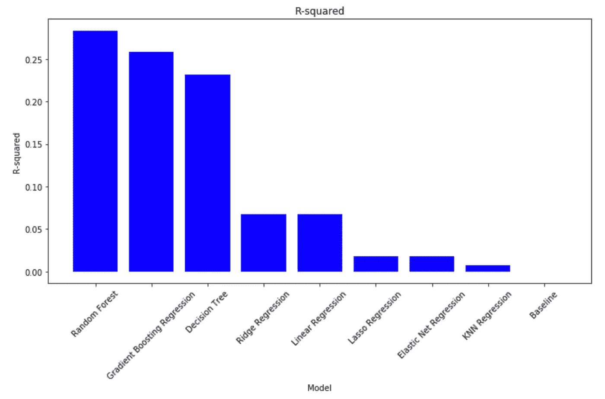
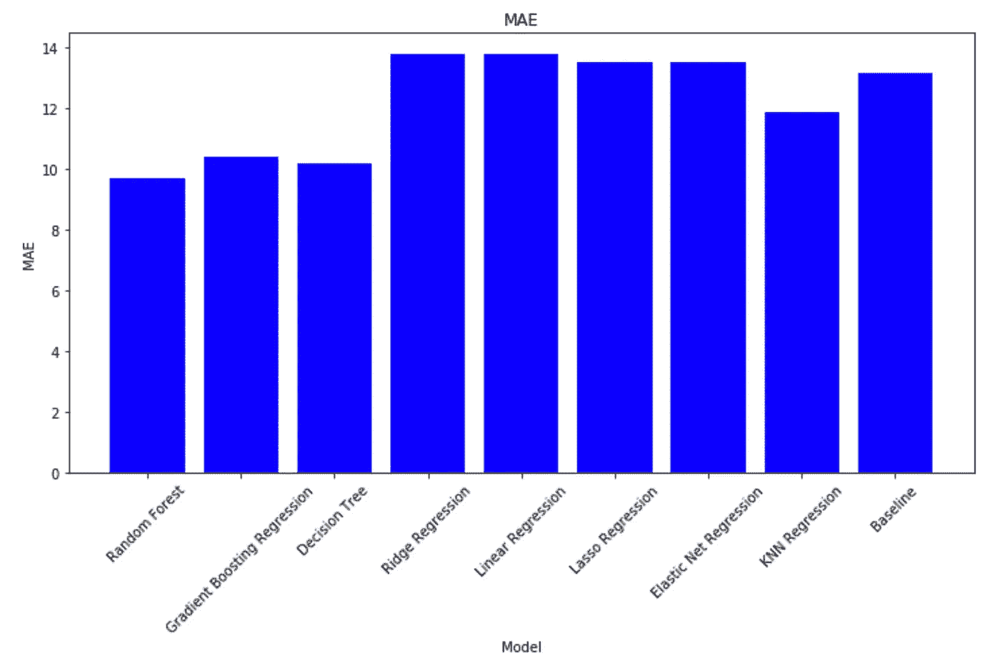
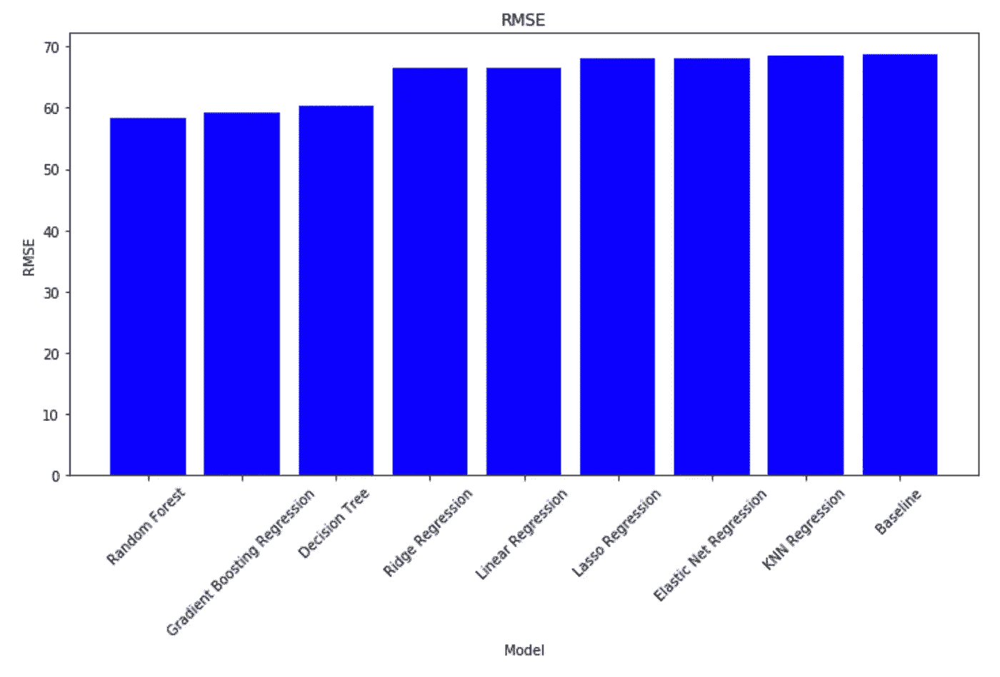
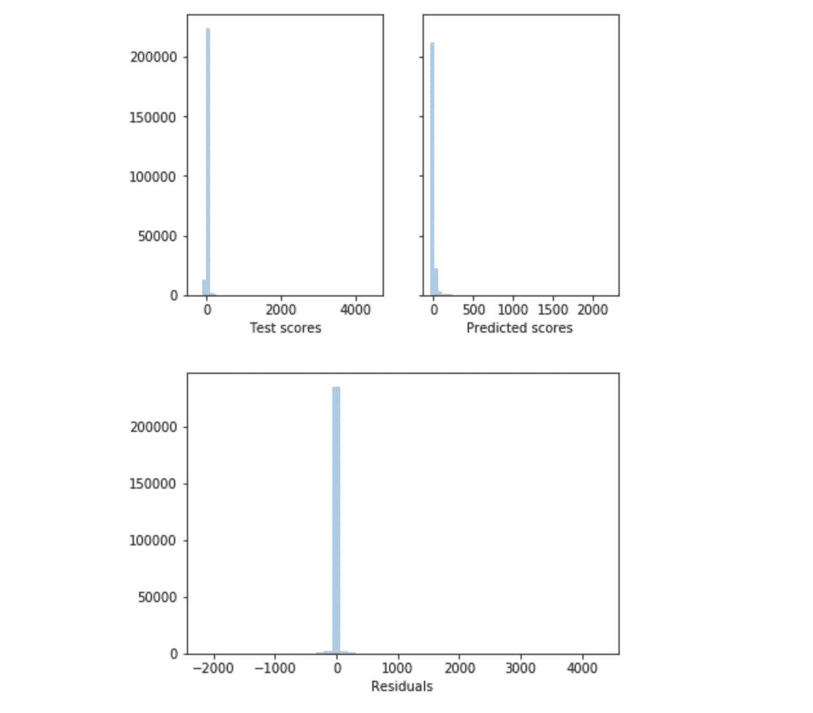
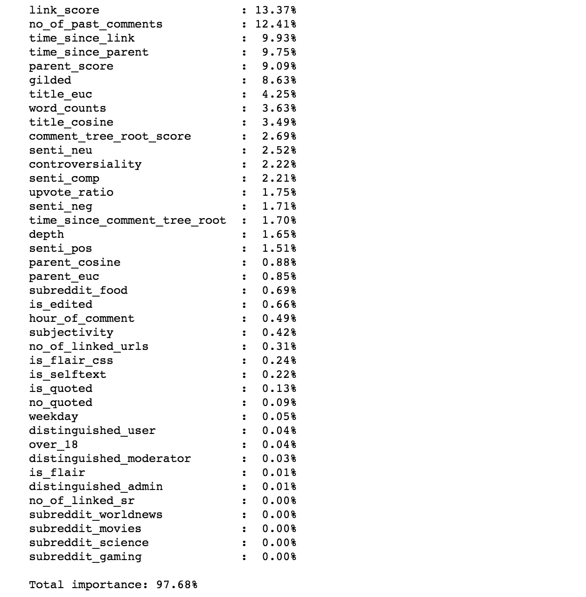

# 用机器学习预测 Reddit 评论投票数

> 原文：<https://towardsdatascience.com/predicting-reddit-comment-karma-a8f570b544fc?source=collection_archive---------19----------------------->


在本文中，我们将使用 Python 和 scikit-learn 包来预测 Reddit 上一条评论的投票数。我们拟合了各种回归模型，并使用以下指标比较了它们的性能:

*   r 来衡量拟合优度
*   在*测试集*上测量精确度的平均绝对误差(MAE)和均方根误差(RMSE)。

这篇文章基于来自[这个](https://github.com/areevesman/reddit-upvote-modeling) Github 库的工作。代码可以在[这个](https://github.com/areevesman/reddit-upvote-modeling/blob/master/model_fitting/associated_nb_for_medium.ipynb)笔记本里找到。


# 背景

Reddit 是一个流行的社交媒体网站。在这个网站上，用户在各种*子主题*中发布*主题*，如下图所示。


A thread in the “AskReddit” subreddit

用户可以对主题或其他评论进行评论。他们还可以给其他线程和评论投*赞成票*或*反对票*。


我们的目标是预测评论将获得的支持票数。


# 数据

该数据是一个 pickle 文件，包含发生在 2015 年 5 月的 1，205，039 行(评论)，存放在 google drive 上，可以使用此[链接](https://drive.google.com/file/d/1pKh6vu-NmWFJVq0BmdSy9kq_cSVWFV-J/view?usp=sharing)下载。

下面列出了将用于建模的目标变量和相关特征。它们可以分为几类。

## 目标变量

*   **得分**:评论的投票数

## 评论级别功能

*   **镀金**:评论上镀金标签(高级赞)的数量
*   **区分**:页面上的用户类型。“版主”、“管理员”或“用户”
*   **争议性**:一个布尔值，表示(1)或(0)评论是否有争议(热门评论的支持票数与反对票数接近)
*   **over_18** :线是否被标记为 NSFW
*   **time_lapse** :评论和线程上第一条评论之间的时间，以秒为单位
*   **小时评论**:发布了一天中的小时评论
*   **工作日**:星期几发表评论
*   **is_flair** :评论是否有 flair 文本([https://www . Reddit . com/r/help/comments/3 tbuml/whats _ a _ flair/](https://www.reddit.com/r/help/comments/3tbuml/whats_a_flair/))
*   **is_flair_css** :是否有注释 flair 的 css 类
*   **深度**:线程中注释的深度(注释拥有的父注释数)
*   **no_of_linked_sr:** 注释中提到的子条目数
*   **链接网址数量:**评论中链接的网址数量
*   **主观性**:“我”的实例数
*   **is_edited** : 评论是否被编辑
*   **被引用**:评论是否引用另一个评论
*   **no_quoted** :评论中引用的次数
*   **senti_neg** :负面情绪得分
*   **senti_neu** :中性情绪得分
*   **senti_pos** :正面情绪得分
*   **senti_comp** :复合情绪得分
*   **字数**:评论的字数

## 父级功能

*   **time_since_parent** :注释和父注释之间的时间，以秒为单位
*   **parent_score:** 父评论的分数(如果评论没有父，则为 NaN)
*   **parent_cos_angle** :注释与其父注释的嵌入之间的余弦相似度([https://nlp.stanford.edu/projects/glove/](https://nlp.stanford.edu/projects/glove/))

## 注释树根功能

*   **is_root** :评论是否为根
*   **time _ since _ comment _ tree _ root**:评论和评论树根之间的时间(秒)
*   **评论树根得分**:评论树根得分

## 线程级功能

*   **link_score** :在线评论的 upvotes 开启
*   **upvote_ratio** :帖子评论上的所有投票中，upvotes 的百分比为 on
*   **link_ups** :线程上的投票数
*   **time_since_link** :线程创建以来的时间(秒)
*   **no_past_comments** :发表评论前帖子上的评论数
*   **score_till_now** :该评论发布时的帖子得分
*   **title_cos_angle** :注释与其线程标题嵌入之间的余弦相似度
*   **is_selftext** :线程是否有 selftext


# 设置

让我们加载我们需要的所有库。

```
**import** **pandas** **as** **pd
import** **numpy** **as** **np
import** **matplotlib.pyplot** **as** **plt
import** **seaborn** **as** **sns****from** **sklearn.metrics** **import** mean_squared_error, r2_score, mean_absolute_error
**from** **sklearn.model_selection** **import** train_test_split
**from** **sklearn.preprocessing** **import** LabelBinarizer**from** **sklearn.dummy** **import** DummyRegressor
**from** **sklearn.linear_model** **import** LinearRegression
**from** **sklearn.linear_model** **import** LassoCV
**from** **sklearn.linear_model** **import** RidgeCV
**from** **sklearn.linear_model** **import** ElasticNetCV
**from** **sklearn.neighbors** **import** KNeighborsRegressor
**from** **sklearn.tree** **import** DecisionTreeRegressor
**from** **sklearn.ensemble** **import** RandomForestRegressor
**from** **sklearn.ensemble** **import** GradientBoostingRegressor**import** **warnings** warnings.filterwarnings('ignore')
```

我们还定义了一些与模型交互的函数。

```
**def** model_diagnostics(model, pr=True):
    """
    Returns and prints the R-squared, RMSE and the MAE for a trained model
    """
    y_predicted = model.predict(X_test)
    r2 = r2_score(y_test, y_predicted)
    mse = mean_squared_error(y_test, y_predicted)
    mae = mean_absolute_error(y_test, y_predicted)
    if pr:
        print(f"R-Sq: **{r2:.4}**")
        print(f"RMSE: {np.sqrt(mse)}")
        print(f"MAE: **{mae}**")

    **return** [r2,np.sqrt(mse),mae]**def** plot_residuals(y_test, y_predicted):
    """"
    Plots the distribution for actual and predicted values of the target variable. Also plots the distribution for the residuals
    """
    fig, (ax0, ax1) = plt.subplots(nrows=1, ncols=2, sharey=**True**)
    sns.distplot(y_test, ax=ax0, kde = **False**)
    ax0.set(xlabel='Test scores')
    sns.distplot(y_predicted, ax=ax1, kde = **False**)
    ax1.set(xlabel="Predicted scores")
    plt.show()
    fig, ax2 = plt.subplots()
    sns.distplot((y_test-y_predicted), ax = ax2,kde = **False**)
    ax2.set(xlabel="Residuals")
    plt.show()**def** y_test_vs_y_predicted(y_test,y_predicted):
    """
    Produces a scatter plot for the actual and predicted values of the target variable
    """
    fig, ax = plt.subplots()
    ax.scatter(y_test, y_predicted)
    ax.set_xlabel("Test Scores")
    ax.set_ylim([-75, 1400])
    ax.set_ylabel("Predicted Scores")
    plt.show()**def** get_feature_importance(model):
    """
    For fitted tree based models, get_feature_importance can be used to get the feature importance as a tidy output
    """
    X_non_text = pd.get_dummies(df[cat_cols])
    features = numeric_cols + bool_cols + list(X_non_text.columns)
    feature_importance = dict(zip(features, model.feature_importances_))
    **for** name, importance **in** sorted(feature_importance.items(), key=**lambda** x: x[1], reverse=**True**):
        print(f"**{name:<30}**: **{importance:>6.2%}**")
        print(f"**\n**Total importance: {sum(feature_importance.values()):.2%}")
    **return** feature_importance
```

**读入数据**

```
df = pd.read_pickle('reddit_comments.pkl')
```

**处理缺失值**

数据有一些缺失值，通过插补或删除观察值来处理。以下各列中出现缺失值，原因如下:

*   **parent_score** :一些评论没有父评论(估算)
*   **comment_tree_root_score** 和**time _ since _ comment _ tree _ root**:一些评论是评论树的根(估算)
*   **parent_cosine，parent_euc，title_cosine，title_euc** :部分评论缺少有手套单词嵌入的单词(dropped)。此外，一些评论没有父项(parent_cosine，parent_title imputed)

```
df = df[~df.title_cosine.isna()] # drop where parent/title_cosine is NaNparent_scrore_impute = df.parent_score.mode()[0] # impute with mode of parent_score column
comment_tree_root_score_impute = df.comment_tree_root_score.mode()[0] # impute with mode of comment_tree_root_score column
time_since_comment_tree_root_impute = df.time_since_comment_tree_root.mode()[0] # impute with mode of time_since_comment_tree_root column
parent_cosine_impute = 0
parent_euc_impute = 0
df.loc[df.parent_score.isna(), 'parent_score'] = parent_scrore_impute
df.loc[df.comment_tree_root_score.isna(), 'comment_tree_root_score'] = comment_tree_root_score_impute
df.loc[df.time_since_comment_tree_root.isna(), 'time_since_comment_tree_root'] = time_since_comment_tree_root_impute
df.loc[df.parent_cosine.isna(), 'parent_cosine'] = parent_cosine_impute
df.loc[df.parent_euc.isna(), 'parent_euc'] = parent_euc_impute
```

**选择变量**

在下一步中，我们定义在训练模型时使用哪些变量。我们为布尔变量、多类别变量和数字变量制作了一个列表。

```
bool_cols = ['over_18', 'is_edited', 'is_quoted', 'is_selftext']cat_cols = ['subreddit', 'distinguished', 'is_flair', 'is_flair_css','hour_of_comment', 'weekday']

numeric_cols = ['gilded', 'controversiality', 'upvote_ratio','time_since_link',
                'depth', 'no_of_linked_sr', 'no_of_linked_urls', 'parent_score',
                'comment_tree_root_score', 'time_since_comment_tree_root',
                'subjectivity', 'senti_neg', 'senti_pos', 'senti_neu',
                'senti_comp', 'no_quoted', 'time_since_parent', 'word_counts',
                'no_of_past_comments', 'parent_cosine','parent_euc',
                'title_cosine', 'title_euc', 'no_quoted','link_score']
```

使用我们的变量列表，我们可以为建模准备数据。下面的步骤使用 scikit-learn 的`LabelBinarizer`从分类列中生成虚拟变量，然后组合所有变量。

```
lb = LabelBinarizer()
cat = [lb.fit_transform(df[col]) **for** col **in** cat_cols]
bol = [df[col].astype('int') **for** col **in** bool_cols]
t = df.loc[:, numeric_cols].values
final = [t] + bol + cat
y = df.score.values
x = np.column_stack(tuple(final))
```

我们使用 80–20 的比例将数据分成训练集和测试集。

```
X_train, X_test, y_train, y_test = train_test_split(x, y, test_size=0.2, random_state=10)
```


# 建模

在本节中，我们使用 scikit-learn 来拟合 Reddit 数据上的模型。我们从基线模型开始，然后尝试用套索、岭和弹性网回归来改进结果。此外，我们尝试了 K 近邻、决策树、随机森林和梯度推进回归。

首先，让我们定义一个字典来存储模型诊断的结果。

```
model_performance_dict = dict()
```

## 线性回归模型

**基线模型**

我们用一个简单的模型来建立一个基线。这个模型总是预测平均票数。

```
baseline = DummyRegressor(strategy='mean')
baseline.fit(X_train,y_train)
model_performance_dict["Baseline"] = model_diagnostics(baseline)
```

**线性回归**

```
linear = LinearRegression()
linear.fit(X_train,y_train)
model_performance_dict["Linear Regression"] = model_diagnostics(linear)
```

**套索回归**

```
lasso = LassoCV(cv=30).fit(X_train, y_train)
model_performance_dict["Lasso Regression"] = model_diagnostics(lasso)
```

**岭回归**

```
ridge = RidgeCV(cv=10).fit(X_train, y_train)
model_performance_dict["Ridge Regression"] = model_diagnostics(ridge)
```

**弹性网回归**

```
elastic_net = ElasticNetCV(cv = 30).fit(X_train, y_train)
model_performance_dict["Elastic Net Regression"] = model_diagnostics(elastic_net)
```

## 非线性回归模型

**K 近邻回归**

```
knr = KNeighborsRegressor()
knr.fit(X_train, y_train)
model_performance_dict["KNN Regression"] = model_diagnostics(knr)
```

**决策树回归**

```
dt = DecisionTreeRegressor(min_samples_split=45, min_samples_leaf=45, random_state = 10)
dt.fit(X_train, y_train)
model_performance_dict["Decision Tree"] = model_diagnostics(dt)
```

**随机森林回归**

```
rf = RandomForestRegressor(n_jobs=-1, n_estimators=70, min_samples_leaf=10, random_state = 10)
rf.fit(X_train, y_train)
model_performance_dict["Random Forest"] = model_diagnostics(rf)
```

**梯度推进回归**

```
gbr = GradientBoostingRegressor(n_estimators=70, max_depth=5)
gbr.fit(X_train, y_train)
model_performance_dict["Gradient Boosting Regression"] = model_diagnostics(gbr)
```


# 模型比较

我们基于三个指标来比较这些模型:R、MAE 和 RMSE。为此，我们定义了下面的函数。

```
**def** model_comparison(model_performance_dict, sort_by = 'RMSE', metric = 'RMSE'):

    Rsq_list = []
    RMSE_list = []
    MAE_list = []
    **for** key **in** model_performance_dict.keys():
        Rsq_list.append(model_performance_dict[key][0])
        RMSE_list.append(model_performance_dict[key][1])
        MAE_list.append(model_performance_dict[key][2])

    props = pd.DataFrame([])

    props["R-squared"] = Rsq_list
    props["RMSE"] = RMSE_list
    props["MAE"] = MAE_list
    props.index = model_performance_dict.keys()
    props = props.sort_values(by = sort_by)

    fig, ax = plt.subplots(figsize = (12,6))

    ax.bar(props.index, props[metric], color="blue")
    plt.title(metric)
    plt.xlabel('Model')
    plt.xticks(rotation = 45)
    plt.ylabel(metric)
```

让我们使用这个函数来比较基于每个指标的模型。

```
model_comparison(model_performance_dict, sort_by = 'R-squared', metric = 'R-squared')
```



```
model_comparison(model_performance_dict, sort_by = 'R-squared', metric = 'MAE')
```



```
model_comparison(model_performance_dict, sort_by = 'R-squared', metric = 'RMSE')
```



# 解释结果

考虑到性能和训练时间，随机森林模型是一个合理的选择。平均绝对误差约为 9.7，这意味着平均而言，模型估计误差约为 9.7。让我们看一些图，了解更多关于模型性能的信息。

```
y_predicted = rf.predict(X_test)
plot_residuals(y_test,y_predicted)
```



比较测试分数和预测分数的直方图，我们注意到，当目标变量较小时，模型往往会高估目标变量。此外，模型从不预测目标变量会远大于 2000。在目标变量较大的少数情况下，结果似乎有偏差。大多数意见只有少量的支持票，但 model 预计这些意见会得到更多的支持票。然而，当评论有极端数量的支持票时，模型会低估它。

残差的这种分布表明，合乎逻辑的下一步是探索堆叠模型的结果。堆叠是一种集合技术(如随机森林、梯度推进等。)这通常可以提高性能。我们将首先拟合一个分类器来预测向上投票的数量(具有像“少”、“一些”、“许多”这样的类),并且结果将被用作回归模型中的附加预测器。这种方法有可能减少错误并提高拟合度，因为除了我们的原始信息之外，回归模型还会有关于评论数量的提示，以帮助它进行预测。

基于树的模型也允许我们量化他们使用的特性的重要性。

```
rf_importances = get_feature_importance(rf)
```



最不重要的特征是不同子数据的指示变量。由于该数据仅包括五个最受欢迎且相当普通的子主题(食品、世界新闻、电影、科学和游戏)的评论，我们不认为这些功能非常重要。此外，还有许多不太重要或不重要的评论。这些特征可以被移除。这有助于避免过度拟合，并减少训练模型所需的时间。

五个最重要的特性是描述评论所在线程或评论父线程的特性。我们可能会预料到这一点，因为受欢迎和有趋势的内容会显示给更多的用户，所以接近有很多支持票的内容的评论也更有可能获得很多支持票。

还需要注意的是，许多非常重要的特性都缺少值。因此，对缺失值的处理方式进行更深入的分析可以提高模型的性能(例如，当我们删除评论树根时，parent score 是最重要的特性，大约占 25%)。使用平均值、中值的插值或使用简单线性回归的预测也值得测试。


# 结论

在本文中，我们概述了一个使用 scikit-learn python 库预测 Reddit 评论投票的机器学习工作流。我们比较了线性和非线性回归模型的性能，发现随机森林回归是最佳选择。

在快速检查了这个模型的残差之后，我们看到了许多改进的空间。该项目的下一步可能包括:

*   使用较少的特征拟合模型，并将它们的性能与原始模型进行比较
*   分析缺失值及其对模型性能的影响
*   堆叠模型以提高性能

本文基于一个项目，该项目最初由 Adam Reevesman、Gokul Krishna Guruswamy、乐海、Maximillian Alfaro 和 Prakhar Agrawal 在旧金山大学数据科学硕士的*机器学习入门*课程中完成。相关的工作可以在[这个](https://github.com/areevesman/reddit-upvote-modeling) Github 仓库中找到，本文的代码可以在[这个](https://github.com/areevesman/reddit-upvote-modeling/blob/master/model_fitting/associated_nb_for_medium.ipynb)笔记本中找到。

我将很高兴收到以上任何反馈。在 areevesman@gmail.com，你可以通过 LinkedIn 或者电子邮件找到我。

