# 用人口普查收入数据预测学校表现

> 原文：<https://towardsdatascience.com/predicting-school-performance-with-census-income-data-ad3d8792ac97?source=collection_archive---------10----------------------->


Source: [Pixabay](https://pixabay.com/en/housing-gate-light-blue-2165180/)

我小时候，我们家经常搬家。出于这个原因，我的父母一直在考虑找一个合适的社区居住。有几个因素影响了这个决定，但对于忧心忡忡的父母来说，有一个主导因素:一所好学校。

弗雷泽研究所是一家加拿大研究和教育机构，每年发布加拿大学校排名。这些评级是基于安大略省标准化评估 EQAO 的平均表现。

在这个数据科学项目中，我们将根据收入、位置、学校董事会以及学校是小学还是中学来分析多伦多的学校表现数据。在那之后，我们将看看我们是否可以预测 2017 年这些学校的评级。

# 获取学校评级数据

为了获得安大略省学校的评级，我们可以[下载弗雷泽研究所发布的 pdf](http://ontario.compareschoolrankings.org/elementary/SchoolsByRankLocationName.aspx)，然后将相关页面复制并粘贴到一个文本文件中，这样我们就可以使用 python 轻松地逐行扫描。小学和中学以单独的 pdf 格式给出，因此我们最终得到两个文本文件，其中共有 3810 所学校，格式如下:

```
Ajax [Public] Ajax OSSLT count: 363
ESL (%): 4.7 Special needs (%): 21.8
Actual rating vs predicted based 2016–17 Last 5 Years
on parents’ avg. inc. of $ n/a: n/a Rank: 596/747 n/a
Academic Performance 2013 2014 2015 2016 2017 Trend
Avg. level Gr 9 Math (Acad) 2.7 2.6 n/a 2.8 2.6 n/a
Avg. level Gr 9 Math (Apld) 1.8 1.8 n/a 1.9 1.9 n/a
OSSLT passed (%)-FTE 81.1 80.5 n/a 76.7 75.4 n/a
OSSLT passed (%)-PE 51.3 49.3 n/a 49.0 37.3 n/a
Tests below standard (%) 31.9 34.4 n/a 31.2 34.4 n/a
Gender gap (level)-Math M 0.1 M 0.1 n/a F 0.2 F 0.1 n/a
Gender gap OSSLT F 8.4 F 5.2 n/a F 14.1 F 20.2 n/a
Gr 9 tests not written (%) 0.7 1.5 n/a 0.0 0.7 n/a
Overall rating out of 10 5.5 5.0 n/a 5.4 4.7 n/a
```

第一行显示学校名称、学校所在的城市以及参加测试的学生人数。与我们最相关的最后一行显示了学校的评分(满分 10 分)。

我们可以将这些信息与来自[多伦多数据目录](https://www.toronto.ca/city-government/data-research-maps/open-data/open-data-catalogue/#ae3d7146-4fe3-19dd-4f0e-4cbe486147d7)的学校位置数据库联系起来。数据库为我们提供了以下信息:

*   学校名称
*   学校董事会(天主教、公立或私立)
*   位置(地址、纬度、经度和自治市)
*   政府特定标识符

使用 Python，我们可以编写一个脚本来解析这个文本文件，提取评级，并将这些评级作为列添加到多伦多学校数据库中。这样做只是将正则表达式应用到正确的行上。

```
import pandas as pdfile = 'Elementary Schools 2017.txt'
file2 = 'Secondary Schools 2017.txt'
years = [2013, 2014, 2015, 2016, 2017]
df = pd.read_excel('SCHOOL.xlsx')with open(file) as f:
    for line in f:
        if '[' in line:
            city = re.search('] (.*?) ', line).group(1)
            if city == 'Toronto':
                school_is_in_toronto = True
                school_name = re.search('(.*) \[', line)
                school_name = school_name.group(1).upper()
        if 'Overall' in line:
            if school_is_in_toronto:
                ratings = re.search('10 (.*)', line).group(1)
                ratings = ratings.split()[0:-1] row = df['NAME'].str.startswith(school_name) if file == 'Elementary Schools 2017.txt':
                    df.loc[row, 'SCHOOL_TYPE'] = 'ELEMENTARY'
                else:
                    df.loc[row, 'SCHOOL_TYPE'] = 'SECONDARY' for i in range(len(ratings)):
                    column = str(years[i]) + ' RATING'
                    df.loc[row, column] = ratings[i]school_is_in_toronto = False
```

我们首先浏览文件，找到有方括号的行(唯一有方括号的行是有学校名称和城市信息的行)。接下来，我们检查城市是否在多伦多，如果是，我们存储学校的名称。在代码的第二部分，我们检查单词“总体”(只出现在最后一行)并提取评级。使用我们从文本文件中记录的学校名称，我们使用“name”列将其与多伦多学校数据库进行匹配。因为小学和中学存储在两个文本文件中，所以我们也可以添加这个特性。最后，我们添加了 5 列，代表每年的评级。

# 获取收入数据

告诉我们一个地区的家庭收入中值的分类普查数据可以很容易地从[人口普查地图的 API](https://censusmapper.ca/api) 中下载。但是，普查地点数据是按[传播区域](https://www12.statcan.gc.ca/census-recensement/2011/ref/dict/geo021-eng.cfm) (DA)排序的。要将 DA 转换成地理位置，我们可以下载 StatsCan 提供的[文件，它告诉我们加拿大每个传播区域的中心纬度和经度。](https://www12.statcan.gc.ca/census-recensement/2011/geo/ref/att-eng.cfm)

在合并了熊猫的两个文件和收集了多伦多的数据后，我们现在有了一个包含 3676 个传播区域的表格，包括它们的经度和纬度，以及它们的家庭收入中值。

```
income_at_latlongs_df = pd.merge(cnsmpr_df, statscan_df, 
                                 how='inner',on=['DA_ID'])
print(income_at_latlongs_df.head())
```

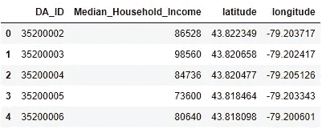

为了将收入信息与评级信息联系起来，我们可以找到与每所学校距离最小的 DA，并假设它是该邻域的中值收入。

为了实现这一点，我们可以使用库 GeoPy( `pip install geopy`)来寻找 vincenty 距离(球面上两点之间的距离)。

```
from geopy.distance import vincentyincomes = []
for school_coordinate in school_coordinates:
    minimum_distance = 9999
    for i, DA_coordinate in enumerate(DA_coordinates):
        distance = vincenty(school_coordinate, DA_coordinate)
        if distance < minimum_distance:
            minimum_distance = distance
            row = income_table.index[i] income_for_school_area = float(income_at_latlongs_df.loc
                                   [row, 'Median_Household_Income'])
    incomes.append(income_for_school_area)df['INCOME'] = incomes
```

将这些收入添加到学校位置数据框架后，我们现在有了完整的数据。

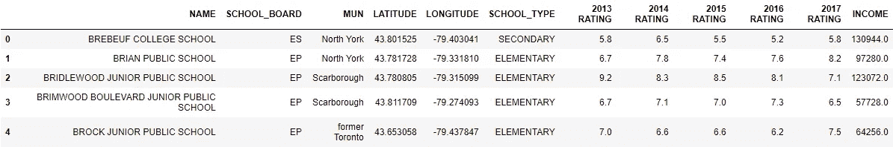

# 数据可视化

首先，我们可以使用图书馆 gmplot ( `pip install gmplot`)制作一个散点图，显示每个学校的位置。

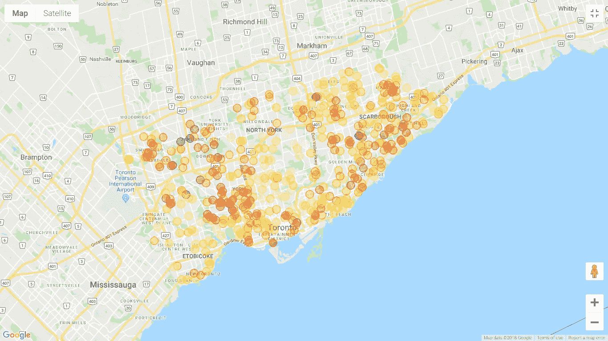

该图显示，多伦多中部和东北部的学校评级较高(较亮的点表示评级较高)。通过查阅由人口普查局提供的收入热图，我们可以看到有可能存在相关性。

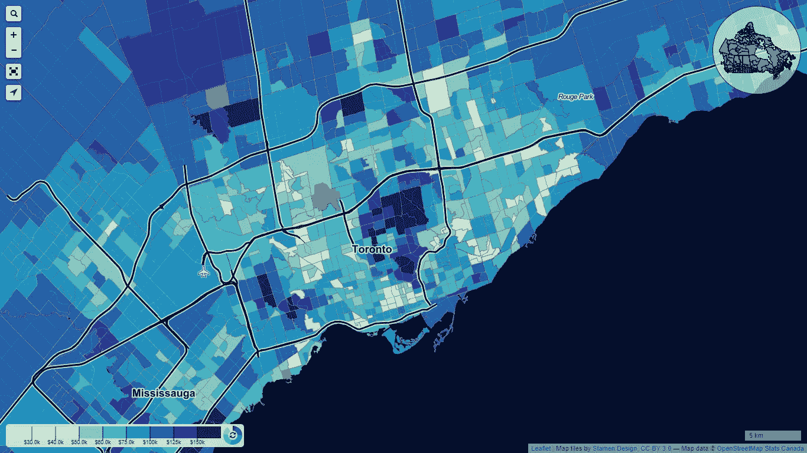

我们来看看多伦多给出的评分分布。

```
from statistics import stdev, mean
import matplotlib.pyplot as plt
import seaborn as sns
sns.set(color_codes=True)ratings = df['2017 RATING']sns.distplot(ratings)
plt.title('Distribution of 2017 Ratings in Toronto')
plt.xlabel('School Rating Out of 10')
plt.ylabel('Proportion of Schools')
plt.show()print(mean(ratings), stdev(ratings))
```

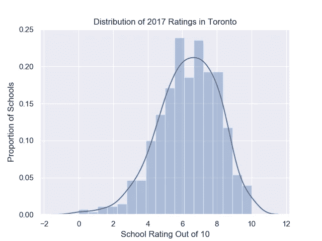

数据大致呈正态分布，均值为 6.35，标准差为 1.73。

既然小学和中学的数据我们都有，那就来看看两种类型的区别吧。

```
fig = sns.boxplot(x=df['SCHOOL_TYPE'], y=ratings)
plt.title('Distribution of 2017 Ratings by School Type')
plt.xlabel('School Type')
plt.ylabel('School Rating Out of 10')
labels = ['Secondary', 'Elementary']
fig.set_xticklabels(labels)
plt.show()
```

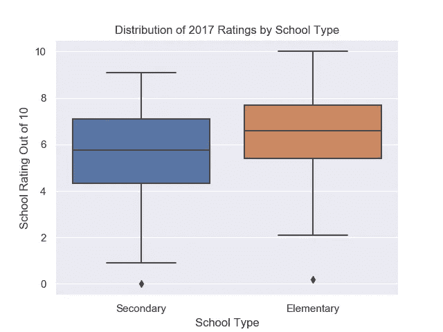

在这里我们看到，小学的评级通常高于中学。

同样，也可以绘制每个学校董事会评级的箱线图。

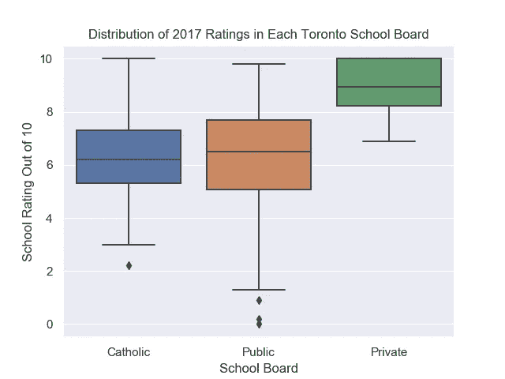

不出所料，私立学校排名最高，而公立和天主教学校排名相近。

我们也可以做一个多伦多每个自治市的收视率箱线图。

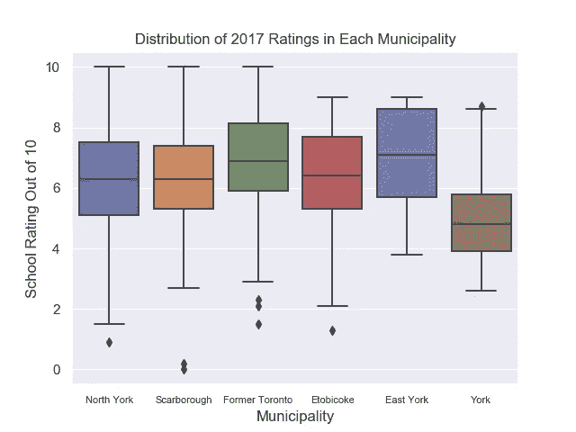

除了约克市的四分位间距低于其他城市外，其他城市的评级似乎相似。稍后，我们可以测试这种差异在统计上是否显著。

为了恰当地将学校的评级形象化为居民年收入中值的函数，我们应该将收入以 2 万美元为间隔放入垃圾箱。

```
highest_bin = 200000
num_bins = 10
intervals = highest_bin / num_bins
values = []
column = 'INCOME'
for _, row in df.iterrows():
    bin = row[column]/intervals
    bin = min(bin, num_bins)
    bin = (math.floor(bin))
    values.append(bin)df[column+'_BINS'] = values
```

绘制数据的箱线图得出:

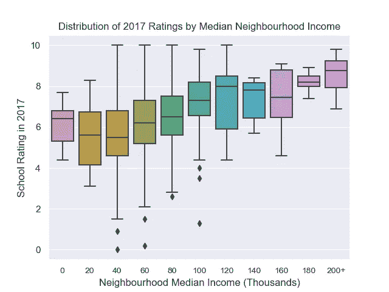

这张图暗示了在一个街区的中值收入和离那个街区最近的学校的评级之间有某种关联。

# 统计显著性

即使我们在上面的方框图中直观地看到了差异，这也不足以证明这种差异不仅仅是偶然的。我们必须证明这种差异具有统计学意义。为了找到统计意义，我们可以进行单向方差分析。通过方差分析，我们陈述了零假设，即类别中的样本是从具有相同均值的总体中抽取的。例如，对于学校董事会列，我们假设 _catholic = _public = _private。另一个假设是，样本是从拥有不同均值的人群中抽取的，因此会受到他们所属群体的影响。

```
from scipy import statscolumns_to_analyze = ['MUN', 'SCHOOL_BOARD', 'SCHOOL_TYPE']
for column in columns_to_analyze:
    grouped_dfs = []
    for group in df.groupby(column).groups:
        grouped_df = df.groupby(column).get_group(group)
        grouped_df = grouped_df.reset_index()['2017 RATING']
        grouped_dfs.append(list(grouped_df.dropna()))
    F, p = stats.f_oneway(*grouped_dfs)
    print(f'{column}: {p: 0.2e}')MUN: 3.70e-05
SCHOOL_BOARD: 9.25e-07
SCHOOL_TYPE: 1.33e-05
```

每一列的方差分析给出了远低于 0.05 的 p 值，因此我们可以说差异具有统计学意义。我们拒绝每列的零假设，即各组的总体均值相同。

# 特征工程

我们可以使用回归技术来看看学校的评级是否可以使用我们创建的特征来预测。

但是，在我们将特征放入模型之前，必须填充缺失值，并且所有特征必须被热编码。为了处理缺失值，我们用已收集的评分平均值替换任何缺失值。我们应该确保平均值中不包括 2017 年的评级，因为这是我们试图预测的值。我们可以在遍历前面的文本文件时填充缺失的值。

```
def fill_missing_values(ratings_with_na):ratings_with_na = [np.nan if rating == 'n/a' 
                              else float(rating) 
                              for rating in ratings_with_na]if all([rating == 'n/a' for rating in ratings_with_na[0:-1]]):
            return ratings_with_namean_rating = round(np.nanmean(ratings_with_na[0:-1]), 1)filled_missing_values = []
    for rating in ratings_with_na:
        if rating in [np.nan]:
            filled_missing_values.append(mean_rating)
        else:
            filled_missing_values.append(rating)return filled_missing_values
```

该函数采用一个包含 5 个评级的列表，并将所有“不适用”的评级转换为 np.nan，因此我们可以应用 np.nanmean()来计算平均值。然后，我们检查前 4 个评分是否缺失，如果缺失，我们将返回包含缺失值的列表(稍后我们将删除这些行，因为它们非常少)。最后，我们找到 2013-2016 年间的平均评级，并返回一个没有缺失值的新评级列表。

为了对每个分类值进行热编码，我们可以使用 pd.get_dummies()，它将每个分类值转换成多个列。根据数据点是否属于该类别，每列的值可能为 0 或 1。

```
ordinal_columns = df[['INCOME_BINS', '2013 RATING', '2014 RATING',
                      '2015 RATING', '2016 RATING', '2017 RATING']]
categorical_columns = ['MUN', 'SCHOOL_TYPE', 'SCHOOL_BOARD']
categorical_columns = pd.get_dummies(df[categorical_columns])
ohe_df = pd.concat([categorical_columns, ordinal_columns], axis=1)
```

包含重命名列的新数据框架如下所示。

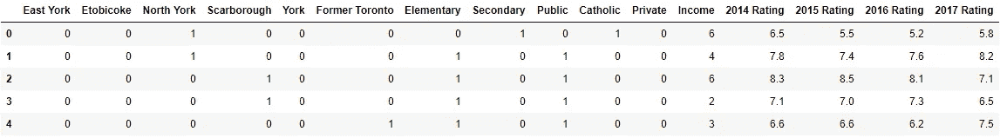

既然所有缺失值都已填充，分类列也已热编码，现在让我们绘制皮尔逊相关矩阵，找出我们应该使用的特征。

```
from matplotlib.colors import LinearSegmentedColormapcorr_sorted = abs(ohe_df.corr()['2017 Rating']).sort_values()
sorted_df = ohe_df[list(corr_sorted.index)]
corr = round(sorted_df.corr(), 2)min_color = 'white'
max_color = (0.03137254, 0.18823529411, 0.41960784313, 1)
cmap = LinearSegmentedColormap.from_list("", [max_color,
                                              min_color,
                                              max_color])
fig = sns.heatmap(corr, annot=True, cmap=cmap,
                  xticklabels=corr.columns.values,
                  yticklabels=corr.columns.values,
                  cbar=False)
plt.xticks(rotation=0)
fig.xaxis.set_tick_params(labelsize=8)
fig.yaxis.set_tick_params(labelsize=8)plt.show()
```

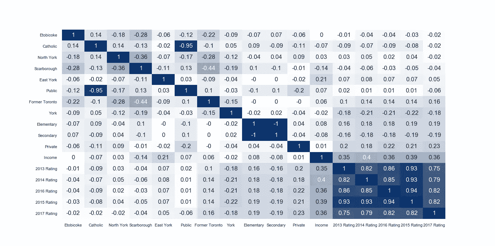

对相关矩阵进行排序，颜色相对于 0 对称绘制，因此我们可以看到 0.19 的相关性与-0.19 的相关性一样显著。正如假设的那样，每年的学校评级与其他年份的评级密切相关，而收入和私立学校的地位与评级有一定的相关性。

# 预言；预测；预告

首先，我们必须建立指标来评估我们的模型是否有效。在测量回归性能时，我们将使用平均绝对误差和均方根误差。为了衡量我们的机器学习模型是否值得努力，我们将创建一个基线。例如，如果我们每次都预测平均值，并获得比任何机器学习模型更低的均方误差/平均绝对误差，那么我们的模型实际上是无用的。如果我们每次只预测平均评分(6.35)，以下是衡量标准。

```
y_predicted = mean(df_y)
rmse = (mean((y_predicted - df_y)**2))**0.5
mae = mean(abs(y_predicted - df_y))
print(f'RMSE: {rmse: 0.4f}, MAE: {mae: 0.4f}')RMSE:  1.7311, MAE:  1.3864
```

如果我们对所有情况的预测值都是 6.35，那么平均来说，预测值将与真实值相差约 1.39 个点。

现在，我们可以设置模型来预测 2017 年给出的评分！为了了解在没有往年信息的情况下能否预测 2017 年的评级，我们将使用学校类型、学校董事会、自治市和收入特征。下面是随机森林、梯度推进、线性回归和留一交叉验证的支持向量机的设置代码。

```
from sklearn.model_selection import cross_validate, LeaveOneOut
from sklearn.ensemble import RandomForestRegressor, 
     GradientBoostingRegressor
from sklearn.linear_model import LinearRegression
from sklearn.svm import SVRdef LOOCV(ohe_df, use_previous_years=False):
    models = {
     'RFR': RandomForestRegressor(n_estimators=50, random_state=0),
     'GBR': GradientBoostingRegressor(max_depth=1, random_state=0),
     'LIR': LinearRegression(),
     'SVR': SVR(kernel='linear')
    }
    if use_previous_years is False:
        ordinal_columns = df[['INCOME_BINS', '2017 RATING']]
        ohe_df = pd.concat([categorical_columns,
        ordinal_columns], axis=1) df_x = ohe_df.iloc[:, :-1]
    df_y = ohe_df.iloc[:, -1] scoring = ['neg_mean_squared_error', 'neg_mean_absolute_error']
    loo = LeaveOneOut.get_n_splits(df_x, df_y) for name, model in models.items():
        scores = cross_validate(model, df_x, df_y, cv=loo,
                                scoring=scoring)
        rmse = (-1*mean(scores['test_neg_mean_squared_error']))**0.5
        mae = -1*mean(scores['test_neg_mean_absolute_error'])
        print(f'{name} RMSE: {rmse: 0.4f}, MAE: {mae: 0.4f}')LOOCV(ohe_df)RFR RMSE:  1.6488, MAE:  1.2841
GBR RMSE:  1.5320, MAE:  1.2210
LIR RMSE:  1.5255, MAE:  1.2210
SVR RMSE:  1.5447, MAE:  1.2354
```

我们可以看到，线性回归的平均绝对误差为 1.22，RMSE 为 1.5255。这是不坏的表现，因为这意味着我们的预测平均在真实值的 1.22 点以内，这比我们每次预测平均值要好 0.16 点或 12%。

为了获得更多的信息，我们来看看与往年的信息有哪些误差。

```
LOOCV(models, df_x, df_y, use_previous_years=True)RFR RMSE:  1.0381, MAE:  0.7906
GBR RMSE:  0.9796, MAE:  0.7443
LIR RMSE:  0.9513, MAE:  0.7215
SVR RMSE:  0.9520, MAE:  0.7200
```

SVM 和线性回归这次效果最好，平均绝对误差为 0.72，比我们每次预测平均值的结果好 0.76 点或 48%！

# 结论

在本文中，我们汇总了来自多伦多数据目录、StatsCan 和弗雷泽研究所的数据。在数据被转换成可用的形式后，它被用来可视化一所学校的评级(满分为 10 分)与各种特征(如学校董事会和中等邻里收入)之间的相关性。发现有相关性，有了这些信息就有可能预测一个学校的评级平均 1.22 分。

数据从质量上说的是众所周知的:贫困可以预测许多特征，而教育是一个非常重要的特征。

接下来的步骤可能包括:

*   将其他城市纳入数据
*   利用学校雇用的教师的信息
*   获取除收入以外的家庭人口统计数据，看看它如何影响学校的表现

文章中使用的所有代码都可以在我的 [GitHub](https://github.com/SayonB/Predicting-School-Ratings) 上找到。如果你对这篇文章有任何反馈或批评，你可以通过 [LinkedIn](http://www.linkedin.com/in/sayon-bhattacharjee) 联系我。