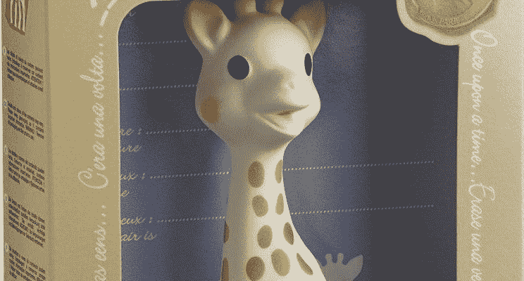
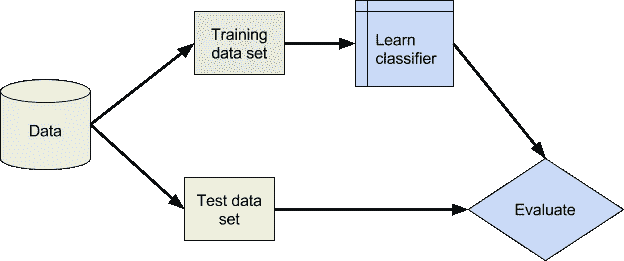
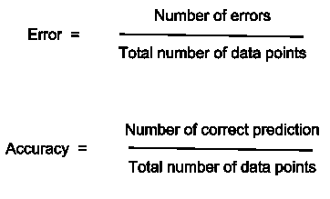
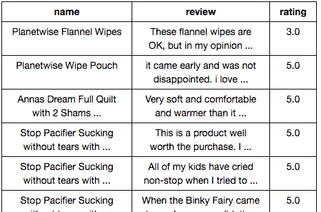
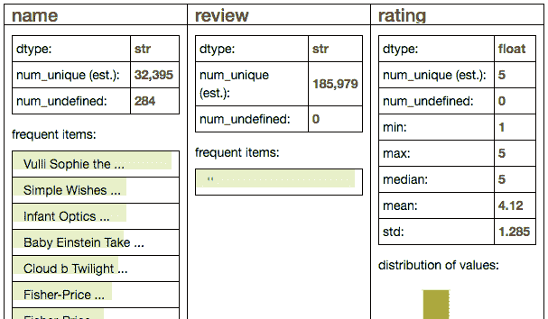
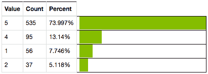
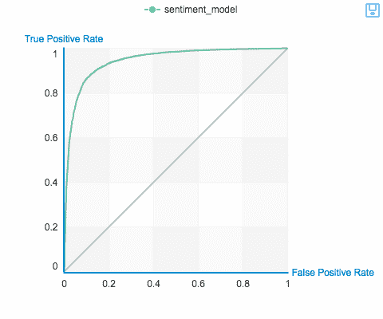
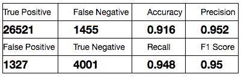
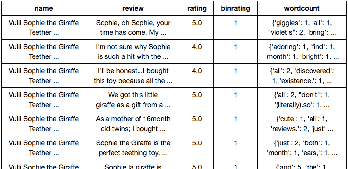
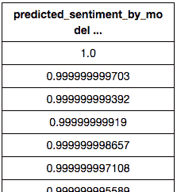

# 预测亚马逊产品评论的评分

> 原文：<https://towardsdatascience.com/predicting-sentiment-of-amazon-product-reviews-6370f466fa73?source=collection_archive---------1----------------------->

*分类器算法*



介绍

在机器学习中，分类用于根据包含类别事先已知的观察值的训练数据集，将新观察值分类到特定的集合/类别中。最常见的例子是电子邮件的“垃圾邮件”或“非垃圾邮件”类别。在电子商务中，可以使用分类器算法来基于单词对评论的情感进行分类。语言中的特定单词根据它们的积极或消极情绪被预先分类。

分类是监督学习的一个实例。训练集已正确识别观察值。分类器算法用于基于与训练数据集的相似性和/或距离从未分类的无监督数据中创建聚类/集合。

# 分析背后的统计数据


在简单分类器模型中，正和负数据点的简单计数将定义总体正或负集合。这就有问题了。例如，在句子中的单词的情况下，“Great”和“Good”都是肯定词。但是“很棒”比“好”的影响更大。我们需要训练我们的模型来衡量确定的数据点。

分类器模型边界可以是将“阳性”和“阴性”结果分开的简单线，也可以是将多个组分开的更复杂的超平面。



可以使用模型的误差或准确度以及“假阳性”和“假阴性”来观察模型的有效性。



# 使用的工具

1.  计算机编程语言
2.  GraphLab
3.  s 帧(类似于熊猫数据帧)

# 数据加载

我们准备对亚马逊产品评论进行分类，了解正面或负面评论。亚马逊有 5 星评级。我们将用它来比较我们的预测。

```
*> product_reviews=graphlab.SFrame(‘amazon_baby.gl/’)**> product_reviews.head()*
```



```
*> product_reviews.show()*
```



创建一个单词字典，将使用我的模型进行分类。

```
*> product_reviews[‘wordcount’] = graphlab.text_analytics.count_words(product_reviews[‘review’])*
```

选择一个特定的产品来预测评论的情绪。Vulli Shopie 是一款适合婴儿长牙的长颈鹿玩具。过滤产品的所有评论。

```
*> vs_reviews = product_reviews[product_reviews[‘name’]==’Vulli Sophie the Giraffe Teether’]**> vs_reviews[‘rating’].show(view=’Categorical’)*
```



# 使用分类器模型的数据分析

过滤掉中间等级为 3 的。高于 4 的评级意味着它是正面评级。

```
*> product_reviews = product_reviews[product_reviews[‘rating’] !=3]**> product_reviews[‘binrating’] = product_reviews[‘rating’] >= 4*
```

创建培训和测试数据集。

```
*> train_data, test_data = product_reviews.random_split(0.8, seed=0)*
```

构建一个情感分类器来识别评论是正面的还是负面的情感。逻辑分类器模型将使用来自训练数据的单词(单词计数列)和评级(binrating)来开发预测目标(binrating)的模型。

```
*> sentiment_model = graphlab.logistic_classifier.create (train_data,* *target=’binrating’,* *features=[‘wordcount’],* *validation_set=test_data)*
```

评估测试数据的模型，并使用 ROC(受试者工作特性)曲线显示。

```
*> sentiment_model.evaluate(test_data, metric=’roc_curve’)*
```

# 结果

```
*> sentiment_model.show(view=’Evaluation’)*
```



91%的准确率就不错了。

使用我们建立的模型，预测 Vullie Sophie 长颈鹿玩具的每个评论情绪。

```
*> vs_reviews[‘predicted_sentiment_by_model’]=
sentiment_model.predict(vs_reviews, output_type=’probability’)*
```



我们的模式运行得非常好。对于更高数量的情感(接近 1)，我们可以观察到亚马逊产品星级为 5。

我们可以根据模型预测的情绪来查看最积极和最消极的评论。

```
*> vs_reviews=vs_reviews.sort(‘predicted_sentiment_by_model’, ascending=False)**> vs_reviews[0][‘review’]*
```

苏菲，哦，苏菲，你的时候到了。我的孙女，维奥莱特 5 个月大，开始长牙了。小索菲给瓦奥莱特带来了多大的快乐。索菲是由非常柔韧的橡胶制成的，结实但不坚韧。对瓦奥莱特来说，把索菲扭成前所未闻的姿势，让她把索菲送进嘴里是相当容易的。小鼻子和小蹄子完全适合小嘴巴，流口水是有目的的。索菲身上的油漆是食品级的。苏菲 1961 年出生于法国。制造商想知道为什么没有婴儿用品，于是在圣索菲节用最好的不含邻苯二甲酸盐的橡胶制作了索菲，这个名字就这样诞生了。从那时起，数以百万计的苏菲出现在这个世界上。她很柔软，婴儿的小手很容易抓住。紫罗兰特别喜欢苏菲那凹凸不平的头和角。苏菲的脖子很长，很容易抓住和扭动。她有可爱的，相当大的斑点，吸引了紫罗兰的注意。索菲有快乐的小吱吱声，带来了紫高兴的尖叫。她能让苏菲吱吱叫，这带来了很多快乐。索菲光滑的皮肤抚慰着维奥莱特的小牙龈。索菲有 7 英寸高，是婴儿抱和爱的正确尺寸。众所周知，婴儿抓到的第一件东西是放进嘴里的——拥有一个能刺激所有感官并有助于解决出牙问题的玩具是多么美妙。苏菲很小，可以放进任何尺寸的口袋或包里。索菲是从几个月到一岁婴儿的最佳选择。听到发现索菲不可抗拒的婴儿发出的咯咯笑声是多么美妙啊。苏菲万岁！强烈推荐。pris rob 12–11–09 "

最负面的评论。

```
*> vs_reviews[-1][‘review’] # most negative*
```

*“我的儿子(现在 2.5 岁)喜欢他的索菲，我每次去参加婴儿送礼会都会买一个。现在，我的女儿(6 个月)就在今天差点被它呛到，我再也不会给她吃了。如果我不在听得见的范围内，那可能是致命的。她发出的奇怪声音引起了我的注意，当我走到她面前，发现她弯曲的前腿被塞进了她的喉咙，她的脸变成了紫色/蓝色时，我慌了。我把它拉出来，她在尖叫前吐了整个地毯。真不敢相信我对这个玩具的看法怎么就从必须要变成不能用了。请不要忽视任何关于窒息危险的评论，它们并没有过分夸张！”*