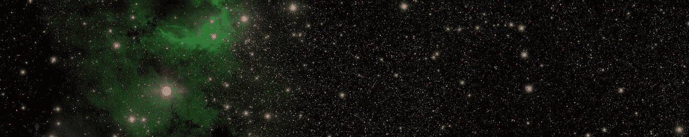
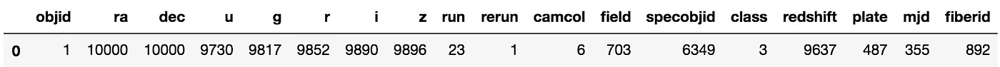
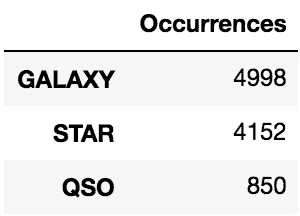
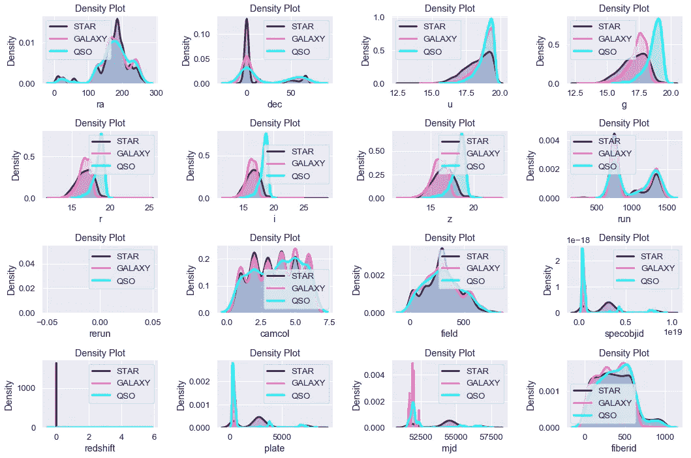
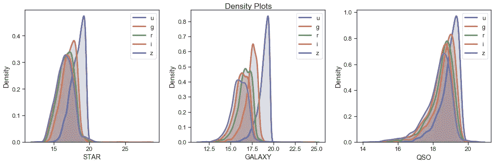
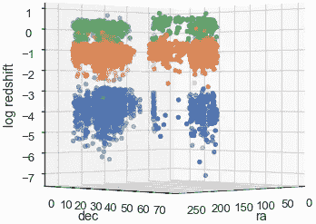
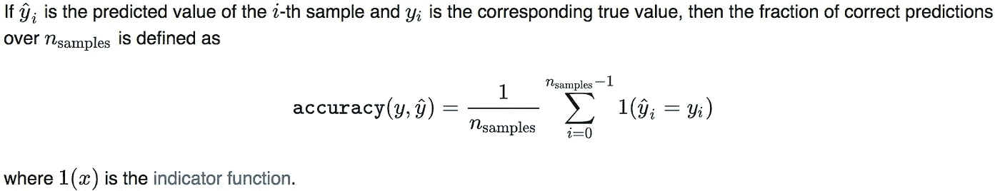
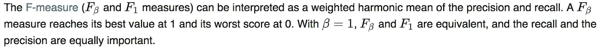
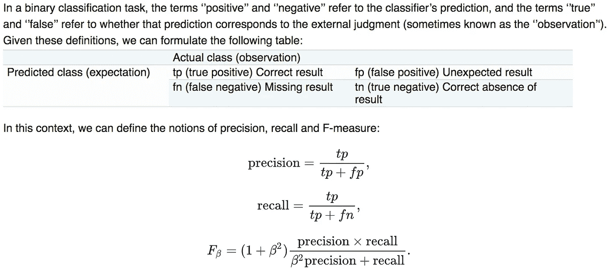
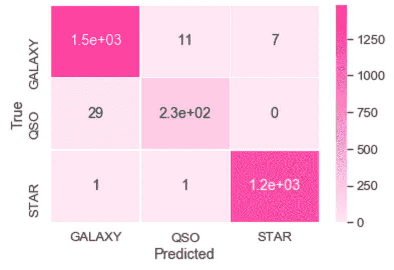

# 用 Python 中的随机森林分类器预测恒星、星系和类星体

> 原文：<https://towardsdatascience.com/predicting-stars-galaxies-quasars-with-random-forest-classifiers-in-python-edb127878e43?source=collection_archive---------10----------------------->

## 来自斯隆数字巡天数据集的见解



The SDSS website banner!

最近，在我寻找有趣(物理学相关)数据集的过程中，我偶然发现了 Kaggle 上的[斯隆数字巡天(SDSS)数据集](https://www.kaggle.com/lucidlenn/sloan-digital-sky-survey)，以及 Faraz Rahman 的[辉煌 Kaggle 内核](https://www.kaggle.com/farazrahman/predicting-star-galaxy-quasar-with-svm/)，它使用 R 中的支持向量机预测了不同类型的天文物体(恒星、星系和类星体)。然而，由于 [R 带回了一些可怕的记忆](https://www-teaching.physics.ox.ac.uk/practical_course/scripts/)和[训练 SVM 需要大量的计算工作](https://stackoverflow.com/questions/16585465/training-complexity-of-linear-svm)，我决定使用 sci 来尝试一下这个分类问题

# 数据概述

## 标签

那么恒星、星系和类星体到底是什么？如果你在开始这个项目之前问我，我可能无法回答(真为我感到羞耻)。幸运的是，法拉兹的笔记本简明扼要地总结了它们是什么:

*   *一个* **星系** *是一个由恒星、恒星残骸、星际气体、尘埃和暗物质组成的引力束缚系统。星系根据它们的视觉形态分为椭圆形、螺旋形和不规则形。许多星系被认为在其活动中心有超大质量黑洞。*
*   ***恒星** *是一种天文物体，由一个发光的等离子球体组成，通过自身重力聚集在一起。离地球最近的恒星是太阳。**
*   **一颗* **类星体** *又称准恒星天体，是一颗极其明亮的活动星系核(AGN)。类星体辐射的能量是巨大的。最强大的类星体的亮度超过 1041 瓦，是普通大星系如银河系的数千倍。**

*安德鲁·邦克教授关于[恒星和星系(S26)](https://users.physics.ox.ac.uk/~Bunker/s26StarsGalaxies.htm) 的短选项课程的页面也是一个很好的资源。*

## *特征*

*细节的细节可以在 Kaggle 数据集概述上找到。更重要的功能总结如下:*

*   *ra，dec —分别为赤经和赤纬*
*   *u，g，r，I，z-过滤波段(又称光度系统或天文星等)*
*   *运行、重新运行、camcol、字段—图像中字段的描述符(即 2048 x 1489 像素)*
*   *红移——由于天文物体的运动，波长增加*
*   *车牌——车牌号码*
*   *mjd —修正儒略历观测日期*
*   *光纤 id —光纤 id*

# *探索性分析*

*这里的分析遵循了法拉兹的分析。我会让观想自己说话。*

## *加载库和数据*

```
*import numpy as np
import pandas as pd
import matplotlib.pyplot as plt
import seaborn as sns
%matplotlib inlinedf = pd.read_csv("skyserver.csv")*
```

## *数据描述*

*自然，我从`df.head()`、`df.describe()`和`df.info()`开始。`df.info()`的输出如下所示:*

```
*<class 'pandas.core.frame.DataFrame'>
RangeIndex: 10000 entries, 0 to 9999
Data columns (total 18 columns):
objid        10000 non-null float64
ra           10000 non-null float64
dec          10000 non-null float64
u            10000 non-null float64
g            10000 non-null float64
r            10000 non-null float64
i            10000 non-null float64
z            10000 non-null float64
run          10000 non-null int64
rerun        10000 non-null int64
camcol       10000 non-null int64
field        10000 non-null int64
specobjid    10000 non-null float64
class        10000 non-null object
redshift     10000 non-null float64
plate        10000 non-null int64
mjd          10000 non-null int64
fiberid      10000 non-null int64
dtypes: float64(10), int64(7), object(1)
memory usage: 1.4+ MB*
```

*没有一个条目是 NaN，这是维护良好的数据集所期望的。清洁不是必须的。*

## *唯一条目*

*`nunique()`方法返回包含每列唯一条目数量的 Series 对象。*

```
*df.nunique().to_frame().transpose()*
```

**

## *每个天文实体的出现*

*然后我在班级栏上运行了`value_counts()`。*

```
*occurrences = df['class'].value_counts().to_frame().rename(index=str, columns={'class': 'Occurrences'})occurrences*
```

**

*我们看到大多数条目不是星系就是恒星。只有 8.5%的条目被归类为类星体。*

## *密度分布图*

*使用核密度估计(kde)，我绘制了各种特征的(平滑)密度分布。*

```
*featuredf = df.drop(['class','objid'], axis=1)
featurecols = list(featuredf)
astrObjs = df['class'].unique()colours = ['indigo', '#FF69B4', 'cyan']plt.figure(figsize=(15,10))
for i in range(len(featurecols)):
    plt.subplot(4, 4, i+1)
    for j in range(len(astrObjs)):
        sns.distplot(df[df['class']==astrObjs[j]][featurecols[i]], hist = False, kde = True, color = colours[j], kde_kws = {'shade': True, 'linewidth': 3}, label = astrObjs[j])
    plt.legend()
    plt.title('Density Plot')
    plt.xlabel(featurecols[i])
    plt.ylabel('Density')
plt.tight_layout()*
```

**

*还为每个类别绘制了滤波器频带密度。*

```
*filterbands = pd.concat([df.iloc[:,3:8], df['class']],axis=1)plt.figure(figsize=(15,5))
plt.suptitle('Density Plots')
sns.set_style("ticks")
for i in range(len(astrObjs)):
    plt.subplot(1, 3, i+1)
    for j in range(len(featurecols2)):
        sns.distplot(df[df['class']==astrObjs[i]][featurecols2[j]], hist = False, kde = True, kde_kws = {'shade': True, 'linewidth': 3}, label = featurecols2[j])
    plt.legend()
    plt.xlabel(astrObjs[i])
    plt.ylabel('Density')
plt.tight_layout()*
```

**

## *附加可视化*

*为了完整起见，我包括一个 3D 图，与原始笔记本相同。最初的意图似乎是确定 SVM 的线性核是否有效(如果我错了，请纠正我)。底部有很多群集，我取了红移的对数(忽略误差)以使可视化更清晰。*

```
*from mpl_toolkits.mplot3d import Axes3Dfig = plt.figure(figsize=(5,5))
ax = Axes3D(fig)for obj in astrObjs:
    luminous = df[df['class'] == obj]
    ax.scatter(luminous['ra'], luminous['dec'], np.log10(luminous['redshift']))ax.set_xlabel('ra')
ax.set_ylabel('dec')
ax.set_zlabel('log redshift')ax.view_init(elev = 0, azim=45)plt.show()*
```

**

# *构建随机森林分类器*

## *训练集和测试集分离*

*传统的列车测试分割可以通过以下方式完成:*

```
*from sklearn.model_selection import train_test_split
from sklearn.ensemble import RandomForestClassifierx_train, x_test, y_train, y_test = train_test_split(features, labels, test_size=0.3, random_state=123, stratify=labels)clf = RandomForestClassifier()*
```

## *训练复杂性*

*当我最初试图用`sklearn.svm.linearSVC`训练我的数据时，我的笔记本电脑开始严重过热。训练时间复杂度一般在 O(mn)到 O(mn)之间，其中 m 是特征数，n 是观测数，如 Jessica Mick [此处](https://datascience.stackexchange.com/questions/989/svm-using-scikit-learn-runs-endlessly-and-never-completes-execution)所解释。另一方面，growing CART(分类和回归树)的训练复杂度为 O(mn logn)和 O(mn)，这里的[解释为](https://stats.stackexchange.com/questions/17616/literature-on-the-algorithm-for-optimal-splitting-in-the-growing-of-classificati)(随机森林是 CART 的系综)。由于时间、耐心和手头的咖啡有限，我决定换成随机森林模型。*

*事后看来，我可以做的一件事是将我的数据缩放到[-1，1]来加速 SVM(甚至随机森林)，正如 Shelby Matlock [在同一篇文章](https://datascience.stackexchange.com/questions/989/svm-using-scikit-learn-runs-endlessly-and-never-completes-execution)中提到的。这样我也能得到更稳定的预测结果。*

```
*from sklearn.preprocessing import MinMaxScaler
scaling = MinMaxScaler(feature_range=(-1,1)).fit(x_train)
x_train_scaled = scaling.transform(x_train)
x_test_scaled = scaling.transform(x_test)*
```

## *超参数优化*

*对于超参数调谐，我发现[这个](/hyperparameter-tuning-the-random-forest-in-python-using-scikit-learn-28d2aa77dd74)和[这个](https://chrisalbon.com/machine_learning/model_selection/hyperparameter_tuning_using_random_search/)相当方便。我们首先实例化一个随机森林，并查看可用超参数的默认值。美化打印`get_params()`方法:*

```
*from pprint import pprint
pprint(clf.get_params())*
```

*这给出了:*

```
*{'bootstrap': True,
 'class_weight': None,
 'criterion': 'gini',
 'max_depth': None,
 'max_features': 'auto',
 'max_leaf_nodes': None,
 'min_impurity_decrease': 0.0,
 'min_impurity_split': None,
 'min_samples_leaf': 1,
 'min_samples_split': 2,
 'min_weight_fraction_leaf': 0.0,
 'n_estimators': 10,
 'n_jobs': None,
 'oob_score': False,
 'random_state': None,
 'verbose': 0,
 'warm_start': False}*
```

*我决定关注的超参数是:*

*   *`n_estimators`(森林中的树木数量)*
*   *`max_features` (max。节点分割中使用的特征数量，通常为。<数据集中的特征数量)*
*   *`max_depth`(最大。每个决策树中的层数)*
*   *`min_samples_split`(敏。分割节点之前节点中的数据点数)*
*   *`min_samples_leaf`(最小。节点中允许的数据点数)*
*   *`criterion`(用于确定决策树停止标准的度量)*

## *使用随机搜索进行调整*

*为了缩小搜索范围，我首先进行了随机搜索交叉验证。在这里，我使用 k = 10 倍交叉验证(`cv=10`)、跨越 100 个不同组合(`n_iter=100`)并同时使用所有可用内核(`n_jobs=-1`)来执行参数的随机搜索。随机搜索随机选择特征的组合，而不是遍历每个可能的组合。更高的`n_iter`和`cv`分别导致更多的组合和更小的过拟合可能性。*

```
*from sklearn.model_selection import RandomizedSearchCVhyperparameters = {'max_features':[None, 'auto', 'sqrt', 'log2'],
                   'max_depth':[None, 1, 5, 10, 15, 20],
                   'min_samples_leaf': [1, 2, 4],
                   'min_samples_split': [2, 5, 10],
                   'n_estimators': [int(x) for x in np.linspace(start = 10, stop = 100, num = 10)],
                   'criterion': ['gini', 'entropy']}rf_random = RandomizedSearchCV(clf, hyperparameters, n_iter = 100, cv = 10, verbose=2, random_state=123, n_jobs = -1)rf_random.fit(x_train, y_train)*
```

*一大堆东西出现了。为了获得最佳参数，我调用了:*

```
*rf_random.best_params_*
```

*这给出了:*

```
*{'n_estimators': 100,
 'min_samples_split': 5,
 'min_samples_leaf': 2,
 'max_features': None,
 'max_depth': 15,
 'criterion': 'entropy'}*
```

## *使用网格搜索进行调整*

*我现在可以指定更小范围的超参数来关注。GridSearchCV 非常适合超参数的微调。*

```
*from sklearn.model_selection import GridSearchCVhyperparameters = {'max_features':[None],
                   'max_depth':[14, 15, 16],
                   'min_samples_leaf': [1, 2, 3],
                   'min_samples_split': [4, 5, 6],
                   'n_estimators': [90, 100, 110],
                   'criterion': ['entropy']}rf_grid = GridSearchCV(clf, hyperparameters, cv = 10, n_jobs = -1, verbose = 2)
rf_grid.fit(x_train, y_train)*
```

*这花了我大约 50 分钟。我打了电话:*

```
*rf_grid.best_params_*
```

*这返回了:*

```
*{'criterion': 'entropy',
 'max_depth': 14,
 'max_features': None,
 'min_samples_leaf': 2,
 'min_samples_split': 5,
 'n_estimators': 100}*
```

## *训练分类器*

*我最后用最佳超参数更新了分类器。*

```
*clf.set_params(criterion = 'entropy', max_features = None, max_depth = 14, min_samples_leaf = 2, min_samples_split = 5, n_estimators = 100)*
```

# *测试和评估*

*然后，我在测试集上测试了更新后的分类器，并根据几个指标对其进行了评估。*

## *准确性得分和 F1 得分*

*注意，`accuracy_score`是指校正预测的分数，`f1_score`是精度(分类器不将阴性样本标记为阳性的能力)和召回率(分类器找到所有阳性样本的能力)的加权平均值。scikit-learn 文档最好地解释了这些概念:*

**

*Formula for accuracy_score*

****

*Formula for f1_score, where beta=1*

*`sklearn.metrics`有这些现成的。列表`f1_score`中分数的顺序对应于类的编码方式，这可以通过使用分类器的`.classes_`属性来访问。*

```
*from sklearn.metrics import accuracy_score, f1_scoresortedlabels = clf.classes_
accscore = accuracy_score(y_test, y_pred)
f1score = f1_score(y_test, y_pred, average = None)print(accscore)
for i in range:
    print((sortedlabels[i],f1score[i]), end=" ")*
```

*这将返回非常令人满意的分数。*

```
*0.99
('GALAXY', 0.9900265957446809) ('QSO', 0.9596774193548387) ('STAR', 0.9959935897435898)*
```

## *混淆矩阵*

*A [混淆矩阵](https://scikit-learn.org/dev/auto_examples/model_selection/plot_confusion_matrix.html) C 有矩阵元素 C_(i，j)对应于已知在 I 组但预测在 j 组的观测值的数量，换句话说，对角线元素代表正确的预测，而非对角线元素代表错误标记。我们的目标是得到混淆矩阵的大对角线值 C(I，I)。*

*我们看一下分类报告和混淆矩阵。*

```
*from sklearn.metrics import classification_report, confusion_matrixcm = confusion_matrix(y_test, y_pred, sortedlabels)print(classification_report(y_test, y_pred))
print(cm)*
```

*这将返回:*

```
*precision    recall  f1-score   support

      GALAXY       0.98      0.99      0.98      1499
         QSO       0.95      0.89      0.92       255
        STAR       0.99      1.00      1.00      1246

   micro avg       0.98      0.98      0.98      3000
   macro avg       0.97      0.96      0.97      3000
weighted avg       0.98      0.98      0.98      3000

[[1481   11    7]
 [  29  226    0]
 [   1    1 1244]]*
```

## *可视化混淆矩阵*

*我一般觉得有用(而且好看！)来绘制混淆矩阵。在我选择的 seaborn 调色板中，较深的颜色意味着更多的条目。*

```
*cm = pd.DataFrame(cm, index=sortedlabels, columns=sortedlabels)sns.set(font_scale=1.2)
sns.heatmap(cm, linewidths=0.5, cmap=sns.light_palette((1, 0.2, 0.6),n_colors=10000), annot=True)
plt.xlabel('Predicted')
plt.ylabel('True')*
```

**

*如果你有反馈/建设性的批评，请在下面随意评论！*