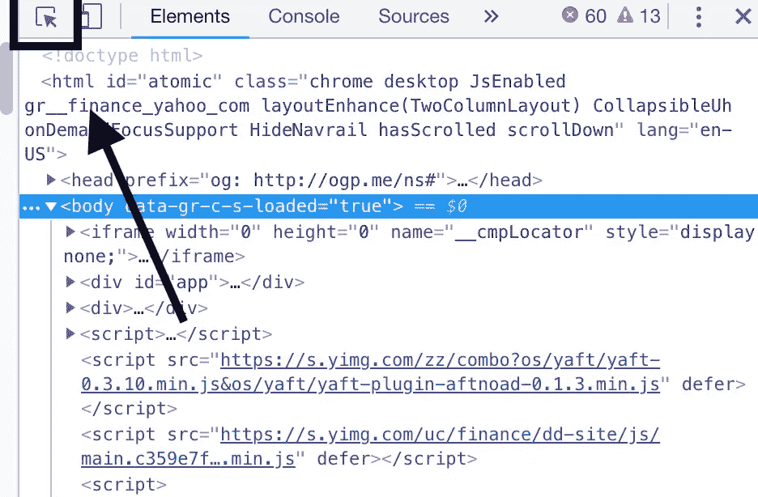
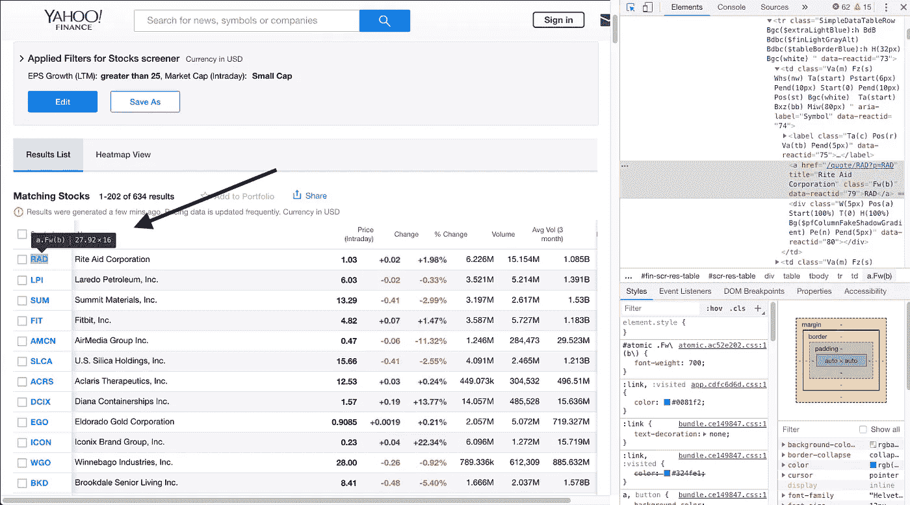
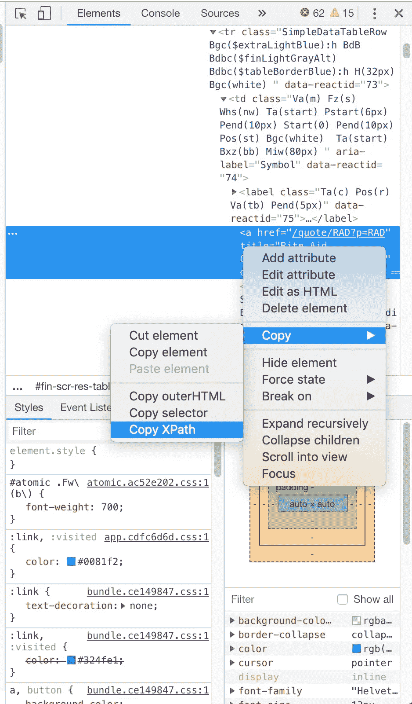

# 用 Python 预测股票价格

> 原文：<https://towardsdatascience.com/predicting-stock-prices-with-python-ec1d0c9bece1?source=collection_archive---------3----------------------->

## 用 100 行代码

投资股票市场过去需要大量资金和经纪人，经纪人会从你的收入中提成。然后 Robinhood 颠覆了这个行业，让你只需投资 1 美元，完全避开经纪人。Robinhood 和类似的应用向任何拥有联网设备的人开放了投资，并让非投资者有机会从最新的科技初创企业中获利。


“space gray iPhone X turned on” by [rawpixel](https://unsplash.com/@rawpixel?utm_source=medium&utm_medium=referral) on [Unsplash](https://unsplash.com?utm_source=medium&utm_medium=referral)

然而，让我们这些不是经济学家或会计师的人自由投资“最热门”或“趋势”股票并不总是最好的财务决策。

成千上万的公司使用软件来预测股票市场的走势，以帮助他们的投资决策。普通的罗宾汉用户没有这个功能。原始预测算法，如时间序列线性回归，可以通过利用 python 包如 [scikit-learn](https://pypi.org/project/scikit-learn/) 和[iexfinance](https://pypi.org/project/iexfinance/)来进行时间序列预测。

这个程序将从网上抓取给定数量的股票，预测它们在一定天数内的价格，并向用户发送短信，通知他们可能适合查看和投资的股票。

# 设置

为了创建一个程序来预测股票在一定天数内的价值，我们需要使用一些非常有用的 python 包。您需要安装以下软件包:

1.  y
2.  [硒](https://pypi.org/project/selenium/)
3.  [sklearn](https://pypi.org/project/scikit-learn/)
4.  一 [exfinance](https://pypi.org/project/iexfinance/)

如果您还没有这些包，您可以通过`pip install PACKAGE`或者通过克隆 git 库来安装它们。

下面是一个用 pip 安装 numpy 的例子

```
pip install numpy
```

用 git

```
git clone [https://github.com/numpy/numpy](https://github.com/numpy/numpy)
cd numpy
python setup.py install
```

现在打开您最喜欢的文本编辑器，创建一个新的 python 文件。从导入以下包开始

```
import numpy as np
from datetime import datetime
import smtplib
import time
from selenium import webdriver#For Prediction
from sklearn.linear_model import LinearRegression
from sklearn import preprocessing, cross_validation, svm#For Stock Data
from iexfinance import Stock
from iexfinance import get_historical_data
```

*注意:python 附带了 datetime、time 和 smtplib 包*

为了清理雅虎股票筛选程序，你还需要安装 Chromedriver 来正确使用 Selenium。在这里可以找到[和](https://sites.google.com/a/chromium.org/chromedriver/)

# 获得股票

使用 Selenium 包，我们可以从雅虎股票筛选程序中筛选股票的代码缩写。

首先，创建一个带有参数`n`的函数`getStocks`，其中 n 是我们希望检索的股票数量。

```
def getStocks(n):
```

在函数中创建你的 chrome 驱动程序，然后使用`driver.get(url)`来检索你想要的网页。我们将导航至[https://finance . Yahoo . com/screener/predefined/aggressive _ small _ caps？offset=0 & count=202](https://finance.yahoo.com/screener/predefined/aggressive_small_caps?offset=0&count=202) 这将显示 200 只列在“激进小型股”类别中的股票。如果你去 https://finance.yahoo.com/screener，你会看到雅虎提供的所有筛选类别的列表。然后，您可以根据自己的喜好更改 URL。

```
#Navigating to the Yahoo stock screenerdriver = webdriver.Chrome(‘**PATH TO CHROME DRIVER**’)url = “https://finance.yahoo.com/screener/predefined/aggressive_small_caps?offset=0&count=202"driver.get(url)
```

确保将下载 chromedriver 的路径添加到粗体代码所在的位置。

您现在需要创建一个列表来保存 ticker 值`stock_list = []`。

接下来，我们需要找到 ticker 元素的 XPath，以便能够抓取它们。转到 screener URL 并在您的 web 浏览器中打开开发者工具(**Command+Option+I**/**Control+Shift+I**或 **F12** for Windows)。

单击“选择元素”按钮



单击股票并检查其属性



最后，复制第一个 ticker 的 XPath，HTML 元素应该如下所示

```
<a href=”/quote/RAD?p=RAD” title=”Rite Aid Corporation” class=”Fw(b)” data-reactid=”79">RAD</a>
```



XPath 应该看起来像这样

```
//*[[@id](http://twitter.com/id)=”scr-res-table”]/div[2]/table/tbody/tr[**1**]/td[1]/a
```

如果您检查第一个下面的 ticker 属性，您会注意到 XPath 完全相同，除了上面代码中加粗的 1 对于每个 ticker 增加 1。所以第 57 个 ticker XPath 值是

```
//*[[@id](http://twitter.com/id)=”scr-res-table”]/div[2]/table/tbody/tr[**57**]/td[1]/a
```

这对我们帮助很大。我们可以简单地创建一个`for`循环，每次运行时递增该值，并将跑马灯的值存储到我们的`stock_list`中。

```
stock_list = []
n += 1for i in range(1, n):
  ticker = driver.find_element_by_xpath(‘//*[@id = “scr-res-table”]/div[2]/table/tbody/tr[‘ + str(i) +          ‘]/td[1]/a’)stock_list.append(ticker.text)
```

`n`是我们的函数`getStocks(n)`将检索的股票数量。我们必须增加 1，因为 Python 是 0 索引的。然后我们使用值`i` 来修改每个 ticker 属性的 XPath。

使用`driver.quit()`退出网络浏览器。我们现在有了所有的股票价格，并准备好预测股票。

我们将创建一个函数来预测下一节中的股票，但现在我们可以创建另一个`for`循环来遍历列表中的所有股票值，并预测每个股票的价格。

```
#Using the stock list to predict the future price of the stock a specificed amount of daysfor i in stock_list:
  try:
    predictData(i, 5)
  except:
    print("Stock: " + i + " was not predicted")
```

用 try 和 except 块处理代码(以防我们的股票包不能识别股票代码值)。

# 预测股票

创建一个新函数`predictData`，它采用参数`stock`和`days`(其中 days 是我们希望预测未来股票的天数)。从 2017 年 1 月 1 日到现在，我们将使用大约 2 年的数据进行预测(尽管您可以使用任何您想要的数据)。设置`start = datetime(2017, 1, 1)`和`end = datetime.now()`。然后使用 iexfinance 函数获取给定股票`df = get_historical_data(stock, start=start, end=end, output_format=’pandas’)`的历史数据。

然后将历史数据导出到一个. csv 文件，为预测创建一个新的虚拟列，并设置`forecast_time = int(days)`

```
start = datetime(2017, 1, 1)
end = datetime.now()#Outputting the Historical data into a .csv for later use
df = get_historical_data(stock, start=start, end=end,     output_format='pandas')csv_name = ('Exports/' + stock + '_Export.csv')
df.to_csv(csv_name)
df['prediction'] = df['close'].shift(-1)
df.dropna(inplace=True)
forecast_time = int(days)
```

使用 numpy 操作数组，然后预处理这些值，并创建 X 和 Y 训练和测试值。对于这个预测，我们将使用 test_size 的`0.5`，这个值给了我最准确的结果。

```
X = np.array(df.drop(['prediction'], 1))
Y = np.array(df['prediction'])
X = preprocessing.scale(X)
X_prediction = X[-forecast_time:]X_train, X_test, Y_train, Y_test =         cross_validation.train_test_split(X, Y, test_size=0.5)
```

最后，对数据进行线性回归。创建变量`clf = LinearRegression()`，拟合 X 和 Y 训练数据，并将 X 值预测存储在变量`prediction`中。

```
#Performing the Regression on the training dataclf = LinearRegression()
clf.fit(X_train, Y_train)
prediction = (clf.predict(X_prediction))
```

在下一节中，我们将定义通过 SMS 发送股票预测的函数`sendMessage`。在`predictData`函数中添加一个`if`语句，该语句存储一个字符串作为输出，并调用`sendMessage`函数，向其传递参数`output`。

变量`output`可以包含您认为有用的任何信息。我让它告诉我股票名称，1 天预测和 5 天预测。

```
#Sending the SMS if the predicted price of the stock is at least 1 greater than the previous closing pricelast_row = df.tail(1)
if (float(prediction[4]) > (float(last_row['close']))):output = ("\n\nStock:" + str(stock) + "\nPrior Close:\n" +         str(last_row['close']) + "\n\nPrediction in 1 Day: " + str(prediction[0]) + "\nPrediction in 5 Days: " + str(prediction[4]))sendMessage(output)
```

# 发送消息

创建一个将`output`作为参数的函数`sendMessage`。要发送短信，我们将使用`smtplib`包，这样我们就可以通过电子邮件发送短信。

将您的电子邮件用户名、密码和接收号码存储为变量。我的手机运营商是威瑞森，所以我用的是@vtext 域名。多亏了这个[网站](https://20somethingfinance.com/how-to-send-text-messages-sms-via-email-for-free/)，这里有一些受欢迎的电话公司的分机号码。

*   number@txt.att.net(手机短信)，number@mms.att.net(彩信)
*   T-Mobile: number@tmomail.net(短信和彩信)
*   number@vtext.com(手机短信)，number@vzwpix.com(彩信)
*   sprint:number @ messaging . sprint PCs . com(短信)，number@pm.sprint.com(彩信)
*   维珍手机:number@vmobl.com(短信)，number@vmpix.com(彩信)

```
def sendMessage(output):username = "EMAIL"
  password = "PASSWORD"
  vtext = "PHONENUMBER@vtext.com"
```

使用以下行发送带有正确消息的 SMS

```
message = output
msg = """From: %s To: %s %s""" % (username, vtext, message)server = smtplib.SMTP('smtp.gmail.com', 587)
server.starttls()
server.login(username, password)
server.sendmail(username, vtext, msg)
server.quit()
```

# 运行程序

最后，创建一个 main 方法来运行程序。我们将把预测的股票数量设置为 200。

```
if __name__ == '__main__':
  getStocks(200)
```

# 结论

仅在 10 只股票上运行预测，实际 1 日价格和 1 日预测价格之间的平均百分比误差为 **9.02%** ，其中 5 日百分比误差是令人惊讶的 **5.90%** 。这意味着，平均而言，5 天的预测仅比实际价格低**0.14 美元**。

这些结果可以归因于样本量小，但无论如何，它们都是有希望的，可以在你投资股票时提供很大的帮助。

[查看 Github 上的完整源代码](https://github.com/Lucas-Kohorst/Python-Stock/)

[](https://medium.freecodecamp.org/creating-a-twitter-bot-in-python-with-tweepy-ac524157a607) [## 使用 Tweepy 在 Python 中创建一个 Twitter 机器人

### Twitter 大约有 15%是由机器人组成的，我想尝试一下。我谷歌了如何创建一个推特机器人…

medium.freecodecamp.org](https://medium.freecodecamp.org/creating-a-twitter-bot-in-python-with-tweepy-ac524157a607) [](https://medium.com/@lucaskohorst/twitter-data-analysis-d5fb7d42ebc7) [## 推特数据分析

### 在使用 Tweepy 和 Python 以及这段代码创建了免费的 Wtr bot 之后，我想用一种方式来看看 Twitter 用户是如何…

medium.co](https://medium.com/@lucaskohorst/twitter-data-analysis-d5fb7d42ebc7) [](/ranking-news-bias-in-python-e9bb5d1ba93f) [## Python 中的新闻倾向性排名

### 我最近在《华盛顿邮报》上读到一篇文章，题为“根据……从自由派到保守派对媒体进行排名。”

towardsdatascience.com](/ranking-news-bias-in-python-e9bb5d1ba93f)