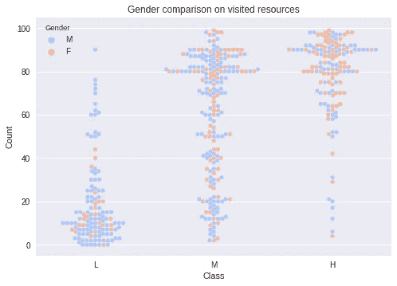
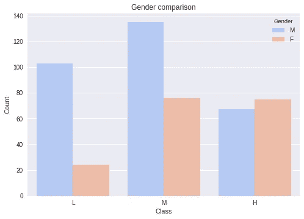

# Kaggle 内核:预测学生的成绩

> 原文：<https://towardsdatascience.com/predicting-students-grades-on-kaggle-fd6ac9b1bfb9?source=collection_archive---------7----------------------->

教育数据挖掘是指将数据挖掘应用于教育数据集。在大多数情况下，EDM 类似于普通的数据挖掘。然而，我们应该考虑教育数据集的具体特征。数据通常有多个层次。此外，许多研究是在一个机构进行的，这使得大多数研究不太容易概括。如果你想了解更多关于 EDM 的内容，你可以看看 Romero 和 Ventura 的论文。两位作者都撰写了关于该主题的多个文献综述，这些综述提供了该领域随时间推移的发展的清晰视图。EDM 中与预测相关的重要主题有:预测注册人数、预测学生表现和预测流失。

在 Kaggle 上，我发现了这个学生成绩的数据集。在分析中，我观察了各种可视化效果，并比较了基于树的机器学习算法对学生成绩的预测。尽管数据集很小，但我们能够达到几乎 82%的准确率。根据想象，女性在这项测试中的得分似乎比男性高。在线环境中被访问资源的数量是最终成绩最重要的预测因素。

您可以通过点击[此](https://www.kaggle.com/rruizendaal/d/aljarah/xAPI-Edu-Data/visualizations-tree-based-classification-methods)链接查看 Kaggle 笔记本，也可以点击下面的静态笔记本。