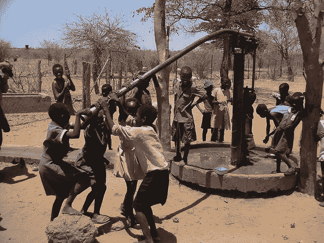
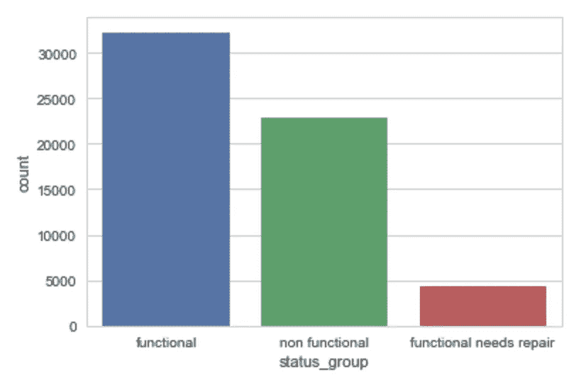
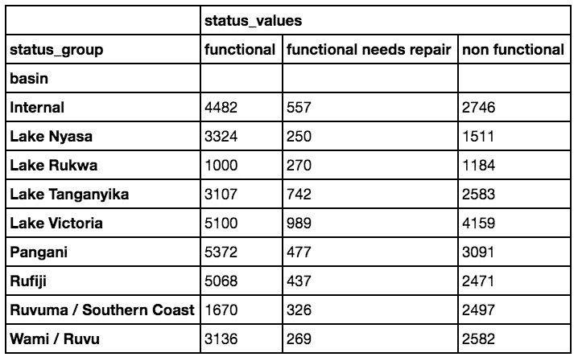
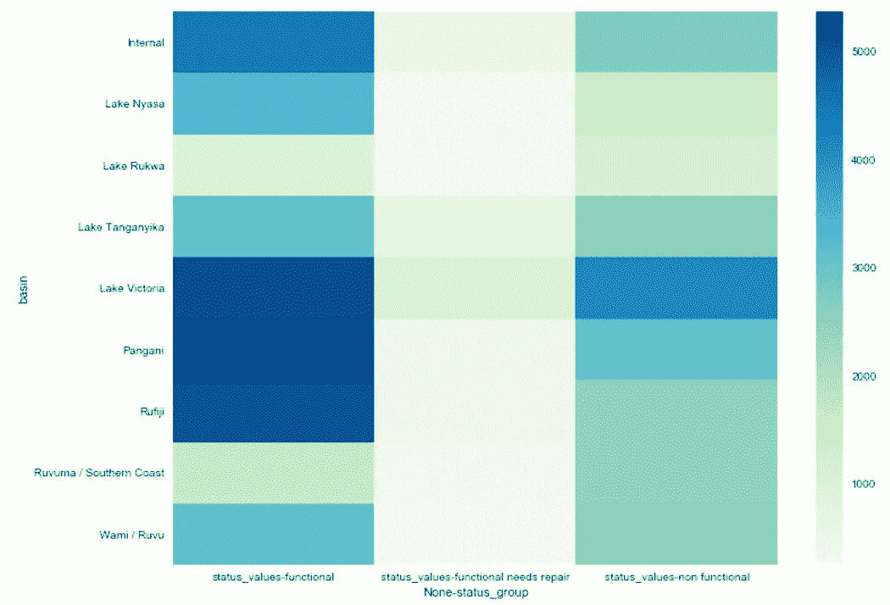
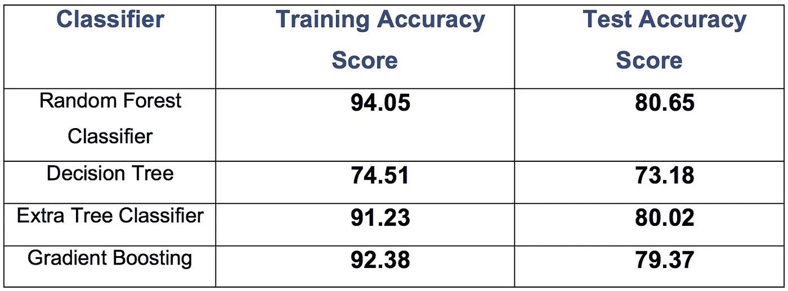
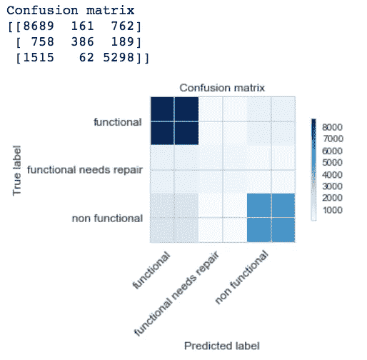
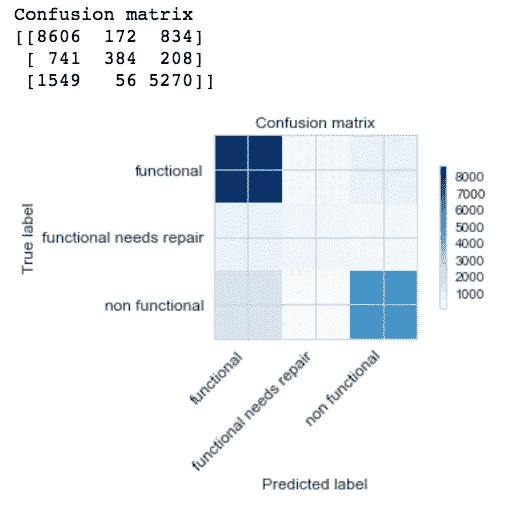
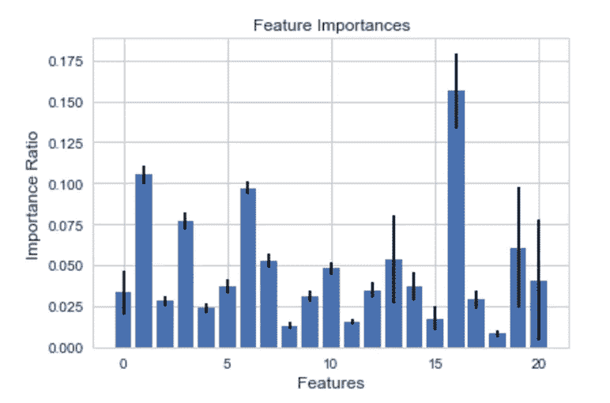

# 预测坦桑尼亚水泵的运行状况

> 原文：<https://towardsdatascience.com/predicting-the-functional-status-of-pumps-in-tanzania-355c9269d0c2?source=collection_archive---------1----------------------->

水是生命和环境的基础；它在经济和社会发展活动中发挥着核心作用。水涉及人类生活的所有领域，包括:家庭、牲畜、渔业、野生动物、工业和能源、娱乐和其他社会经济活动。它通过加强粮食安全、家庭卫生和环境，在减贫方面发挥着关键作用。安全和清洁的水的供应提高了生活水平，而水的不足造成了严重的健康风险，并导致生活水平和预期寿命的下降。

坦桑尼亚的主要淡水来源包括:湖泊、河流、小溪、水坝和地下水。然而，这些并没有在全国范围内得到很好的分配。一些地区既缺乏地表水资源，也缺乏地下水资源。

人口增长和城市化对可用水的数量和质量造成严重压力。当前和未来人类生活和环境的可持续性主要取决于适当的水资源管理。



Image Courtesy: [flickr user christophercjensen](https://www.flickr.com/photos/christophercjensen/3559607145)

首先分析坦桑尼亚现有供水点的功能状态。在此分析中，我们将研究坦桑尼亚水泵的数据集，以预测供水点的运行状况。这给了我们分析的灵感。

> 通过预测功能正常但需要维修的水泵，降低了坦桑尼亚水利部的总成本。这可以改善水泵的维护操作，并确保坦桑尼亚各地的社区都能获得清洁的饮用水。

首先，让我们看看现有的数据。

**训练集值** —训练集的独立变量。**'**[https://S3 . amazonaws . com/driven data/data/7/public/4910797 b-ee55-40a 7-8668-10 EFD 5 C1 b 960 . CSV](https://s3.amazonaws.com/drivendata/data/7/public/4910797b-ee55-40a7-8668-10efd5c1b960.csv)**'**

**训练集标签** —训练集值中每一行的因变量(status_group)。**'**[https://S3 . amazonaws . com/driven data/data/7/public/0 BF 8 BC 6 e-30d 0-4c 50-956 a-603 fc 693d 966 . CSV](https://s3.amazonaws.com/drivendata/data/7/public/0bf8bc6e-30d0-4c50-956a-603fc693d966.csv)**'**

导入数据

```
training_values = pd.read_csv('[https://s3.amazonaws.com/drivendata/data/7/public/4910797b-ee55-40a7-8668-10efd5c1b960.csv](https://s3.amazonaws.com/drivendata/data/7/public/4910797b-ee55-40a7-8668-10efd5c1b960.csv)', encoding = 'iso-8859-1')training_lables = pd.read_csv('[https://s3.amazonaws.com/drivendata/data/7/public/0bf8bc6e-30d0-4c50-956a-603fc693d966.csv](https://s3.amazonaws.com/drivendata/data/7/public/0bf8bc6e-30d0-4c50-956a-603fc693d966.csv)', encoding = 'iso-8859-1')
```

数据集中的要素

```
list(training_values.columns.values)
```

我们有 40 个预测变量。在数据集中的 40 个特征中，我们有 31 个分类变量、7 个数值变量和 2 个日期变量。

```
['id', 'amount_tsh', 'date_recorded', 'funder', 'gps_height', 'installer', 'longitude', 'latitude', 'wpt_name', 'num_private',
'basin', 'subvillage', 'region', 'region_code', 'district_code',
'lga', 'ward', 'population', 'public_meeting', 'recorded_by',
'scheme_management', 'scheme_name', 'permit', 'construction_year',
'extraction_type', 'extraction_type_group', 'extraction_type_class',
'management', 'management_group', 'payment', 'payment_type',
'water_quality', 'quality_group', 'quantity', 'quantity_group',
'source', 'source_type', 'source_class', 'waterpoint_type',
'waterpoint_type_group']
```

水泵是这三种类型中的任何一种

1.  功能性的，
2.  不起作用，或
3.  功能正常但需要修理。

```
training_lables.head(5)
```


现在，让我们检查 status_group 中泵的每种功能类型的计数，以便了解泵状态的功能场景。

```
training_lables.status_group.value_counts()functional                 32259
non functional             22824
functional needs repair     4317
Name: status_group, dtype: int64
```



根据上述结果，我们可以说，有 54.31%的功能泵、38.42%的非功能泵和 7.27%的功能泵需要修理。

根据上面的数字，我们可以粗略估计，如果我们从数据中随机抽取一个泵作为功能泵，有 54.31%的可能性。

> **删除具有相似数据表示的特征**

(提取类型，提取类型组，提取类型类)，(付款，付款类型)，
(水质，质量组)，(水源，水源类)，(子村，区域，区域代码，地区代码，lga，ward)，以及(水点类型，水点类型组)的特征组都包含不同粒度的数据的相似表示。因此，在训练过程中，我们冒着过度拟合数据的风险，在我们的分析中包括所有的特征，这些特征可以被丢弃。

*   可以删除 id，因为它对于每个实例都是唯一的。
*   num_private 大约 99%为零

# **数据清理和分析**

从数据来看，一些基于人类直觉的特征似乎是有区别的。amount_tsh(供水点可用的水量)、gps_height、basin、installer、population、scheme_management、施工年份、抽水类型、管理组、水质、付款类型、水源和供水点类型看起来对识别水泵状态非常重要。

**我们的特征中有空值，需要更新以更好地训练我们的模型。**

在清除空值的过程中，我们发现一些特征具有很高的 arity。因此，对于具有高 arity 的特征，**让我们基于频率保留前 10 个值，并将所有剩余的值分配给第 11 个合成值作为“其他”。**

将全部数据分成 10 组后，我们创建了一个数据透视表，将数据分组到子组中，该子组包含特定特性的每个合成值在每个条件下的泵数量，我们还创建了一个热图，以图形方式查看数据。例如，查看名为 basin 的特征，其实例广泛分布在所有类别中(这可能对我们的模型有影响)。

```
piv_df= training_df[['basin','status_group','status_values']]
piv_table = piv_df.pivot_table(index='basin',
                           columns='status_group', aggfunc='count')
piv_table
```



Heat Map constructed using the Pivot table created in the previous step

在丢弃不需要的特征并清理数据集后，我们剩下 20 个特征可用于训练我们的模型。我们将用于培训的功能有:

```
['amount_tsh', 'days_since_recorded', 'funder', 'gps_height',
 'installer', 'basin', 'subvillage', 'population', 'public_meeting',
 'scheme_management', 'scheme_name', 'permit', 'construction_year',
 'extraction_type', 'payment_type', 'water_quality',   
 'quantity_group', 'source_type', 'source_class', 'waterpoint_type',
 'waterpoint_type_group']
```

为分类器获取数据的一种常见方法是将可用数据分成两个集合，一个训练集和一个测试集。分类模型建立在训练集上，并应用于测试集。测试集从未被模型看到过，因此当模型应用于看不见的数据时，最终的性能将是一个很好的指导。

通常，选择的比例是 70%用于训练集，30%用于测试。这个想法是，更多的训练数据是一件好事，因为它使分类模型更好，而更多的测试数据使误差估计更准确。

```
X_train, X_test, y_train, y_test = sklearn.model_selection.train_test_split(training, test, test_size = 0.3, random_state = 0) 
```

对于分类，我们将使用集成方法，集成学习使用几种用不同学习算法构建的机器学习模型来提高预测的准确性。它基本上是对几个模型的预测进行平均，从而得到一个更好的预测。我将在这个分析中使用的一些集成方法是随机森林，额外树和梯度推进。

我们将尝试不同的方法，选择最适合我们数据的方法。

**随机森林分类器**

```
rfc = sklearn.ensemble.RandomForestClassifier(n_estimators=1000, 
                                               min_samples_split=6,
                                               criterion='gini', 
                                               max_features='auto',
                                               oob_score=True,
                                               random_state=1,
                                               n_jobs=-1)
```

**决策树:**

```
dtc = DecisionTreeClassifier(criterion='gini',
                             max_depth = 10,
                             max_features = 'auto',
                             random_state = 1,
                             splitter = 'best')
```

**额外的树分类器:**

```
ETC = ExtraTreesClassifier(n_estimators=1000, min_samples_split=10)
```

**梯度增强:**

```
param_grid = {'learning_rate': [0.075,0.07],
               'max_depth': [6,7],
               'min_samples_leaf': [7,8],
               'max_features': [1.0],
               'n_estimators':[100, 200]}gbc = GridSearchCV(estimator=GradientBoostingClassifier(),
                                 param_grid=param_grid,
                                 n_jobs=-1)
```

每个分类器的验证分数如下。



对于每个分类器，我们构建了混淆矩阵来检查每个值中的真阳性和假阳性。让我们显示在随机森林分类器和额外树分类器的情况下表现良好的分类器的混淆矩阵。

**随机森林分类器的混淆矩阵**



**额外树分类器的混淆矩阵**



> ***综合考虑训练数据集和测试数据集的准确率、F-1、查准率和查全率，随机森林分类器表现良好，根据以上证据，我们可以选择随机森林作为我们的分类模型。***

当我们选择模型时，让我们检查每个特性的重要性，看看哪些特性影响了我们的模型。



```
['amount_tsh', 'days_since_recorded', 'funder', 'gps_height', 
 'installer', 'basin', 'subvillage', 'population', 'public_meeting',   
 'scheme_management', 'scheme_name', 'permit', 'construction_year', 
 'extraction_type', 'payment_type', 'water_quality',   
 'quantity_group', 'source_type', 'source_class', 'waterpoint_type', 
 'waterpoint_type_group']
```

在所有特性中，数量组、子村庄和 gps 高度似乎是最重要的。通过观察特征的重要性，我们还可以推断出水泵的面积和特定区域的可用水量将对水泵的功能状态产生更大的影响。

# 最终结果:

分析让我们相信数据集很难分类。对分类进行优先排序，以确定需要维修的泵。一个标准泵的价格从 100 美元到 2000 美元不等。安装这种泵需要钻井，费用可能在 1000 美元到 3000 美元之间。另一方面，维护水泵只需要花费几十美元，这可以帮助坦桑尼亚的水行业获得数百万美元。

# 未来工作:

1.  我们可以从外部来源收集准确的人口数据，并将其添加到我们的数据集中，并检查特定区域的人口是否影响泵的功能状态，这可以帮助他们预测该区域并在该区域采取更多措施。
2.  我们可以通过使用历史数据来确定水泵的寿命，这可以帮助坦桑尼亚水利部在水泵无法使用之前对其进行维修。
3.  为了提高预测的性能和执行速度，我们可以使用极限梯度提升方法，在 python 中我们可以使用 XGBoost 库来处理它。

# **项目地点:**

[T3【https://github.com/ksdkalluri/identifying_faulty_pumps】T5](https://github.com/ksdkalluri/identifying_faulty_pumps)