# 基于范围预测任务持续时间

> 原文：<https://towardsdatascience.com/predicting-the-task-duration-based-on-a-range-a345b83fab58?source=collection_archive---------16----------------------->

## 使用机器学习进行项目评估。


在[之前的条目之一](https://medium.com/@michaellarionov/using-statistics-in-agile-estimation-ead56236de64)中，我们已经建立了一个统计模型，用于根据估计预测实际项目时间和成本。我们讨论过，我们可以将评估(敏捷项目和瀑布项目)拟合到对数正态分布，这保证了积极的支持。正如我们在另一篇文章的[中所讨论的那样，使用统计方法进行估算使我们能够给出具有所需置信水平的预测，并预测货币收益、成本和风险。](/agile-estimation-part-ii-80bba09b9fc1)

我被问到的一件事是，当一个估计值被作为一个范围给出时，这个模型如何推广。事实上，这是每个人都教导我们的:不要给出一个单一的数字，而是范围。一种方法是继续使用我们的统计模型，并在中间输入一个数字，即两个值的平均值。

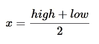

这样，该模型无需修改即可使用。

这种方法有两个问题:

1.  取一个高低的平均值是任意的。它将给出的信息减少了一半。最好有一个算法来学习我们需要在低边界和高边界之间的区间内的什么地方设置变量 x
2.  通过给我们一系列的数据，开发者试图向我们传达一个非常重要的信息:评估的不确定性程度。正确的模型应该使用这些信息。

为了简化过程，我们将对所有的估计值和实际值取自然对数。由于我们使用对数正态分布对估计值建模，我们的新变量`y`、`l`、`h`将分别是实际天数、低估计值和高估计值的对数。在这种情况下我们可以使用正态分布！我们将使用线性回归对`y`建模:

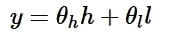

在 *θh* 和 *θl* 相等的情况下，我们会遇到与之前讨论的[完全相同的问题](https://medium.com/@michaellarionov/using-statistics-in-agile-estimation-ead56236de64)。

在这种情况下，单个数据的似然函数可以写成如下形式(在[和](https://en.wikipedia.org/wiki/Bayesian_linear_regression)之后)。

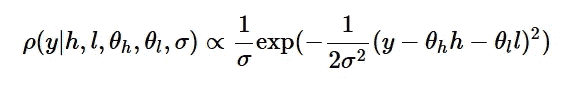

如前所述，通过给出一个范围，开发人员希望向我们传达评估的不确定性。我们应该将这种不确定性包括在我们对 *σ* 的估计中。直观上，范围与标准偏差成比例，我们可以通过将 *σ* 建模为:

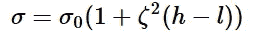

如果我们也使用精度参数 *τ* 代替 *σ* 0:

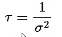

那么我们的可能性函数将是:

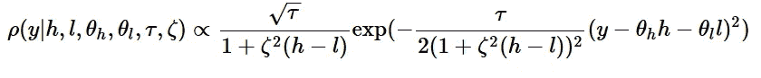

*τ* 和 *θ* 的先验传统上分别为伽玛分布和正态分布；

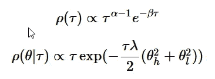

这里 *α* ， *β* ， *λ* 为超参数。

为 *ζ* 选择先验比较困难。对于我们选择的这种似然函数，没有共轭先验存在。现在我们可以选择正态分布。这种分布的零均值意味着我们先验地不信任范围(我们知道许多顾问的范围总是 20%并且不传达任何信息)。先验分布的高均值意味着我们更加关注估计的不确定性程度。

为简单起见，我们将平均值设为零。

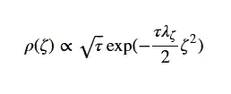

负对数后验函数为:

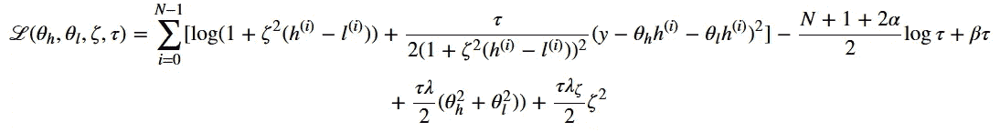

在这个博客里我会找到参数，对应最大后验概率。为了避免在微分中出错，我们将使用张量流。我们将按照这个例子来构建我们的代码

```
import numpy as np
import pandas as pd
import tensorflow as tf
```

此处的数据代表预计和实际天数。我们看到开发人员喜欢在他的预算中增加 25%作为缓冲。然而，对于一些故事，他增加了更多的缓冲，也许是为了表明更多的不确定性。

```
seed=1389
tf.reset_default_graph()
task_data = pd.DataFrame({'low':[4,14,4,3,4,3,4,9,6,27,20,23,11],
                          'high':[5,18,5,4,5,7,5,10,8,30,25,29,14],
                          'actual':[17,8,5,3,5,4,9,9,4,27,16,15,7,]})%matplotlib inline
import matplotlib.pyplot as plt
import seaborn as sns
fig, ax = plt.subplots(figsize=(11.7, 8.27))
task_data['story_id'] = task_data.index
data_for_plot = pd.melt(task_data, id_vars="story_id", var_name="type", value_name="days")
task_data.drop(columns=['story_id'], inplace=True)
sns.barplot(x='story_id', y='days', hue='type', data=data_for_plot,ax=ax);
```

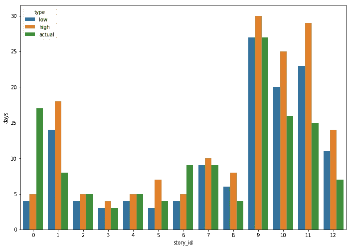

定义变量时，我们用 *τ* 代替另一个变量 *ρ* :

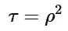

这是为了避免优化器选择负的 *τ*

```
#Taking the log of data
log_data = np.log(task_data.values)
N = log_data.shape[0]#Defining variables
theta_h = tf.Variable(name='theta_h', initial_value=0.5)
theta_l = tf.Variable(name='theta_l', initial_value=0.5)
zeta = tf.Variable(name='zeta', initial_value=0.01)
rho = tf.Variable(name='rho', initial_value=0.01)
```

由于不想调太多超参数，我们就把 *α* 和 *β* 设为一。两个 *λ* 参数都作为正则化参数，所以我们必须调整它们

```
#Set the hyperparameters
alpha = tf.constant(name='alpha', value=1.0)
beta = tf.constant(name='beta', value=1.0)
lambda1 = tf.constant(name='lambda1', value=1e-4)
lambda2 = tf.constant(name='lambda2', value=1e-4)def loss(l, h, y):
    return tf.log(1+zeta**2*(h-l)) + \
        rho**2/2/(1+zeta**2*(h-l))**2 * (y - theta_l*l - theta_h*h)**2cummulative_loss = tf.reduce_sum(list(np.apply_along_axis(lambda x: loss(*x), axis=1, arr=log_data )))
cost = cummulative_loss - (N+1-2*alpha)/2*tf.log(rho**2) + beta*rho**2 + \
rho**2*lambda1/2*(theta_h**2+theta_l**2) + rho**2*lambda2/2*zeta**2learning_rate = 1e-4
optimizer = tf.train.AdamOptimizer(learning_rate)
train_op = optimizer.minimize(cost)import math
init = tf.global_variables_initializer()
n_epochs = int(1e5) with tf.Session() as sess:
    sess.run(init) for epoch in range(n_epochs):
        if epoch % 1e4 == 0:
            print("Epoch", epoch, "Cost =", cost.eval())
            print(f'Parameters: {theta_l.eval()}, {theta_h.eval()}, {rho.eval()}, {zeta.eval()}')
        sess.run(train_op)
    best_theta_l = theta_l.eval()
    best_theta_h = theta_h.eval()
    best_sigma = 1/math.sqrt(rho.eval())Epoch 0 Cost = 55.26268
Parameters: 0.5, 0.5, 0.009999999776482582, 0.009999999776482582
Epoch 10000 Cost = 6.5892615
Parameters: 0.24855799973011017, 0.6630115509033203, 0.6332486271858215, 1.1534561276317736e-35
Epoch 20000 Cost = 1.39517
Parameters: 0.2485545128583908, 0.6630078554153442, 1.3754394054412842, 1.1534561276317736e-35
Epoch 30000 Cost = 1.3396643
Parameters: 0.24855604767799377, 0.6630094647407532, 1.4745615720748901, 1.1534561276317736e-35
Epoch 40000 Cost = 1.3396641
Parameters: 0.24855272471904755, 0.6630063056945801, 1.4745622873306274, 1.1534561276317736e-35
Epoch 50000 Cost = 1.3396646
Parameters: 0.2485586702823639, 0.6630119681358337, 1.4745632410049438, 1.1534561276317736e-35
Epoch 60000 Cost = 1.3396648
Parameters: 0.2485581487417221, 0.6630115509033203, 1.4745649099349976, 1.1534561276317736e-35
Epoch 70000 Cost = 1.3396643
Parameters: 0.2485586702823639, 0.6630122065544128, 1.4745644330978394, 1.1534561276317736e-35
Epoch 80000 Cost = 1.3396643
Parameters: 0.24855820834636688, 0.6630116701126099, 1.4745631217956543, 1.1534561276317736e-35
Epoch 90000 Cost = 1.3396646
Parameters: 0.248562291264534, 0.663015604019165, 1.474563717842102, 1.1534561276317736e-35
```

这里有意思的是 *ζ* 为零。这意味着我们不能相信开发者给我们的不确定性估计。这也意味着我们可以只使用由学习参数 *θl* 和 *θh* 指定的平均值周围的对数正态分布。比方说，同一个开发人员估计一项新任务需要 10-15 天。代入我们看到的公式:

```
mu = best_theta_l*math.log(10)+best_theta_h*math.log(15)
most_likely_prediction = math.exp(mu)    
most_likely_prediction10.67385532327305
```

我们还可以通过将这些值直接代入对数正态分布来获得 95%的置信度:

```
from scipy.stats import lognorm
distribution = lognorm(s=best_sigma, scale=most_likely_prediction, loc=0)
print(f'95% confidence: {distribution.ppf(0.95)}')95% confidence: 41.3614192940211
```

如我们所见，如果我们想要 95%的置信度，我们必须给出 41 天的估计，而不是 50%置信度的 11 天。如果你看到开发人员在过去没有很好地完成任务评估，这就很容易解释了。

您可以从 [github](https://github.com/mlarionov/machine_learning_POC/blob/master/agile_estimation/range_estimates.ipynb) 访问笔记本。