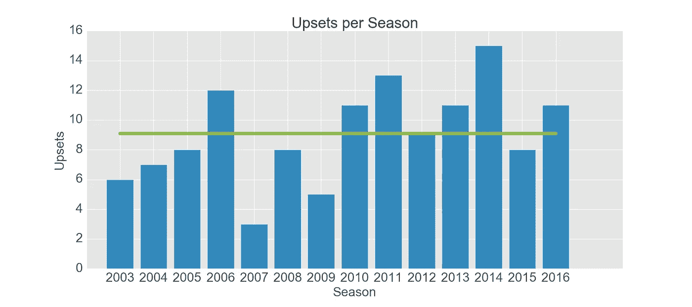
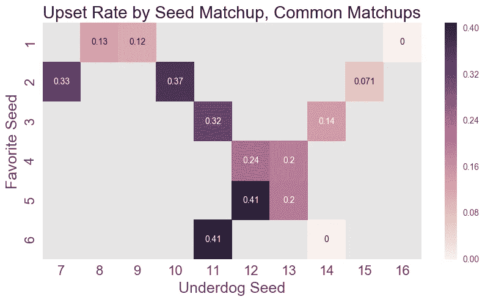
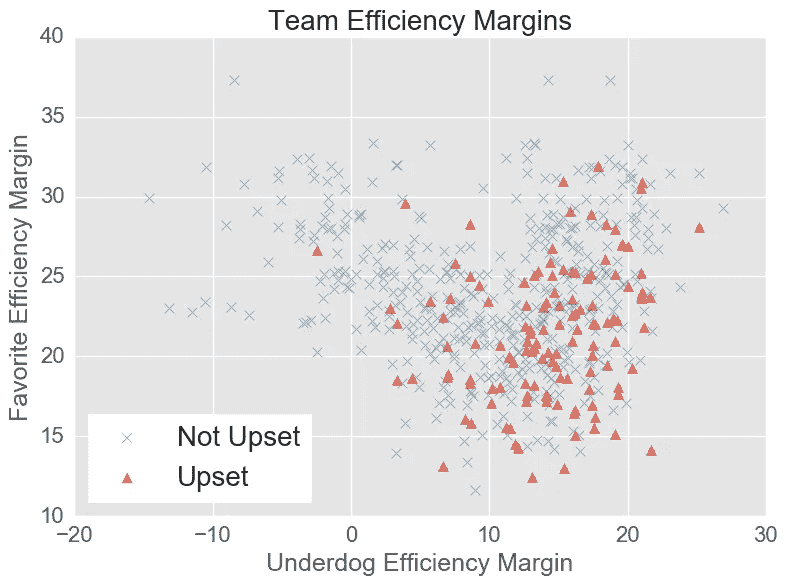
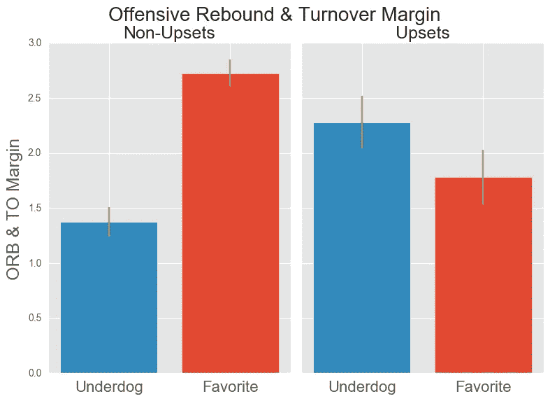
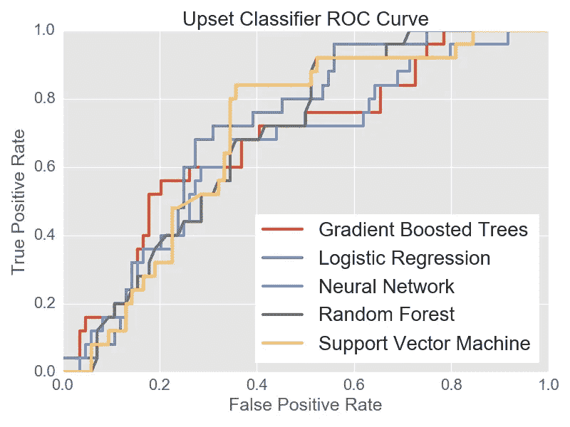
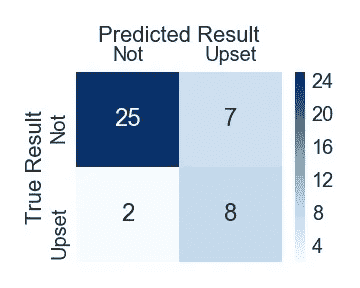
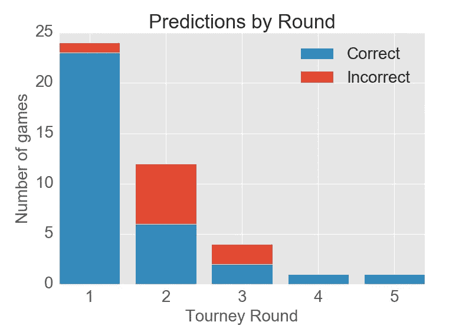

# 用机器学习预测 NCAA 锦标赛的冷门

> 原文：<https://towardsdatascience.com/predicting-upsets-in-the-ncaa-tournament-with-machine-learning-816fecf41f01?source=collection_archive---------4----------------------->

**更新**:看看这个[的后续](https://link.medium.com/W02maxUDbV)，我在这里讨论了 3 个额外的不安信号。

疯狂即将来临！一年一度的男子大学篮球锦标赛将于 3 月 15 日开始，很快数百万球迷将填写他们的括号。

对我们大多数人来说，冷门是锦标赛中最精彩的部分。在体育运动中，很少有球迷的经历能比得上看到实时爆冷的兴奋感，以及处于劣势的球队赢得胜利时的纯粹喜悦:

唯一比看着疯狂的冷门下跌更好的事情是把冷门选秀权钉在你的支架上。说起来容易做起来难:在最近的一次全国在线括号比赛中，平均只有 19%的括号选择了不满意。冷门还会让一些种子选手提前回家。例证:2016 年 [62%的 ESPN 挑战赛排名](http://www.espn.com/blog/collegebasketballnation/post/_/id/112638/tournament-challenge-final-pick-results-and-bracket-numbers)密歇根州立大学进入了四强，斯巴达队获得了第二多的冠军。但疯狂随之而来:汤姆伊佐的球队在第一轮就被拥有 15 个种子的田纳西中部州立大学淘汰了。

正确挑选冷门可以区分你的括号，给你一个竞争优势。我试图通过使用数据和机器学习来预测 NCAA 锦标赛中的冷门，从而战胜困难。

## 使用团队种子定义意外事件

每年，64 个符合条件的团队被分成四组，每组 16 个(“地区”)，每个团队都被分配一个“种子”，排名从 1(最好)到 16(最差)，就像 2016 年的中西部地区一样。一个队在几乎每场比赛中都有技术优势，但人们不会对 9 号种子击败 8 号种子，甚至 10 号种子击败 7 号种子感到震惊。这些比赛基本上都是“胜负难分”的。我对预测更令人震惊和意想不到的沮丧感兴趣。

**我把一场失利定义为一个比对手**低至少 4 位的种子队的胜利，比如 1 号种子输给 5 号种子或更低，2 号种子输给 6 号种子或更低，等等。因为锦标赛每年都使用相同的结构，所以种子赛是一种快速、简单的方法来识别和研究冷门。

# 数据准备和探索

## 数据

我获得了自 2003 年以来每支锦标赛球队在常规赛和锦标赛中球队和球员表现的数据。该数据包括 584 场有“潜在冷门”的锦标赛，这意味着这些球队的种子差距至少为 4。

## 特征工程

我为每个团队创建了一个包含 82 个特征的数据集，包括整个赛季的团队表现、团队效率指标、教练比武经验/成功以及团队旅行。因为目标是预测，所有特征都是在每场锦标赛游戏的之前*可用的特征。然后，我做了一些数据探索，以确定可能预测冷门的趋势。*

## 冷门和种子比赛

下面的图表显示了每年的冷门次数，以及每年的平均值。不要疯狂地挑太多的冷门；平均每年只有 9 起。

On average only 9 upsets occur in each tournament

哪些比赛最有可能导致冷门？事实证明，在第 1 轮和第 2 轮中出现的 14 个常见种子配对占所有“潜在冷门”游戏的 85%。下面显示了这些比赛，以及它们的“冷门率”(导致冷门的比赛比例)的热图。

Heat map of upset rates for the most common seed pairings

该图基于种子匹配确定了一些好的不规则候选:

*   在第一轮中，关注 12 对 5 和 11 对 6。12 号种子选手和 11 号种子选手赢得这些比赛的几率约为 40%。
*   如果你觉得大胆，在第一轮中拿一个 13 号种子胜过一个 4 号种子。13 号种子队赢得了 20%的比赛。
*   2 粒种子很少在第一轮中失败(7%)，但在第二轮中，他们令人惊讶地容易被 7 粒种子(33%)和 10 粒种子(37%)打乱。
*   这些 10 粒种子和 7 粒种子比 8 粒种子和 9 粒种子更适合 16 粒种子，后者很少在第二轮中击败 1 粒种子(12-13%)。
*   考虑在甜蜜的 16 强中放一个 11 号种子:在第二轮中，11 号种子赢得了三分之一的比赛。

## 发现灰姑娘和后进生

除了种子赛，赢的失败者和输的热门有什么特征？

## 团队效率边际

从肯·波默罗伊优秀的高级篮球分析[网站](https://kenpom.com/)，一个球队的*调整后的效率边际*是一个单一的数字，它表明了比赛的整体实力。本质上，它代表了在给定 100 分的情况下，一个球队相对于一个普通对手的预期胜率。下面我画出了我的数据集中每场比赛的失败者和最受欢迎者的效率边际，数据点显示了比赛是否导致了冷门。

Upsets involve underdogs with higher efficiency and favorites with lower efficiency

大多数冷门都发生在差幅超过 10 的劣势方对差幅低于 25 的热门方的时候。事实上，符合这些标准的游戏有 35%的时间会导致不愉快，而不符合这些标准的游戏只有 13%。作为挑选冷门的简单经验法则，你当然可以做得更糟！

## 赚取额外的财富——篮板和失误

在篮球比赛中，球队在投篮不中或得分后交换控球权，但球队也可以通过反弹自己的失误(产生额外的投篮机会)和迫使失误(夺走对手的机会)来获得“额外”的控球权。为了计算“进攻篮板和失误率”，我计算了整个赛季中每支球队平均每场比赛的进攻篮板和失误优势。

Winning underdogs have better offensive rebounding and turnover margins

在左边，我显示了在非冷门(左)和冷门(右)比赛中的冷门选手和热门选手的平均差距。

在没有冷门的情况下，热门比冷门有更高的利润，但是在冷门的情况下，情况正好相反。如果处于劣势的一方比他们的对手更擅长获得进攻篮板和失误，那么这场比赛就是一场逆转。

# 用于镦粗预测的机器学习

与其逐个检查 82 个特征，不如让算法发挥作用。我将游戏分成训练集(80%)和测试集(20%)，并训练每个算法进行预测。

**训练分类算法**

我将冷门预测作为一个分类问题，目标是将每场比赛归类为“冷门”与否。我选择了 5 种分类算法进行训练:

*   逻辑回归
*   神经网络
*   支持向量机
*   随机森林
*   梯度树提升分类器

使用 python 的 [scikit-learn](http://scikit-learn.org/stable/supervised_learning.html#supervised-learning) 包，我使每个算法适合训练数据，并使用 5 重交叉验证来调整模型超参数(影响模型拟合的设置)。为了确定每个算法的最佳设置，我使用了交叉验证 *F1* 分数。这里， *F1* 分数是扰乱*精度*(最小化不正确的扰乱预测)和*召回*(预测大多数实际扰乱)的平衡。关于 *F1* 的更多信息，请参见[此处](https://en.wikipedia.org/wiki/F1_score)。

我也应该承认冷门在这些数据中是“不平衡”的，只有 22%的游戏是冷门。这些算法通常最适用于接近对半分割的示例。不涉及太多细节，我会注意到训练数据被*重采样*以在扰乱和非扰乱之间创建平衡(在这里阅读关于不平衡数据和重采样[的更多信息)。](https://svds.com/learning-imbalanced-classes/)

**测试模型性能**

对于每种算法，在保留的测试集上评估来自训练的最佳模型。5 个模型的 ROC 曲线如下所示:

该图显示，对于每个分类器，随着真阳性率的增加，假阳性率也增加。大多数分类问题都是如此；随着更多的真实情况被预测，更多的虚假情况也被预测。我还注意到，这些算法在 ROC 曲线的不同点上最大化了真正的阳性率，因此将它们组合在一起可能会产生更好的结果。

**“未来”对决分类**

为了评估一个更“真实世界的场景”，我想预测单个锦标赛的冷门。我使用逻辑回归模型预测了 2017 年的 42 场潜在冷门比赛，这些比赛是我在之前的训练和测试中推出的。

Matrix showing prediction results for 2017

该矩阵将预测细分为正确的非镦粗(左上)、正确的镦粗预测(右下)、不正确的非镦粗预测(左下)和不正确的镦粗预测(右上)。

该模型预测了 2017 年的 15 次颠覆。在 2017 年的 10 次实际冷门中，有 8 次被模型识别出来，但模型也做出了 7 次“假阳性”的冷门预测。该模型在预测冷门时有点过于激进，但对于这些难以预测的游戏来说，它仍然是正确的。

更仔细地观察预测，可以更深入地了解模型在哪些方面表现良好，以及在哪些方面需要改进:

Upset predictions are most accurate for Round 1

模型真的很擅长预测第一轮，23/24 场比赛预测正确。对于所有其他回合，该模型去 10/18。我希望模型在整个比赛中更加精确，但第一轮也是最令人失望的时候。大多数括号池玩家可以通过在第一轮中采取模型预测的冷门来获得优势。我还计算出，在这些令人沮丧的预测上下注，将获得 21%的净回报。

# **结论**

我有几个改进模型预测的想法，包括添加更多的数据来创建更多的特征，对团队最近的表现进行加权，以及尝试其他算法或算法组合。我还想尝试对比赛分数而不是最终结果进行建模，并研究其他 NCAA 锦标赛预测问题，如识别被高估的球队提前回家的特征，以及“灰姑娘”失败者准备深入锦标赛的特征。

我将在 Twitter 上宣布未来的工作，所以如果你喜欢，请给我一个[关注](https://twitter.com/bracket_vision)！