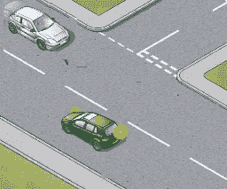
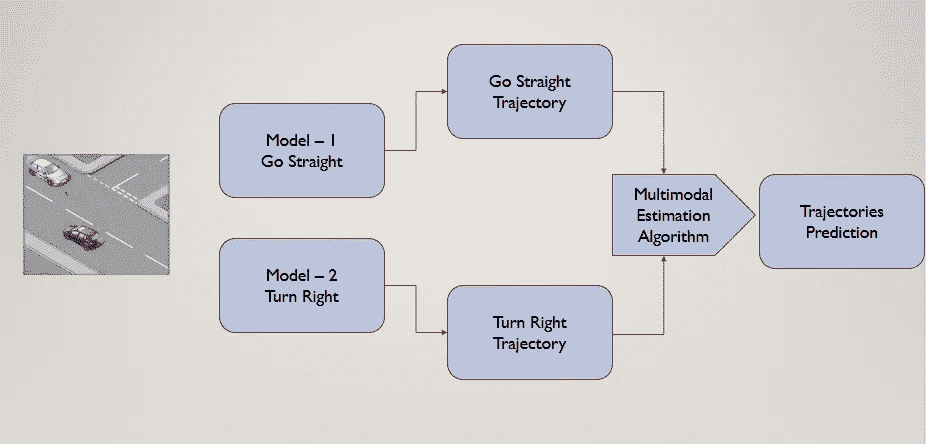
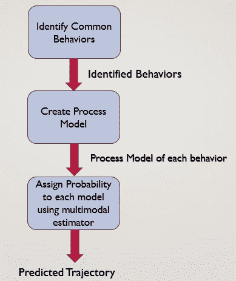
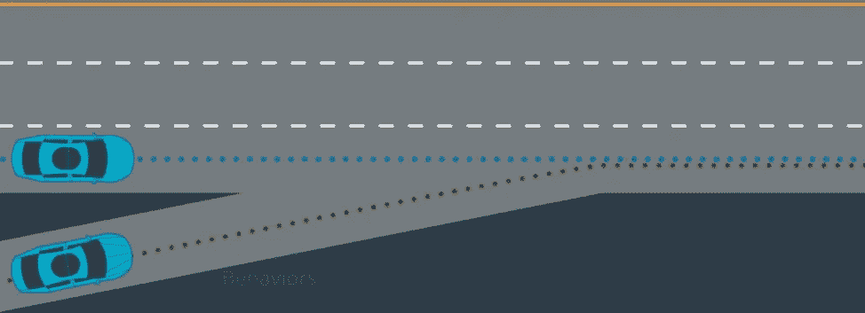
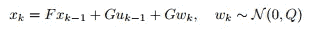
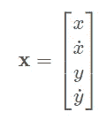
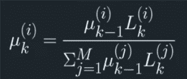
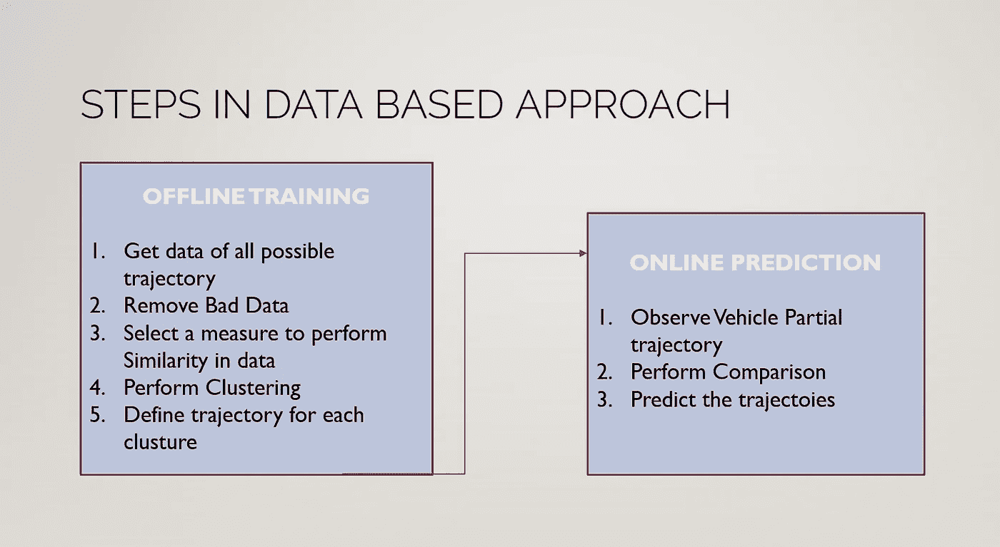
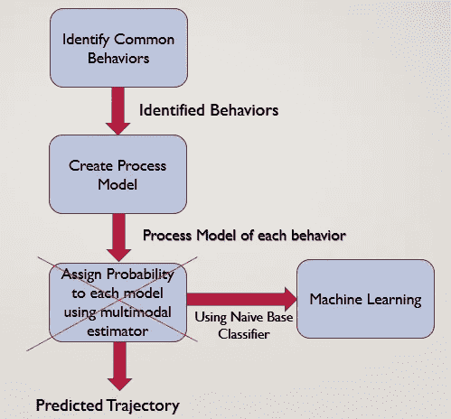
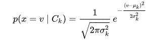

# 自动驾驶汽车中的预测——你需要知道的一切

> 原文：<https://towardsdatascience.com/prediction-in-autonomous-vehicle-all-you-need-to-know-d8811795fcdc?source=collection_archive---------7----------------------->

想象一个场景，你在一条双车道的路上驾驶一辆车，向前行驶，你想右转，但是第二车道上有一辆车从相反的方向驶来，现在你会怎么做？

自动驾驶汽车的预测是关于我们的自动驾驶汽车如何预测另一辆汽车的轨迹或路径，并采取行动避免碰撞。

我是 Udacity 自动驾驶汽车纳米学位项目的第三期学生，在这里我将分享我在预测方面的知识，这是自动驾驶汽车轨迹规划的一个重要部分。

# **这是怎么做到的？**

预测的输入来自传感器融合和定位。传感器融合就是结合来自多个传感器(如雷达、激光雷达等)的数据(使用[卡尔曼滤波器](/an-intro-to-kalman-filters-for-autonomous-vehicles-f43dd2e2004b))。)让我们的汽车了解它的环境，而汽车使用定位来精确地知道它在哪里。

一旦我们有了输入，就可以通过以下方法来预测车辆的轨迹:

1.**基于模型的方法**

2.**数据驱动方法**

这些方法可以单独使用，也可以混合使用，以做出更好的预测。

让我们一次看一种方法

## **1。基于模型的方法:**

这种方法识别车辆的常见行为(变道、左转、右转、确定最大转弯速度等。) .

在这种方法中，我们为车辆可能行驶的每个可能轨迹创建一个模型，并将其与汽车的行为一起发送给**多模态估计算法** *(现在假设它是一个黑盒)*。该算法将概率分配给轨迹模型，最终选择概率最高的模型。

Modal Based Approach

在我们深入研究基于模型的方法之前，让我们先来看看 *Frenet 坐标系。*

**弗雷诺坐标系**

在 FCS 中，我们使用**s’**和**d’**符号来确定物体的位置，其中**s’是道路上的距离**，而 **d 确定距离车道中心的距离**，这与我们使用 x，y 坐标来表示道路上的位置的笛卡尔坐标系不同。FCS 是表示道路上物体位置的更好的方法，因为使用笛卡尔坐标实现曲线道路的方程会困难得多。

> **基于模型的方法中使用的步骤:**

Steps used in Model Based Approach

*第一步:*确定汽车的共同行为

*步骤 2:* 为每个被识别的行为创建过程模型

*第三步:*计算每个过程模型的概率

让我们通过一个简单的例子来理解每个步骤:

Image Source: Udacity Nano Degree Program

假设我们的自动驾驶汽车(绿色汽车)必须在高速公路上行驶。为此，它必须预测蓝色汽车的行为。

**第一步:**

蓝色汽车的行为如下:

*   它会忽略我们
*   它会减速，让我们的车先行，这是一个礼貌的司机
*   它会加速并超过我们的车
*   它会变道并以同样的速度继续行驶

等等..

我们必须用数学描述来描述这些行为。为此，我们将转到步骤 2。

**第二步:**

过程模型为确定的行为提供了数学描述。

这些模型的复杂程度可以从非常简单的数学描述到非常复杂的数学描述不等

*   *请注意，流程模型数量取决于所识别行为的数量。它可能随着行为的数量而变化。*

**预测状态 x 在时间 k** 的过程模型的一般状态形式如下:

state vector

**第三步:**

在这一步中，我们将通过为每个行为创建的流程模型分配概率，来确定汽车中的驾驶员将执行什么操作。这是通过**多模态估计算法完成的。**该算法最简单的方法是**自主多模态(AMM)算法。**

## **自主多模态(AMM)算法。**

在 AMM，我们首先观察车辆在时间 k-1 和时间 k 的状态

然后，我们计算 k-1 时刻的流程模型，并得到 k 时刻的预期状态。

然后将比较期望状态和观察状态的可能性。并使用以下公式获得模型在时间 k 的概率:

模型(I)在时间 k 的概率

> 其中:
> 
> **M:** 多个不同的流程模型
> 
> **U:** 模型的概率。
> 
> **L:** 模型的观测的可能性
> 
> k: 时间戳

最后选择概率最高的模型。

## **2。数据驱动方法**

在数据驱动方法中，我们将采用一个黑盒，并使用大量训练数据对其进行训练。一旦它得到训练，我们将符合观察到的行为，并得到预测。

这有助于确定车辆的具体模式，否则可能会被遗漏。

数据驱动方法分两个阶段完成:

1.  离线培训(模型培训)
2.  在线预测(使用模型预测轨迹)

Data Based Approach

> ***离线培训***

**数据驱动方法中使用的步骤:**

*第一步:*获取大量轨迹数据

*第二步:*清除数据

*步骤 3:* 选择一个度量来执行相似性

*步骤 4:* 使用机器学习算法执行轨迹的无监督聚类，如[谱聚类](https://en.wikipedia.org/wiki/Spectral_clustering)或[凝聚聚类](https://en.wikipedia.org/wiki/Hierarchical_clustering)

*步骤 5* :为每个集群定义一个轨迹模式

按照这些步骤，我们将得到**模式和轨迹群**

> ***在线预测***

*步骤 1:* 观察车辆局部轨迹

第二步:将它与原型轨迹进行比较

*第三步:*预测轨迹

重复在线预测步骤，直到我们找到原型轨迹之一与车辆轨迹相似的最大可能性。

所以到现在为止，你们一定对预测轨迹的两种不同方法有很好的理解。

**混合方法**

所以现在的问题是使用哪种方法..？

为什么不利用这两种方法的优点呢？这就是混合方法发挥作用的地方。:)

Hybrid Approach

为了实现混合方法，我们将用机器学习代替基于运动的方法的多重运动估计器。为此，我们需要一个分类器。一个这样的分类器是*朴素贝叶斯分类器*

**朴素贝叶斯分类器:**

处理连续数据时的一个典型假设是，与每个类相关联的连续值按照高斯分布分布。

例如，假设训练数据包含一个连续属性 x。我们首先按类对该数据进行分段，然后计算每个类的平均值和标准偏差。假设我们有类的第 k 段，即 x 的 C_k，u_k 是平均值，_ square _ k 是标准偏差，那么给定一个类 C_k，v 的概率分布可以通过将 v 代入方程来计算

这就是我们需要知道的关于我们的自动驾驶车辆如何预测其他车辆的轨迹。请记住，在这篇博客中，我们已经通过一次一个对象的方式介绍了预测，而在现实世界的场景中，可能会有许多对象必须同时进行预测，这使得预测过程更加复杂。幸运的是，我们到目前为止所学的知识可以很好地预测公路上车辆的轨迹。

你可以通过阅读这篇关于 T2 多模型算法的论文来了解更多关于预测的知识，作者是 T4 的瑞安·r·皮特里·维斯林·p·吉尔科夫·x·李蓉。

如有任何疑问，请通过 LinkedIn[联系我](https://www.linkedin.com/in/atul-singh-2b8954115/)或写下私人笔记。