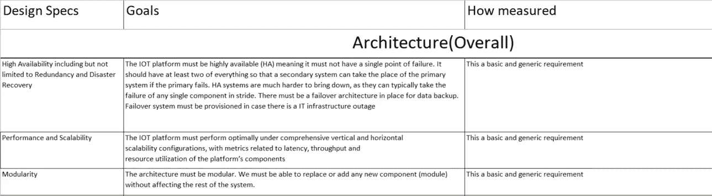
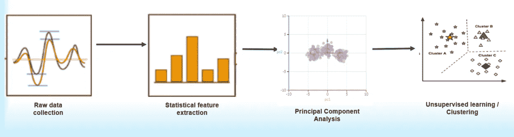
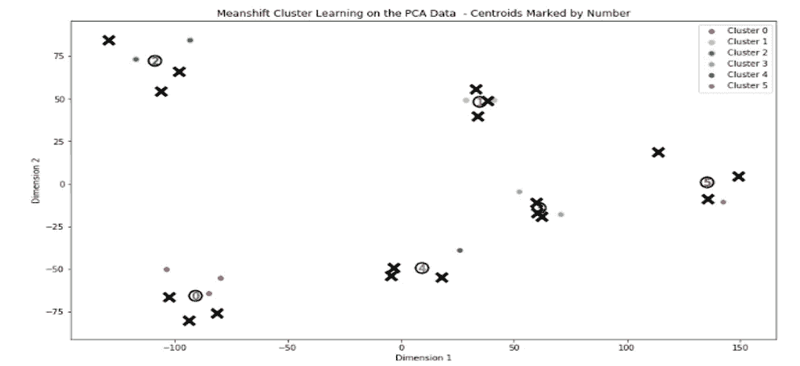
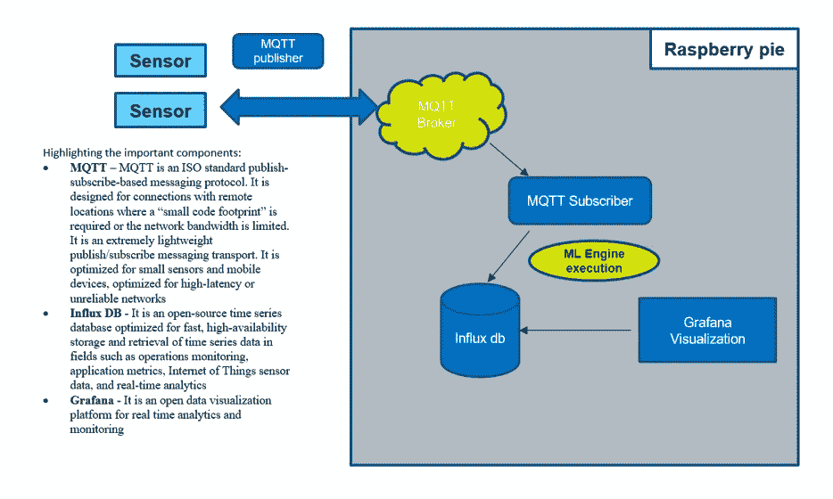
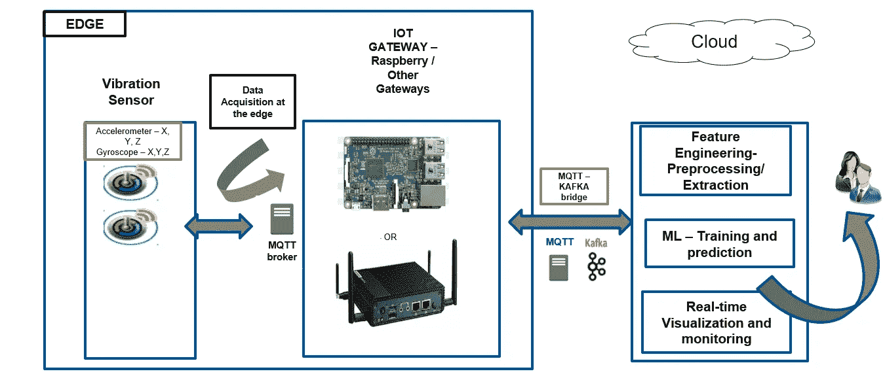

# 基于机器学习的制造业预测性和规范性维护

> 原文：<https://towardsdatascience.com/predictive-and-prescriptive-maintenance-for-manufacturing-industry-with-machine-learning-2078afa76bfb?source=collection_archive---------7----------------------->

利用机器学习监控机器健康状况并优化制造产量

作者:帕萨·德卡和罗希特·米塔尔

今天的人工智能(AI)趋势和制造业自动化水平的提高允许企业通过数据驱动的见解灵活地连接资产和提高生产率，这在以前是不可能的。随着制造业越来越多地采用自动化，处理维护问题所需的响应速度将会越来越快，从经济角度来看什么是最佳选择的自动化决策也变得越来越复杂。

**规定性维护:**

规范维护是一种范式转变，它促进从严格依赖计划事件转向能够从实际事件中采取实时行动。规范维护利用高级软件来确定识别点，以明确诊断根本原因问题，然后指示精确而及时的措施，以便及时改变结果。工业企业正在使用规定的维护和分析软件来减少或消除计划外停机时间，并最大限度地提高盈利能力和设备可靠性。人工智能支持的说明性维护的独特之处在于，它不仅仅预测即将发生的故障，而是努力通过分析产生以结果为中心的运营和维护建议。

**提高生产力:**

生产率是制造商追求的三个基本要素之一，另外两个是成本和质量。今天，估计有价值 5000 亿美元的机床在帮助企业管理他们的工业设备。然而，现代公司正在寻求超越预防性维护，以实现规范的维护系统。例如，减少停机时间对于工业设备和机器来说非常重要，有助于提高生产率和设备的整体运行效率。OEE 黄金标准仅为 80%左右。事实证明，如果没有人工或成本高昂的流程，很难超越这些效率水平。

**数字核心:**

实施规定维护和分析的一个关键方面是纳入下一代数字核心技术，包括人工智能、机器学习、物联网连接、协作和高级分析。这些工具必须灵活、可扩展，并且易于集成到遗留的 IT 基础设施中。它们允许组织将来自后台系统的业务流程和事务数据与来自各种来源的大量结构化和非结构化数据集成在一起。然后，高级分析可以跨数字核心及时嵌入数据，使组织能够获得新的见解，如预测结果或提出新的行动。

**工业化人工智能:**

人工智能元素需要在确定的基础上嵌入并同步到整个数字核心的数据中，使公司能够获得新的见解，例如预测结果和自动采取行动以确保优化结果。

**高级分析:**

AI/ML 系统是规定维护平台的大脑。生产机器的 ML 模型被设计用来检测生产过程中的异常行为。训练数据有助于为单个配方步骤或特定设备类型开发特定模型。通过在一些连续的基础上确定数据点是否落在这些界限之外，及时的检测和规定被完成，它被标记为异常并被报告。培训新模型和按需部署的能力是关键。通过这样做，模型能够随着时间的推移不断学习和适应

**虚拟协作:**

大量数据的可视化对于支持管理分析和快速决策至关重要，以便进行持续监控和说明性维护和分析。可视化工具必须综合多维的、通常是融合的数据和信息，以便支持评估、规划和预测。该工具需要是开放的、动态的、实时的，并对所有参与者可用，以便能够与所有参与者协作，在不同的抽象和网络连接级别访问数据。

**案例分析**

**为了保持我们工作的机密性，我们在下面呈现一个抽象的用例:**

**问题陈述:**

我们的组件制造经历了多个连续的步骤。我们的制造组件由多个移动部件组成，最显著的是运动平台和致动器。最难以捉摸的产量问题之一是随着时间的推移随机发生的间歇性电机故障。就时间、频率、组件、配方等而言，故障发生没有可识别的一致性。它们只是随机出现。关闭设备进行铁测试，直到人们能够幸运地捕捉到现场故障事件，这通常非常耗时，并对我们工厂的生产能力产生负面影响。另一方面，如果设备保持在线，则继续间歇性地制造故障产品，浪费下游工厂产能、耗材、劳动力和高额收入损失。我们以前依赖基于条件的手动监控解决方案和预防性维护计划，这限制了我们提高产量和生产率的能力。预测性和说明性维护最近已在重型制造业中采用。例如用于燃气轮机、真空泵、飞机发动机等的预测性维护。这些预测性维护解决方案在本质上是高度定制的，基于机器及其操作、领域等。此外，这些情况下使用的传感器适用于大型和重型机器，并针对大幅度的速度、加速度、旋转和倾斜进行调整。与重型机械行业的流程相比，我们的制造流程非常不同。不仅我们的制造领域和流程不同，而且数据采集的传感器要求也不同。在我们的组件制造中使用的电机尺寸小，它们的运动范围更短，不那么突然，以便处理精密和小型光学组件。目前可用的现成 IOT 传感器(用于重型制造业的运动检测)不适合我们的组件制造，因为它们体积太大，无法安装，或者不够精确和灵敏。例如，导致过度振动的运动可能会导致现有传感器无法检测到微小部件的未对准。

**我们的解决方案:**

我们通过广泛的解决方案需求文档提出了解决方案，详细说明了技术设计规格，如性能、可扩展性、模块化、安全性、高可用性、连接性、灵活的应用程序编程接口、CPU/内存/网络/硬盘使用规格、互操作性、可配置性、可靠性、可用性、延迟、ML / AI 算法、数据库性能、可视化、可扩展性、传感器要求。

例如:

我们与一家供应商合作，该供应商拥有满足我们所有解决方案设计规格的专业知识。通过与供应商合作，我们开发了一个预测性维护框架，该框架利用定制的机器学习技术、软件工程原理以及基于外形、功率和通信协议等选择的适当传感器。对我们的组件制造更加精确。总的来说，预测性维护框架能够执行实时检测、可视化、警报创建以及针对我们制造流程不同阶段的修复建议。这种独特的系统还使用最先进的机器学习技术和软件工程原理来抢先和自主地预测、检测、创建警报，并建议在组件制造过程中修复异常振动。该系统在制造过程的任何实际中断发生之前提醒个人并推荐修正估计。这使得我们能够对组件制造流程进行预测性和规范性的定期维护，减少突发和计划外的停机/中断，并优化我们的工厂产能、耗材、劳动力和成本。AI/ML 的平台集成是一个时间感知运行时系统和灵活的创作工具，可以更好地预测工艺和设备问题，并对我们的设备组件进行精确维护，避免突然和计划外的停机时间/避免间歇性故障制造，最大限度地减少收入损失。

**我们实现的主要收益:**

产量增加

提高工人生产力

减少计划外停机时间

优化盈利能力

快速实施

快速可扩展性

**最大似然算法概述:**

**什么是异常检测**？ **:**

异常检测是关于发现模式(如离群值、异常、异常等)。)偏离数据集内的预期行为，因此它可以类似于噪声去除或新奇检测。检测到异常的模式实际上是感兴趣的，噪声检测可能略有不同，因为噪声检测的唯一目的是去除那些噪声。与大多数数据科学项目一样，异常检测的最终目标不仅仅是算法或工作模型。相反，它是关于异常/异常值所提供的洞察力的价值，即防止设备损坏所节省的业务资金。在制造领域，我们希望在异常检测实际损坏设备之前，利用异常检测主动实现预测性和规范性维护。这将预警并实现“定期维护”,避免通常会导致严重收入损失的突然停机

**有人监督与无人监督:**

有两种用于构建异常检测系统的主要架构:

监督异常检测—如果我们已经标记了数据集，并且知道每个数据点是否正常，就可以使用监督异常检测

无监督异常检测—数据集未标记，即每个数据点是否异常不可靠或未知

**我们的 ML 管道:**

我们最先进的 ML 软件框架从战略性地放置在我们制造装配各部分的传感器中执行实时传感器数据采集。所有这些都是实时的，我们的软件框架从采集的传感器信号中执行统计特征提取，导出主成分，并使用监督和非监督学习技术检测异常聚类(数据点)，对传感器信号以及置信区间保护带执行时序抢先预测，并检测极端振动。以下是一个概述:

**检测各种聚类的样本无监督算法:**

均值漂移聚类旨在发现数据点的平滑密度中的聚类。这是一种基于质心的算法；它首先将每个数据点视为一个聚类中心。根据所提供的带宽参数，每个数据点构建一个假想的感兴趣的球体。然后，它使用球体中数据点的平均值更新球体的质心，然后围绕新平均值(新质心)构建新的感兴趣球体，然后再次使用该区域中数据点的平均值更新质心。这个过程反复进行，直到它收敛，直到质心不再移动。随后是过滤后处理阶段，以消除近似重复，从而形成最终的质心集。球体中汇聚到同一个质心的数据点被视为同一个聚类的成员

每种技术的最佳聚类数是通过优化轮廓系数来实现的。使用每个样本的平均组内距离(a)和平均最近组距离(b)计算轮廓系数。样本的轮廓系数为(b — a) / max (a，b)。为了澄清，b 是样本和该样本不属于的最近聚类之间的距离。最好的值是 1，最差的值是-1。接近 0 的值表示重叠的簇。负值通常表示样本被分配到错误的聚类，因为不同的聚类更相似

下图中，均值漂移聚类检测到我们的一个制造装配组件的各种振动阶段:

**我们的软件架构:**

我们有一个灵活的软件架构，可在边缘提供全部功能，并根据数据/ ML 计算需求等按需切换到基于混合边缘云的架构。我们的框架还提供了一个灵活的 API 来根据需要更新我们的 ML 模型。以下是我们的示例高级软件架构与树莓馅饼边缘计算机。我们利用了开放技术，如 MQTT(基于实时订阅的消息协议)、Influx db(用于实时分析的开源时间序列数据库)和 Grafana(用于实时可视化)

由于从实时数据处理到最大似然训练/预测的各种计算限制，我们采用了一种灵活的软件架构，可以无缝切换到混合形式。Edge-cloud 框架在滚动窗口中将数据持续归档到云中的历史归档数据库中，例如，在云数据库中维护到当前日期为止一周或一个月的历史数据，要归档的数据量可以根据使用情况而变化。该框架具有基于规则的模型健康监控系统，该系统定期(以及按需)检查 ML 模型的性能统计数据——性能统计数据可以基于但不限于用例的性质、ML 算法的性质等而变化。如果模型性能统计低于阈值(例如 f1 分数、受监督学习者的 R 平方、无监督学习者的轮廓系数等。这可以基于用例、算法等而变化。)，一旦满足阈值标准，该框架触发 ML 训练管道(在线)并部署新训练的模型。以下是我们的混合架构示例:

**规定性维护实时可视化平台:**

我们构建了一个最先进、易于使用的智能监控平台，用于规范维护。操作人员可以监控异常情况，深入分析根本原因，并接收智能建议，以实时修复制造过程中的故障情况。基于 ML 的智能建议基于异常行为、传感器位置、传感器数据、发生时间、设备类型/属性等。有了这个平台，操作员还可以轻松查看和监控 CPU、内存、网络使用情况等。在各种制造装配服务器上。我们的可视化平台还提供自定义日期范围的回看选项。基于需求并使用回顾选项，模型健康监控系统可以指示异常检测算法在云中使用存档的历史来重新训练自身，以更好地预测未来。

**总结&结论:**

我们开发了一个基于机器学习的端到端可扩展、安全、模块化、可扩展、可互操作、可配置的规范维护平台。借助该平台，我们实现了组件制造流程产量的大幅提升。我们积极主动地检测故障，为我们的组件制造装配提出修复建议，从而大幅减少计划外停机时间和工厂产能、耗材、劳动力和运营成本。异常检测科学是不断变化的。我们的平台提供的灵活的 ML API 使我们能够根据需要更新我们的异常检测算法。

**参考文献:**

http://mqtt.org/

【https://www.influxdata.com/ 

[https://grafana.com/](https://grafana.com/)

[http://ranger.uta.edu/~chqding/papers/KmeansPCA1.pdf](http://ranger.uta.edu/~chqding/papers/KmeansPCA1.pdf)

[https://scikit-learn.org/stable/](https://scikit-learn.org/stable/)