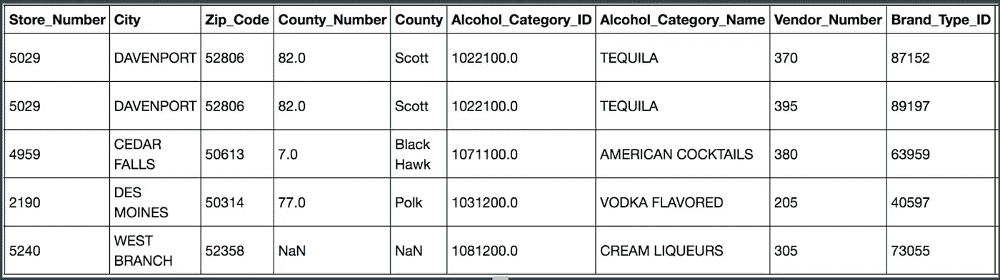
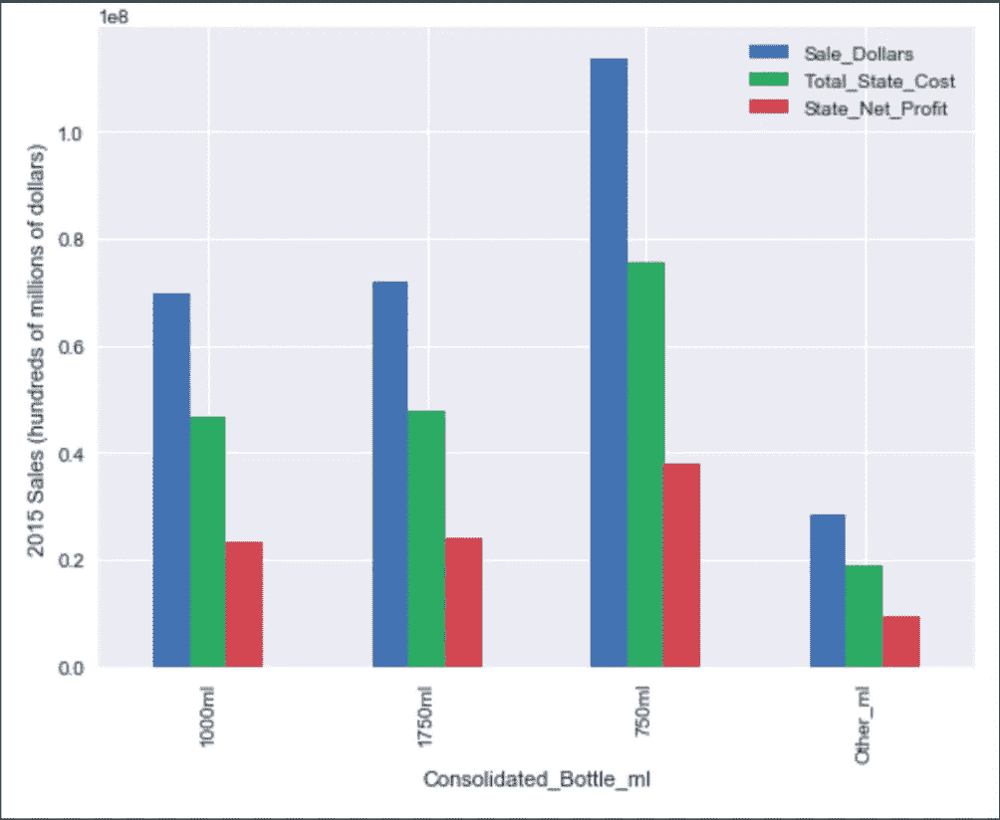
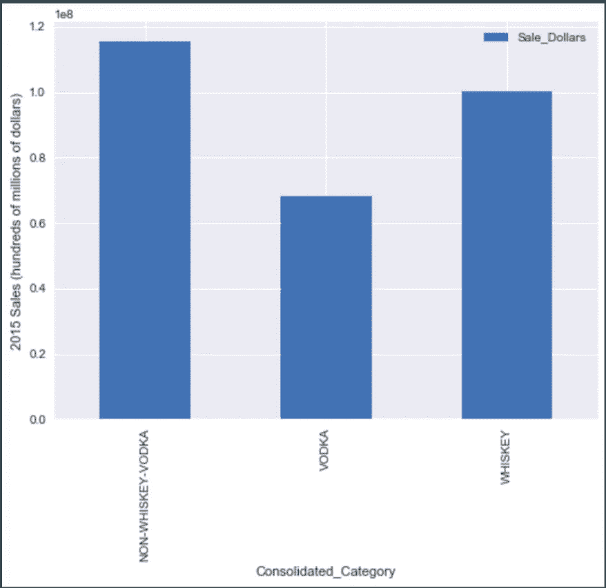
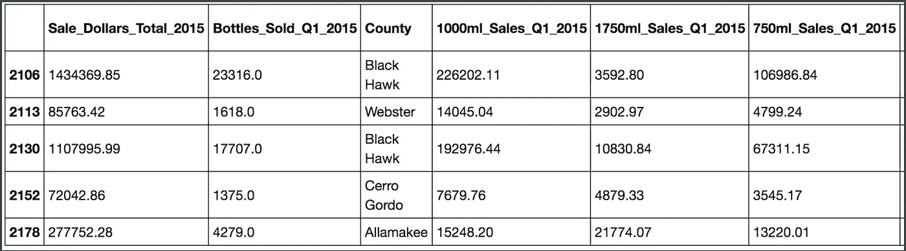
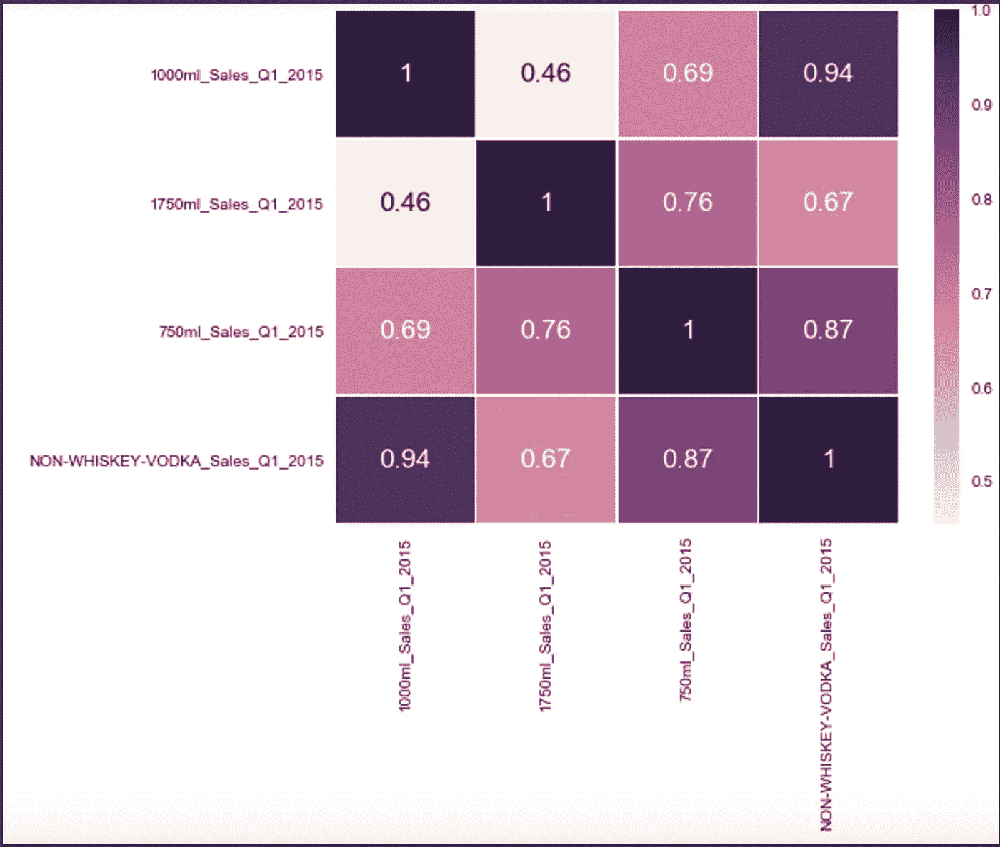
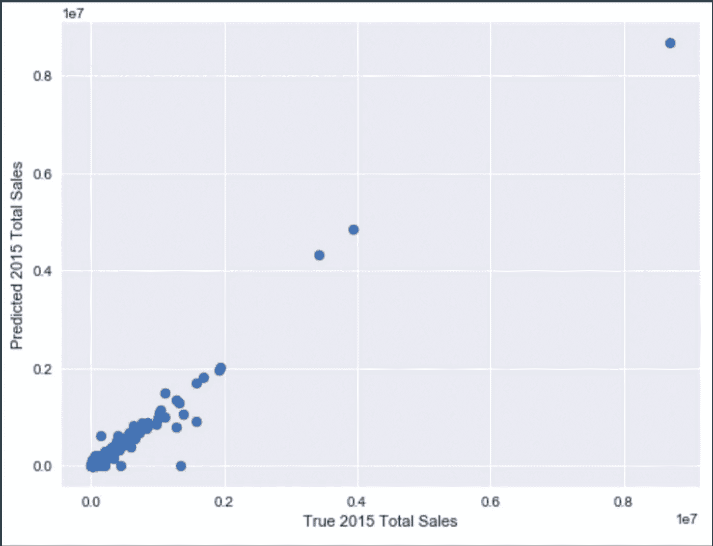
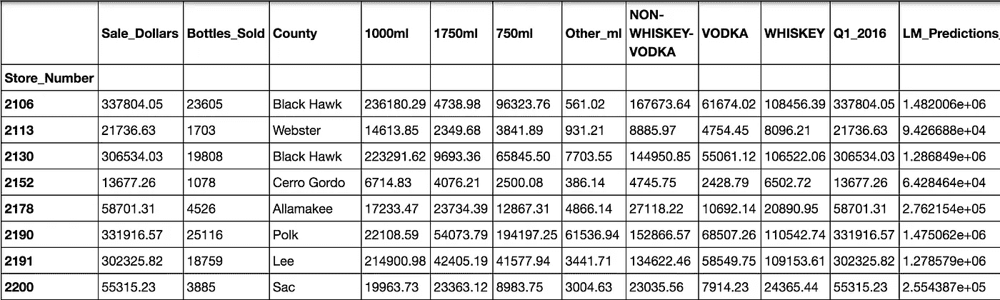

# 爱荷华州白酒销售数据的预测模型

> 原文：<https://towardsdatascience.com/predictive-modeling-with-iowa-state-liquor-sales-data-e45342081b83?source=collection_archive---------2----------------------->

你好朋友们，

最近，我的任务是利用爱荷华州的大量酒类销售数据建立一个预测模型。

作为一个简短的背景，爱荷华州是一个酒精饮料控制州，这意味着该州在全州范围内保持着对酒类批发的垄断。实际上，私人零售商必须从州政府那里购买酒，然后才能卖给个人消费者。你可以在[爱荷华酒精饮料部门](https://en.wikipedia.org/wiki/Iowa_Alcoholic_Beverages_Division)的维基页面上了解更多。


The majestic Iowa flag

出于这个项目的目的，我利用了爱荷华州白酒销售数据的子集，这些数据可以在爱荷华州的[州托管的开放数据门户](https://data.iowa.gov/Economy/Iowa-Liquor-Sales/m3tr-qhgy)上找到。虽然门户网站包含 2012 年以来的酒类销售，但我使用的数据集包含了 2015 年全年和 2016 年第一季度(1-3 月)的单个酒类销售。该项目的目标是使用 2015 年的销售数据建立一个模型，该模型可以根据 Q1 2016 年的数据预测 2016 年的总销售额。我使用 Python 中的 Pandas 库分析了数据。

简而言之，该数据集包含超过 270 万行数据。每项观察包含的信息包括:

*   购买日期(年/月/日)
*   进行购买的供应商的详细信息(例如，指定的商店编号、县和城市详细信息)；
*   购买的酒的类型和品牌(例如，杰克丹尼尔的田纳西威士忌)；
*   瓶子尺寸(例如 750 毫升)和购买的瓶子数量；
*   总销售额，包括国家和每瓶零售成本；和
*   出售的酒的总体积，单位为升和加仑



A snapshot of select columns in the original dataset. There are many additional data columns not pictured here.

# 初始数据清理和探索性分析

最初的数据清理和探索性分析包括以下步骤。

常规数据清理:

*   提高列名的清晰度，根据需要转换数据类型。
*   删除重复行
*   用真空值替换字符串“nan”值
*   对于成对的列(category_ID 和 category_name)，如果一个列值没有相邻的对，我就填充它，如果可以的话，否则就把它改为 null

确保正确的计算:

*   确保瓶子尺寸(例如 750 毫升)x 售出的瓶子=售出的体积升数
*   确保瓶子的零售价值 x 售出的瓶子=销售额
*   我没有发现数学上的问题，但是检查一下还是很好的

# 准备模型构建

我知道，如果我能把大部分数据分成更简单的类别，分析会容易得多。因此，我创建了几个新的专栏，从长远来看，这会让我的生活变得更加轻松。

例如，我创建了一个列，将日期条目折叠到它们发生的季度和年份:

(我将我的数据帧命名为爱荷华酒精的 i_a)

```
#Generating column for quarter-year
i_a[“Quarter_Year”] = “-”i_a.ix[(i_a.Date > ‘2014–12–31’) & (i_a.Date < ‘2015–04–01’), “Quarter_Year”] = “Q1_2015”
i_a.ix[(i_a.Date > ‘2015–03–31’) & (i_a.Date < ‘2015–07–01’), “Quarter_Year”] = “Q2_2015”
i_a.ix[(i_a.Date > ‘2015–06–30’) & (i_a.Date < ‘2015–10–01’), “Quarter_Year”] = “Q3_2015”
i_a.ix[(i_a.Date > ‘2015–09–30’) & (i_a.Date < ‘2016–01–01’), “Quarter_Year”] = “Q4_2015”
i_a.ix[(i_a.Date > ‘2015–12–31’) & (i_a.Date < ‘2016–04–01’), “Quarter_Year”] = “Q1_2016”
```

我还创建了单独的列来计算每笔交易的总零售成本和州的总成本，以了解该州从其酒类销售中获得了多少利润。

当检查某些类别和 2015 年总销售额之间的关联时，我可以看到与其他不太受欢迎的选项相比，某些项目占总销售额的很大一部分。

例如，有 30 多种不同的瓶子尺寸(体积/毫升)。然而，绝大多数售出的瓶子要么是 750 毫升、1000 毫升，要么是 1750 毫升。为了使进一步的分析和模型构建更容易，我创建了一个列来指示所购买的酒的瓶子大小是 750 毫升、1000 毫升、1750 毫升还是其他。

```
i_a[“Consolidated_Bottle_ml”] = “”#After examining data, it made sense to consolidate bottle sizes into 750ml, 1000ml, 1750ml, and all others
i_a.ix[i_a.Bottle_Volume_ml == 750, “Consolidated_Bottle_ml”] = “750ml”
i_a.ix[i_a.Bottle_Volume_ml == 1000, “Consolidated_Bottle_ml”] = “1000ml”
i_a.ix[i_a.Bottle_Volume_ml == 1750, “Consolidated_Bottle_ml”] = “1750ml”
i_a.ix[i_a.Consolidated_Bottle_ml == “”, “Consolidated_Bottle_ml”] = “Other_ml”
```

当绘制与这些类别相关的相对总销售额时，可以清楚地看到这些瓶子尺寸在所有其他产品中的主导地位:



同样，我注意到酒类的大趋势表明，许多购买的要么是各种威士忌，要么是伏特加。为了解析这些，我对类别字符串进行了文本搜索，以表明所购买的酒是某种威士忌、伏特加还是其他什么:

```
#Creating “Is_” columns as booleans for each type in the list above
#After further analysis, only whiskey and vodka seem to warrant their own categories, with everything else in “Other”i_a[“Is_WHISK”] = i_a[‘Alcohol_Category_Name’].str.contains(“WHISK”)
i_a[“Is_VODKA”] = i_a[‘Alcohol_Category_Name’].str.contains(“VODKA”)#Creating new column to identify consolidated alcohol typei_a[“Consolidated_Category”] = “”#Assigning values as either Whiskey, Vodka, or Non-Whiskey-Vodka, depending on true values in "Is_" columns. If the category is neither whiskey, nor vodka, or is null, assigning it to this other category.i_a.ix[i_a.Is_WHISK == True, “Consolidated_Category”] = “WHISKEY”
i_a.ix[i_a.Is_VODKA == True, “Consolidated_Category”] = “VODKA”

i_a.ix[((i_a.Is_WHISK == False) & (i_a.Is_VODKA == False)) | (i_a.Alcohol_Category_Name.isnull()), “Consolidated_Category”] = “NON-WHISKEY-VODKA”
```

同样，你会注意到与所有其他烈性酒相比，威士忌和伏特加这两种酒是多么突出:



既然我可以看到大部分销售收入的分组，我觉得我有足够的信息来开始构建一个模型

# 转换数据集

为了构建我的模型，我知道我需要仅使用一个季度的销售数据来预测全年的销售。

为此，我想转换我的数据集，按商店编号对数据进行分组，然后构建一个模型，根据一个季度的数据预测每个商店的年总销售额。

我知道我希望将预测变量的数量保持在最小，所以我希望选择那些看起来能解释总销售额中最大差异的变量。

具体来说，我想根据与四个变量相关的 Q1 2015 年销售额来预测年总销售额:750 毫升瓶、1000 毫升瓶、1750 毫升瓶，以及非威士忌/非伏特加酒的购买量。

为了在 pandas 中实现这一点，我使用 groupby 语句创建了一系列独立的数据帧，然后将这些不同的数据帧连接在一起，以创建我的最终建模集。

我用多个变量分组，用“.unstack()"函数有助于将每个感兴趣的变量存储为自己的列，而不是分层嵌套结果。在开始这个过程之前，我还创建了一个单独的日期框架，仅包含 2015 年的数据(i_a_2015)。

(有几个额外的变量我没有包括在我的最终模型中，它们最初是为了好奇而添加的。)

```
#Use the data from 2015 to make a linear model using as many variables as you find useful to predict the yearly sales of all stores.#We don’t want to use ALL of the data from the variables of interest — we only want about 1/4 of it (as we’ll only have a quarter’s worth of data from 2016 when generating predictions for all of 2016.)#create dataframe grouped by store for 2015 that will be used for building regression model#We DO still keep ALL of the sales data from 2015 as the target variable, as we want to predict the final 2016 totals
#for all storesstore_sales_2015 = pd.DataFrame(i_a_2015.groupby(“Store_Number”).Sale_Dollars.sum())store_sales_2015.rename(columns={‘Sale_Dollars’:’Sale_Dollars_Total_2015'}, inplace=True) #Drawing out bottles_sold; keeping Q1 data and dropping Q2:Q4add_Q1_bottle_sold = pd.DataFrame(i_a_2015.groupby([“Store_Number”, “Quarter_Year”]).Bottles_Sold.sum().unstack())#alter Q1_2015 column name for easier interpretabilityadd_Q1_bottle_sold.rename(columns={‘Q1_2015’:’Bottles_Sold_Q1_2015'}, inplace=True)add_Q1_bottle_sold.drop([‘Q2_2015’, “Q3_2015”, “Q4_2015”], axis=1, inplace=True)#Finding the “mode” of the stores’ counties, which will be the only item associated with each storeadd_store_county = pd.DataFrame(i_a_2015.groupby(“Store_Number”).County.agg(lambda x:x.value_counts().index[0]))#Creating df of only Q1_2015 to make extracting of bottle sizes and other multi-variable columns easieri_a_Q1_2015 = i_a[i_a[“Quarter_Year”] == “Q1_2015”]#Drawing out bottles_sizes sales volume for 750ml, 1000ml, 1750ml, and other_ml for Q1_2015;add_Q1_bottle_sizes = pd.DataFrame(i_a_Q1_2015.groupby([“Store_Number”, “Consolidated_Bottle_ml”]).Sale_Dollars.sum().unstack())add_Q1_bottle_sizes.rename(columns={‘1000ml’:’1000ml_Sales_Q1_2015', ‘1750ml’:’1750ml_Sales_Q1_2015',’750ml’:’750ml_Sales_Q1_2015',’Other_ml’:’Other_ml_Sales_Q1_2015'}, inplace=True)#Drawing out consolidated_category sales volume for whiskey, vodka, and others for Q1_2015;add_Q1_consolidated_category = pd.DataFrame(i_a_Q1_2015.groupby([“Store_Number”, “Consolidated_Category”]).Sale_Dollars.sum().unstack())add_Q1_consolidated_category.rename(columns={‘NON-WHISKEY-VODKA’:’NON-WHISKEY-VODKA_Sales_Q1_2015', ‘VODKA’:’VODKA_Sales_Q1_2015',’WHISKEY’:’WHISKEY_Sales_Q1_2015'}, inplace=True) #saves changes#drawing out total Q1 sales from initial i_a_2015 df, dropping Q2, Q3, and Q4add_Q1_total_sales = pd.DataFrame(i_a_2015.groupby([“Store_Number”, “Quarter_Year”]).Sale_Dollars.sum().unstack())add_Q1_total_sales.rename(columns={‘Q1_2015’:’Q1_2015_total_sales’}, inplace=True) #saves changes add_Q1_total_sales.drop([‘Q2_2015’, “Q3_2015”, “Q4_2015”], axis=1, inplace=True)#creating final dataframe for modeling by concatenating all other dfsmodel_df = pd.concat([store_sales_2015, add_Q1_bottle_sold, add_store_county, add_Q1_bottle_sizes, 
 add_Q1_consolidated_category, add_Q1_total_sales], axis=1)#there are some NaN values where stores didn’t buy certain bottle sizes or liquor types — convert to zerosmodel_df.fillna(value=0, inplace=True)
```

完成所有这些后，我们有了 2015 年总销售额的数据框架，并选择了可用于预测的 Q1 销售变量。让我们快速浏览一下:



A snapshot of our dataframe used for modeling. The Index column on the far left is each store’s assigned number. Not all columns are pictured here.

检查我感兴趣的变量的关联热图，我可以看到这些变量之间有中等强度的关联，这并不完全令人惊讶(特别是考虑到非威士忌/非伏特加酒将固有地与瓶子大小重叠)。



# 构建预测模型

为了训练和测试我的模型，我对 2015 年的模型集进行了 70:30 的训练测试分割。这意味着我可以使用建模数据框架中 70%的数据来拟合我的模型，然后用拟合模型时没有使用的剩余 30%的数据来测试我的模型的准确性。

在下面的代码中:

X =仅使用上述热图中列出的变量的存储数据对数据框架进行建模

y =仅包含 2015 年商店总销售额的数据框架

```
from sklearn import linear_model
from sklearn.model_selection import train_test_split#Conducting 70:30 train-test split for purposes of building and testing model. Set random state = 1 for reproducibility.X_train, X_test, y_train, y_test = train_test_split(X, y, test_size=0.3, random_state=1)#instantiate linear model for ease of coding belowlm = linear_model.LinearRegression() #generate fit of model base on training set
#fit method expects two arguments of x’s and y’smodel = lm.fit(X_train, y_train) #generate predicted values of y_test from X_test based off of training setpredictions = lm.predict(X_test)#plotting predicted ys against y values in test set plt.scatter(y_test, predictions) 
plt.xlabel(“True 2015 Total Sales”)
plt.ylabel(“Predicted 2015 Total Sales”)
```

得到的模型的 R =.956，这意味着该模型解释了商场 2015 年年度销售额中约 95.6%的差异，这是根据我选择的变量中的 Q1 销售数据得出的。这是预测值与实际值的对比图:



我用交叉验证和正则化方法进一步检查了这个模型，但是这篇博文已经够长了，而且他们没有给已经不存在的模型增加太多东西。

# 对 2016 年进行预测

最后一步，是为我现有的 2016 年 Q1 再现一个类似的建模数据框架(按商店分类的信息)，然后为每个商店的 2016 年总销售额生成预测。我使用了与上面巨大代码块非常相似的代码来生成 2016 预测集。

生成预测后，我将预测(LM_Predictions)附加到每个商店的行中，如下所示:



# **最终结果**

我建立的线性模型预测 2016 年白酒总销售额为 2.92 亿美元，比 2015 年(2.84 亿美元)增长 3%。

其中，该州 2015 年的利润占总销售额的 33%(9500 万美元)，该州 2016 年的预计利润为 9800 万美元。很酷，东西！