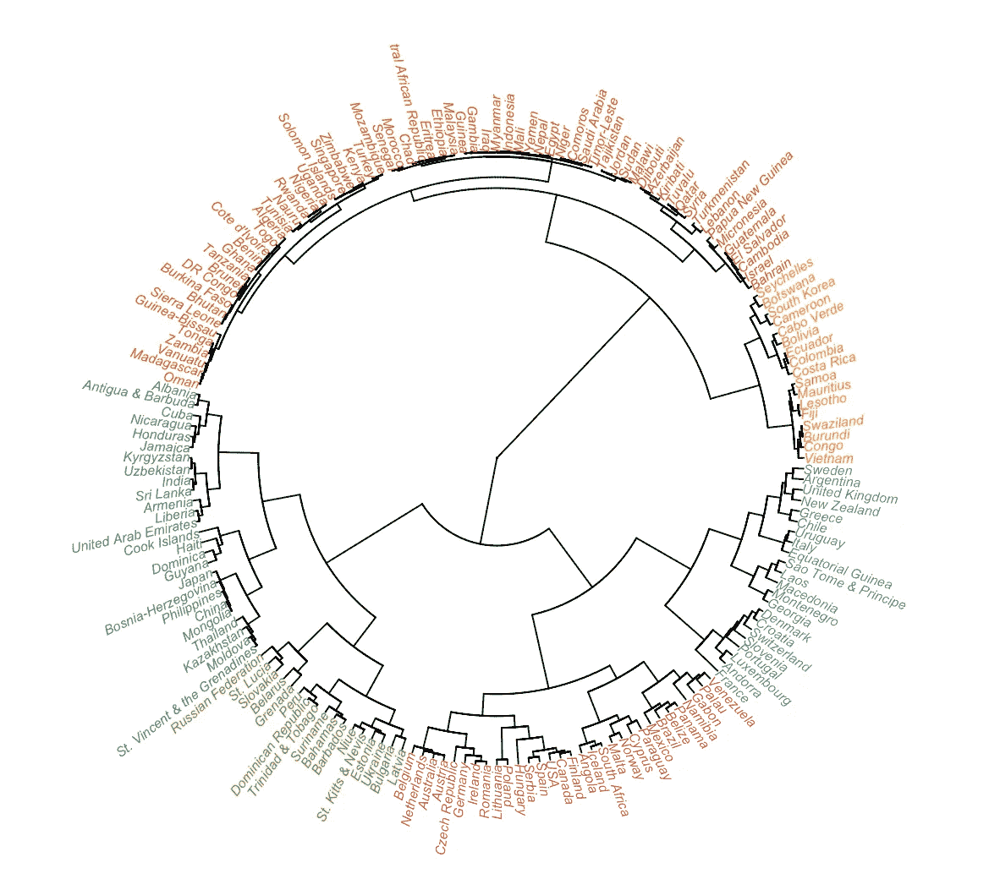

# 世界各地的饮料偏好

> 原文：<https://towardsdatascience.com/preferences-of-drinks-around-the-world-36f37de0394?source=collection_archive---------2----------------------->

在啤酒、烈酒和葡萄酒消费方面，一些国家比其他国家更相似吗？

我使用了一个来自世卫组织的包含年度酒精消费量的数据集，对它应用了层次聚类，并将树分成 6 个聚类。结果很有趣。

地理位置相近的国家有相似的饮酒习惯，比如我们可以看到俄罗斯、白俄罗斯、斯洛伐克在一个群中，瑞士和卢森堡在一个群中，比利时、荷兰、奥地利在一个群中。潜在文化相似的国家也靠得很近，比如巴布亚新几内亚和密克罗尼西亚。

这是我的# 100 day 项目的第四天。完整代码在 [github](https://github.com/yanhann10/Kaggle_Dataset/blob/67557baa12452059ed699cdb94fb37f367a39ba1/drinks/alcohol_consumption.Rmd) 上。