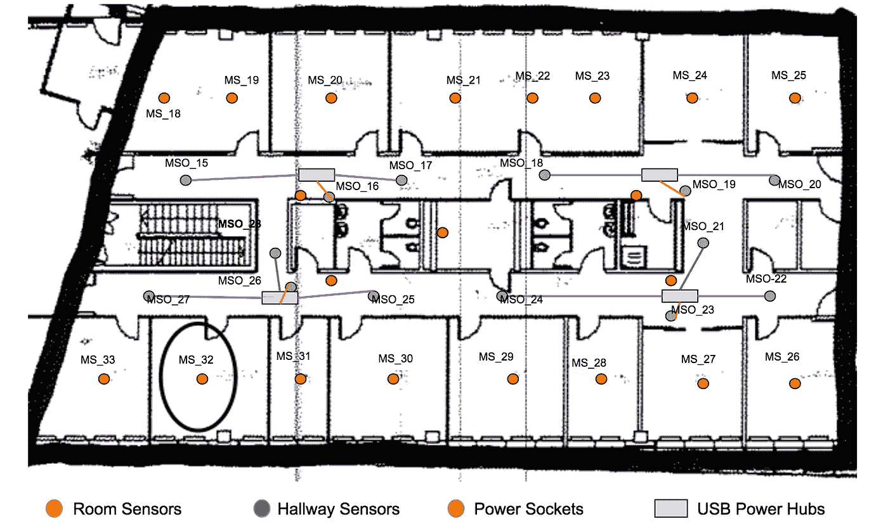
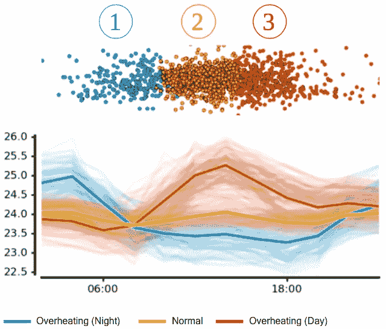
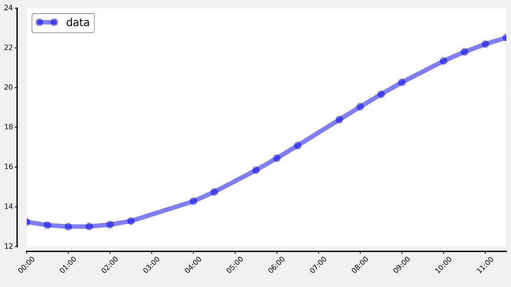
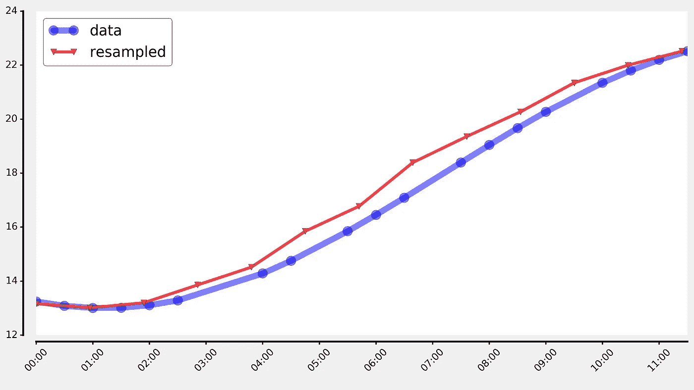
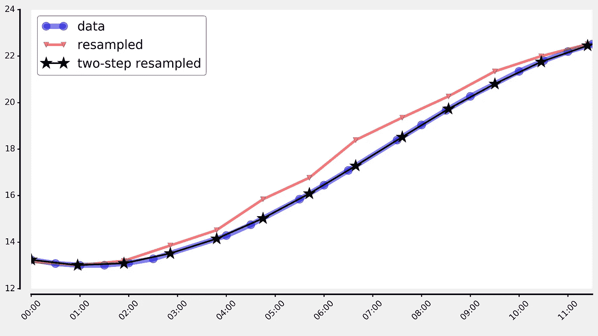
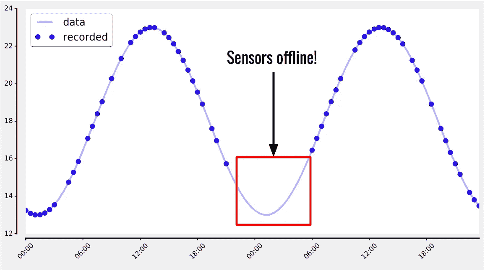
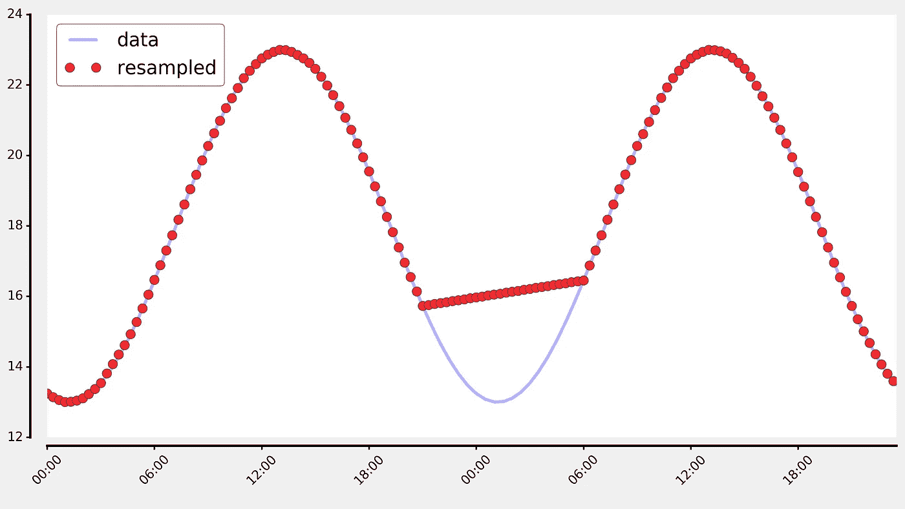
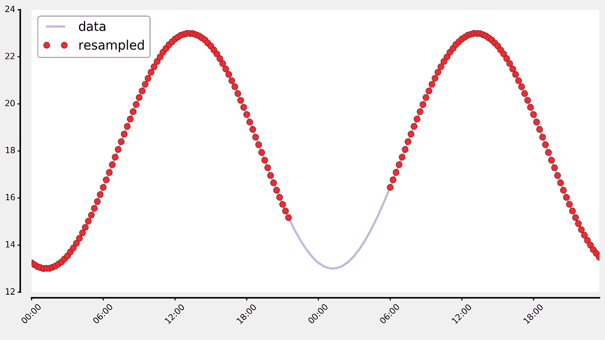

# 物联网数据预处理:线性重采样

> 原文：<https://towardsdatascience.com/preprocessing-iot-data-linear-resampling-dde750910531?source=collection_archive---------1----------------------->

## 处理间隔不均匀的时间序列数据

在本文中，我将介绍我们认为在分析来自物联网(IoT)的时间序列数据时最重要的预处理步骤:**线性重采样**。我将描述对物联网传感器数据进行重采样所面临的挑战，并介绍我们为解决这些挑战而设计的简单解决方案。

# 不规则物联网时间序列数据

在物联网(IoT)中，传感器和其他连接设备收集数据。这些数据被发送到云端，以便进行处理、分析或建模，从而构建智能应用。

因为物联网设备通常不会定期发出数据，所以物联网时间序列数据在采样率方面非常不规则，无论是在设备内部还是在设备之间。这使得处理和分析变得麻烦，尤其是当来自多个传感器的数据被组合在一起分析时。

因此，[重采样](https://en.wikipedia.org/wiki/Sample_rate_conversion)不规则和不均匀间隔的时间序列数据到一致和规则的频率是物联网中至关重要的预处理步骤，可以极大地促进数据的连续处理。

在总部位于柏林的风险建筑商 [WATTx](http://www.wattx.io) ，我们专注于深度技术，包括物联网。在我们最近的一个项目中，我们在一栋安装了数百个传感器的建筑中建造了一个能源优化原型。这些传感器收集关于温度、湿度、亮度和运动的信息。下面，您可以看到一张展示该设置的平面图:



Smart Office IoT setup

通过分析来自办公室这些传感器的数据，我们发现了一个特别有趣的现象:



Clusters of averaged daily temperature curves

该图显示了平均温度曲线簇，并显示了大量房间在夜间和白天都出现过热，这表明 HVAC 系统的使用不理想，因此浪费了能量。

# 使用熊猫进行重采样

在运行与上面类似的分析之前，一个关键的预处理步骤是将不规则的时间序列数据转换为规则的频率，在所有传感器上保持一致。通过这样做，我们消除了在后面的分析过程中必须处理不规则和不一致的跨传感器时间戳的痛苦。

在 WATTx，我们大量使用 Python 及其数据科学堆栈，因此这个过程的自然选择是使用来自 [pandas](https://pandas.pydata.org/) 的`[resample](https://pandas.pydata.org/pandas-docs/stable/generated/pandas.DataFrame.resample.html)`功能。

让我们来看一个简单的模拟温度曲线示例，数据点间距不均匀:



现在，假设我们想要使用*平均值*作为聚合函数和线性插值，以 50 分钟(任意选择)的频率对此温度曲线进行重新采样:

`pd.resample(tseries, '50min', 'mean').interpolate()`



如上所述，重新采样后的时间序列与原始数据并不完全匹配，但显示出相当大的偏移。这主要是因为 pandas 的重采样功能是一个按时间分组的*操作，这使得它非常容易受到原始数据的精确采样和期望目标频率的影响。*

# 物联网的两步重采样过程

为了克服这些不一致性，我们提出了一种解决方案，可以解决我们所有需要线性插值的物联网传感器的这个问题。

该解决方案由两步重采样过程组成，其中我们 **(1)首先使用*均值*作为聚合函数和线性插值将原始时间序列向上采样**到高频(例如 1 分钟或 1 秒，取决于初始数据的分辨率)，然后使用简单的*正向填充*聚合将序列向下采样到所需的目标频率。

应用于上面的示例曲线，代码如下所示:

```
tmp = pd.resample(tseries, '1min', 'mean').interpolate()
resampled = pd.resample(tmp, '50min', 'ffill')
```

让我们来看看结果:



显然，这种两步重采样过程的结果曲线与底层数据的匹配程度更高，并且在我们所有需要线性重采样的物联网传感器中都是如此。

# 增强稳健性:处理缺失数据

当对物联网传感器数据进行重采样时，我们希望考虑的另一种情况是时间序列中缺失数据的大缺口。例如，传感器离线几个小时就是这种情况。

以下是一个模拟温度曲线的示例，显示了传感器在夜间(大约从晚上 10 点到早上 6 点)离线的几个小时间隔:



如果我们对这个时间序列进行重新采样，得到的数据点如下所示:



显然，重采样的数据与大块数据丢失期间的基本真实温度曲线不匹配。为了涵盖这种情况，我们引入了一个附加参数，该参数规定了缺失数据的最大间隙应该是多大，以便进行插值。如果差距超过这个指定的阈值(我们发现在大多数情况下，1 小时左右是一个好的选择)，数据点不会被插值，而是作为 *NaN(不是数字)*值返回。

应用这个额外的功能，我们得到了我们想要的结果；在无数据传输期间，定期采样的数据为空值:



# 摘要

在这篇博文中，我们展示了对不规则物联网时间序列数据进行重采样的挑战，以及我们为克服这些挑战而设计的简单解决方案。我们简单的物联网传感器数据重采样解决方案的代码可在 GitHub gist 的[中找到。](https://gist.github.com/neocortex/5d962742ef16b072dee9a04d9015f85d)

这篇博文的内容是我在 [PyData Berlin 2017](https://pydata.org/berlin2017/schedule/presentation/3/) 演讲的一部分，幻灯片可以在[这里](https://github.com/pydataberlin/conf2017slides/blob/master/smart_iot_applications/building_mart_IoT_applications_Rafael_Schultze-Kraft.pdf)找到。

要了解我们在 WATTx 工作的更多令人兴奋的内容，请查看我们的博客和[Statice](https://www.statice.io/)——我目前正在从事的项目，我们在其中开发技术以实现隐私保护数据科学。