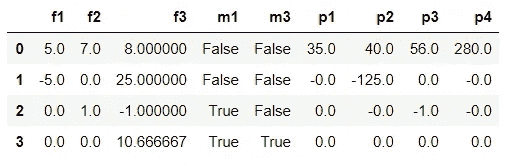
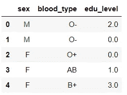
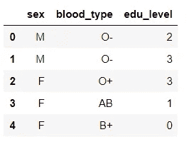
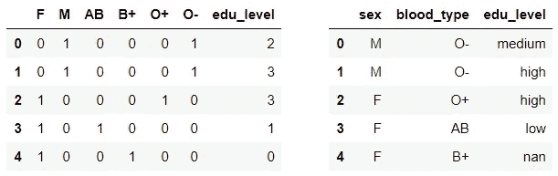
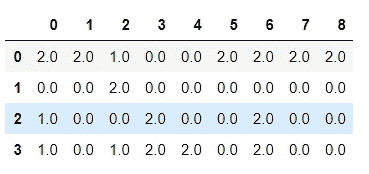
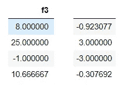
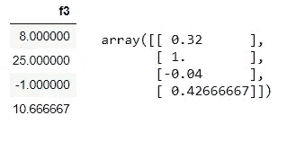
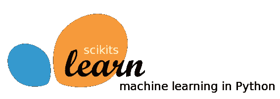

# 使用 sklearn 进行预处理:完整而全面的指南

> 原文：<https://towardsdatascience.com/preprocessing-with-sklearn-a-complete-and-comprehensive-guide-670cb98fcfb9?source=collection_archive---------0----------------------->

对于有抱负的数据科学家来说，有时可能很难在预处理技术的森林中找到出路。 *Sklearn* 它的**预处理库**形成了一个坚实的基础，指导您完成数据科学管道中的这项重要任务。虽然 Sklearn 有相当可靠的文档，但它经常忽略不同概念之间的流线和直觉。


本文旨在成为一个关于使用 **sklearn v0.20.0** 进行预处理的完整指南。它包含了 sklearn 中可用的*所有*实用函数和 transformer 类，并补充了其他常用库中的一些有用函数。最重要的是，文章是按照一个逻辑顺序**来组织的，这个逻辑顺序**代表了执行所讨论的转换的顺序。

将处理以下主题:

*   缺少值
*   多项式特征
*   分类特征
*   数字特征
*   自定义转换
*   特征缩放
*   正常化

注意，第三步和第四步可以互换执行，因为这些转换应该彼此独立地执行。

# 缺少值

处理缺失值是一项重要的预处理任务，如果处理不当，可能会严重影响模型的质量。在处理缺失值时，应该提出几个问题:

> 我是否有缺失的值？它们在数据中是如何表达的？我应该扣留缺失值的样本吗？或者我应该换掉它们？如果是，应该用哪些值替换？

在开始处理缺失值之前，重要的是**识别缺失值**并知道它们被哪个值替代。通过将元数据信息与探索性分析相结合，您应该能够发现这一点。

一旦您对丢失的数据有了更多的了解，您就必须决定是否要保留带有丢失数据的条目。根据 Chris Albon ( *机器学习与 Python 食谱*)的说法，这个决定应该部分取决于**随机缺失值的程度**。

如果它们是完全随机的，它们不会给出任何额外的信息，可以省略。另一方面，如果它们不是随机的，值丢失的事实本身就是信息，可以表示为额外的二进制特征。

还要记住，因为缺少一个值而删除整个观察可能是一个糟糕的决定，会导致信息丢失。就像保留一整行缺失值，因为它有一个有意义的缺失值，这可能不是您的最佳选择。

让我们使用 sklearn 的 *MissingIndicator* 通过一些编码示例来实现这个理论。为了给我们的代码赋予一些意义，我们将创建一个非常小的数据集，包含三个特性和五个样本。数据包含明显的缺失值，表示为*非数字*或 *999* 。

```
import numpy as np
import pandas as pdX = pd.DataFrame(
    np.array([5,7,8, np.NaN, np.NaN, np.NaN, -5,
              0,25,999,1,-1, np.NaN, 0, np.NaN])\
              .reshape((5,3)))X.columns = ['f1', 'f2', 'f3'] #feature 1, feature 2, feature 3
```


Data set with three features and five samples

快速浏览一下数据，这样您就知道丢失的值在哪里。使用 pandas 的 *dropna* 函数，可以从数据中删除包含大量无意义缺失值的行或列。让我们来看看最重要的参数:

*   *轴* : 0 为行，1 为列
*   *tresh* :非 NaN 的不删除一行或一列的数目
*   就地:更新框架

我们通过删除所有只有*和*缺少值的行(*轴* =0)来更新数据集。注意，在这种情况下，除了将 *tresh* 设置为 1，您还可以将 *how* 参数设置为*‘all’*。结果，我们的第二个样本被丢弃，因为它只包含丢失的值。请注意，为了方便起见，我们重置了索引并删除了旧的索引列。

```
X.dropna(axis=0, thresh=1, inplace=True)X.reset_index(inplace=True)X.drop(['index'], axis=1, inplace=True)
```

让我们创建一些额外的布尔特征，告诉我们样本是否缺少某个特征的值。首先从 *sklearn.impute* 导入 *MissingIndicator* (注意需要**版本 0.20.0** )(用'*conda update sci kit-learn*'更新)。

不幸的是，*缺失指示器*不支持多种类型的缺失值([参见 Stackoverflow](https://stackoverflow.com/questions/53002403/sklearn-impute-missingindicator-valueerror-input-contains-nan-infinity-or-a-va) 上的这个问题)。因此，我们必须将数据帧中的 *999* 值转换为 *NaN* 值。接下来，我们创建、拟合并转换一个 MissingIndicator 对象，该对象将检测数据中的所有 *NaN 的*。

从这个指示符，我们可以创建一个新的数据帧，用布尔值表示一个实例是否缺少某个特性的值。但是为什么我们只有两个新专栏，而我们有三个原始功能？删除第二个样本后， *f2* 不再有缺失值。如果*缺失指示器*没有检测到特征中的任何缺失值，它不会从该特征创建一个新特征。

我们稍后会将这个新特性添加到我们的原始数据中，现在我们可以将它们存储在*指示器*变量中。

```
from sklearn.impute import MissingIndicatorX.replace({999.0 : np.NaN}, inplace=True)indicator = MissingIndicator(missing_values=np.NaN)indicator = indicator.fit_transform(X)indicator = pd.DataFrame(indicator, columns=['m1', 'm3'])
```

在决定保留(一些)缺失值并创建缺失值指示器后，下一个问题是是否应该替换缺失值。当缺失值被表示为*而不是数字* ( *np)时，大多数学习算法表现不佳。NaN* )并且需要某种形式的缺失值插补。要知道有些库和算法，比如 *XGBoost* 、*可以*处理缺失值，通过学习自动估算这些值。

## 输入值

为了用通用策略填充缺失值，sklearn 提供了一个*简单估算器*。四个主要策略是*均值*、*最频繁*、*中值*和*常量*(不要忘记设置*填充值*参数 **)** 。在下面的例子中，我们用特征的平均值估算数据框架 X 的缺失值。

```
from sklearn.impute import SimpleImputerimp = SimpleImputer(missing_values=np.nan, strategy='mean')imp.fit_transform(X)
```

注意，返回的值被放入一个 *Numpy* 数组，我们丢失了所有的元信息。由于所有这些策略都可以在 *pandas* 中模仿，我们将使用 pandas *fillna* 方法来估算缺失值。对于表示的‘T28’，我们可以使用下面的代码。这个 *pandas* 实现还提供了向前填充( *ffill* )或向后填充(*bfil*)的选项，这在处理时间序列时非常方便。

```
X.fillna(X.mean(), inplace=True)
```

其他常用的估算缺失数据的方法是**用 k 近邻** (KNN) **算法**对数据进行聚类，或者**使用各种插值方法对值进行插值**。这两种技术都没有在 *sklearn* 的预处理库中实现，这里就不讨论了。

# 多项式特征

创建多项式要素是一种简单而常用的要素工程方法，它通过组合要素来增加数字输入数据的复杂性。

当我们想要包含特征和目标之间存在非线性关系的概念时，通常会创建多项式特征**。它们主要用于增加几乎没有特征的线性模型的复杂性，或者当我们怀疑一个特征的效果依赖于另一个特征时。**

在处理缺失值之前，您需要决定是否要使用多项式要素。例如，如果您将所有缺少的值替换为 0，则使用此功能的所有叉积都将为 0。此外，如果不替换丢失的值( *NaN* )，创建多项式特征将在 *fit_transform* 阶段产生值错误，因为输入应该是有限的。

在这方面，用中值或平均值代替缺失值似乎是一个合理的选择。由于我对此并不完全确定，也找不到任何一致的信息，[我在数据科学 StackExchange](https://datascience.stackexchange.com/questions/40003/handling-missing-values-to-optimize-polynomial-features) 上问了这个问题。

*Sklearn* 提供了一个*多项式特征*类来从头创建多项式特征。*次数*参数决定多项式的最大次数。例如，当*度*设置为 2 且 X=x1，x2 时，创建的特征将为 1，x1，x2，x1，x1x2 和 x2。 *interaction_only* 参数让函数知道我们只需要交互特性，即 1、x1、x2 和 x1x2。

这里，我们创建了三次多项式特征，也是唯一的交互特征。结果我们得到四个新特征: *f1.f2* 、 *f1.f3* 、 *f2.f3* 和 *f1.f2.f3* 。请注意，我们的原始特征也包含在输出中，并且我们会切掉新特征，以便稍后添加到我们的数据中。

```
from sklearn.preprocessing import PolynomialFeaturespoly = PolynomialFeatures(degree=3, interaction_only=True)polynomials = pd.DataFrame(poly\
                           .fit_transform(X), 
                           columns=['0','1','2','3', 
                                    'p1', 'p2', 'p3', 'p4'])\
                                        [['p1', 'p2', 'p3', 'p4']]
```

正如任何其他形式的特征工程一样，在进行任何特征缩放之前，创建多项式特征*是很重要的。*

现在，让我们用 pandas *concat* 方法将新的缺失指标特征和多项式特征连接到我们的数据中。

```
X = pd.concat([X, indicator, polynomials], axis=1)
```



Dataframe with original features (f), missing value indicators (m) and polynomial features (p)

# 分类特征

分类数据的筛选是数据预处理过程中的另一个重要过程。不幸的是， *sklearn 的*机器学习库不支持处理分类数据。即使对于基于树的模型，也有必要**将分类特征转换成数字表示**。

在开始转换数据之前，确定您正在处理的要素是否是有序的(相对于名义的)非常重要。**有序特征**最好描述为**具有自然有序类别的特征，类别之间的距离未知**。

一旦你知道你正在处理什么类型的分类数据，你就可以选择一个合适的转换工具。在 sklearn 中，将有一个用于序数数据的 *OrdinalEncoder* ，以及一个用于名义数据的 *OneHotEncoder* 。

让我们考虑一个简单的例子来演示这两个类是如何工作的。创建一个具有五个条目和三个特征的数据框架:*性别*、*血型*和*教育程度*。

```
X = pd.DataFrame(
    np.array(['M', 'O-', 'medium',
             'M', 'O-', 'high',
              'F', 'O+', 'high',
              'F', 'AB', 'low',
              'F', 'B+', np.NaN])
              .reshape((5,3)))X.columns = ['sex', 'blood_type', 'edu_level']
```

查看数据框架，您应该注意到教育水平是唯一的顺序特征(可以排序，类别之间的距离未知)。我们将从用 *OrdinalEncoder* 类编码这个特性开始。导入该类并创建一个新实例。然后通过将该特征拟合并转换到编码器来更新教育水平特征。结果应该如下所示。

```
from sklearn.preprocessing import OrdinalEncoderencoder = OrdinalEncoder()X.edu_level = encoder.fit_transform(X.edu_level.values.reshape(-1, 1))
```



注意这里我们有一个相当烦人的问题:**我们丢失的值被编码成一个单独的类(3.0)** 。仔细阅读文档可以发现，这个问题还没有解决方案。一个好的迹象是， *sklearn* 开发者正在[讨论实现一个合适的解决方案](https://github.com/scikit-learn/scikit-learn/issues/11996)的可能性。

另一个问题是**我们的数据顺序没有得到尊重**。幸运的是，这可以通过将特性的唯一值的有序列表传递给*类别*参数来解决。

```
encoder = OrdinalEncoder(categories=['low', 'medium', 'high'])
```

要解决第一个问题，我们必须求助于熊猫。*因式分解*方法提供了一种替代方法，可以处理缺失值并尊重我们的值的顺序。第一步是将特征转换为有序熊猫*分类*。传递一个*类别列表*(包括缺失值的类别)并将*有序*参数设置为*真*。

```
cat = pd.Categorical(X.edu_level, 
                     categories=['missing', 'low', 
                                 'medium', 'high'], 
                     ordered=True)
```

用*缺失*类别替换缺失值。

```
cat.fillna('missing')
```

然后，将分类参数设置为*真*的*分类*进行因式分解，并将输出分配给*教育水平*特征。

```
labels, unique = pd.factorize(cat, sort=True)X.edu_level = labels
```

这一次的结果更令人满意，因为数据是数值型的，仍然是有序的，缺失值被替换为 0。请注意，用最小值替换缺失值可能并不总是最佳选择。其他选项是**将其放在最常见的类别中，或者在特征分类时将其放在中间值的类别中**。



现在让我们转向另外两个，名义特征。请记住，我们不能用数字来代替这些特征，因为这意味着这些特征是有顺序的，这在性别或血型的情况下是不正确的。

最流行的标称特征编码方式是**一次热编码**。本质上，**具有 *n* 个类别的每个分类特征被转换成 *n* 个二元特征**。

让我们看一下我们的例子，把事情弄清楚。首先导入 *OneHotEncoder* 类，并创建一个新实例，将输出数据类型设置为 integer。这不会改变我们的数据将如何被解释，但会提高我们输出的可读性。

然后，拟合并转换我们的两个名义范畴。这个转换的输出将是一个稀疏矩阵，这意味着我们必须将矩阵转换成一个数组(*)。toarray()* )才能将其倒入数据帧中。当初始化一个新的类实例时，可以通过将*稀疏*参数设置为*假*来省略这个步骤。分配列名，输出就可以添加到其他数据中了( *edu_level* 特性)。

```
from sklearn.preprocessing import OneHotEncoderonehot = OneHotEncoder(dtype=np.int, sparse=True)nominals = pd.DataFrame(
    onehot.fit_transform(X[['sex', 'blood_type']])\
    .toarray(),
    columns=['F', 'M', 'AB', 'B+','O+', 'O-'])nominals['edu_level'] = X.edu_level 
```

将输出(*名词*)与我们的原始数据进行比较，以确保一切都以正确的方式进行。



Encoded data versus original data

因为我们的数据中没有丢失值，所以说明如何用*onehotencode*处理丢失值是很重要的。丢失的值可以很容易地作为一个额外的特性来处理。注意，要做到这一点，您需要首先用一个任意值替换丢失的值(例如，*‘missing’*)如果您另一方面想忽略丢失的值并创建一个全为零的实例( *False* )，您只需将 *OneHotEncoder* 的*handle _ unknown*参数设置为 *ignore* 。

# 数字特征

就像分类数据可以被编码一样，数字特征可以被“解码”成分类特征。最常见的两种方法是**离散化**和**二值化**。

## [数]离散化

离散化，也称为量化或宁滨，**将连续特征分成预先指定数量的类别**(箱)，从而使数据离散。

离散化的主要目标之一是显著地**减少连续属性**的离散区间的数量。因此，为什么这种转换可以提高基于树的模型的性能。

Sklearn 提供了一个 *KBinsDiscretizer* 类来处理这个问题。您唯一需要指定的是每个特征的面元数量(*n _ 面元*)以及如何对这些面元进行编码(*序数*、*一个热点*或*一个热点密集*)。可选的*策略*参数可以设置为三个值:

*   *统一*，其中每个特征中的所有箱具有相同的宽度。
*   *分位数(*默认)，其中每个特征中的所有条柱具有相同的点数。
*   *k 均值*，其中每个箱中的所有值都具有相同的 1D k 均值聚类的最近中心。

小心选择策略参数很重要。例如，使用统一策略对异常值非常敏感，会使您最终得到只有几个数据点的条柱，即异常值。

让我们转向我们的例子来进行一些澄清。导入 *KBinsDiscretizer* 类并创建一个新实例，该实例具有三个 bin、序号编码和统一策略(所有 bin 都具有相同的宽度)。然后，拟合并转换我们所有原始的、缺失的指标和多项式数据。

```
from sklearn.preprocessing import KBinsDiscretizerdisc = KBinsDiscretizer(n_bins=3, encode='uniform', 
                        strategy='uniform')disc.fit_transform(X)
```

如果输出对您没有意义，调用离散化器(*圆盘*)上的 *bin_edges_* 属性，看看这些面元是如何划分的。然后尝试另一种策略，并查看面元边缘如何相应地变化。



Discretized output

## 二值化

特征二值化是**对数字特征进行阈值处理以获得布尔值**的过程。或者换句话说，基于阈值给每个样本分配一个布尔值(*真*或*假*)。注意，二进制化是二进制离散化的极端形式。

总的来说，二值化作为一种**特征工程技术是有用的，用于创建新的特征来表示有意义的东西**。就像上面提到的*缺失指示器*用来标记有意义的缺失值。

sklearn 中的*二进制化器*类以非常直观的方式实现二进制化。您需要指定的唯一参数是*阈值*和*复制*。所有低于或等于阈值的值被替换为 0，高于阈值的值被替换为 1。如果复印设置为*假*，则执行原位二值化，否则进行复印。

考虑我们示例中的*特征 3* ( *f3* )，让我们创建一个额外的二元特征，对于正值使用*真*，对于负值使用*假*。导入*二进制化器*类，创建一个阈值设置为零的新实例，并复制到 *True* 。然后，将二进制化器安装并转换到*特征 3。*输出是一个带有布尔值的新数组。

```
from sklearn.preprocessing import Binarizerbinarizer = Binarizer(threshold=0, copy=True)binarizer.fit_transform(X.f3.values.reshape(-1, 1))
```

# 定制变压器

如果您想将现有的函数转换成转换器，以帮助数据清理或处理，您可以使用 *FunctionTransformer* 从任意函数实现转换器。如果你正在使用 *sklearn* 中的*管道*，这个类可能会很有用，但是可以很容易地通过将 lambda 函数应用到你想要转换的特征来替换(如下所示)。

```
from sklearn.preprocessing import FunctionTransformertransformer = FunctionTransformer(np.log1p, validate=True)transformer.fit_transform(X.f2.values.reshape(-1, 1)) #same outputX.f2.apply(lambda x : np.log1p(x)) #same output
```

# 特征缩放

预处理管道中的下一个逻辑步骤是缩放我们的特征。在应用任何缩放变换之前，将你的数据分成一个训练集和一个测试集是非常重要的。如果您之前就开始缩放，您的训练(和测试)数据可能会围绕一个平均值(见下文)进行缩放，而这个平均值实际上并不是训练或测试数据的平均值，从而忽略了您最初缩放的全部原因。

## 标准化

标准化是一种转换，**通过移除每个特征的平均值来集中数据，然后通过将(非恒定)特征除以它们的标准偏差来缩放数据**。标准化数据后，平均值为零，标准偏差为一。

标准化可以极大地提高模型的性能。例如，学习算法的目标函数中使用的许多元素(如支持向量机的 RBF 核或线性模型的 l1 和 l2 正则化子)假设所有特征都以零为中心，并且具有相同顺序的方差。如果某个特征的方差比其他特征的方差大几个数量级，那么它可能会主导目标函数，使估计器无法像预期的那样正确地从其他特征中学习。

根据你的需求和数据，sklearn 提供了一堆定标器:*标准定标器*、*最小最大定标器*、*最大最小定标器*和*鲁棒定标器*。

## 标准缩放器

*Sklearn* 它的主定标器 *StandardScaler* 使用一个严格的标准化定义来标准化数据。它**通过使用以下公式纯粹地将数据**居中，其中 *u* 是平均值， *s* 是标准偏差。

> x _ scaled =(x-u)/s

让我们看看我们的例子，看看这在实践中。在我们开始编码之前，我们应该记住我们的第四个实例的值是缺失的，我们用平均值代替了它。如果我们在上面的公式中输入平均值，标准化后的结果应该为零。我们来测试一下。

导入 *StandardScaler* 类并创建一个新实例。请注意，对于稀疏矩阵，您可以将 *with_mean* 参数设置为 *False* 以避免数值集中在零附近。然后，将定标器安装并转换至*特征 3* 。

```
from sklearn.preprocessing import StandardScalerscaler = StandardScaler()scaler.fit_transform(X.f3.values.reshape(-1, 1))
```

不出所料，第四个实例的值为零。


Ouput of standard scaling feature 3

## 最小最大缩放器

*最小最大缩放器*通过**将每个特征缩放到给定范围**来变换特征。该范围可以通过指定*特征范围*参数来设置(默认为 *(0，1)* )。此缩放器更适合非高斯分布或标准偏差非常小的情况。然而，它对异常值很敏感，所以如果数据中有异常值，你可能需要考虑另一个缩放器。

> x _ scaled =(x-min(x))/(max(x)-min(x))

导入和使用*最小最大缩放器*的工作方式与*标准缩放器*完全相同——就像下面所有的缩放器一样。唯一的区别在于启动新实例时的参数。

这里我们将*特征 3* ( *f3* )缩放到-3 和 3 之间的比例。正如所料，我们的最大值( *25* )被转换为 3，最小值(- *1* )被转换为-3。所有其他值在这些值之间线性缩放。

```
from sklearn.preprocessing import MinMaxScalerscaler = MinMaxScaler(feature_range=(-3,3))scaler.fit_transform(X.f3.values.reshape(-1, 1))
```



Feature 3 before and after applying the MinMaxScaler

## MaxAbs 定标器

*maxabscaler*的工作方式与 *MinMaxScaler* 非常相似，但会根据**绝对最大值**自动将数据缩放至 *[-1，1]* 范围。该缩放器用于已经以零为中心的**数据或稀疏数据**。它不会移动/居中数据，因此不会破坏任何稀疏性。

> x_scaled = x / max(abs(x))

让我们再次使用*maxabscaler*对*特性 3* 进行转换，并将输出与原始数据进行比较。

```
from sklearn.preprocessing import MaxAbsScalerscaler = MaxAbsScaler()scaler.fit_transform(X.f3.values.reshape(-1, 1))
```



Feature 3 before and after applying the MaxAbsScaler

## 鲁棒定标器

如果您的数据包含许多异常值**，使用数据的平均值和标准偏差进行缩放可能不会很好。在这些情况下，您可以使用*鲁棒定标器*。**移除中间值，并根据分位数范围**缩放数据。文档中没有规定*鲁棒定标器*的确切公式。如果你想要完整的细节，你可以随时查看源代码。**

**默认情况下，缩放器使用四分位数范围(IQR)，即第一个四分位数和第三个四分位数之间的范围。当启动*鲁棒定标器*的新实例时，可以通过指定 *quantile_range* 参数来手动设置分位数范围。这里，我们使用从 *10%* 到 *90%* 的分位数范围来变换*特征 3* 。**

```
from sklearn.preprocessing import RobustScalerrobust = RobustScaler(quantile_range = (0.1,0.9))robust.fit_transform(X.f3.values.reshape(-1, 1))
```

# **正常化**

**归一化是指**将单个样本缩放至单位范数**的过程。基本上，当算法根据数据点之间形成的加权关系进行预测时，您需要对数据进行规范化。将输入缩放到单位规范是**文本分类或聚类**的常见操作。**

> **缩放(例如标准化)和规格化之间的一个关键区别是规格化是一个**行操作**，而缩放是一个列操作。**

**虽然有许多其他方法来归一化数据，但是 *sklearn* 提供了三个范数(与单个值进行比较的值): *l1* 、 *l2* 和 *max* 。创建*规格化器*类的新实例时，可以在*规格化*参数下指定所需的规格化。**

**下面，可用范数的公式将在 Python 代码中讨论和实现——结果是数据集 *X* 中每个样本的分母列表。**

## **马克斯**

****

***最大值*范数使用绝对最大值，对样本的作用与*最大值缩放器*对特征的作用相同。**

> **x_normalized = x / max(x)**

```
norm_max = 
list(**max**(list(abs(i) for i in X.iloc[r])) for r in range(len(X)))
```

## **l1 '**

***l1* 范数使用**所有值的总和**作为，因此给予所有参数相等的惩罚，加强稀疏性。**

> **X _ 规格化= x / sum(X)**

```
norm_l1 = 
list(**sum**(list(abs(i) for i in X.iloc[r])) for r in range(len(X)))
```

## **l2 '**

**l2 范数使用所有平方值之和的平方根。这创建了平滑和旋转不变性。一些模型，如 PCA，假设旋转不变性，因此 *l2* 将执行得更好。**

> **X _ normalized = X/sqrt(sum((I * * 2)for I in X))**

```
norm_l2 = 
list(math.sqrt(sum(list((i**2) for i in X.iloc[r]))) 
 for r in range(len(X)))
```

****——请随时在评论中或私信中告诉我任何不一致或错误。—****

# **来源**

**[](https://scikit-learn.org/stable/modules/preprocessing.html#preprocessing) [## 4.3.预处理数据-sci kit-学习 0.20.1 文档

### 例如，学习算法的目标函数中使用的许多元素(如支持向量机的 RBF 核…

scikit-learn.org](https://scikit-learn.org/stable/modules/preprocessing.html#preprocessing) [](https://swaathi.com/2017/04/29/normalizing-data/) [## 规范化数据-人工智能系列的第一部分

### 与 nave en(Skcript 的 AI Dev)合著。在机器学习中，更多的时候是不对数据应用算法…

swaathi.com](https://swaathi.com/2017/04/29/normalizing-data/) [](http://www.faqs.org/faqs/ai-faq/neural-nets/part2/section-16.html) [## 人工智能神经网络常见问题，第 2 部分，共 7 部分:学习部分——我是否应该标准化/规范化/重新调整

### 人工智能神经网络常见问题，第 2 部分，共 7 部分:学习部分——我是否应该标准化/规范化/重新调整

人工智能神经网络常见问题，第 2 部分，共 7 部分:学习部分——我应该标准化/规范化/重标 thewww.faqs.org 吗](http://www.faqs.org/faqs/ai-faq/neural-nets/part2/section-16.html)  [## 使用 Python 的机器学习食谱

### 量化数据是对某些东西的度量——无论是班级规模、月销售额还是学生成绩。自然的方式…

www.oreilly.com](https://www.oreilly.com/library/view/machine-learning-with/9781491989371/ch04.html) [](https://machinelearningmastery.com/prepare-data-machine-learning-python-scikit-learn/) [## 如何使用 Scikit-Learn 为 Python 中的机器学习准备数据

### 许多机器学习算法会对你的数据做出假设。在…中准备数据通常是一个非常好的主意

machinelearningmastery.com](https://machinelearningmastery.com/prepare-data-machine-learning-python-scikit-learn/) [](https://medium.com/@rrfd/standardize-or-normalize-examples-in-python-e3f174b65dfc) [## 标准化还是常态化？Python 中的示例

### 一个常见的误解是，什么是标准化数据以及何时标准化数据与标准化日期之间的区别。

medium.com](https://medium.com/@rrfd/standardize-or-normalize-examples-in-python-e3f174b65dfc)  [## 使用 scikit-learn 扩展功能

### 在这篇文章中，我们探索了 scikit-learn 中实现的 3 种特征缩放方法:标准缩放器假设…

benalexkeen.com](http://benalexkeen.com/feature-scaling-with-scikit-learn/)**