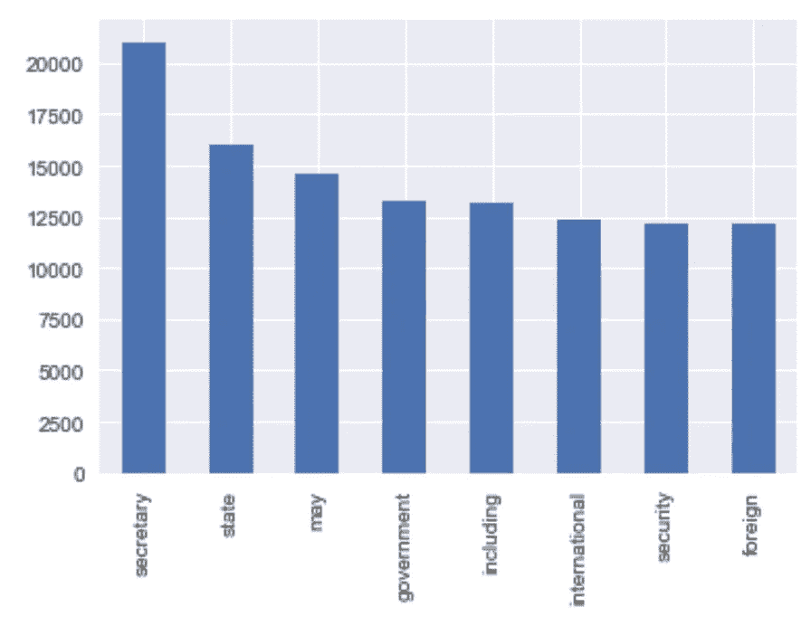
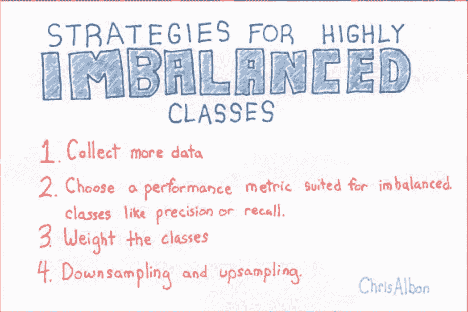
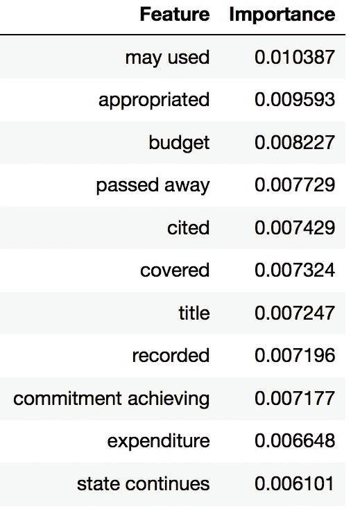
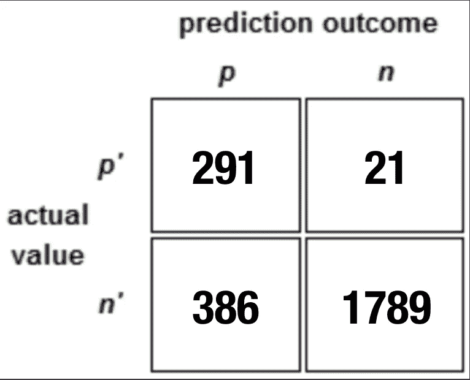

# 用数据保护我们更好的立法者

> 原文：<https://towardsdatascience.com/preserving-our-better-legislators-with-data-3726232f86f6?source=collection_archive---------6----------------------->

你有最喜欢的国会议员吗？在一个支持率非常低的机构中，人们倾向于喜欢他们当地的联邦立法代表。我的情况也不例外；我也开始钦佩我在当地的代表，Ileana Ros-Lehtinen。

除了地区问题，她在拉丁美洲问题上的立法记录给我留下了特别深刻的印象。作为第一位当选国会议员的拉美裔女性，她对外交政策产生了兴趣，并加入了美国众议院外交事务委员会。她作为被卡斯特罗驱逐出古巴的古巴人的背景影响了她的问题观点，但这从未妨碍她在支持拉丁美洲的和平与民主方面有着完美的记录。作为一名哥伦比亚人，我注意到她在 90 年代末帮助控制国家的努力。后来，在国会山工作时，我目睹了她争取国会支持反对委内瑞拉萌芽中的查韦斯/马杜罗独裁政权。类似的行动发现在联邦记录尼加拉瓜，厄瓜多尔等。

众议员 Ros-Lehtinen 将在国会本届会议后退休。作为一个国家，我们将非常怀念她在政治舞台上充满激情的声音和合群的个性。更重要的是，这留下了一个问题:她的追随者会如何看待她的遗产。在这篇文章中，我将利用数据科学为维护她的理想贡献我的一粒沙子。

This is retiring member Ileana Ros-Lehtinen. She has an even happier aura in person.

该项目旨在预测一名长期任职的国会议员退休后将如何投票表决未来的立法。通过使用她在过去 4 届国会会议期间在委员会中发起的法案，我将创建一个预测模型，该模型将输出一个逻辑答案，即在给定文本的情况下，众议员 Ros-Lehtinen 是否会对法案进行投票。

为了利用文本作为特征，我对账单文本执行了计数矢量化以提取特征。这一过程需要做出许多关键决策，例如对计数矢量化结果进行词汇化时丢失的上下文，以及除 NLTK 的“英语”集合中的标准之外的停用词的选择。在适当的时候，我们将法案中的标准语言和法案文本中更具程序性的语言纳入到停用字词阈值中。

计数矢量化的结果数据框将使用 XGBoost 和 Logislitc 回归进行建模，目的是在信号太弱时使用增强方法。

# **数据字典和清理**

这些数据主要是从他们现在已经废弃的(至少是数据部门)[阳光基金会](https://sunlightfoundation.com/)、[美国政府出版办公室](https://www.gpo.gov/)和 [ProPublica](https://www.propublica.org/datastore/) 收集的。

我从阳光基金会刮出了一份从 2009 年到现在提交给美国众议院外交事务委员会(委员会)的所有法案的清单。在 scrape 中，我保留了几个有助于识别账单的变量，包括计数矢量化的潜在目标，比如账单标题和昵称。

使用账单标识信息，我构建了第二个 scraper，它将迭代第一个 scraper 以获取账单信息，从而从 **GPO** 下载账单文本。

最后，我使用来自阳光基金会的委员会特定法案的信息来解析 **ProPublica 的**法案记录。从那里我收集了众议员 Ileana Ros-Lehtinen 赞助或共同赞助的条目。我选择了赞助而不是投票，因为赞助比投票更常见，因为少量的提案会得到投票的考虑。这也表明了个人对拟议立法的语言和内容的更多承诺。

获取必要的数据后，接下来的步骤是为计数矢量化做准备。该法案的文本有很多格式，以纠正空白，并选择该法案的最有用和独特的部分。在运行计数矢量器之前，数据被分离出来，只包含文本和 Ros-Lehtinen 的投票记录。

此时，我执行了一次训练、测试分割，并继续进行数据的计数矢量化。

> 下图只是字数统计；我分享是因为我觉得很有趣，最常见的话基本上是告诉国务卿该做什么。

Keeping SoS busy

# 特征和模型选择

鉴于项目的范围和我收集的数据，我选择了以下特征来构建模型。

主要特征是应用于账单文本语料库的词汇化计数 Verctorization 的结果。所使用的案文正文被删除了法案的序言(包括提案国和共同提案国，以及将法案提交委员会的程序)，以及诸如符号和章节编号等非文字部分。除了计数矢量化之外，我还使用虚拟变量来表示条目是哪种法规(HR、HRES、S 等。).

当然，回应变量是众议员罗斯-莱蒂宁的一个衡量标准。然而，考虑到提交给委员会的法案和正在进行表决的法案之间的交集非常少，我不得不使用一个不同的参数。为此，我选择提案或共同提案一项法案。因此，响应类的数量上升到数据的大约 15%。使用这个标准还可以防止我错过以语音投票形式出现的数据点。口头投票在普遍认可的立法中很常见，反对党有义务要求投赞成票和反对票，以便将这些投票立场纳入联邦登记册。

为了解决班级失衡问题，我所做的最积极的决定是增加我的积极回应，以匹配我的消极回应。我通过替换重采样和设置参数来实现这一点，这样每个类平均分为 2150 个条目。在使用这个数据集构建模型之后，我将恢复到最初的数据集，并在模型中运行它。基于此的报告将是我的模型评分的一部分。

A reminded of how, and in which order, to deal with highly unbalanced classes, courtesy of the one and only Chris Albon. If his website is not among your most visited, make it a thing.

有了我的数据和响应变量，我建立了几个分类模型，看看哪种算法最能突出我的响应变量。

# 结果

即使有模型和矢量器组合的排列数，模型也难以获得高于 60%的 AUC 分数。使用计数矢量器、TFIDF 矢量器以及 KNeighbors、逻辑回归、Bernoulli 朴素贝叶斯、多项式朴素贝叶斯、XGBoost 和 Random Forest 模型，我寻找可能的最佳评分模型。准确性总是很高，但是根据混淆矩阵和 AUC 评分，模型不断将结果偏向非常低的阳性预测数。

经过上述的上采样后，我的模型的结果得到了改善。当我在 upsampled-made 模型中传递原始数据时，我发现**精确度和计算效率的最佳平衡是对 TF-IDF 矢量化文本运行逻辑回归。**XGBoost 模型的结果也显示了类似于逻辑回归的前景，但不足以证明其缓慢的表现。

所选逻辑回归模型的最终交叉验证准确度和 AUC 度量为 82%准确度和. 69% AUC。我感到矛盾，因为这略低于我所声明的达到. 70 AUC 分数的目标，但精度远远高于我的原始目标，我觉得概念证明已经实现，并需要使用更合适的自然语言处理工具进行进一步开发。

A model feature importance; for those who are curious about which terms mattered most.

# 估价

在投票行为并不总是被记录的议会系统中，预测投票行为的任务是棘手的。此外，立法通常由工作人员以历史悠久的方式构建，因此减少了文本矢量器在预测投票成员的感受或风格方面的影响。然而，我确实相信，在对文本的分析中，有足够的信号表明他们将支持什么样的立法。

在具体参考我的结果和评估我的实验时，我对我的目标变量中的积极响应的低召回值感到担忧。该模型对比尔赞助回忆的得分为 0.45，这确实给我的结果和断言蒙上了一层阴影，但我相信其他 NLP 工具将有助于纠正这一错误。

Final results of my original data when applied to the models made with upsampled dataset. The model was a logistic regression with a TF-IDF vectorization.

随后的分析将加深对基于立法文本的投票行为的理解，该分析将运行无监督学习算法，例如 LDA。将这个项目的模型和 LDA 部署为一个集成系统是不可能的，但它将深化主题专业知识，并为未来的模型开发提供见解。

# 最后的想法

我将继续致力于这个项目，以更好地预测投票/赞助行为。我还有本届国会会议的剩余时间来进一步测试这个模型；更确切地说是拉丁美洲的钞票，这也是这个项目最初的预期。我还将制作一个针对具体问题划分的法案子集，看看我的模型在某些子集上是否更好。