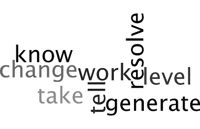
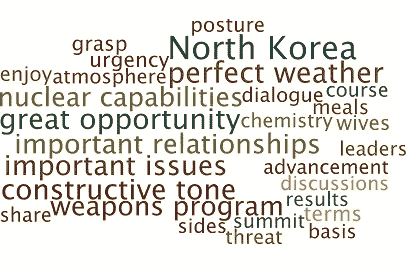
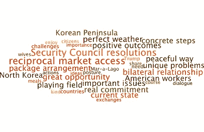

# 从文本分析的角度看媒体吹风会:川普总统与中国习主席的会晤

> 原文：<https://towardsdatascience.com/press-briefing-through-the-lens-of-text-analytics-president-trumps-meetings-with-president-xi-of-a0d8eabe0f08?source=collection_archive---------5----------------------->

特朗普总统和中国总理 Xi 上周在美国的会晤是全世界关注和报道的最重要事件之一。会后，白宫博客发布了秘书们关于这次会议的简报，可以在[这个公共领域](https://www.whitehouse.gov/the-press-office/2017/04/07/briefing-secretary-tillerson-secretary-mnuchin-and-secretary-ross)找到。

首先，当你阅读时，我觉得新闻发布会是一个相当长的内容，因为峰会的复杂性和重要性。其次，一些关键的含义可能隐藏到普通人的眼睛和头脑才能理解。所以，这里有一个基于文本分析的方法，我用它来从简报中理解会议的重要性。

**进场:**

我首先将新闻简报的内容(不包括问题)分成三个部分，这三个部分可以提供过去、现在和未来的线索。然后，我查看具体的上下文，如找到重要的单词、语言风格、情感等，以获得更好的理解。

在这篇文章中，我将只涉及我观察到的现在和未来的相关方面。整个发现和观察对我来说花了大约 30 分钟，使用了我在公司建立的技术框架，并基于我从经验中使用的特定技术。

## 文本分析

**文本发现到现在的语境**

> *正如在座各位所知，今天显然是一个完美的天气，这对夫妇来说是一个很好的机会，可以真正了解彼此，享受，一起用餐，并就重要问题开展工作。
> *当然，我们在这里有代表，他们也能够为我们未来的许多工作建立重要的关系。我想我真正想让你了解的是，两位领导人之间的气氛和化学反应是积极的。
> *因此，我认为我们所有人都对本次峰会的成果感到非常满意，因为它为未来奠定了非常有建设性的基调。
> *双方注意到了朝鲜武器计划威胁的紧迫性，重申了
> *我认为，从他们的角度来看，他们都认为朝鲜核能力的发展已经到了非常严重的阶段。但是为了实现这一点，朝鲜的姿态必须改变，才有对话或讨论的基础。

**文本发现到未来语境**

> *我会先说总统非常高兴在 Mar-a-Lago 主持这两天。正如在座的各位所知，今天显然是一个完美的天气，这对总统和他们的妻子来说是一个很好的机会，可以真正了解彼此，享受，一起用餐，并就重要问题开展工作。
> *我可以告诉你，交流是非常坦率的。两国总统回顾了双边关系的现状，并指出共同努力取得有益于两国公民的积极成果的重要性。
> *总统强调了采取具体措施为美国工人创造公平竞争环境的必要性，反复强调了互惠市场准入的必要性。
> *没有讨论过解决这个问题的一揽子安排。他们讨论了给两国带来的挑战，但是我们有一个真正的承诺，那就是共同努力，看看这个问题是否能以和平的方式解决。
> *但为了实现这一目标，朝鲜必须改变姿态，才有对话或讨论的基础。
> *川普向习主席表示，他欢迎习主席和中国关于我们可以采取的其他行动的任何想法，我们很高兴与他们合作，但我们知道这对他们造成了独特的问题和挑战，如果这是我们无法协调的事情，我们将准备好规划我们自己的道路。他们致力于朝鲜半岛无核化，并致力于全面执行联合国安理会决议。

接下来，参照会议的当前语境，让我们看看动作动词、语境词、语言风格、情绪和情感

**动作动词(现在&未来语境)**

*   现在动作动词单词**‘Have’**指向朝鲜(对象)的武器和姿势的拥有，单词**‘Think’**指向表达对峰会的看法或印象。所以，从主观上来说，这表明当前峰会的背景与朝鲜有关，反映了对峰会/其目标的看法。
*   接下来，与将来动作动词相关的语境词指向 ***【变化】*** 朝鲜现在的姿态中预期的方面、**【解决】**朝鲜问题。为美国工人创造一个' ***'平等'*** '的竞争环境， ***【采取】*** 基于双方想法的行动，以及**【产生】**共同努力的积极成果..

所以现在到未来的语境从**‘思考’**的世界转移到**‘表演’**

## 在当前和未来方面发现的重要术语:

下面显示了我应用算法从过去和未来时态文本内容中发现重要术语而生成的单词云。单词的**大小**表示在上下文中与其他单词的相对重要性。

*   **目前的**背景表明了朝鲜姿态的重要性，以及通过此次会议解决除峰会环境问题之外的其他问题的大好机会。
*   **未来**的背景很有趣。它指出，与中国合作的经济、市场方面/增长**与通过联合国安理会决议实现朝鲜半岛无核化**同等重要。

## 简报的语言风格和情感基调

1.  **当前上下文**

> **语言风格**:理性(83%)和自信(90%)
> **情感基调:**喜悦(58%)、厌恶(50%)显著
> *语言的这种高度逻辑推理和确定性取向，表明简报中的事实和确信的可能性较高。然后，积极和消极情绪的存在都有快乐的阴影，以及对与朝鲜方面有关的东西的厌恶和反感。快乐是拥抱机会，厌恶是摆脱或驱逐武器场景。

**2。未来背景**

> **语言风格**:理性(64%)。肯定的或试探性的感觉——:不存在
> **情绪基调:**喜悦(59%)、悲伤(53%)是显著的
> *逻辑推理表明陈述中的分析取向，而不是含糊或猜测的工作类陈述。那么积极情绪和消极情绪的存在就有快乐和悲伤的阴影。(具有相反极性的情感)。快乐意味着通过联合关系活动实现或获得利益的机会，而悲伤则是需要“做出改变”才能变得快乐的方面的指示器。悲伤是一种长期的情绪，而愤怒或厌恶则有短期的倾向。因此，这种情绪为可能必须做出的重大改变/行动提供了线索，以实现长期目标(参考上面的词语云:互惠市场行动、双边关系、遵守安全理事会决议)

## 摘要

文本分析有助于为这样的新闻简报文档带来不同的视角，并获得更好的见解。关于内容的分析，

*   从简报中发现的当前背景为峰会有关两国合作和朝鲜问题的**“思考/焦点”**方面提供了线索。
*   发现的未来背景为与市场/经济增长相关的**【行动要点】****提供线索，期望改变朝鲜半岛的安全局势，并致力于双边关系。**

****更新:4 月 11 日-** 今天[看到这条新闻很有趣](https://goo.gl/3KK9nV)中国将派遣 15 万军队应对可能出现的情况。**

**声明:
此处提及的观点均为本人观点。
本文使用的数据来自公共领域的可用信息。但对其准确性、完整性、及时性或正确性不做任何明示或暗示的陈述或保证。我不对任何错误或不准确负责，不管是什么原因造成的。(读者)。**