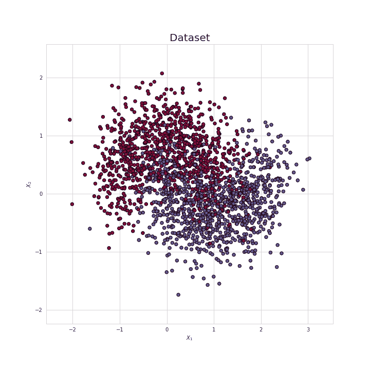
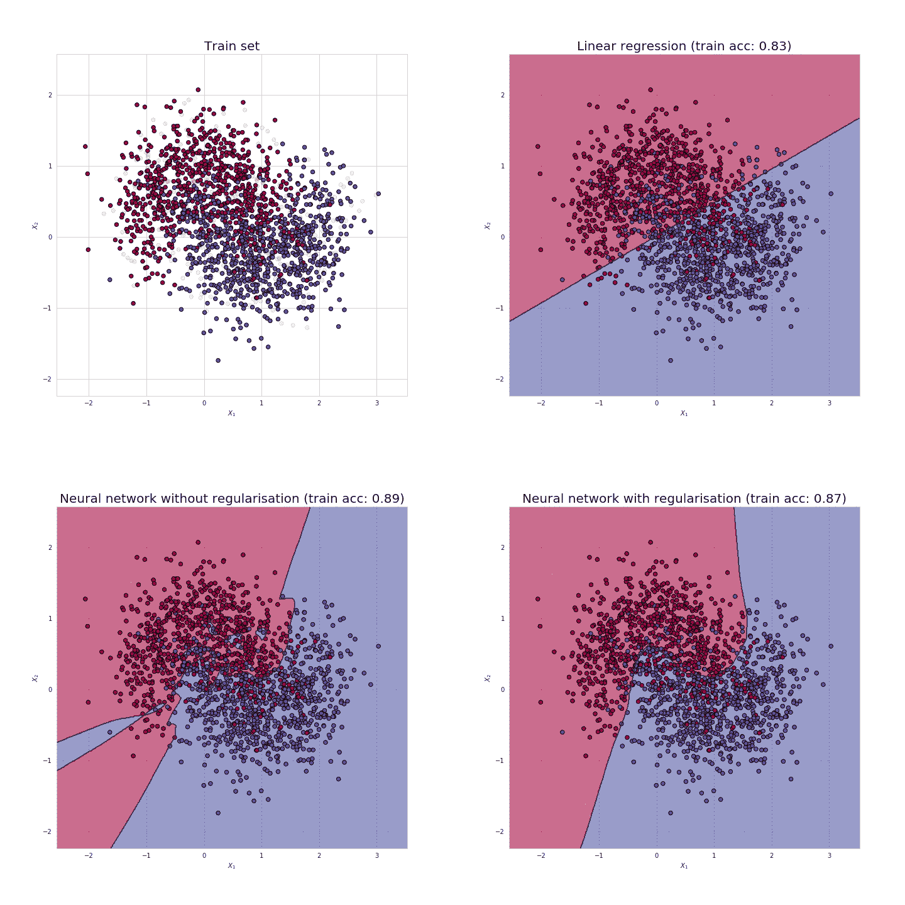
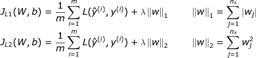
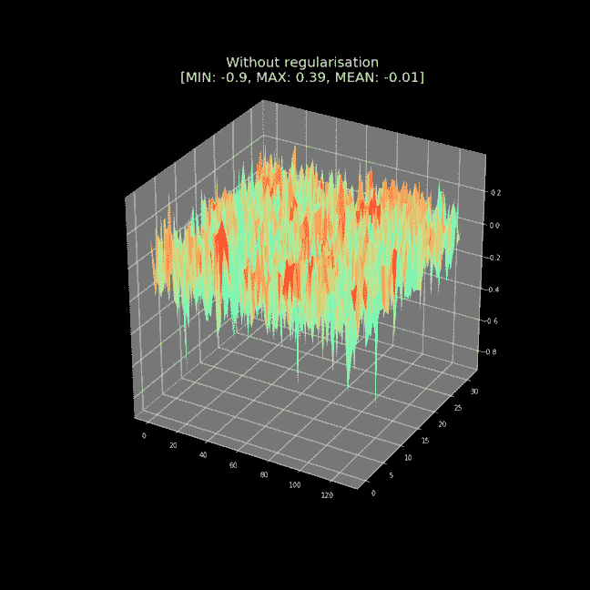
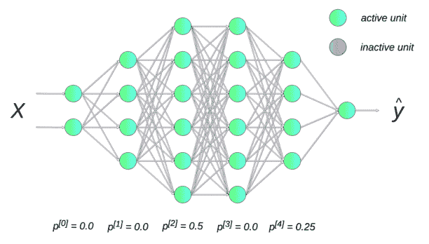
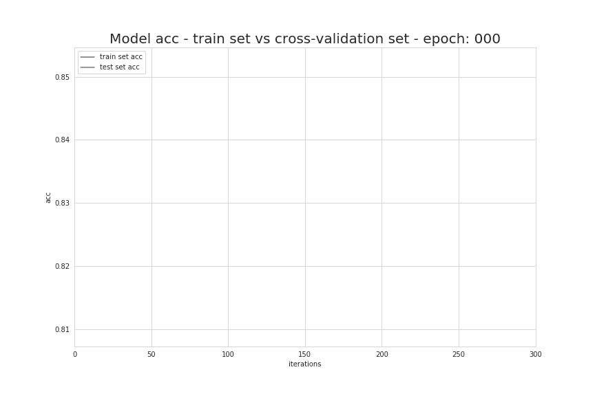

# 防止深度神经网络过拟合

> 原文：<https://towardsdatascience.com/preventing-deep-neural-network-from-overfitting-953458db800a?source=collection_archive---------0----------------------->

## 神经网络的秘密第二部分

[Source](https://www.publicdomainpictures.net/en/view-image.php?image=234572&picture=brain-cell)

由于拥有大量的参数(数千个，有时甚至数百万个)，神经网络有很大的自由度，可以适应各种复杂的数据集。这种独特的能力使他们能够接管许多在“传统”机器学习时代难以取得任何进展的领域，如图像识别、物体检测或自然语言处理。然而，有时他们最大的优势变成了潜在的弱点。对我们模型的学习过程缺乏控制可能会导致过度拟合的情况，当我们的神经网络与训练集如此接近，以至于很难对新数据进行归纳和预测。理解这个问题的根源和防止它发生的方法，是成功设计神经网络的关键。

**注:**本文是“神经网络的奥秘”系列的第二部分，如果你还没有机会，请阅读[的开篇文章](/https-medium-com-piotr-skalski92-deep-dive-into-deep-networks-math-17660bc376ba)。在我的 [GitHub](https://github.com/SkalskiP/ILearnDeepLearning.py) 上可以找到用于创建本文中使用的可视化效果的源代码。

# 你怎么知道你的神经网络过度拟合？

## 培训、开发和测试设备

在实践中，检测我们的模型是否过度拟合是困难的。我们训练过的模型已经投入生产，然后我们开始意识到有问题，这种情况并不罕见。事实上，只有面对新的数据，你才能确保一切正常运行。然而，在训练过程中，我们应该尽可能地再现真实情况。**出于这个原因，将我们的数据集分成三个部分是一个很好的做法——训练集、开发集(也称为交叉验证或保留)和测试集。**我们的模型通过只看到第一部分来学习。Hold-out 用于跟踪我们的进度，并得出优化模型的结论。同时，我们在训练过程的最后使用测试集来评估我们的模型的性能。使用全新的数据可以让我们对我们的算法有多好有一个公正的看法。

Figure 1\. Recommended method of dividing the data set.

确保您的交叉验证和测试集来自相同的分布，以及它们准确地反映了我们期望在未来收到的数据，这一点非常重要。只有这样，我们才能确信我们在学习过程中做出的决策会让我们更接近更好的解决方案。我知道你在想什么…“我应该如何划分我的数据集？”直到最近，最常推荐的拆分之一是 60/20/20，但在大数据时代，当我们的数据集可以计算数百万个条目时，那些固定的比例不再合适。简而言之，一切都取决于我们所处理的数据集的大小。如果我们有数百万个条目可供我们使用，那么将它们以 98/1/1 的比例划分可能会更好。我们的开发和测试集应该足够大，以使我们对模型的性能充满信心。根据数据集大小划分数据集的推荐方法如图 1 所示。

## 偏差和方差

T 感谢我们对数据的适当准备，我们给了自己评估模型性能的工具。然而，在我们开始得出任何结论之前，我们应该熟悉两个新概念——偏差和方差。为了让我们更好地理解这个有些多么复杂的问题，我们将用一个简单的例子，希望能让我们发展出一种有价值的直觉。我们的数据集由位于二维空间的两类点组成，如图 2 所示。

Figure 2\. Visualization of the data set.

由于这是一个简单的演示，这次我们将跳过测试集，只使用训练集和交叉验证集。接下来，我们将准备三个模型:第一个是简单的线性回归，另外两个是由几个紧密连接的层构建的神经网络。如下图 3 所示。我们可以看到使用这些模型定义的分类界限。右上角的第一个模型非常简单，因此具有较高的偏向性，即它无法找到特征和结果之间的所有重要联系。这是可以理解的-我们的数据集有很多噪音，因此简单的线性回归不能有效地处理它。神经网络的表现要好得多，但第一个(显示在左下角)与数据拟合得太过紧密，这使得它在坚持集上的表现明显更差。这意味着它具有很高的方差——它符合噪声，而不符合预期输出。在上一个模型中，这种不良影响通过使用规范化得到了缓解。

Figure 3\. Classification boundaries created by: top right corner — linear regression; bottom left corner — neural network; bottom right corner — neural network with regularisation

我知道，我知道……我举的例子很简单——我们只有两个特性，任何时候我们都可以创建一个图表，直观地检查我们模型的行为。当我们在多维空间中操作，数据集包含，比如说，几十个特征，该怎么办？**然后，我们比较使用训练集和交叉验证集计算的误差值。**当然，我们应该追求的最佳情况是这两个集合的低错误率。主要问题是定义什么是低错误率——在某些情况下，它可以是 1%,而在其他情况下，它可以高达 10%或更多。在训练神经网络时，建立一个基准来比较我们模型的性能是很有帮助的。这通常是人类执行这项任务的效率水平。然后，我们试图确保我们的算法在训练期间具有接近我们参考水平的误差。如果我们已经实现了这个目标，但是当我们在坚持集上验证它时，错误率显著增加，这可能意味着我们过度拟合(高方差)。另一方面，如果我们的模型在训练集和交叉验证上表现不佳，它可能太弱，有很高的偏差。当然，这个问题要复杂得多，范围也很广，可以作为单独一篇文章的主题，但是这些基本信息应该足以理解下面的分析。

# 防止过度拟合的方法

## 介绍

T 当我们的神经网络具有高方差时，这里有许多方法可以帮助我们。其中的一些，比如获取更多的数据，是相当通用的，每次都能很好的工作。其他的，比如正规化，需要很多技巧和经验。对我们的神经网络施加太多的限制可能会损害它有效学习的能力。现在让我们来看看一些最流行的减少过度拟合的方法，并讨论它们起作用的原因。

## L1 和 L2 正规化

O 当我们需要减少过度拟合时，我们应该尝试的第一个方法是规范化。它涉及到在损失函数中增加一个额外的元素，这惩罚了我们的模型过于复杂，或者简单地说，在权重矩阵中使用了过高的值。这样我们试图限制它的灵活性，但也鼓励它基于多种特性构建解决方案。这种方法的两个流行版本是 L1 最小绝对偏差(LAD)和 L2 最小平方误差(LS)。下面给出了描述这些正则化的方程。

在大多数情况下，使用 L1 是更可取的，因为它将不太重要的特征的权重值降低到零，通常从计算中完全消除它们。在某种程度上，它是自动选择特性的内置机制。此外，L2 在含有大量异常值的数据集上表现不佳。值平方的使用导致模型以更受欢迎的示例为代价最小化离群值的影响。

现在让我们看看我们在偏差和方差的例子中使用的两个神经网络。其中一个，正如我前面提到的，我使用正则化来消除过度拟合。我发现这是一个有趣的想法，在三维空间中可视化权重矩阵，并比较正则化和非正则化模型之间获得的结果。我还使用正则化对许多模型进行了模拟，改变了 **λ** 值，以验证其对权重矩阵中包含的值的影响。(老实说，我这么做也是因为我觉得它看起来超级酷，我不想让你睡着。)矩阵行和列索引对应于水平轴值，权重被解释为垂直坐标。

Figure 4\. Visualization of weighing matrix for models without and with regularization.

## λ因子及其影响

在之前提到的 L1 和 L2 两个版本的正则化公式中，我引入了超参数**λ**——也称为**正则化率。**在选择其值时，我们试图在模型的简单性和使其适合训练数据之间找到平衡点。增加 **λ** 值也会增加正则化效果。在图 4 中。我们可以立即注意到，没有调节的模型和具有非常低的 **λ** 系数值的模型所获得的平面是非常“湍流”的。有许多具有重要值的峰值。在应用具有较高超参数值的 L2 正则化之后，图形变平。最后，我们可以看到，将 lambda 值设置为 0.1 或 1 左右会导致模型中权重值的急剧下降。我鼓励您检查用于创建这些可视化的源代码。

## 拒绝传统社会的人

另一种非常流行的神经网络正则化方法是放弃。这个想法其实很简单——我们神经网络的每一个单元(除了属于输出层的单元)都被赋予了在计算中被暂时忽略的概率 *p* 。超参数 p 被称为**辍学率**，通常其默认值被设置为 0.5。然后，在每次迭代中，我们根据分配的概率随机选择我们丢弃的神经元。结果，每次我们用一个更小的神经网络工作。下面的可视化显示了一个神经网络遭受辍学的例子。我们可以看到在每次迭代中，第二层和第四层的随机神经元是如何被去激活的。

Figure 5: Visualization of a dropout.

这种方法的有效性是相当令人惊讶和违反直觉的。毕竟，在现实世界中，如果工厂的经理每天随机挑选员工并让他们回家，工厂的生产率就不会提高。让我们从单个神经元的角度来看这个问题。由于在每次迭代中，任何输入值都可能被随机消除，神经元试图平衡风险，而不是偏向任何特征。结果，权重矩阵中的值变得更加均匀分布。该模型希望避免这样的情况，即它提出的解决方案不再有意义，因为它不再有来自非活动特性的信息。

## 提前停止

下图显示了在学习过程的后续迭代中，在测试和交叉验证集上计算的准确度值的变化。我们马上看到，我们最终得到的模型并不是我们可能创造的最好的。老实说，这比我们经历了 150 个时代还要糟糕得多。为什么不在模型开始过拟合之前中断学习过程？这一观察启发了一种流行的过拟合减少方法，即早期停止。

Figure 6\. Change of accuracy values in subsequent epochs during neural network learning.

在实践中，每隔几个迭代就对我们的模型进行采样，并检查它与我们的验证集的工作情况，这是非常方便的。每一个比之前所有模型表现更好的模型都会被保存。我们还设置了一个限制，即没有进展被记录的最大迭代次数。超过该值时，学习停止。尽管早期停止可以显著提高我们模型的性能，但在实践中，它的应用会使我们模型的优化过程变得非常复杂。简直很难和其他常规技术结合。

## 结论

认识到我们的神经网络过度拟合的能力以及我们可以用来防止这种情况发生的解决方案的知识是最基本的。然而，这些都是非常广泛的主题，不可能在一篇文章中描述得足够详细。因此，我的目标是提供基本的直觉，让人们了解诸如正规化或辍学这样的把戏实际上是如何运作的。这些话题对我来说很难理解，我希望我帮助你解决了它们。如果你喜欢这篇文章，请在 [Twitter](https://twitter.com/PiotrSkalski92) 和 [Medium](https://medium.com/@piotr.skalski92) 上关注我，并在 [GitHub](https://github.com/SkalskiP) 和 [Kaggle](https://www.kaggle.com/skalskip) 上查看我正在进行的其他项目。保持好奇！

