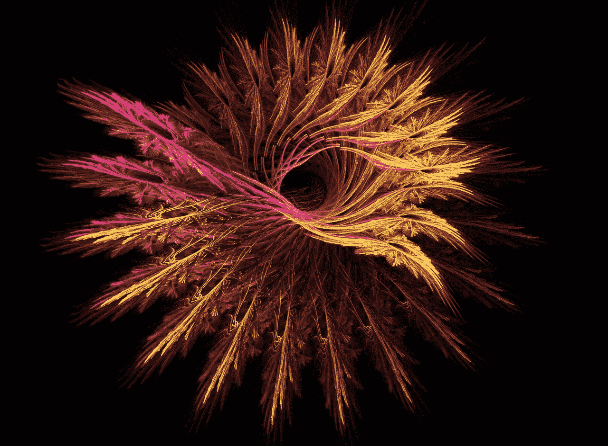
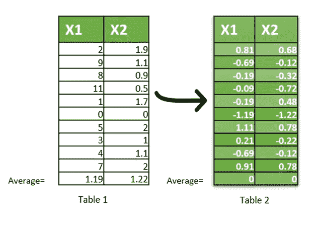
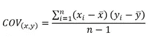
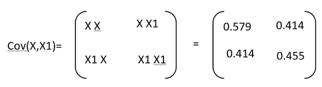
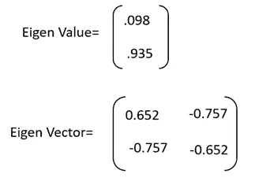

# 主成分分析-简介

> 原文：<https://towardsdatascience.com/principal-component-analysis-intro-61f236064b38?source=collection_archive---------0----------------------->

## 可变缩减技术

> 变数太多？你应该使用所有可能的变量来生成模型吗？

为了处理“维数灾难”并避免高维空间中的过拟合等问题，使用了主成分分析等方法。

PCA 是一种通过从大量数据中提取重要变量来减少数据中变量数量的方法。它减少了数据的维度，目的是保留尽可能多的信息。换句话说，这种方法将高度相关的变量组合在一起，形成一个较小数量的人工变量集，称为“主成分”，它解释了数据中的大多数差异。

让我们深入了解 PCA 是如何在幕后实现的。

***开始*** 通过从每个数据点中减去平均值来标准化预测值。对预测值进行归一化非常重要，因为原始预测值可能处于不同的等级，并且可能对方差产生显著影响。结果如表 2 所示，平均值为零。

Normalized Data

**接下来**，计算数据的协方差矩阵，该矩阵将测量两个预测器如何一起移动。它是在两个预测值之间测量的，但如果您有三维数据(x，x1，x2)，则测量 x x1，x x2，x1 x2 之间的协方差。供参考的协方差公式为:

在我们的例子中，协方差矩阵如下所示:

Covariance Matrix

**现在**，计算上述矩阵的特征值和特征向量。这有助于发现数据中的潜在模式。在我们的例子中，它大约是:

Eigen Value and Vector

我们快到了:)。执行重定向。为了将数据转换成新的轴，将原始数据乘以特征向量，这表示新轴的方向。请注意，您可以选择省略较小的特征向量，或者两者都使用。此外，根据哪一组占了 95%或更多差异，决定保留多少组特性。

**最后，**从上述步骤中计算出的分数可被绘制出来，并输入预测模型。绘图让我们感觉到两个变量有多接近/高度相关。我们没有使用原始数据来绘制 X 和 Y 轴(这并不能告诉我们点与点之间的关系),而是绘制转换后的数据(使用特征向量),这些数据可以发现模式并显示点之间的关系。

*尾注*:很容易将 *PCA* 与*因子分析*混淆，但这两种方法在概念上是有区别的。我将在下一篇文章中详细介绍*因子分析*以及它与 *PCA* 的不同之处..敬请关注。