# Tensorflow 中带交互代码的主成分分析网络

> 原文：<https://towardsdatascience.com/principal-component-analysis-network-in-tensorflow-with-interactive-code-7be543047704?source=collection_archive---------10----------------------->

GIF from this [website](https://giphy.com/gifs/loop-vaporwave-oSYflamt3IEjm)

从[主成分分析池层](https://medium.com/@SeoJaeDuk/principal-component-analysis-pooling-in-tensorflow-with-interactive-code-pcap-43aa2cee9bb)的自然延伸将是在该层之外制作一个完整的神经网络。我想知道这是否可能，以及它在 [MNIST 数据上的表现是好是坏。](http://yann.lecun.com/exdb/mnist/)

**主成分分析池层**

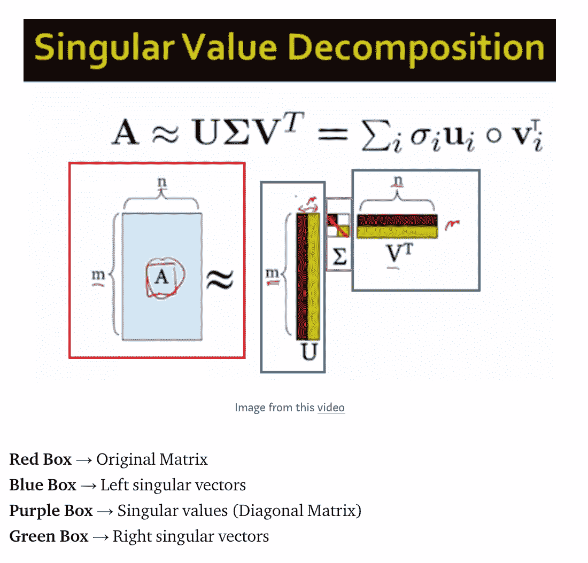

Image from this [website](https://medium.com/@SeoJaeDuk/principal-component-analysis-pooling-in-tensorflow-with-interactive-code-pcap-43aa2cee9bb)

对于不熟悉 PCAP 的人，请先阅读这篇[博客。](https://medium.com/@SeoJaeDuk/principal-component-analysis-pooling-in-tensorflow-with-interactive-code-pcap-43aa2cee9bb)基本思想是合并层，如最大或平均合并操作执行维数减少，不仅节省计算能力，而且作为正则化。 [PCA 是一种降维技术，将相关变量转换成一组线性不相关变量的值，称为主成分](https://en.wikipedia.org/wiki/Principal_component_analysis)。我们可以利用这个操作来做与最大/平均池类似的工作。

**由大多数池层组成的网络**

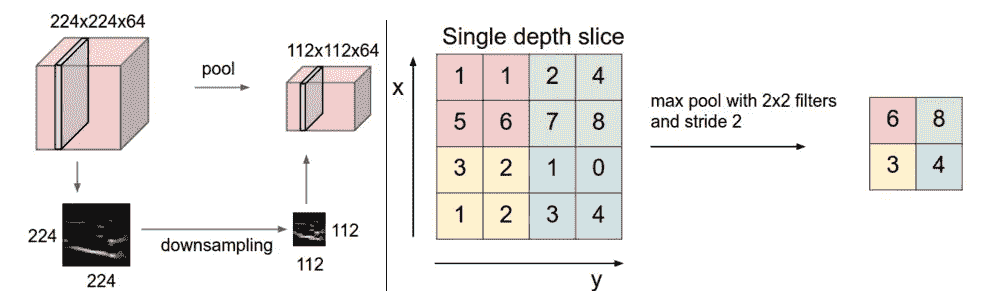

Image from this [website](https://leonardoaraujosantos.gitbooks.io/artificial-inteligence/content/pooling_layer.html)

现在我知道你在想什么了，在执行分类的时候有一个只由池层组成的网络是没有意义的。你是完全正确的！它没有！但我只是想试着玩玩。

**数据集/网络架构**

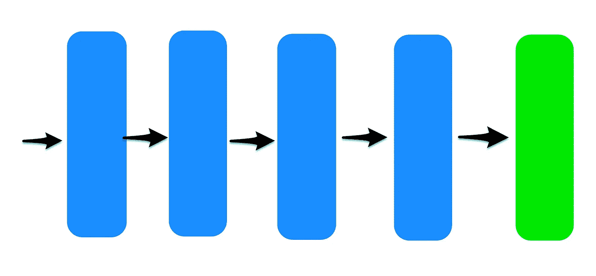

**蓝色矩形** → PCAP 或最大池层
**绿色矩形** →卷积层增加通道尺寸+ [全局平均池操作](/iclr-2015-striving-for-simplicity-the-all-convolutional-net-with-interactive-code-manual-b4976e206760)

网络本身非常简单，只有四个池层和一个卷积层来增加信道大小。然而，为了使尺寸匹配，我们将把每个图像下采样为 16*16 的尺寸。因此张量的形状是…

【批量，16，16，1】→【批量，8，8，1】→【批量，4，4，1】→
【批量，2，2，1】→【批量，1，1，1】→【批量，1，1，10】→
【批量，10】

并且我们可以像任何其他网络一样使用软最大层来执行分类。

**结果:主成分网络**

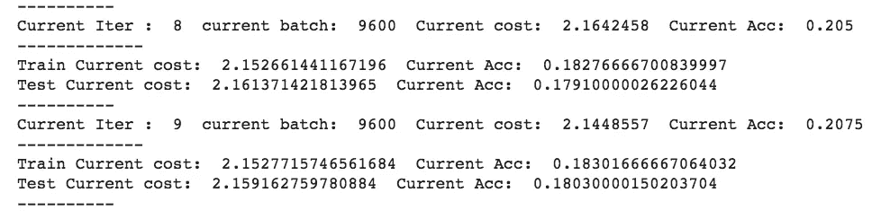

如上所述，训练准确率停滞在 18 %,这是可怕的 LOL。但我怀疑网络从一开始就没有足够的学习能力，这是它能做到的最好的。然而，我想看看每个 PCAP 层如何转换图像。

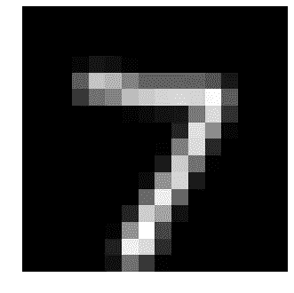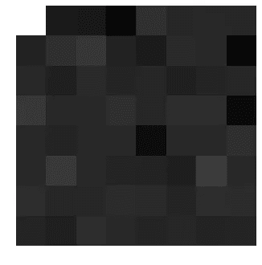

Generated Image when input is 7

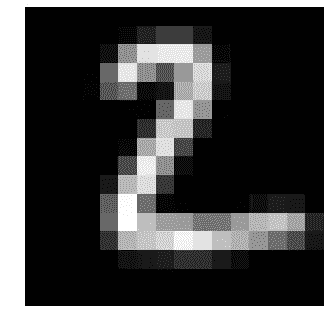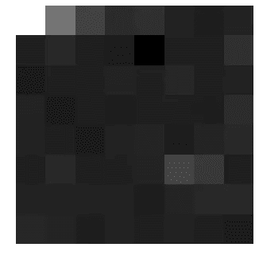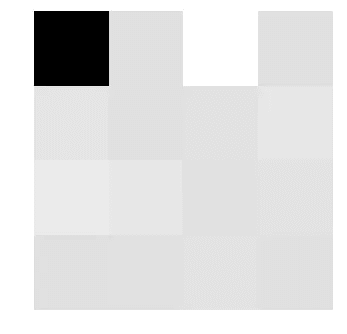

Generated Image when input is 2

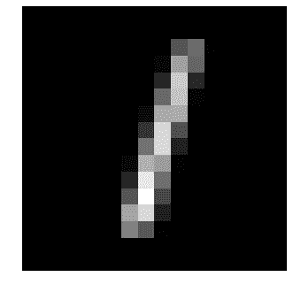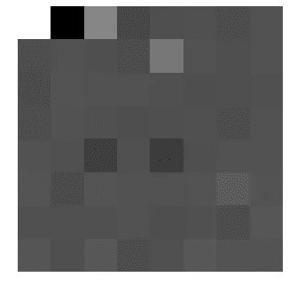

Generated Image when input is 1

**左上图** →原始输入
**右上图** →第一层后
**左下图** →第二层后
**右下图** →第四层后

我们可以观察到的一个明显的模式是亮度的变化。例如，如果左上像素在第二层中是白色的，则该像素在下一层中将变为黑色。目前，我不能 100%确定为什么会发生这种情况，但随着更多的研究，我希望知道确切的原因。

**结果:最大共享网络**

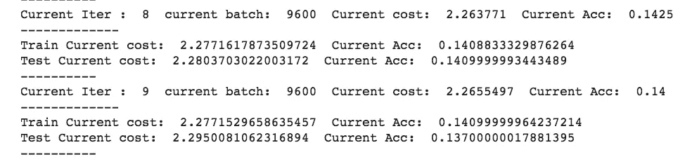

如上所述，当我们用 max pooling 操作替换所有 PCAP 层时，我们可以观察到训练图像的精度停滞在 14%左右，这证实了网络从一开始就没有足够的学习能力。

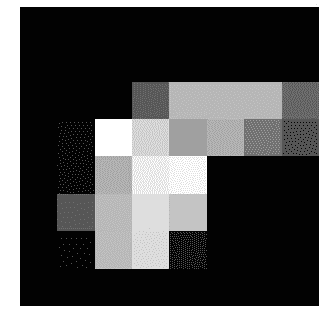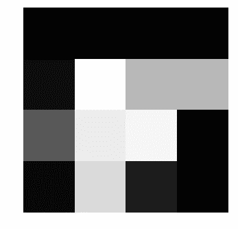

Generated Image when input is 7

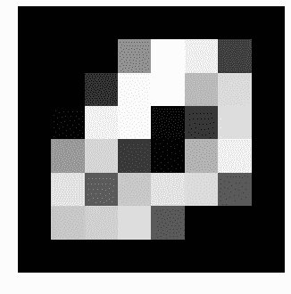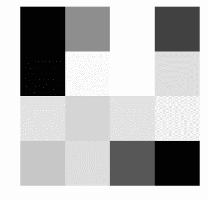

Generated Image when input is 2

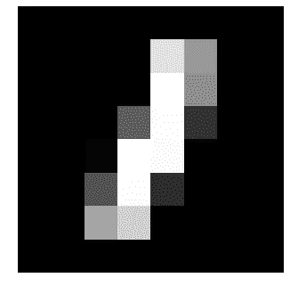

Generated Image when input is 1

**左上图像** →原始输入
**右上图像** →第一层后
**左下图像** →第二层后
**右下图像** →第四层后

与 PCAP 相反，使用最大池，我们可以清楚地观察到具有最高亮度的像素移动到下一层。这是意料之中的，因为这就是最大池的作用。

**交互代码**

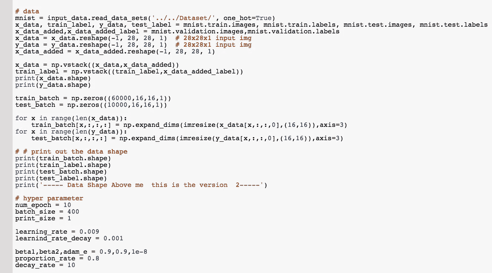

对于 Google Colab，你需要一个 Google 帐户来查看代码，而且你不能在 Google Colab 中运行只读脚本，所以在你的操场上复制一份。最后，我永远不会请求允许访问你在 Google Drive 上的文件，仅供参考。编码快乐！

要使用 [PCAP 访问网络，请点击这里。](https://colab.research.google.com/drive/1dZHcbCGuOmBDr16N4lRWyxqTafHUenFQ)
要使用[最大池访问网络，请单击此处](https://colab.research.google.com/drive/1Qrqp5NbZzhIZb0o0jbL9VFNE7dF6wuY5)。

**最后的话**

我从一开始就没有对这个网络抱太大希望，但我希望在训练/测试图像上至少有 30%的准确率。

如果发现任何错误，请发电子邮件到 jae.duk.seo@gmail.com 给我，如果你希望看到我所有写作的列表，请在这里查看我的网站。

同时，在我的 twitter 上关注我[这里](https://twitter.com/JaeDukSeo)，访问[我的网站](https://jaedukseo.me/)，或者我的 [Youtube 频道](https://www.youtube.com/c/JaeDukSeo)了解更多内容。我还实现了[广残网，请点击这里查看博文](https://medium.com/@SeoJaeDuk/wide-residual-networks-with-interactive-code-5e190f8f25ec) t。

**参考**

1.  50000 有 28 个因子。(2018).Factornumber.com。检索于 2018 年 6 月 3 日，来自[http://factornumber.com/?page=50000](http://factornumber.com/?page=50000)
2.  终端？，H. (2018)。如何在终端中重命名文件？。问 Ubuntu。检索于 2018 年 6 月 3 日，来自[https://askubuntu . com/questions/280768/how-to-rename-a-file-in-terminal](https://askubuntu.com/questions/280768/how-to-rename-a-file-in-terminal)
3.  中学 _y，H. (2018)。用 Seaborn + Pandas 带 secondary_y. Stack 溢出出图时如何去掉网格线？检索于 2018 年 6 月 3 日，来自[https://stack overflow . com/questions/26868304/how-to-ride-of-grid-lines-when-plotting-with-seaborn-pandas-with-secondary](https://stackoverflow.com/questions/26868304/how-to-get-rid-of-grid-lines-when-plotting-with-seaborn-pandas-with-secondary)
4.  [复本]，H. (2018)。如何在 Matplotlib (python)中隐藏轴和网格线？堆栈溢出。检索于 2018 年 6 月 3 日，来自[https://stack overflow . com/questions/45148704/how-to-hide-axes-and-gridlines-in-matplotlib-python](https://stackoverflow.com/questions/45148704/how-to-hide-axes-and-gridlines-in-matplotlib-python)
5.  MNIST 手写数字数据库，Yann LeCun，Corinna Cortes 和 Chris Burges。(2018).Yann.lecun.com。检索于 2018 年 6 月 3 日，来自[http://yann.lecun.com/exdb/mnist/](http://yann.lecun.com/exdb/mnist/)
6.  TensorFlow？，W. (2018)。TensorFlow 中最大汇集 2D 层的输出张量是什么？。堆栈溢出。检索于 2018 年 6 月 3 日，来自[https://stack overflow . com/questions/43453712/what-is-output-tensor-of-max-pooling-2d-layer-in-tensor flow](https://stackoverflow.com/questions/43453712/what-is-output-tensor-of-max-pooling-2d-layer-in-tensorflow)
7.  主成分分析。(2018).En.wikipedia.org。检索于 2018 年 6 月 3 日，来自[https://en.wikipedia.org/wiki/Principal_component_analysis](https://en.wikipedia.org/wiki/Principal_component_analysis)
8.  桑托斯大学(2018)。混合层人工智能。Leonardo araujosantos . git books . io . 2018 年 6 月 3 日检索，来自[https://Leonardo araujosantos . git books . io/artificial-intelligence/content/pooling _ layer . html](https://leonardoaraujosantos.gitbooks.io/artificial-inteligence/content/pooling_layer.html)
9.  [ ICLR 2015 ]追求简单:具有交互码的全卷积网。(2018).走向数据科学。检索于 2018 年 6 月 3 日，来自[https://towards data science . com/iclr-2015-力争简单-所有卷积-网络-交互-代码-手册-b4976e206760](/iclr-2015-striving-for-simplicity-the-all-convolutional-net-with-interactive-code-manual-b4976e206760)