# Tensorflow 中的主成分分析池与交互代码[PCAP]

> 原文：<https://towardsdatascience.com/principal-component-analysis-pooling-in-tensorflow-with-interactive-code-pcap-c621c7d927ed?source=collection_archive---------10----------------------->

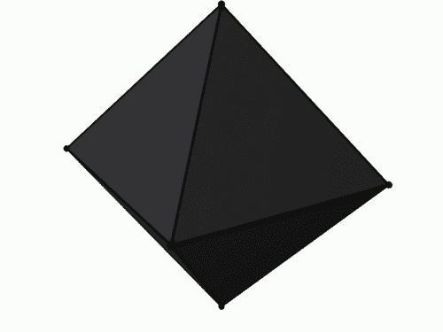

其思想很简单，卷积神经网络中的最大/平均池操作用于降低输入的维数。虽然引入了更复杂的池操作，如 [Max-Avg (Mix) Pooling](https://arxiv.org/abs/1509.08985) 操作，但我想知道我们是否可以用[主成分分析(PCA)](https://en.wikipedia.org/wiki/Principal_component_analysis) 做同样的事情。

**PCA 概述及简单教程**

上面的论文在解释什么是 PCA 方面做了大量的工作，并且给出了使用哪种数学的简单例子。这将是一个好主意，先浏览 pdf 文件，然后再继续阅读。

**PCA /单值分解**

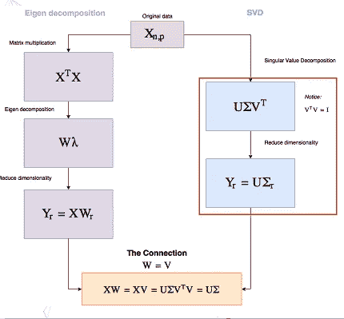

Image from this [website](https://ewanlee.github.io/2018/01/17/PCA-With-Tensorflow/)

**红框** →我们将如何在 Tensorflow 中执行 PCA

这篇[博文](https://ewanlee.github.io/2018/01/17/PCA-With-Tensorflow/)很好地解释了我们如何使用[单值分解](https://en.wikipedia.org/wiki/Singular-value_decomposition)来执行 PCA。谢天谢地 Tensorflow 已经有了 [tf.svd()](https://www.tensorflow.org/api_docs/python/tf/svd) 操作来执行单值分解。

Video from this [website](https://www.youtube.com/watch?v=P5mlg91as1c)

我个人不得不观看/阅读额外的材料来具体理解什么是单值分解，并且我已经链接了我在上面观看的视频。(这个 [Quora](https://www.quora.com/What-is-an-intuitive-explanation-of-singular-value-decomposition-SVD) 帖子和这个 [medium 帖子](https://blog.statsbot.co/singular-value-decomposition-tutorial-52c695315254)也是一个很好的阅读来源。)

**(愚蠢的)主成分分析池背后的想法**

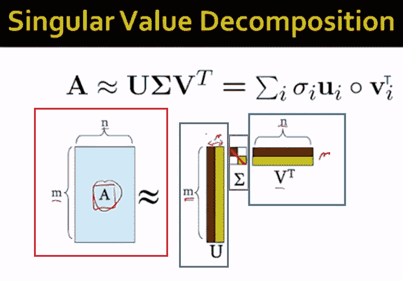

Image from this [video](https://www.youtube.com/watch?v=P5mlg91as1c)

**红框** →原矩阵
**蓝框** →左奇异向量
**紫框** →奇异值(对角矩阵)
**绿框** →右奇异向量

我试图尽可能简单地理解难懂的概念，所以这里是我的简单(非常愚蠢的)SVD 版本。假设我们有一个蛋糕叫做 A，谢天谢地这个蛋糕 A 只由两种成分组成。牛奶 M 和糖 s 所以 A = M + S。

然而，这里的诀窍是知道我们制作原始蛋糕 A 所需的牛奶和糖的确切组合。假设我们需要 30 升牛奶和 50 毫克糖来正确制作蛋糕 A，这意味着我们也需要在某个地方获得该信息。

这样做的好处是，我们不必随身携带蛋糕(这需要大量的存储空间),我们可以简单地携带牛奶、糖和说明书(告诉我们需要多少比例的牛奶和糖),作为一种更紧凑的形式。这是我对奇异值分解的理解，从这里我们可以转到主成分分析。

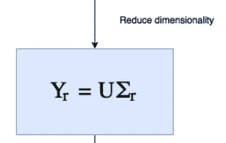

Image from this [website](http://Li, E. (2018). PCA With Tensorflow. Abracadabra. Retrieved 25 May 2018, from https://ewanlee.github.io/2018/01/17/PCA-With-Tensorflow/)

如上面在 PCA 中所看到的，我们丢弃右奇异向量并修改奇异值矩阵的维数，以便降低维数。我们可以利用这一点，使我们的 PCA 充当池操作。

例如，假设我们有一批 8*8*1 的张量格式的 200 幅图像，我们可以将它写成(200，8，8，1)。但我们已经知道，我们可以对图像进行矢量化，将张量整形为(200，8*8*1) = (200，64)。现在，如果我们执行 PCA 以将维度从 64 降低到 16，我们可以将其重塑回 3D 图像，使张量变成(200，4，4，1)。因此得到的张量具有与执行平均汇集操作相同的维数。

**奇异矩阵的指数加权移动平均值/α，β**

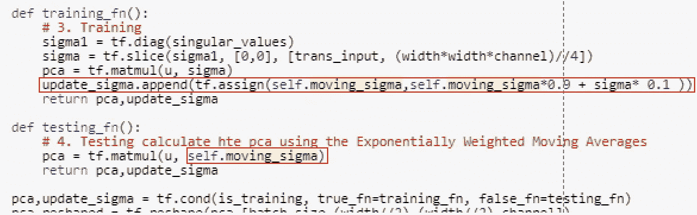

**红框→** 在训练期间更新移动奇异矩阵(sigma ),但是在测试期间，我们将使用移动平均 sigma 值来执行维度缩减。

我们需要注意的一个小细节是奇异矩阵的指数加权移动平均。就像我们执行批量标准化一样，我们在训练期间跟踪平均值和标准差的权重。在测试期间，我们不使用数据的平均值/标准值，而是使用移动平均值。

因为我们希望模型的预测只依赖于测试阶段的给定测试数据。因此，我们将使用奇异矩阵的移动加权平均值，而不是使用测试数据中的奇异矩阵。(如果有人想了解更多关于批量标准化[的信息，请点击这里。)](https://medium.com/@SeoJaeDuk/deeper-understanding-of-batch-normalization-with-interactive-code-in-tensorflow-manual-back-1d50d6903d35)

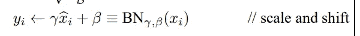

Original Image from the [paper](https://arxiv.org/pdf/1502.03167v3.pdf)

如上所述，在批量标准化中，我们将标准化数据乘以α，并添加β项。我将遵循这个想法，也给我们的 PCAP 层一些能力来取消 PCA 操作，如下所示。

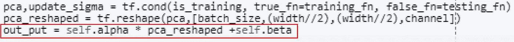

**红框** →将α和β项添加到整形后的 PCA 中

**网络架构**

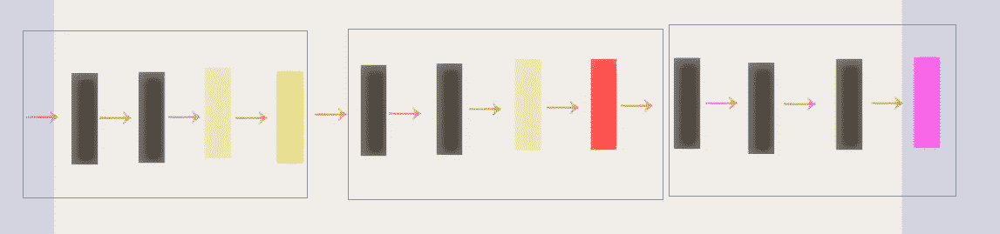

**黑盒** →卷积层
**黄盒** →卷积+批量归一化
**绿盒** →平均池层
**红盒** →主成分分析池层
**粉盒** →全局平均池和 Softmax

我们将要使用的基本网络是[全卷积网络](/iclr-2015-striving-for-simplicity-the-all-convolutional-net-with-interactive-code-manual-b4976e206760)，如上所示(浅蓝色方框)，整个网络主要分为三个不同的部分。

**结果**

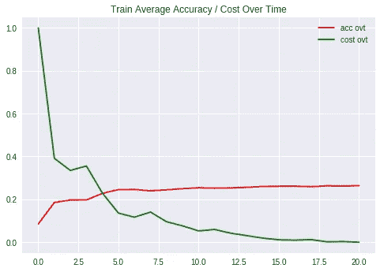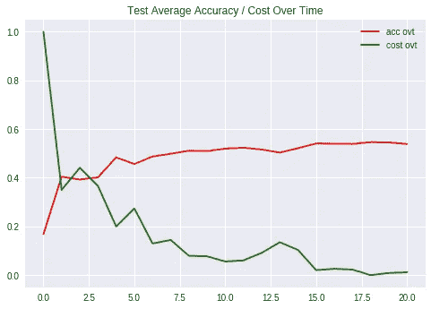

**左图** →随时间变化的训练精度/随时间变化的成本
**右图** →随时间变化的测试精度/随时间变化的成本

令人惊讶的是，该模型正在学习如何使用 PCA 池层对 MNIST 图像进行分类。尽管我们需要注意这样一个事实，它几乎没有达到 50%的准确率。(都在测试/训练图像上)。

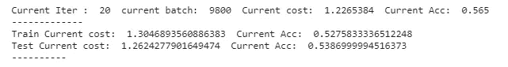

第 21 个纪元后的最终精度为 53%。

**交互代码**

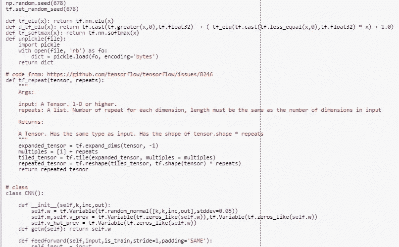

对于 Google Colab，你需要一个 Google 帐户来查看代码，而且你不能在 Google Colab 中运行只读脚本，所以在你的操场上复制一份。最后，我永远不会请求允许访问你在 Google Drive 上的文件，仅供参考。编码快乐！同样为了透明，我在训练期间上传了所有的日志。

要访问代码以及[培训日志，请点击此处。](https://colab.research.google.com/drive/1yHk1y-O4PEDv4yAuhAZzCPHgL7hnSrDf)

**最后的话**

最终结果非常有趣，因为该模型实际上能够学习如何对 MNIST 图像进行分类。我很高兴地知道，在网络中插入更复杂的操作(如 PCA)是可能的。(带端到端培训)最后，顺便提一下，如果有人有兴趣学习更多关于线性代数的知识，请观看下面的视频系列。( [3Blue1Brown](https://www.youtube.com/channel/UCYO_jab_esuFRV4b17AJtAw) 是一个产出高质量内容的土豆/数学家)

Video From this [website](https://www.youtube.com/channel/UCYO_jab_esuFRV4b17AJtAw)

如果发现任何错误，请发电子邮件到 jae.duk.seo@gmail.com 给我，如果你希望看到我所有写作的列表，请在这里查看我的网站。

同时，在我的 twitter 上关注我[这里](https://twitter.com/JaeDukSeo)，访问[我的网站](https://jaedukseo.me/)，或者我的 [Youtube 频道](https://www.youtube.com/c/JaeDukSeo)了解更多内容。我还实现了[广残网，请点击这里查看博文](https://medium.com/@SeoJaeDuk/wide-residual-networks-with-interactive-code-5e190f8f25ec) t。

**参考**

1.  李，E. (2018)。张量流 PCA。胡言乱语。检索于 2018 年 5 月 25 日，来自[https://ewanlee.github.io/2018/01/17/PCA-With-Tensorflow/](https://ewanlee.github.io/2018/01/17/PCA-With-Tensorflow/)
2.  tf.set_random_seed | TensorFlow。(2018).张量流。检索于 2018 年 5 月 25 日，来自[https://www . tensor flow . org/API _ docs/python/TF/set _ random _ seed](https://www.tensorflow.org/api_docs/python/tf/set_random_seed)
3.  Iris 数据集-sci kit-学习 0.19.1 文档。(2018).Scikit-learn.org。检索于 2018 年 5 月 25 日，来自[http://sci kit-learn . org/stable/auto _ examples/datasets/plot _ iris _ dataset . html](http://scikit-learn.org/stable/auto_examples/datasets/plot_iris_dataset.html)
4.  tf.cumsum | TensorFlow。(2018).张量流。检索于 2018 年 5 月 25 日，来自[https://www.tensorflow.org/api_docs/python/tf/cumsum](https://www.tensorflow.org/api_docs/python/tf/cumsum)
5.  输入，T. (2018)。Tensorflow:使用 tf.slice 拆分输入。堆栈溢出。检索于 2018 年 5 月 25 日，来自[https://stack overflow . com/questions/39054414/tensor flow-using-TF-slice-to-split-the-input](https://stackoverflow.com/questions/39054414/tensorflow-using-tf-slice-to-split-the-input)
6.  李，c，，p .，，涂，Z. (2015)。卷积神经网络中的一般化池函数:混合、门控和树。Arxiv.org。检索于 2018 年 5 月 26 日，来自[https://arxiv.org/abs/1509.08985](https://arxiv.org/abs/1509.08985)
7.  主成分分析。(2018).En.wikipedia.org。检索于 2018 年 5 月 26 日，来自[https://en.wikipedia.org/wiki/Principal_component_analysis](https://en.wikipedia.org/wiki/Principal_component_analysis)
8.  (2018).cs . otago . AC . NZ . 2018 年 5 月 26 日检索，来自[http://www . cs . otago . AC . NZ/cosc 453/student _ tutorials/principal _ components . pdf](http://www.cs.otago.ac.nz/cosc453/student_tutorials/principal_components.pdf)
9.  李，E. (2018)。张量流 PCA。胡言乱语。检索于 2018 年 5 月 25 日，来自[https://ewanlee.github.io/2018/01/17/PCA-With-Tensorflow/](https://ewanlee.github.io/2018/01/17/PCA-With-Tensorflow/)
10.  奇异值分解。(2018).En.wikipedia.org。检索于 2018 年 5 月 26 日，来自 https://en.wikipedia.org/wiki/Singular-value_decomposition
11.  tf.svd |张量流。(2018).张量流。检索于 2018 年 5 月 26 日，来自 https://www.tensorflow.org/api_docs/python/tf/svd
12.  线性代数预习精华。(2018).YouTube。检索于 2018 年 5 月 26 日，来自[https://www.youtube.com/watch?v=kjBOesZCoqc&list = plzhqobowt qd D3 mizm 2 xvfitgf 8 he _ ab](https://www.youtube.com/watch?v=kjBOesZCoqc&list=PLZHQObOWTQDPD3MizzM2xVFitgF8hE_ab)
13.  [在线]可从以下网址获取:[https://www . quora . com/What-is-an-intuitive-explain-of-singular-value-decomposition-SVD](https://www.quora.com/What-is-an-intuitive-explanation-of-singular-value-decomposition-SVD)【2018 年 5 月 26 日获取】。
14.  对 Tensorflow 中使用交互式代码进行批处理规范化有了更深入的理解。(2018).中等。检索于 2018 年 5 月 26 日，来自[https://medium . com/@ SeoJaeDuk/deeper-understanding-of-batch-normalization-with-interactive-code-in-tensor flow-manual-back-1d50d 6903 d35](https://medium.com/@SeoJaeDuk/deeper-understanding-of-batch-normalization-with-interactive-code-in-tensorflow-manual-back-1d50d6903d35)
15.  [在线]可从以下网址获取:[https://www . quora . com/What-is-an-intuitive-explain-of-singular-value-decomposition-SVD](https://www.quora.com/What-is-an-intuitive-explanation-of-singular-value-decomposition-SVD)【2018 年 5 月 26 日获取】。
16.  奇异值分解教程:应用，例子，练习。(2017).统计和机器人。检索于 2018 年 5 月 26 日，来自[https://blog . statsbot . co/singular-value-decomposition-tutorial-52c 695315254](https://blog.statsbot.co/singular-value-decomposition-tutorial-52c695315254)
17.  (2018).Arxiv.org。检索于 2018 年 5 月 26 日，来自[https://arxiv.org/pdf/1502.03167v3.pdf](https://arxiv.org/pdf/1502.03167v3.pdf)
18.  [ ICLR 2015 ]追求简单:具有交互码的全卷积网。(2018).走向数据科学。检索于 2018 年 5 月 26 日，来自[https://towards data science . com/iclr-2015-努力简化-所有卷积网-交互式代码-手册-b4976e206760](/iclr-2015-striving-for-simplicity-the-all-convolutional-net-with-interactive-code-manual-b4976e206760)