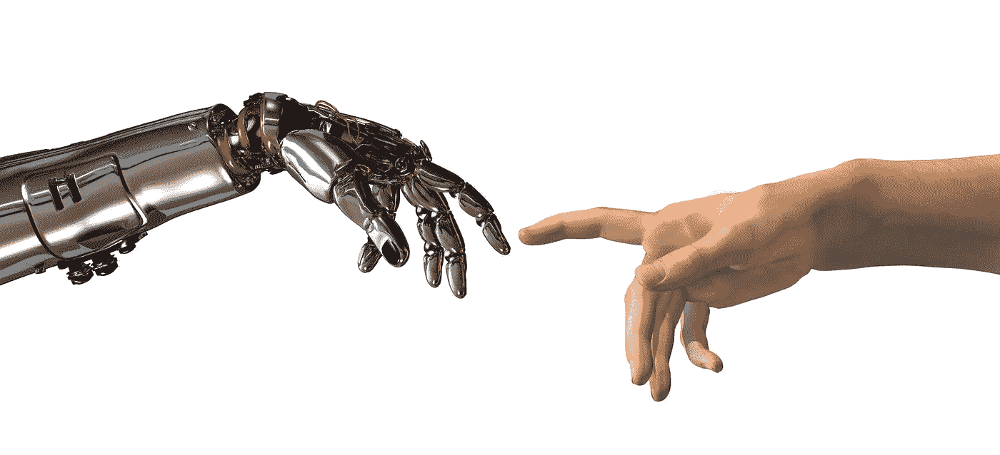

# 人工智能和机器学习原理

> 原文：<https://towardsdatascience.com/principles-of-artificial-intelligence-machine-learning-122be27d33a4?source=collection_archive---------2----------------------->

自从我在谷歌工作以来，人工智能一直吸引着我，从检测谷歌云上的欺诈到预测 YouTube Red 上的用户保留率。为了拓宽我的专业经验，我加入了百度风投，成为其第一个夏季投资助理，与才华横溢的创始人一起创建人工智能创业公司。

现在在宾夕法尼亚大学沃顿商学院，我正在寻找机会结识有着有趣的人工智能相关想法的人，并了解人工智能生态系统内的最新创新。在商学院的头两个月，我联系到了[尼古拉斯·林德](https://www.linkedin.com/in/nicholasthorlind/)，他是沃顿商学院二年级的 MBA 学生，在 IBM Watson 实习，担任数据科学家。我们立即意识到我们对人工智能的共同热情，为我们的同学制作了一份关于人工智能和机器学习(ML)的午餐和学习。

利用以下资料，我们试图:

*   定义人工智能并描述其在商业中的应用
*   解码“深度学习”和“认知计算”等流行语
*   强调 AI / ML 中使用的分析技术和最佳实践
*   最终，培养未来的人工智能领导者

午餐学习很受欢迎。当它变得明显，这是手头的话题，而不是吸引了大量观众的免费比萨饼，我惊讶于兴趣的程度。令人欣慰的是，听到同学们有兴趣了解更多关于该技术及其在解决日常业务挑战方面的实际应用。尼克和我现在正在建立一个基础，使这些研讨会成为一项持续的努力，以便工程、设计和宾夕法尼亚大学各学院的更多人能够从中受益。

沃顿商学院注重量化的严谨性，这已经让我觉得它非常适合我。在未来的两年里，我期待着与志同道合的人接触，无论是在课堂上还是在课堂外，与同龄人分享我关于 AI 的知识，并反过来向他们学习。通过共同努力扩大宾夕法尼亚大学在这一新领域的影响力和声誉，我相信我们都能成长为下一代领导者，在人工智能时代推动公司前进。

我很想听听你的想法。如果你觉得这篇文章或这些资料有用，请把它们推荐给你的朋友和同事！