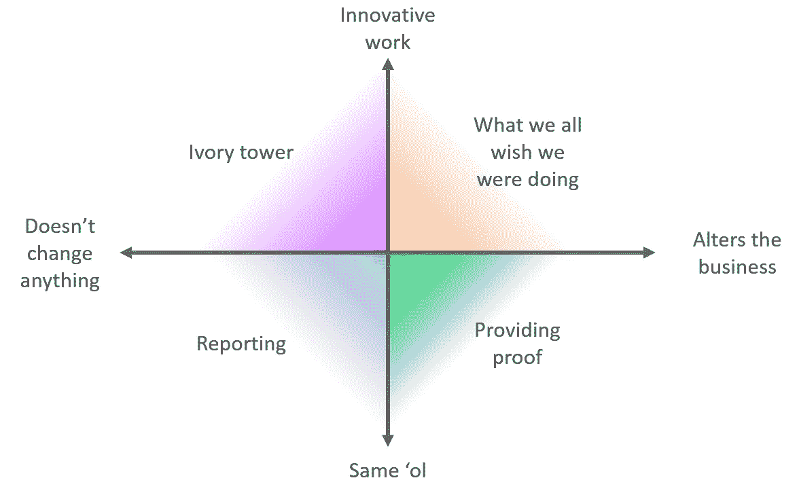

# 确定数据科学工作的优先顺序

> 原文：<https://towardsdatascience.com/prioritizing-data-science-work-936b3765fd45?source=collection_archive---------5----------------------->

## 在你能做的许多事情中做出选择

作为一名试图支持一个组织的数据科学家，您必须不断地决定您应该从事什么任务。您可能正在管理各种任务，例如:

*   直接来自利益相关者的任务，比如为明天的大型会议制作一段时间内的销售图表，
*   你个人认为具有长期效益的想法，比如制作一个 CLV 模型来预测高价值客户，以及
*   来自其他业务部门的模糊任务，比如帮助确定为什么某个地区的客户保持率似乎下降了。

很难平衡什么是最重要的事情，什么可以放在次要位置，尤其是当你有很多人要求你分析的时候。通常，人们认为对他们非常重要的工作对整个企业来说可能并不重要。与提出数据科学请求的人相比，你通常是一名资历较浅的员工，这使得直截了当地说不变得更加复杂，即使你不容易做到这一点。所有这些创造了一个环境，在这个环境中，你做什么的决定会极大地影响业务，但你也会在选择什么方面受到限制。

这是我个人在职业生涯中纠结过的话题。当公司里的人带着关于数据的问题来找我时，我几乎总是想回答他们，不让他们失望。通常我认为这些请求很有趣！然而，试图满足每一个要求是不可持续的，因为对答案的要求是无止境的。此外，用数据回答一个问题通常会引出新的问题，因此满足请求通常会产生额外的工作，而不是减少剩余的工作量。

我逐渐意识到，在考虑进行可能的分析时，我首先要回答两个问题:

1.  知道这个分析结果对公司有实质性影响吗？而且，
2.  这项创新工作是否为企业带来了新的东西？

对这两个问题的回答产生了四种截然不同的工作类型:

## 我们都希望我们正在做的事情(创新且有影响力)😊

理想的项目是既创新又改变业务的项目。一个示例项目是创建一个客户流失模型，为赢回客户的营销工作提供动力。这是那种首先让人们进入数据科学的工作。不幸的是，没有多少项目属于这一类——只是很难找到你能真正改变一个企业的开创性地方。如果你发现一个属于这一类的项目，尽你所能让它启动。

## 提供证据(不创新，但有影响力)🙂

这些项目并不创新，但却改变了业务，所以从定义上来说，做这些工作是有价值的。这通常意味着为每个人都怀疑是真的事情提供证据——这不是特别创新，但会有所帮助。例如，企业中的人可能会怀疑特定人群的客户不太可能再次光顾。没有证据证明这些预感是正确的，人们就不愿意尝试解决营销问题。如果你能做一些分析表明假设是正确的，你就能帮助企业找到解决方案。这不是迷人的工作，向人们展示他们已经认为是真实的东西不是特别令人惊叹，但它仍然是有用的。如果你得到这样的工作，试着去做。

## 象牙塔(创新但没有影响力)🤨

这是创新的工作，但对业务没有用处，这可能是一笔巨大的沉没成本。这些项目通常来自数据科学团队内部，当人们对基于方法论上有趣的事物的建模或分析的新领域有想法时。一个示例项目是尝试使用机器学习来细分客户，而不知道您将使用这些细分做什么。如果没有一个来自数据团队之外的对项目有用的人，那么工作可能不会有任何进展。作为一名数据科学家，很容易感觉到一旦你完成了这个项目，人们就会发现它的用处。在实践中，如果你不能立即看到项目的用途，那么业务人员可能也不能。不要被困在这些项目中，因为他们会让数据科学家看起来好像没有贡献。

## 报告(既无创新也无影响力)😴

不能改变任何事情并且没有创新的工作通常会被报道。这是为人们提供数字和 KPI，以便他们可以监控业务，确保一切顺利运行。有时，企业会有很好的流程来审查报告并找出机会所在。其他时候，这些报告会定期创建，但从来不会被查看。进行报告的最佳情况是，您可以设置一个自动化流程，以便在每次需要新报告时快速生成报告。最糟糕的情况是，每次您需要更新它时，这都是一个繁重的手动过程，这会拖累您的整体工作能力。作为一名数据科学家，你越能避免这成为你的工作就越好。

因此，尽可能优先考虑那些影响公司并具有创新性的项目(我们都希望自己正在做的工作)。否则，尝试做一些不创新但有用的工作，向人们提供证据，以帮助推动业务向前发展。确保你远离象牙塔，不做与业务无关的有趣工作，避免只做报告。祝你好运！

如果你想要大量的方法来帮助你在数据科学领域发展职业生涯，可以看看我和 Emily Robinson 写的书: [*在数据科学领域建立职业生涯*](http://bestbook.cool) 。我们将带您了解成为数据科学家所需的技能，找到您的第一份工作，然后晋升到高级职位。

