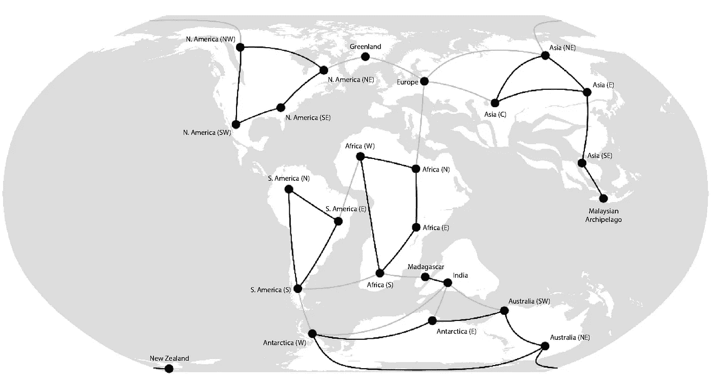
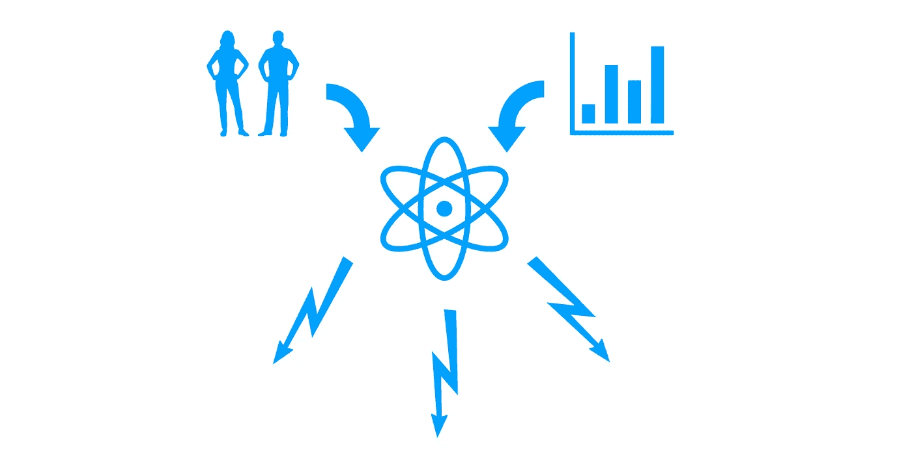

# 概率图形模型—简介

> 原文：<https://towardsdatascience.com/probabilistic-graphical-models-introduction-f7c919069d5c?source=collection_archive---------4----------------------->

概率图形模型或 PGM 是用于创建**复杂现实世界场景**的**概率** **模型**，并以**紧凑图形表示**来表示它们的框架。这个定义本身是非常抽象的，涉及到许多需要自己空间的术语，所以让我们一个一个地来看这些术语。

M **odel** 模型是我们想要分析的真实世界场景或问题的声明性表示。当我说声明性时，它意味着它不是派生的，而是由领域专家使用其对问题的领域知识或通过使用来自历史数据集的静态学习算法来声明或定义的，然后使用任何数学工具如图形或甚至简单地由方程来表示。
为 ex 在[线性回归](https://medium.com/@paragradke/simple-linear-regression-2421076a5892)

Where **Y** is the outcome we want to predict given the feature vector **X** that affects the output. So here **we assume (model) Y as a linear function of the input X which is parameterised by Theta.**

为什么我们需要对问题建模？因为两个主要原因
1。它允许我们将非结构化的现实世界问题转化为结构化的数学表示
2。它允许我们将问题(模型表示)与其解决方案(算法)隔离，这意味着一旦我们有了问题的数学模型，我们就可以应用任何算法来解决它，例如，对于上述模型，我们可以使用梯度下降或任何其他方法来解决它，模型不会改变。

因为**不确定性**，我们通常感兴趣解决的问题的性质或者我们想要进行的查询的类型都是概率性的。造成这种情况的原因有很多。例如，对问题的不完全了解、有噪声的观察结果或对问题有贡献但不能/没有包括在模型中的一些属性。

在上面的例子中，我们使用了模型的数学表示，但是在现实世界中，情况是复杂的，经常涉及大量的变量。很多时候，图形表示帮助我们更好地可视化，然后我们使用**图论**来减少所有参与变量的相关组合的数量，以更紧凑地表示高维度**概率分布**模型。

我将使用一些与概率和统计相关的基本术语和概念来讨论 PDMs。那些在单独的帖子 [**【基础概率论与统计】**](https://medium.com/@paragradke/basic-probability-theory-and-statistics-3105ab637213) **中有涉及。**

如果模型能帮助我们理解现实世界的现象，让我们对世界在特定条件下的行为做出有用的预测，那么它通常是有用的。我们经常想在模型上做的那种查询本质上是预测当其他事情已经发生/观察到时可能会发生什么。为了回答这样的问题，我们需要考虑世界状态的所有组成部分(随机变量),并以某种方式表示它们。我们已经学过“[联合分布](https://medium.com/towards-data-science/basic-probability-theory-and-statistics-3105ab637213)”，我们代表一个事件的所有可能结果。因此，这意味着我们有工具来表示我们的模型，它可以覆盖所有可能的场景，这就是“联合概率分布表”(暂时仅限于离散随机变量)。那我们为什么要讨论 PGM？
问题是，即使对于一个简单的模型，变量 **n** 的数量也可能在 100 个的范围内，如果每个变量都能获得平均 **d** 值，则联合分布表的大小可能非常大。因此，表格可能不是表示复杂模型的可行方法，尽管从概念上讲它们是足够的，但是计算限制不允许它们。我们需要一些其他的表示方法，因为图形的稀疏性，它似乎是一个很好的选择。使用图来表示这种概率模型有许多优点。

1.  即使涉及到大量的随机变量，它们也不一定都是相互依赖的。如果两个随机变量是独立的，我们不需要考虑它们在连接分布表中的所有组合，这意味着理想情况下表中的行数会更少。图论具有表示这种依赖性和独立性固有能力。
2.  从某种意义上说，图形表示是灵活的，人们不需要获得关于世界的所有知识来建立模型。一个人可以从他对世界的理解开始，建立一个模型，它会根据它所拥有的知识来行动。当一个人获得更多的知识时，他可以将同样的知识递增地应用于模型(添加/更新节点、边),并且模型将基于新的信息产生改进的结果。
3.  因为图是标准数学结构，所以它不仅允许对概率分布进行编码，而且为预测查询的查询模型提供了非常清晰的接口。

由于 PGM 基于图论，它们可以分为两类，即**有向图**或**无向图**。有一个 PGM 家族使用有向图是**贝叶斯网络**，另一个使用无向图是**马尔可夫网络**。尽管它们都来源于图论，但它们的直觉有很多不同，并且都需要自己的空间，我将在单独的帖子中讨论它们。