# 深度学习背景下的概率统计解释

> 原文：<https://towardsdatascience.com/probability-and-statistics-explained-in-the-context-of-deep-learning-ed1509b2eb3f?source=collection_archive---------3----------------------->

## 让你快速起床的实用方法


Photo by [Josh Appel](https://unsplash.com/@joshappel?utm_source=medium&utm_medium=referral) on [Unsplash](https://unsplash.com?utm_source=medium&utm_medium=referral)

本文面向希望获得概率统计知识的深度学习初学者，也可供从业者参考。

在我的上一篇文章中，我用自上而下的方法写了关于深度学习的线性代数的概念(文章的[链接)(如果你对线性代数没有足够的了解，请先阅读)。这里使用了同样的自顶向下的方法。首先提供用例的描述，然后是概念。](/linear-algebra-explained-in-the-context-of-deep-learning-8fcb8fca1494)

所有示例代码都使用 python 和 numpy。公式以图像的形式提供，以便重复使用。

# 目录:

*   介绍
*   概率基础
*   集中趋势和可变性的度量
*   离散概率分布，二项式分布
*   连续概率分布、均匀分布和正态分布
*   模型精度测量工具
*   随机过程和马尔可夫链
*   概率规划
*   外部资源

[](https://www.buymeacoffee.com/laxmanvijay)

**简介:**

概率是量化不确定事物的科学。大多数机器学习和深度学习系统利用大量数据来学习数据中的模式。*每当数据被用于一个系统而不是唯一的逻辑时，不确定性就会增加，而每当不确定性增加时，概率就变得相关了。*

通过将概率引入深度学习系统，我们将常识引入系统。否则，该系统将会非常脆弱，将不会有用。在深度学习中，使用了几种模型，如贝叶斯模型、概率图形模型、隐马尔可夫模型。它们完全依赖于概率概念。

真实世界的数据是混乱的。由于深度学习系统利用真实世界的数据，它们需要一种工具来处理混乱。

> 使用简单且不确定的系统总是比使用复杂但确定且脆弱的系统更实际。

这里介绍的概率和统计的版本是实际科目的高度简化版本。两者都是非常庞大和独立的研究课题。但是这里写的概念对于一个深度学习的追求者来说已经足够了。在本文的最后，我留下了一些关于这些主题的资源的链接。

**概率基础:**

如果你开始深度学习，导师提供给你的第一个例子(可能)是 MNIST 手写数字识别任务。这就像深度学习的 hello 世界。

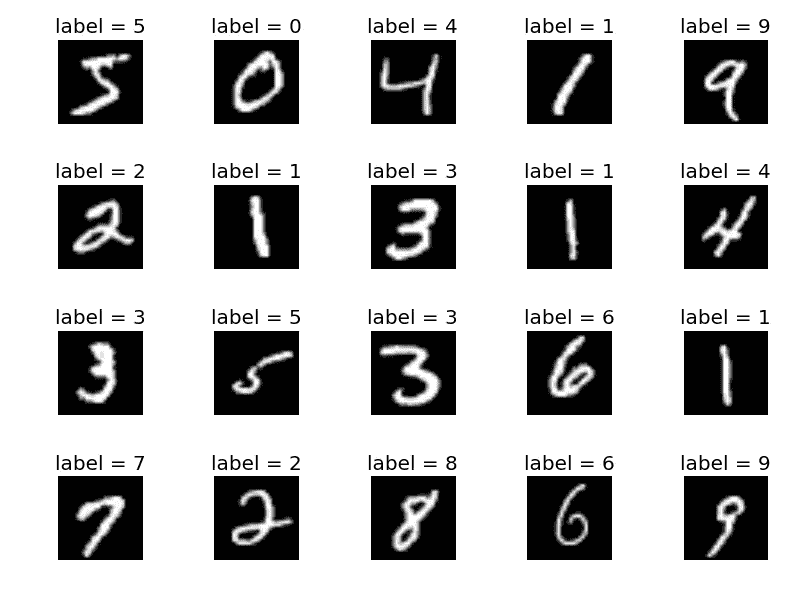

mnist dataset

任务是对手写数字进行分类并标记。正如我前面提到的，你为完成这项任务而创建的机器学习系统是不准确或不确定的。这些图像是 28*28 像素的图像。例如，考虑以下用于此任务的神经网络。

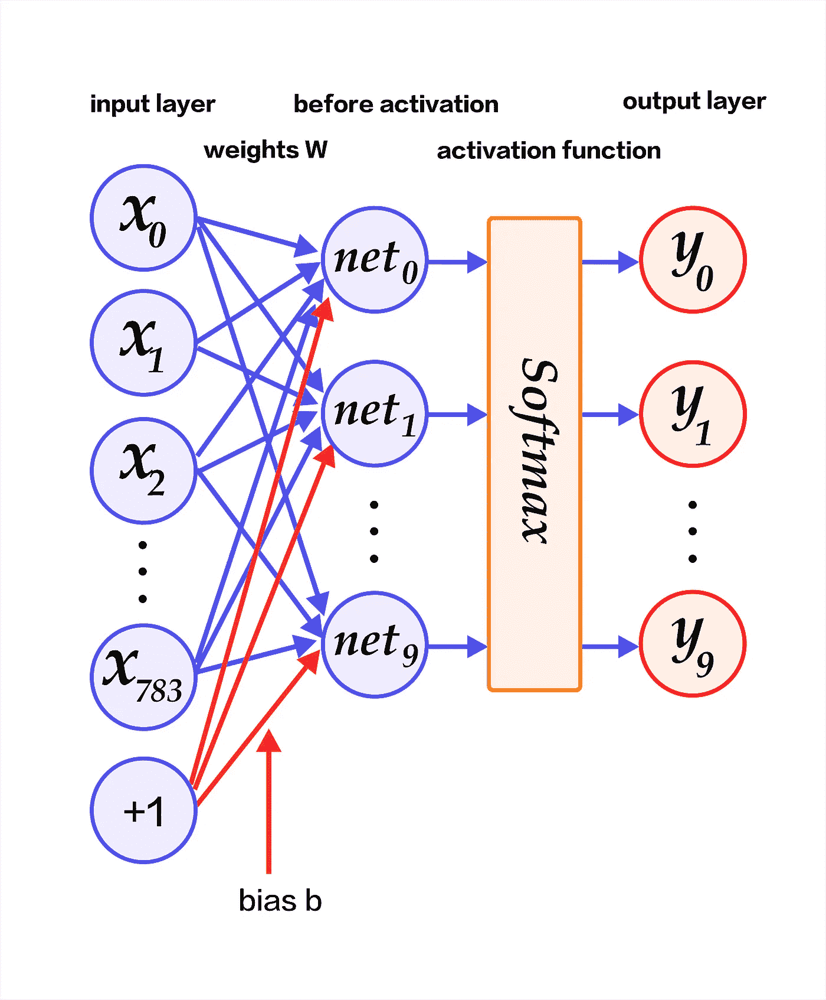

输入图层是输入图像大小的展平矢量(28*28=784)。它被传递到一个层，在该层中，输入向量与权重相乘，并与偏差向量相加。这一层有 10 个神经元。这是暗示有 10 位数。然后他们通过一个 softmax 激活功能。

在这个步骤之后，它们不输出精确的数字，而是输出长度为 10 的向量，其中每个元素是每个数字的概率值。

我们使用 argmax 来获取输出向量中具有最高值的概率的索引。(哪个是预测)

说到这里，我们将再次详细讨论 softmax。这里的要点是，为了理解这个神经网络，我们必须理解一些概率的基础知识。

向量***y***=【y0，y1，y2，y3，y4，y5，y6，y7，y8，y9】

这里面概率在哪里？

**样本空间** : **实验中所有可能值的集合**。(在上面的例子中，输入可以来自一组图像，因此它是输入的样本空间，类似地，输出预测可以取从数字 0 到 9 的任何值，因此这些数字是输出预测的样本空间。)

**随机变量** : **可以随机取样本空间不同值的变量。**在上面的神经网络中，输入向量 ***x*** 是一个随机变量，输出‘预测’是一个随机变量，神经网络的权重也是一个随机变量(因为它们是用概率分布随机初始化的。)

**概率分布:**概率分布是对**随机变量在样本空间**中取不同值的可能性的描述。在神经网络中，权重由概率分布初始化。输出向量 ***y*** 遵循 softmax 分布，soft max 分布也是显示 X 取不同数字值的概率的概率分布。(通常，softmax 提供分类值的概率)

在这个例子中，概率分布 y 是离散的(具有 10 个离散值。)而在其他一些情况下，它可能是连续的(样本空间也是连续的)。**在离散分布中，概率分布由 P(x= *x* )** 表示的概率质量函数(pmf)提供。在上例中，softmax 函数是随机变量 x 的 pmf。

*如果你看到输出向量 y = [0.03，0.5，0.07，0.04，0.06，0.05，0.05，0.06，0.04，0.1]的某个实例*

这有什么特别的？如果仔细观察，它们的总和都是 1.0，argmax 显示索引 1 的最大值为 0.5，表明该值应该是 1。

这种累加到 1.0 的性质叫做**归一化**。此外，这些值必须介于 0 和 1 之间。不可能的事件用 0 表示，确定的事件用 1 表示。

同样的条件也适用于连续变量。(一会儿就知道了。)

## 3 个基本定义:

在任何概率书或课程中，你总是在一开始就学习这三个基础知识。它们是条件概率、边际概率和联合概率。

**联合概率** : *两个事件同时发生的概率是多少。用 P(y=y，x=x)或 P(y 和 x)* 表示。例子:同时看到太阳和月亮**的概率**非常低。

**条件概率** : *假设另一个事件 x 已经发生，某个事件 y 发生的概率是多少。用 P(y = y | x =x)* 表示。既然另一个事件 x 已经发生，它的概率不可能为零。例:吃完后喝水**的概率很高。**

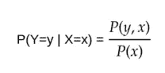

**边际概率** : *随机变量超集的一个子集的概率是多少*。例如:人留长发的概率是男人留长发的概率和女人留长发的概率之和。(此处长发随机变量保持不变，性别随机变量改变。)

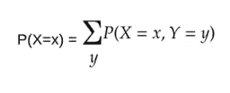

**贝叶斯定理**:它描述了一个事件发生的概率，这个概率是基于与该事件相关的其他事件的先验知识。


贝叶斯定理利用了概率中的信念概念。“我有 40%的把握这个事件会发生”并不等同于“骰子有 16%的几率显示 6”。前者利用信念，被称为**贝叶斯概率**，而后者依赖于以前的数据，被称为**频率主义概率。** [**阅读更多**](https://en.wikipedia.org/wiki/Bayesian_probability)

贝叶斯定理还被用于一种最简单的机器学习算法，称为朴素贝叶斯算法。[见 sklearn 文档。](https://scikit-learn.org/stable/modules/naive_bayes.html)

## 集中趋势和变化的测量:

**平均值**:平均值是数据的算术平均值。[数字文件](http://lagrange.univ-lyon1.fr/docs/numpy/1.11.0/reference/generated/numpy.mean.html)

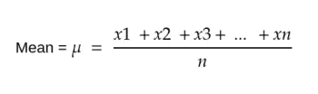

```
import numpy as np
a = np.array([[1,2,3,4,5,6]])
np.mean(a,axis=0)
```

**中位数**:数据的中间值。[数字文件](https://docs.scipy.org/doc/numpy/reference/generated/numpy.median.html)。

```
np.median(a,axis=0)
```

**模式**:数据的频繁出现值。[科学文件。](https://docs.scipy.org/doc/scipy/reference/generated/scipy.stats.mode.html)

```
import numpy as np
from scipy import statsstats.mode(a)
```

**期望值**:某个变量 X 关于某个分布 P(X= *x* )是从 P 中抽取 *x 时 X 的平均值*

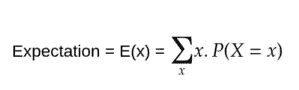

期望值等于数据集的统计平均值。[看为什么](https://stats.stackexchange.com/questions/30365/why-is-expectation-the-same-as-the-arithmetic-mean)。

**方差**:数据相对于平均值的可变性的度量。

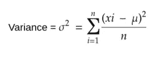

```
import numpy as np
a = np.array([[1,2,3,4,5,6]])np.var(a)
```

对于随机变量，方差由下式给出:


这个公式和上面的公式意思一样。[数字文档。](https://docs.scipy.org/doc/numpy/reference/generated/numpy.var.html)

**标准差**:是方差的平方根。[数字文档。](https://docs.scipy.org/doc/numpy/reference/generated/numpy.std.html?highlight=standard%20deviation)

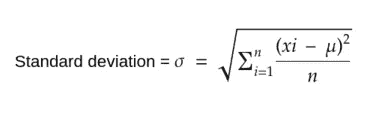

```
import numpy as np
np.std(a)
```

还有一些其他的变量度量，如范围和四分位间距。[看这里](https://www.khanacademy.org/math/probability/data-distributions-a1/summarizing-spread-distributions/a/range-and-interquartile-range-worksheet)

**共方差**:显示两个变量如何线性相关。Numpy 输出协方差矩阵，其中 Cij 表示 xi 和 xj 之间的协方差。[数字文件](https://docs.scipy.org/doc/numpy/reference/generated/numpy.cov.html)

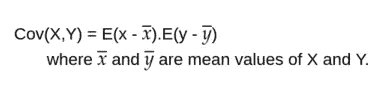

```
np.cov(a)
```

## 概率分布:

正如我在开始提到的，神经网络的几个组成部分是随机变量。随机变量的值来自概率分布。在许多情况下，我们只使用某些类型的概率分布。有些是，

**二项分布:**二项随机变量是一个随机实验的 n 次试验的成功次数。当随机变量只能有两种结果(成功和失败)时，称随机变量 x 遵循二项分布。自然，二项分布是针对离散随机变量的。 [numpy 文档。](https://docs.scipy.org/doc/numpy/reference/generated/numpy.random.binomial.html)

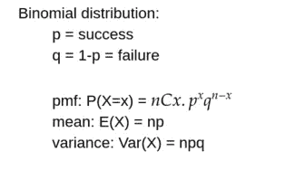

```
import numpy as npn=10 # number of trialsp=0.5 # probability of success
s=1000 # size
np.random.binomial(n,p,s)
```

**连续分布**:这些是为连续随机变量定义的。在连续分布中，我们用 p(x)表示的概率密度函数(pdf)来描述分布。

他们的积分等于 1。

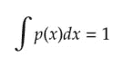

如果你对微积分不太熟悉[看这里](https://www.youtube.com/playlist?list=PLZHQObOWTQDMsr9K-rj53DwVRMYO3t5Yr)，

**均匀分布**:这是最简单的连续分布形式，样本空间中的每个元素都是**等概率**。[数字文档](https://docs.scipy.org/doc/numpy/reference/generated/numpy.random.uniform.html)

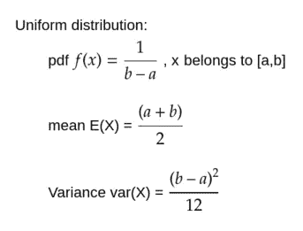

```
import numpy as np
np.random.uniform(low=1, high=10,size=100)
```

**正态分布**:“从混沌中有序”

这是**所有发行版中最重要的**。也称为高斯分布。在缺乏关于实数分布形式的先验知识的情况下，正态分布是一个很好的选择，因为它具有**高熵，并且中心极限定理表明几个独立随机变量的和是正态分布的**。[数量单据](https://docs.scipy.org/doc/numpy/reference/generated/numpy.random.normal.html)

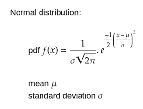

```
import numpy as np
mu = 0
sigma = 1
np.random.normal(mu,sigma,size=100)
```

在一个正态分布中，**如果均值为 0，标准差为 1，则称为标准正态分布。**

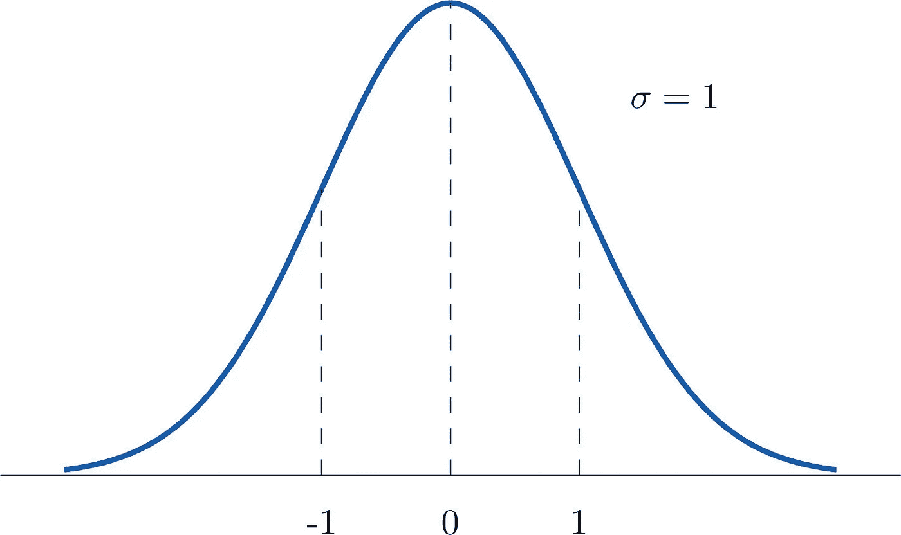

the famous bell curve

在机器学习中，你经常会遇到‘规范化’和‘标准化’这两个词。我们上面所做的获得标准正态分布的过程称为标准化，而将数据集**值的范围限制在 0.0 到 1.0 之间的过程称为归一化**。然而，这些术语经常互换。

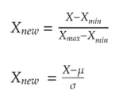

```
from sklearn.preprocessing import StandardScaler
import numpy as npdata = np.array([1,2,3,4,5])
scaler = StandardScaler()
scaler.fit_transform(data)
```

在这个阶段，我们遇到了几个公式和定义。如果你把这些都背下来，那是非常有用的。(或者以此文作为参考！)还有其他重要的分布，如指数分布和泊松分布。[参考此处](https://www.analyticsvidhya.com/blog/2017/09/6-probability-distributions-data-science/)快速浏览。

**Softmax 分布**:在本文开头，我提到了关于 Softmax。这是一种概率分布。它最适合用于表示 N 类分类分布中的 1 类。也是深度学习中最常用的分布。区分起来很方便。

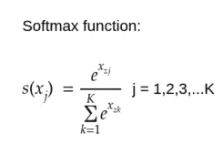

```
def softmax(x):
    e_x = np.exp(x - np.max(x))
    return e_x / e_x.sum(axis=0)##the np.max(x) is used just for numerical stability.it is Not ##formula
```

## 模型精度测量工具:

为了衡量深度学习模型的性能，我们使用几个概念。了解这些概念非常重要。它们被称为度量。在上面的 MNIST 神经网络中，如果神经网络正确地预测了 100 幅输入图像中的 95 幅，那么它的准确度被认为是 95%,以此类推。(这部分用 sklearn python 库举例。)

你可以直观地理解准确性，但理论是，它是**在总的获得结果中正确结果的命题。**

**准确性**是一个非常简单的衡量标准，有时可能会提供错误的见解。在某些情况下，更高的准确性并不意味着我们的模型工作正常。为了澄清这一点，首先看下面的定义，

*   **真阳性(TP):** 正例数，如此标注。
*   **假阳性(FP):** 阴性样本数，标注为阳性。
*   **真否定(TN):** 否定例数，如此标注。
*   **假阴性(FN):** 阳性例数，标为阴性。

```
Accuracy = (TP + TN)/(TP + FP + TN + FN)
```

**混淆矩阵**:包含 TP、FP、TN、FN 值的矩阵。

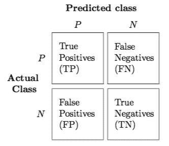

confusion matrix

```
from sklearn.metrics import confusion_matrix
y_true = [2, 0, 2, 2, 0, 1]
y_pred = [0, 0, 2, 2, 0, 2]
confusion_matrix(y_true, y_pred)
```

现在，想象一个二进制分类器，输出 1 或 0。如果一切正常，模型没有偏差，它就表示实际的准确性。但是，如果我们调整模型，使其始终为 0(或始终为 1)(现在模型的预测能力为零)。但是我们仍然会得到很高的精度！考虑一下桌子。

```
 Classified positive  Classified negative 
Positive class         0 (TP)            25 (FN)
Negative class         0 (FP)           125 (TN)
```

这个表很明显模型很差(因为所有的正类例子都分类错误)但是准确率 83%！！

**精度和召回率:**所以我们选择另外两个指标——精度和召回率。

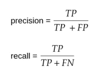

**精度**告诉你**有多少选择的对象是正确的**

回忆告诉你选择了多少正确的对象。

在上面的例子中，精确度和召回率都是 0.0，这表明模型非常差。

**F1 得分**:是精度和召回率的调和平均值。

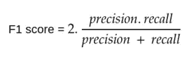

**F1 分 0 代表最差，1 代表最好。**利用这一点，我们可以解决准确性度量的混乱行为。

Sklearn 有一个 classification_report 函数，您可以调用它来获得 precision、recall 和 f1 分数。

```
**>>> from** **sklearn.metrics** **import** classification_report
**>>>** y_true = [0, 1, 2, 2, 2]
**>>>** y_pred = [0, 0, 2, 2, 1]
**>>>** target_names = ['class 0', 'class 1', 'class 2']
**>>>** print(classification_report(y_true, y_pred, target_names=target_names))
              precision    recall  f1-score   support

     class 0       0.50      1.00      0.67         1
     class 1       0.00      0.00      0.00         1
     class 2       1.00      0.67      0.80         3

   micro avg       0.60      0.60      0.60         5
   macro avg       0.50      0.56      0.49         5
weighted avg       0.70      0.60      0.61         5
```

**平均绝对误差**:原始值与预测值之差的平均值。

**均方误差**:原始值和预测值之差的平方的平均值。

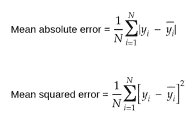

```
**from** **sklearn.metrics** **import** mean_squared_error
y_true = [3, -0.5, 2, 7]
y_pred = [2.5, 0.0, 2, 8]
mean_squared_error(y_true, y_pred)
```

均方误差被广泛使用，因为它更容易计算梯度。

**接收机工作特性(ROC)** **曲线**:ROC 曲线是一个**图，显示了分类模型**的性能，如我们的数字识别器示例。它有两个参数——真阳性率(TPR)和假阳性率(FPR)。 **TPR 和 recall 一样，也叫灵敏度。FPR 也是 1-特异性。**

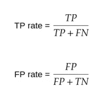

将这两者相对于彼此进行绘图，以获得下图(通过改变分类阈值并再次重复预测结果，获得绘图的几个值。).该 ROC 曲线下的面积是准确度的量度。


**曲线下面积(AUC)的解释**:当 AUC=1.0 时，模型最佳。当 AUC=0.5 时，模型最差。但是，如果 AUC=0.0，那么模型将重复结果。(就像把 1 归类为 0，把 0 归类为 1 一样)。

```
**import** **numpy** **as** **np**
**from** **sklearn.metrics** **import** roc_auc_score
y_true = np.array([0, 0, 1, 1])
y_scores = np.array([0.1, 0.4, 0.35, 0.8])
roc_auc_score(y_true, y_scores)
```

更多信息:[看这里](https://stats.stackexchange.com/a/132832/229583)和[这里](/understanding-auc-roc-curve-68b2303cc9c5)。

使用梯形规则计算 AUC([sk learn 使用此规则](https://scikit-learn.org/stable/modules/generated/sklearn.metrics.auc.html#sklearn.metrics.auc) ): [看这里](https://www.dummies.com/education/math/calculus/how-to-approximate-area-with-the-trapezoid-rule/)

## 随机过程、马尔可夫链和图形模型；

随机过程是由一些值索引的随机变量的**集合。直观上，随机过程或随机过程是一种现象的数学模型，这种现象对于观察者来说是以不可预测的方式进行的。下一个事件的结果是**不依赖于**当前事件的结果。例如，一系列的硬币投掷。**

如果随机过程中随机变量被索引的索引集来自一个离散的自然数，则该过程称为离散时间随机过程或**随机序列**。如果指标集位于实数线上，则该过程为**连续时间随机过程**。如果指标集位于笛卡儿平面或某些更高维的欧几里得平面，那么这个过程就称为**随机场**。

随机过程是概率中非常有趣的一部分。它们被用来模拟与时间相关的事物，如天气预报、股票市场、自然现象等。有几个随机过程。这里我们重点关注马尔可夫链。想要更详细的资料，请参考维基百科。

**马尔可夫链**:

马尔可夫链是一个**概率自动机**。它有状态。它描述了一系列事件，其中从一个状态转移到另一个状态的**概率仅取决于前一个事件**。[这里](http://setosa.io/ev/markov-chains/)是对马尔可夫链的极好的直观解释。

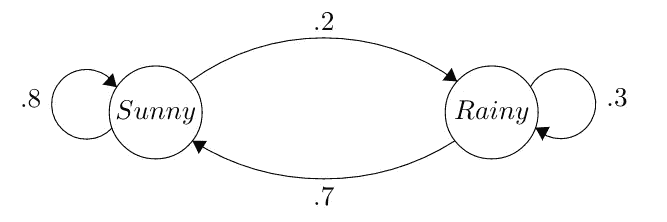

这是描述天气状况的马尔可夫链。这些值代表从一种状态转换到另一种状态的概率。

马尔可夫链用于简单的系统，如下一个单词预测、语言生成、声音生成和许多其他系统。

称为隐马尔可夫模型的马尔可夫链的扩展用于**语音识别系统。**

我已经停止了随机过程，并计划写一篇关于它们的文章，因为这个概念太长了。

## 概率规划:

一种新的编程范式已经发展成为概率编程。这些语言或库有助于模拟贝叶斯风格的机器学习。这是一个令人兴奋的研究领域，受到人工智能社区和软件工程社区的支持。这些语言很容易支持概率函数和模型，如高斯模型、马尔可夫模型等。

优步去年创建了一个这样的用于编写概率程序的库，名为 [pyro](http://pyro.ai) ，它以 [pytorch](https://pytorch.org/) (一个深度学习库)作为后端来支持 python。


pyro library logo

如果你喜欢这篇关于深度学习的概率和统计的文章，请为这篇文章鼓掌。这里提供的内容是面向深度学习初学者的，也可以作为深度学习从业者的参考资料。但是对于初学者来说，我还会推荐几个其他很棒的外部资源来巩固他们在有趣的概率领域的知识。( ***虽然你通过这篇文章获得的知识已经足够进行深度学习*** *)*

## 外部资源:

关于深度学习和机器学习的超赞免费课程: [fast.ai](https://www.fast.ai/)

微积分的直观解释: [3blue1brown](https://www.youtube.com/playlist?list=PLZHQObOWTQDMsr9K-rj53DwVRMYO3t5Yr)

深度学习最佳书籍:[深度学习书籍](https://www.deeplearningbook.org/)

随机过程:[谢尔登·m·罗斯](https://www.webdepot.umontreal.ca/Usagers/perronf/MonDepotPublic/mat2717/ross.pdf)

统计学:拉里·乏色曼的《T2 统计大全》

概率论:[威廉·费勒](https://www.researchgate.net/profile/William_Balthes/post/Stronger_limit_Theorems_then_the_strong_law_of_large_numbers/attachment/59d6256e6cda7b8083a21880/AS%3A445697653776384%401483274010393/download/William+Feller-An+Introduction+To+Probability+Theory+And+Its+Applications.+Vol+II.pdf)

[](https://www.buymeacoffee.com/laxmanvijay)