# 数据科学的概率与统计第一部分

> 原文：<https://towardsdatascience.com/probability-and-statistics-for-data-science-part-1-3eed6051c40d?source=collection_archive---------4----------------------->

概率和统计构成了数据科学的基础。概率论对做预测很有帮助。估计和预测是数据科学的重要组成部分。借助统计方法，我们作出估计，以便进一步分析。因此，统计方法在很大程度上依赖于概率论。所有的概率和统计都依赖于数据。

## 数据

数据是我们收集的关于某事或事实的信息(观察结果)和收集在一起用于参考或分析的统计数据。

> 数据——已经转化为计算机可以处理的形式的事实(数字、文字、测量、观察等)的集合

## 为什么数据很重要？

*   通过识别两个变量之间可能存在的关系，帮助了解更多关于数据的信息。
*   有助于预测未来或根据以前的数据趋势进行预测。
*   有助于确定数据之间可能存在的模式。
*   通过发现数据中的异常，帮助发现欺诈。

如今数据很重要，因为我们可以从中推断出重要的信息。现在让我们深入研究数据是如何分类的。数据可以有两种类型:分类数据和数字数据。例如，在一家银行，我们的地区、职业类别、性别遵循分类数据，因为数据在固定的某个值内，而余额、信用评分、年龄、任期月份遵循数值连续分布，因为数据可以遵循无限范围的值。

注:分类数据可以通过条形图、饼图、[帕累托图](https://en.wikipedia.org/wiki/Pareto_chart)可视化。数字数据可以通过柱状图、线图、散点图来可视化

# 描述统计学

描述性统计是对信息集合的特征进行定量描述或总结的汇总统计。它帮助我们更好地了解我们的数据。它用于描述数据的特征。

## 数据的测量水平

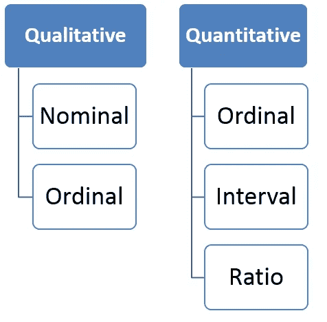

定性和定量数据与上述分类和数值数据非常相似。

**名义**:这个级别的数据使用名称、标签或质量进行分类。例如:品牌名称，邮政编码，性别。

**序数**:本级数据可以按顺序排列或排名，可以比较。例如:成绩、明星评论、比赛名次、日期

**Interval** :该级别的数据可以按其在一个数值范围内的情况进行排序，并且可以计算出数据点之间有意义的差异。例:摄氏温度，出生年份

**比率**:此级别的数据类似于区间级别，但增加了固有零的属性。可以对这些数据点进行数学计算。身高，年龄，体重

看看这个:[数据| Mahrita Harahap](https://mahritaharahap.wordpress.com/teaching-areas/inferential-statistics/data/)

## 总体或样本数据

在进行任何数据分析之前，我们应该确定我们正在处理的数据是总体数据还是样本数据。

**人群:**所有物品(N)的集合，它包括我们研究的每一个单元。这是很难定义和衡量的特点，如平均，模式被称为参数。

**样本:**总体(n)的子集，它只包括少数几个总体单位。它是随机选择的，特性的测量称为统计。

例如，假设您想知道电影订阅服务的订阅者的平均收入(参数)。我们随机抽取 1000 个用户样本，并确定他们的平均 income(x̄是 34，500 美元(统计)。我们的结论是，人口平均收入(μ)也可能接近 34，500 美元。

在看数据分布之前。让我们来看看数据的度量。

## 集中趋势测量

集中趋势的度量是试图通过识别一组数据中的中心位置来描述该组数据的单个值。因此，集中趋势的度量有时被称为集中位置的度量。它们也被归类为汇总统计。

**平均值**:平均值等于数据集中所有值的总和除以数据集中值的个数，即计算出的平均值。**易受异常值的影响**当添加异常值时，会出现偏差，即偏离典型的中心值。

**中值**:中值是按数量级排列的数据集的中间值。中位数是平均值的更好替代，因为它受数据异常值和偏斜度的影响较小。中间值比典型的中心值更接近。

如果值的总数是奇数，则

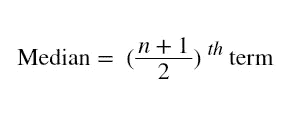

如果值的总数是偶数

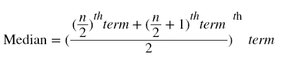

**模式:**模式是数据集中最常出现的值。因此，模式有时会认为模式是最受欢迎的选项。

例如，在包含{13，35，54，54，55，56 **，** 57，67，85，89，96}个值的数据集中。平均值为 60.09。中位数是 56。众数是 54。

## 不对称的度量

**偏斜度:**偏斜度是统计分布中的不对称，其中曲线出现扭曲或向左或向右偏斜。偏斜度表示数据是否集中在一侧。

Source: [Pearson Mode Skewness: Definition and Formulas](https://www.statisticshowto.datasciencecentral.com/pearson-mode-skewness/)

**正偏度:**正偏度是当均值>中位数>时的模式。离群值向右倾斜，即尾部向右倾斜。

**负偏度:**负偏度是当均值<中位数<众数。离群值向左倾斜，即尾部向左倾斜。

偏斜度很重要，因为它告诉我们数据分布在哪里。

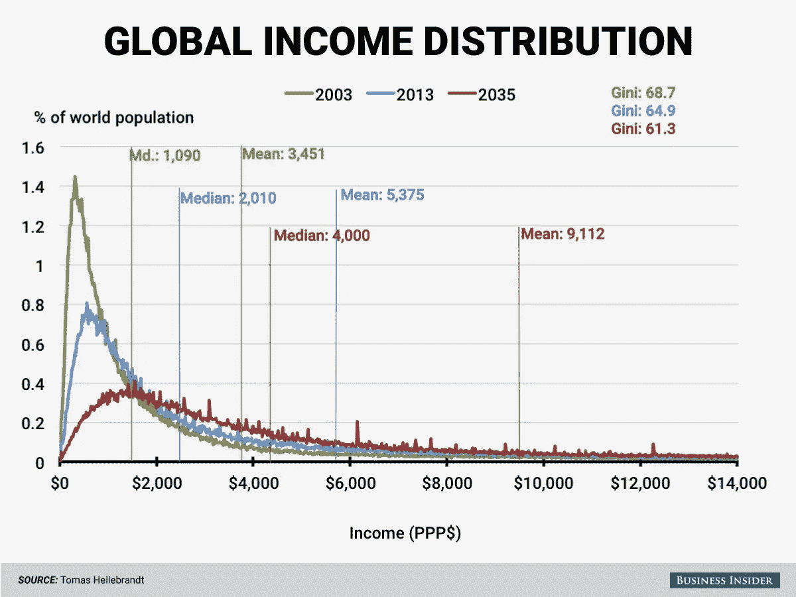

2003 年的全球收入分配是高度右倾的。我们可以看到，2003 年的平均值为 3，451 美元(绿色)，高于中位数 1，090 美元。这表明全球收入分配不均。大多数个人收入低于 2，000 美元，收入高于 14，000 美元的人数较少，因此出现了偏态。但根据预测，收入不平等似乎在 2035 年会随着时间的推移而减少。

## 可变性(离差)的测量

集中趋势的度量给出了代表整体值的单个值；然而，中心趋势不能完全描述观察结果。离差的度量有助于我们研究项目的可变性，即数据的分布。

*记住:总体数据有 N 个数据点，样本数据有(n-1)个数据点。(n-1)称为贝塞尔校正，用于减少偏差。*

**范围**:一个数据的最大值和最小值之差，称为分布的范围。范围不考虑一个系列的所有值，即它只考虑极端项目，中间项目不被认为是重要的。例如:对于{13，33，45，67，70}，范围是 57，即(70–13)。

**方差:**方差衡量每个点到平均值的距离平方和，即平均值周围的离差。

*方差是所有平方偏差的平均值。*

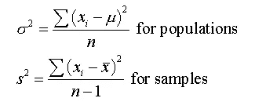

注意:*值和方差的单位不相等，因此我们使用另一个可变性度量。*

**标准差:**由于方差受单位差影响，所以使用标准差。方差的平方根就是标准差。它说明了数据在数据集平均值附近的集中程度。

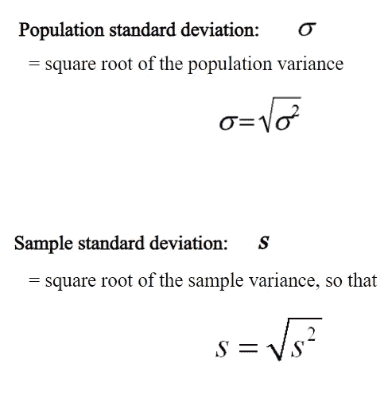

例如:{3，5，6，9，10}是数据集中的值。

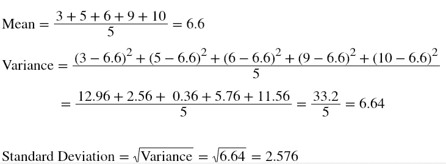

**变异系数(CV):** 又称相对标准差。它是标准偏差与数据集平均值的比率。

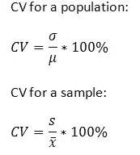

标准差是单个数据集的可变性。而变异系数可用于比较两个数据集。

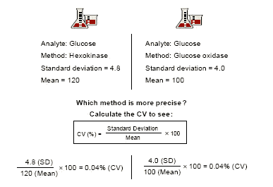

从上面的例子可以看出，CV 是一样的。两种方法都很精确。所以这是完美的比较。

## 四分位数的度量

考虑到每个数据点，四分位数更容易理解。

查看我之前的[帖子](/data-visualization-using-matplotlib-16f1aae5ce70)——在箱线图[部分](https://medium.com/p/16f1aae5ce70#ec41)，我已经详细阐述了四分位数。

## 关系的度量

关系的度量用于找出两个变量之间的比较。

**协方差:**协方差是对两个变量的可变性之间关系的度量，即它度量变量的变化程度，当一个变量发生变化时，另一个变量是否会发生相同/相似的变化。

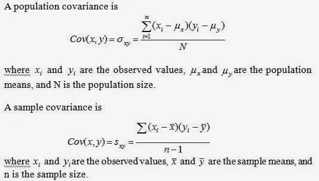

协方差没有给出关于两个变量之间关系的有效信息，因为它没有被归一化。

**相关性:**相关性让我们更好地理解协方差。它是归一化协方差。相关性告诉我们变量之间的相关程度。它也被称为皮尔逊相关系数。

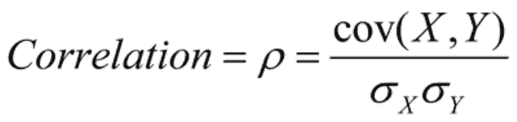

相关值的范围从-1 到 1。-1 表示负相关，即一个独立变量增加，另一个因变量减少。1 表示正相关，即一个独立变量增加，另一个因变量增加。0 表示变量相互独立。

举个例子，

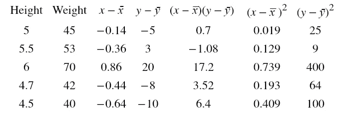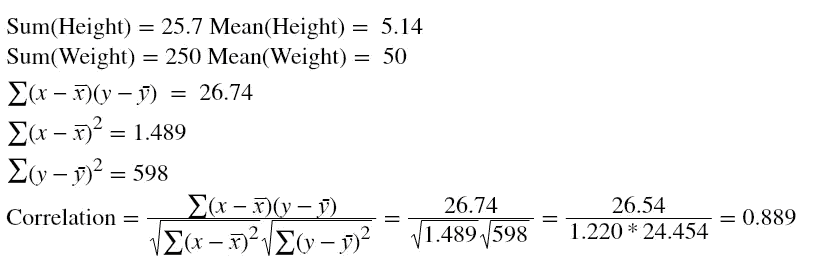

相关性 0.889 告诉我们身高和体重有正相关关系。很明显，随着一个人身高的增加，体重也会增加。

## 注:[相关并不意味着因果关系](https://en.wikipedia.org/wiki/Correlation_does_not_imply_causation)，[对于一些奇怪的相关](http://www.tylervigen.com/spurious-correlations)为虚假相关。

## **结论**

在本文中，我们学习了描述性统计，它通过理解数据集中的关键特征来帮助我们更好地了解我们的数据。